---
output:
  pdf_document: default
  html_document: default
---
# Software applications

We start the book with an introduction into the software packages SPSS and RStudio that are needed to conduct the procedures explained in the other chapters. If you are an user of SPSS or RStudio you can skip this Chapter without losing relevant information and continue with the next chapter.

## SPSS

### Data and Variable View windows

In this book we work with SPSS version 24 (IBM, 2016). When you open SPSS you see an empty Data View window, you are than in the SPSS Data Editor window. This window is always open when you start SPSS.

In the SPSS Data Editor, you have the possibility to go to the Data View and Variable View windows. In the Data View window, you can enter data yourself or read in data by using the options in the file menu. In (Figure \@ref(fig:fig2)) you see an example of a dataset in the Data View window. Each row in the Data View window represents a case and in the columns you find the variable names. In the Data View window, you can start all kind of data manipulations by using the different menu’s above in the window. 

```{r fig2, echo = FALSE, fig.cap="Data View window in SPSS", out.width='80%', fig.align='center'}
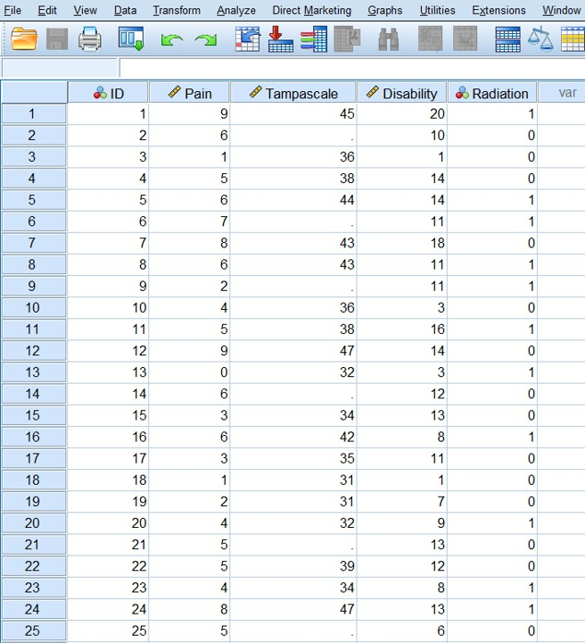
```

In the lower left corner of the window you can click on the tab Variable View and the Variable view window will appear (Figure \@ref(fig:fig3)).

```{r fig3, echo = FALSE, fig.cap="Variable View window in SPSS", out.width='80%', fig.align='center'}
knitr::include_graphics("images/fig1.3.png")
```

In the Variable View window, you can add new variables, by entering the name in the name column. Further, you can change the columns by using the options: Type: i.g. numeric or string; Width: number of digits; Decimals: the number of decimal places displayed; Label: The variable name; Values: To assign numbers to the categories of a variable; Missing: you can define specified data values as user-missing or system missing; Columns: To change the number of characters displayed in the Data View window; Align: to specify the alignment of the data; Measure: to specify the level of each variable, scale (continuous), ordinal or nominal; Role: Here you can define the role of the variable during your analysis. Examples are, Input for independent variable, Target for dependent or outcome variable, Both, independent and dependent variable. There are more possibilities, but most of the times you use the default Input setting.

### Analyzing data in SPSS

All statistical procedures in SPSS can be found under the Analyze button (Figure \@ref(fig:fig4)). Here you also find the option “Multiple Imputation” which plays an important role in this manual. 

```{r fig4, echo = FALSE, fig.cap="Statistical procedures that can be found under the Analyze menu in SPSS", out.width='80%', fig.align='center'}
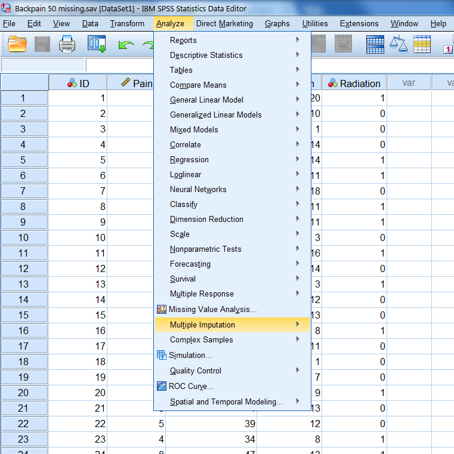
```

### The Output window in SPSS

If you have run your analyses in SPSS, an SPSS Output (or viewer) Window will pop-up. The main body of the Output Window consists of two panes (left and right panes). In the left pane you find an outline of the output. In the right pane younfind the actual output of your statistical procedure (Figure \@ref(fig:fig5)).

```{r fig5, echo = FALSE, fig.cap="Part of the Output or Viewer window in SPSS after making use of Descriptive Statistics under the Analyze menu", out.width='80%', fig.align='center'}
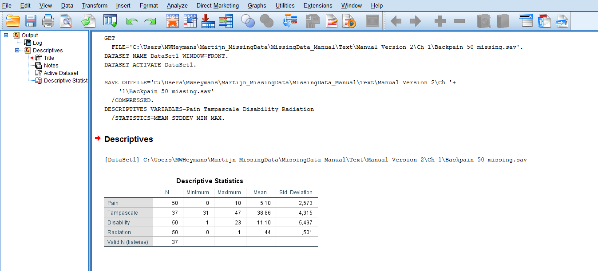
```

### The Syntax Editor in SPSS

In the syntax editor of SPSS, you use the SPSS syntax programming language. You can run all SPSS procedures by typing in commands in this syntax editor window, instead of using the graphical user interface, i.e. by using your mouse and clicking on the menu´s. You can get access to the syntax window in two ways. The first is just by opening a new syntax file by navigating to 

> File -> New -> Syntax. 

This will open a new syntax window (Figure \@ref(fig:fig6)). 

```{r fig6, echo = FALSE, fig.cap="Screenshot of new syntax file", out.width='80%', fig.align='center'}
knitr::include_graphics("images/fig1.6.png")
```

You can also generate syntax by accessing statistical procedures through the dropdown menus and clicking the `Paste` button instead of clicking the OK button after you have specified the options. Than a new Syntax Editor window will pop up or the new syntax will automatically be added to the open Syntax Editor window. An example can be found in Figure \@ref(fig:fig7), where the syntax is shown for the Descriptive Statistics procedure of Figure \@ref(fig:fig5).

```{r fig7, echo = FALSE, fig.cap="Screenshot of Syntax editor of SPSS including the Syntax code for descriptive statisitcs", out.width='80%', fig.align='center'}
knitr::include_graphics("images/fig1.7.png")
```

In this manual we will not use SPSS syntax code to access statistical procedures. SPSS is most frequently used via the graphical user interface, and we will use that method also in this manual.

### Reading and saving data in SPSS

You can Read data in, in SPSS via the menu File: 

> File -> Open -> Data. 

All kind of file types can be selected. Of course the SPSS .sav files, but also .por, .xlsx, .cvs, SAS, Stata, etc. (Figure 1.8). After you have selected a specific file type other than SPSS you may have to go through several steps before you see the data in the Data View window. These steps are not necessary for SPSS files, they open directly in the data editor.

```{r fig8, echo = FALSE, fig.cap="Window to read in different file types in SPSS", out.width='80%', fig.align='center'}
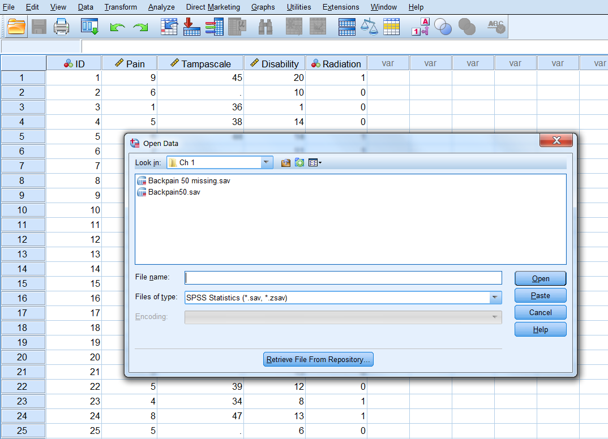
```

Saving files in SPSS is possible via the Save Data As option under the menu File. You can choose the same kind of file types.

## R and RStudio

RStudio is an integrated environment to work with the software program R. Consequently, to work with RStudio, R has to be installed. RStudio uses the R language and is also freely available. In this manual we will only show some possibilities and options in RStudio that are needed to run the R code and the programs that are discussed in this manual. For more information about RStudio and its possibilities visit the RStudio website at www.rstudio.com. When you open RStudio the following screen will appear.

```{r fig10, echo = FALSE, fig.cap="First screen that appears after you have started RStudio", out.width='80%', fig.align='center'}
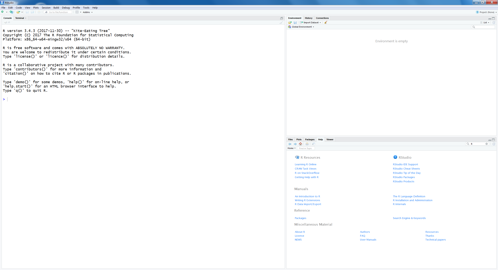
```

There are three windows opened:

1. On the left is the Console window

This is the main window to run R code (see below for more information about the Console window).

2. Right above is the window where you can choose between the Environment and History tabs (e.g. history tracks the code you typed in the Console window).

3. At the right site below is the window where you can choose between Files, Plots, Packages, Help and Viewer tabs.

### The role of the Console Window

When you enter code in the Console window you will directly receive a result. For example, when you type 3 + 3 the result will appear directly.

```{r} 
3 + 3
```

Other multiplication procedures as divide, square, etc. can also be executed. The main use for R is its functions. For example, to generate 20 random numbers you use the following function code (we will discuss more about functions in R later):

```{r} 
rnorm(20)
```

The number [1] between brackets is the index of the first number or item in the vector.   

### R assignments and objects

In R it is possible to create objects and to assign values to these objects. In this way it is possible to store some intermediate results and recall or use them later on. Assigning values to objects is done by using the assignment operator <- . You can also use the = sign as an assignment operator. This is not recommended because this is also a symbol used for mathematical operations. For example, when we want to assign the value 3 to the object x, we use:

```{r} 
x <- 3 
```

When we subsequently type in the letter x we get the following result:

```{r} 
x 
```

Now the value 3 is assigned to the object x. In R all kind of information can be assigned to an object, i.e. one number, a vector of numbers, results from analysis or other R objects such as data frames, matrices or lists. Objects can have all kinds of different names, composed of different letters and numbers. Here are some examples where number 3 is assigned to different objects with different names:

```{r} 
test <- 3
test.1 <- 3
test.manual <- 3
test
test.1
test.manual 
```

Note that some letters and words are used by R itself. It is not recommended to use these leters as names for objects in R that you create yourself. For example, the letter T and F are used as TRUE and FALSE by R. Other letters that are already in use are c, q, t, C, D, I and diff, df, and pt.

#### Vectors, matrices, lists and data frames

**Vectors**
A vector can be created by the following code:

```{r} 
y <- c(1, 2, 3, 4, 5)
y
```

The numbers 1, 2, 3, 4 and 5 are assigned to the data vector y. The “c” in the above code stand for concatenate which makes that all separate (one-vector) numbers are merged into one vector. It is also possible to create character vectors, which are vectors that contain strings (text). An example:

```{r} 
y <- c("a", "b", "test")
y
```

Vectors can also be made by using the “:” symbol. With that symbol it is easy to generate a sequence of numbers. An example:

```{r} 
y <- 1:10
y

```

**Matrix**
You can create a matrix by using the matrix function.

```{r} 
matrix(c(1, 2, 3, 4, 5, 6), nrow=2, ncol=3)
```

Now we have created a matrix with 2 rows and 3 columns. In essence we converted the vector c(1, 2, 3, 4, 5, 6) into a matrix. 

*List*
Another object is called a list. A list can contain components of different formats. Let’s look at an example using the following code:

```{r} 
x <- 1:5
x
y <- c("a", "b", "test")
z <- list(x=x, y=y)
z
```

With this code you created the list object z consisting of the two components x and y which are the vectors that were created above. You see that in a list two components of different data type can be combined, a numeric and a character factor. The names of the list components are indicated by the dollar sign, `$`. The list component can be obtained separately by typing `z$x` for component x or `x$y` for component y.

*Dataframe*
Mostly we work with datasets that contain information of different variables and persons. In R such a dataset is called a dataframe. Typically, a dataframe is created by reading in an existing dataset. How to create a dataframe by reading in a dataset will be further discussed in the paragraph “Reading in and saving data”.

#### Indexing Vectors, Matrices, Lists and Data frames

*Vectors*
An important operation in R is to select a subset of elements of a given vector. This is called indexing vectors. This subset can be assigned to another vector. For example:

```{r} 
y <- c(3, 5, 2, 8, 5, 4, 8, 1, 3, 6)
y[c(1, 4)]
```

The R code y[c(1, 4)], extracts the first and fourth element of the vector. Another example is by using the “:” symbol, to extract several subsequent elements:

```{r} 
y[2:5]
```

The R code y[2:5], extracts the second to the fifth element of the vector.

A minus sign excludes the specific element from the vector, like:

```{r} 
y[-3]
```

The R code y[-3], excludes the third element of the vector (i.e. 2).
A new vector z can be created where the third and fourth element of the y vector are excluded:

```{r} 
z <- y[-c(3, 4)]
z
```

*Matrices*
When we index matrices we can choose to index rows, columns or both. Here are some examples:

First construct the matrix z:

```{r} 
z <- matrix(1:9, nrow=3)
z
```

Extract from the first row the number in the second column
```{r} 
z[1, 2]
```

Extract all numbers in each column in the first row
```{r} 
z[1, ]
```

Extract all numbers in each row of the first column
```{r} 
z[, 1]
```

A minus sign can also be used to delete specific elements or complete rows or columns.

You can omit the first row from the matrix z
```{r} 
z[-1, ]
```

*Lists*
First create a list with 3 components, each component consists of a vector of the same length and with 10 elements each.

```{r} 
k <- list(a=1:10, b=11:20, c=21:30)
k
```

Index the individual component b by using the following code:

```{r} 
k$b
k[["b"]]
k[[2]]
```

To extract individual list components double square brackets are used, compared to single brackets for indexing vectors and matrices. 

When you use single brackets, you get the following results:

```{r} 
k["b"]
```

The difference between using single and double brackets is that single brackets return the component data type, which is in this case a vector (but could be any kind of data type) and single brackets always return a list.

*Data frames*
Indexing data frames follows the same method as indexing matrices, but we can also use the method that is used to index lists, since data frames are essentially lists of vectors of the same length. Data frames consist of rows and columns which can be accessed separately or both to extract specific elements. We use the data frame that was constructed in R code 1.11.

```{r} 
z
```

To index the first column you use:

```{r} 
z[, 1]
k$a
```

The second row can be accessed by using:

```{r} 
z[2, ]
```
 
#### Vectorized Calculation

With R it is possible to perform vectorized calculations. This means that you can do calculations elementwise, i.e. the same calculation is done on each element of an object. Let’s look at an example.

First create a vector z with numerical variables. 

```{r} 
z <- c(1, 2, 3, 4, 5, 6, 7, 8)
z
```

Now you can fairly easy square each element of the vector by typing:

```{r} 
z^2
```
 
We see that each element is squared. You can do these vectorized calculations by using all kinds of mathematical functions, e.g. taking the square root, logarithms, adding constant values to each element, etc. 

#### R Functions

Functions play an important role in R. Functions can be seen as lines of R code to run all kind of data procedures and to return a result. Take for example the small function “print.sum.test” that generates a sequence of numbers from 1 to 5 and sums all values from 1 to the value we define beforehand, which is here the value 3.  This means that the function will sum all values from 1 to 3, i.e. 1 + 2 + 3 when it is at the value of 3 and all values from 1 to 4 when we use as input value the value 4. 
 
```{r} 
print.sum.test <- function(x) 
{
 for (i in 1:5) 
 {
   if (i==x) y <- sum(1:i)  
 }
return(y)
}
print.sum.test(3)
```
 
At the first line we define the function print.sum.test that includes one argument x. Than in de body of the function which starts with a left brace and ends with another brace, the actual calculations take place. The return statement gives back the result. At the end we call the function with the statement print.sum.test(3), where the value 3 is actually used in the function.
 
Once the function is defined, you can call the function and plug in other values. For example:
 
```{r} 
print.sum.test(4)
```

You can write functions yourself but in R many functions are available which means that many calculations are done by using function calls. A function name is followed by a set of parentheses which contain some arguments. In the above self-written function, we already made use of a function, which is the sum function. We can use it separately as follows:

```{r} 
sum(3,4)
```

The arguments in this function are the numbers 3 and 4 and the result is their sum. This function uses as arguments numbers or complete vectors. 

If you want to see the formal arguments of each function you can use the args function. For example, you can use it for the matrix function:

```{r} 
args(matrix)
```

As a result the arguments of the functions are listed with their default settings. In this case the arguments are:

data: an optional data vector (including a list or expression vector). 

nrow: the desired number of rows.

ncol: the desired number of columns.

byrow: logical. If FALSE (the default) the matrix is filled by columns, otherwise the matrix is filled by rows.

dimnames: A dimnames attribute for the matrix: NULL or a list of length 2 giving the row and column names respectively. An empty list is treated as NULL, and a list of length one as row names. The list can be named, and the list names will be used as names for the dimensions.

#### The Help function

There are several possibilities to start the help facilities in R and to get more information about functions and their arguments in R. 

You can just type help or use the question mark as follows:

```{r ,eval=FALSE} 
help(matrix)
?matrix
```

In both ways the help tutorial for the matrix function will be activated and appear in your web browser or in help tab in the right corner below when you use R studio.

#### Working with script files

If you want to use R code and functions more than once it is useful to work with scripts files. In this way you can type and save R code and reuse it. To create a script file in R is easy. 

After you have started RStudio you go to 

> File -> New File -> R Scripts

A new window will open on the left side above. In that file you can type for example the self-written function print.sum.test. (Figure \@ref(fig:fig11)). You can save the script file by using the Save option under the File menu, open it again and use it whenever you want.

```{r fig11, echo = FALSE, fig.cap="Script file example in RStudio", out.width='80%', fig.align='center'}
knitr::include_graphics("images/fig1.11.png")
```

#### Creating a working directory

It is a good idea to keep your R files at the same place when you are doing data analysis for some kind of project. If you do not use a separate directory, R will use a default directory, that will mostly be in Windows in the documents folder. All files that you have to use or save during your R session are in that directory. To locate your working directory, you can type in the Console window:

```{r, eval=FALSE} 
getwd()
```

In Rstudio you can get information about the current working directory or change it in another way. Go in RStudio to the window on the right site below and go to the Files tab and click on the right site of the screen on the three dots. Than a window will open and you can browse to your preferred folder. Then choose for More in the Files tab and then select “Set As Working Directory” (Figure \@ref(fig:fig12)). Now you have set your preferred working directory. You can check if your directory is set correctly by choosing  “Go To Working Directory”.

```{r fig12, echo = FALSE, fig.cap="Working directory selection in RStudio", out.width='80%', fig.align='center'}
knitr::include_graphics("images/fig1.12.png")
```

#### Reading in SPSS data in RStudio

There are several procedures in RStudio to read in datasets. 

1.	Import datasets via “Import Dataset”
An easy way is via the window at the right site above. There you will find the button “Import Dataset”. When you click on it you can choose between different kind of file types, i.e. CVS, Excel, SPSS, SAS and Stata files (Figure 1.13). 

```{r fig13, echo = FALSE, fig.cap="Screen to import datasets in RStudio", out.width='80%', fig.align='center'}
knitr::include_graphics("images/fig1.13.png")
```

Here we choose for SPSS. When you approach this procedure for the first time RStudio asks for your permission to download a package called “haven”. This package is built to import and export data from several types. 

Another way to import an SPSS dataset is by making use of the foreign package. You find this package under the Packages Tab in the window at the right site below under the heading “System Library”. Install that package first. The foreign package includes the function “read.spss”. 

When you are in the correct working directory, i.e. the working directory where the file that you want to import is stored, you use the following code to import the dataset:

```{r, echo = FALSE, eval=FALSE} 
library(foreign)
dataset <- read.spss(file= "data/Backpain50.sav", to.data.frame = T)
```

The SPSS dataset is now connected to the object dataset.

#### Saving and Reading R data in RStudio

Datasets can be saved and read in R using different commands.

*Write.table* and *Read.table*

You can use the write.table function to write matrices and data frames (datasets):

```{r, echo = FALSE, eval=FALSE} 
dataset <- read.spss(file= "data/Backpain50.sav", to.data.frame = T)
write.table(dataset, file="data/Backpain50 R file")
```

Files written with write.table can be easily imported in SPSS by using the steps that will be discussed in the next paragraph. 

You can use the read.table function to read in matrices and data frames by using:

```{r, echo = FALSE, eval=FALSE} 
dataset <- read.table(file="data/Backpain50 R file")
dataset
```

*Save*
You can also use the command save to save datasets, according to (notice the .RData extension):

```{r, echo = FALSE, eval=FALSE} 
save(dataset, file="data/Backpain50 R file.RData")
```

*Load*
You can Load the dataset again in the workspace by using:

```{r, echo = FALSE, eval=FALSE} 
load(file="data/Backpain50 R file.RData")
```

You can also use save by using the default options in the following way to save your datasets:

```{r, echo = FALSE, eval=FALSE} 
save(dataset, file="data/Backpain50 R file")
```

To get direct access to the data that you have saved, you can use the get function in combination with the load function like this:

```{r, echo = FALSE, eval=FALSE} 
get(load(file="data/Backpain50 R file"))
```

With save, you can save any R object, also lists such as:

```{r, echo = FALSE, eval=FALSE} 
x <- list(a=1, b="example", c=3)

save(x, file="data/listsave.RData")
```

Subsequently, after you have removed object x from the workspace, you can load it again by using:

```{r, echo = FALSE, eval=FALSE} 
load(file="data/listsave.RData")
```

#### Reading in (R)Studio data into SPSS

When you have used the write.table function to save data in R you can easily read them in into SPSS. First you have to use write.table in the following way:

```{r, echo = FALSE, eval=FALSE} 
write.table(dataset, file="data/Backpain50 R file", sep=";", dec=",", row.names=F)
```

The extra parameter settings, mean:
sep=";", separate each variable by an “;” indicator.
dec=",", use for decimals a “,” instead of an “.”.
row.names=F , Do not add an extra column with row.names.
 
Follow the next steps to read in the data into SPSS:

> File -> Open data -> “All files (*.*)”

than you will see the file you want to import in SPSS, here the “Backpain50 R file”.

```{r fig18, echo = FALSE, fig.cap="Choosing the dataset to import in SPSS", out.width='80%', fig.align='center'}
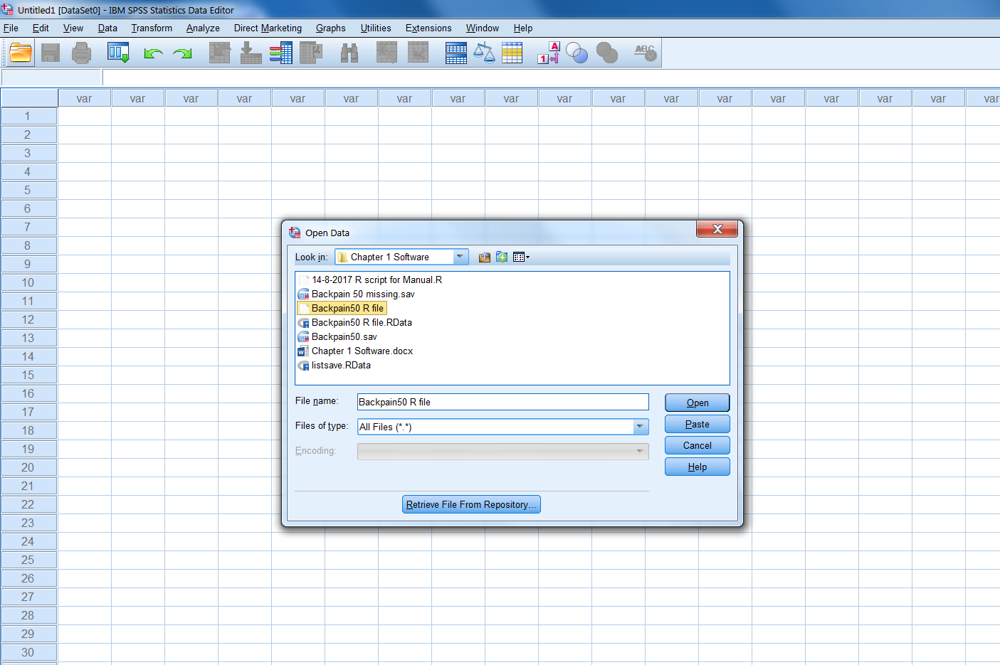
```

Then click Open (wait a couple of seconds) and click on next. You will see the following window that is part of the Text Import Wizard procedure in SPSS (Figure 1.19):

```{r fig19, echo = FALSE, fig.cap="Step 1 of the Text Import Wizard", out.width='80%', fig.align='center'}
knitr::include_graphics("images/fig1.19.png")
```

Then click the “Next >” button 5 times, passing by the following windows:

Step 2 of 6 (Figure 1.20):
To change how variables are arranged: here delimited
To include variable names included at the top of the file: here Yes.
To set the decimal symbol: here a comma.

```{r fig20, echo = FALSE, fig.cap="Step 2 of the Text Import Wizard", out.width='80%', fig.align='center'}
knitr::include_graphics("images/fig1.20.png")
```

Step 3 of 6 (Figure 1.21):

On which line number begins the first case: here 2
How cases are represented: Each line is a case.
How many cases you want to import: here all cases. 

```{r fig21, echo = FALSE, fig.cap="Step 3 of the Text Import Wizard", out.width='80%', fig.align='center'}
knitr::include_graphics("images/fig1.21.png")
```

Step 4 of 6 (Figure 1.22):
The delimiters that appear between variables; here the Semicolon.
The text qualifier: here Double quote.
Remove trailing spaces from string values: skip.

```{r fig22, echo = FALSE, fig.cap="Step 4 of the Text Import Wizard", out.width='80%', fig.align='center'}
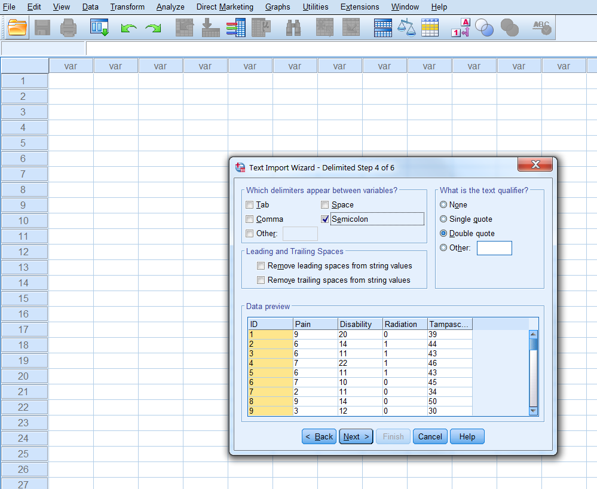
```

Step 5 of 6 (Figure 1.23):
Here you overwrite the Data format of the variable (you can also change that in the Variable View window, when the data has been read in).

```{r fig23, echo = FALSE, fig.cap="Step 5 of the Text Import Wizard", out.width='80%', fig.align='center'}
knitr::include_graphics("images/fig1.23.png")
```

Step 6 of 6:
To save your specifications of the previous steps into a separate file (Figure 1.24).

```{r fig24, echo = FALSE, fig.cap="Step 6 of the Text Import Wizard", out.width='80%', fig.align='center'}
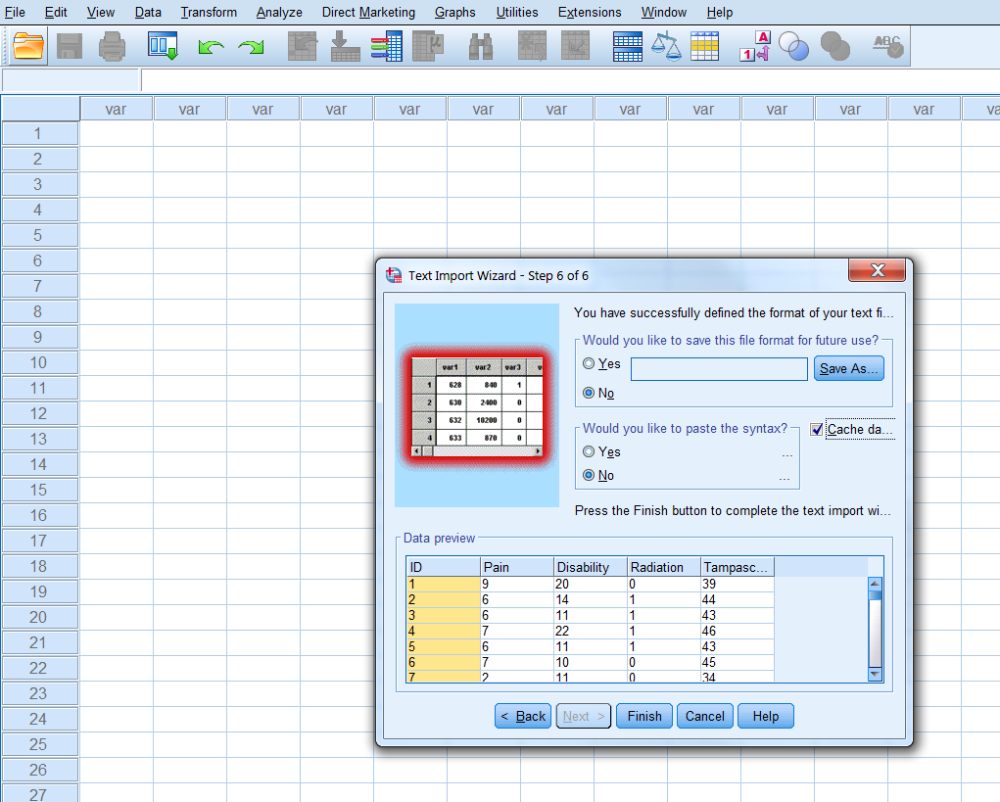
```

Then click finish and the is imported in a new SPSS file. In that file you can of course change all kind of variable and data settings in the Variable View Window.

You can also skip step 2 to 5 by clicking the Finish button twice when you are at step 1. Than you use all default settings, which is most of the times a good option.

#### Installing R Packages

When R is installed on your computer also a folder called library is created. This folder contains packages that are part of the basic installation. A package is a collection of different functions written in the R language. Besides packages that are part of the basic installation of R there are also packages that are not part of the basic installation but are written by others, i.e. the add-on packages. Packages can be downloaded from the CRAN website (https://cran.r-project.org/). Currently, there are thousands of user-written packages available on the CRAN website.

Before you can use a specific package that is not part of the basic installation, you have to install it in your R library. In this manual we will use the mice package to do all kind of imputation procedures, such as multiple imputation. mice is not part of the R basic installation and you have to install it first. There are several procedures in RStudio to install a package. One way is to use the install.packages function in the Console window:

```{r, echo = FALSE, eval=FALSE} 
install.packages("mice")
```

The mice package will be automatically downloaded from the CRAN website.

Another way is to use the window on the right site below and go to the Packages tab. When you click “Install” a new window is opened. Than you can type “mice” on the blank line under “Packages (separate multiple with space or comma):” (Figure 1.25a and b).   

```{r fig25, echo = FALSE, fig.cap="Install packages Window in RStudio to install packages from the CRAN website", out.width='80%', fig.align='center'}
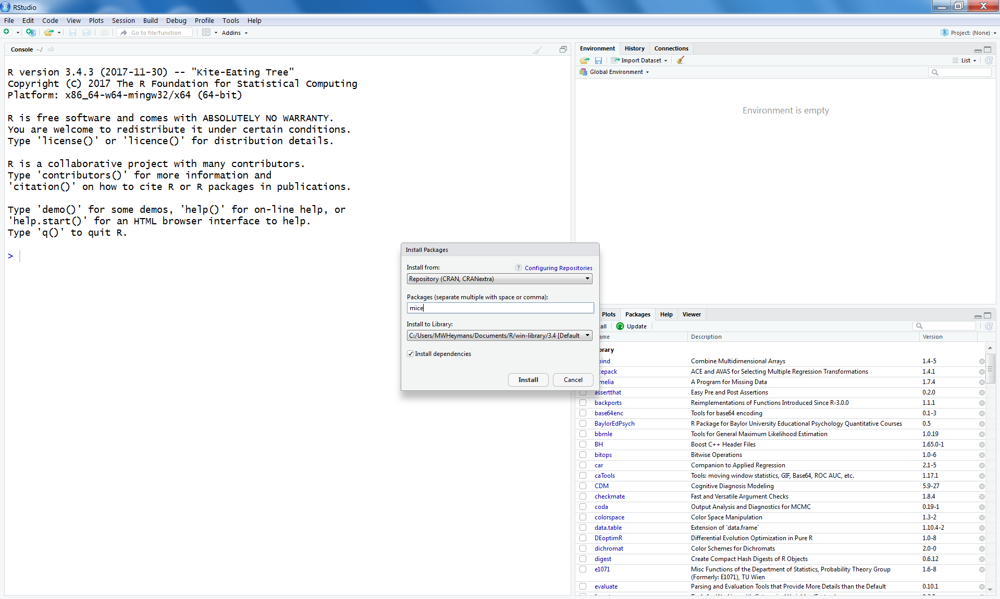
```

```{r fig26, echo = FALSE, fig.cap="Enlarged Install packages Window in RStudio to install packages from the CRAN website", out.width='80%', fig.align='center'}
knitr::include_graphics("images/fig1.25b.png")
```

After you have clicked on “Install” the package will be downloaded from the CRAN website automatically and will be listed in the Package list named “User Library”.

Another way is to go to the CRAN website and download the package as a zip file in a directory on your computer, for example your working directory or in your library. Again use the window on the right site below and go to the Packages tab. When you choose Install a new window is opened. Now under “Install from:” choose for “Package Archive File (.zip; .tar.gz)”  (Figure 1.26a and 1.26b).  Than you can browse to the zip file and install the package.

```{r fig27, echo = FALSE, fig.cap="Install packages Window in RStudio to install packages from zip files", out.width='80%', fig.align='center'}
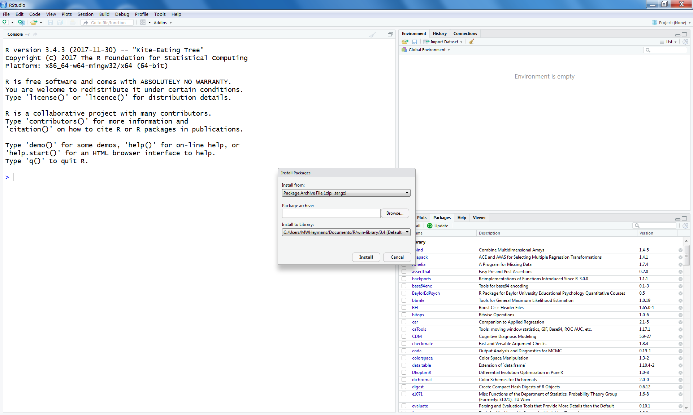
```

```{r fig28, echo = FALSE, fig.cap="Enlarged Install packages Window in RStudio to install packages from zip files", out.width='80%', fig.align='center'}
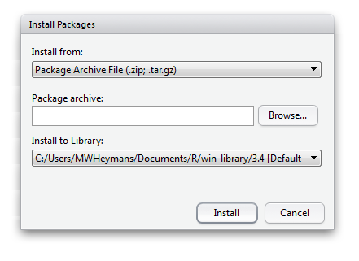
```

#### Loading R Packages

Once an add-on (user written) R package has been installed you have to load it to get access to all functions that are part of that package. To load a library, you can use the function library() or require(). 

```{r, echo=FALSE, eval=FALSE} 
library(mice)
```

The require() function is used in the same way. You have to load add-on packages each time you start a new R session. 

#### Updating R Packages

To keep the add-on packages up to date you can use the update.packages() function.

```{r, echo=FALSE, eval=FALSE} 
update.packages()
```

R will ask you if you want to update each package. If you type “y” in the Console window, R will update the package.

In RStudio updating packages can be done in the Package tab as well. You can click on the Update button. A new window will open that contains a list of all packages that need to be updated. Subsequently you can select the packages you want to update. 

#### Useful Missing data Packages and links

The main package that we will use in this manual is mice which stand for Multivariate Imputation by Chained Equations (MICE) (Van Buuren, 2009).

Other packages that are related to MICE are miceadds and micemd:
**miceadds**
Package contains some additional multiple imputation functions (Robitzsch et al., 2017).
See for more information: 
[linked phrase](https://cran.r-project.org/web/packages/miceadds/index.html)
 
**micemd** 
Package contains additional functions for the mice package to perform multiple imputation in two-level (Multilevel) data (Audigier & Resche-Rigon, 2017).
See for more information: 
[linked phrase](https://cran.r-project.org/web/packages/micemd/index.html)

**mi**
Provides functions for data manipulation, imputing missing values in an approximate Bayesian framework, diagnostics of the models used to generate the imputations, confidence-building mechanisms to validate some of the assumptions of the imputation algorithm, and functions to analyze multiply imputed data sets (Gelman et al., 2015). 
See for more information: 
[linked phrase](https://cran.r-project.org/web/packages/mi/index.html)

**MItools**
Small package to perform analyses and combine results from multiple-imputation datasets (Lumley, 2015).
See for more information: 
[linked phrase](https://cran.r-project.org/web/packages/mitools/index.html)

**norm**
Package is for the Analysis of multivariate normal datasets with missing values. It contains the mi.inference function. This function combines estimates and standard errors to produce a single inference. Uses the technique described by Rubin (1987), which are called the Rubin’s Rules (RR) (Novo, 2015).
See for more information: 
[linked phrase](https://cran.r-project.org/web/packages/norm/index.html)

**vim (visualization and imputation of missing values)**
Package includes tools for the visualization of missing and/or imputed values. In addition, the quality of imputation can be visually explored using various univariate, bivariate, multiple and multivariate plot methods (Templ et al., 2017).
See for more information: 
[linked phrase](https://cran.r-project.org/web/packages/mi/index.html)

**BaylorEdPsych**
Package for Baylor University Educational Psychology Quantitative Courses. This package included Little’s MCAR test (Beaujean, 2015).
See for more information: 
[linked phrase](https://cran.r-project.org/web/packages/BaylorEdPsych/index.html)

**MKmisc**
Contains several functions for statistical data analysis; e.g. for sample size and power calculations, computation of confidence intervals, and generation of similarity matrices. This package contains the mi.t.test function for pooling t-tests after multiple imputation (Kohl, 2016).
See for more information: 
[linked phrase](https://cran.r-project.org/web/packages/MKmisc/index.html)

**mvnmle**
Package estimates the maximum likelihood estimate of the mean vector and variance-covariance matrix for multivariate normal data with missing values. This package is needed for the mlest function this is used for Little’s MCAR test in Cahpter 2.
See for more information: 
[linked phrase](https://cran.r-project.org/web/packages/mvnmle/index.html)

