---
output:
  html_document: default
  pdf_document: default
---
# Missing Data Evaluation

Before you decide what to do with your missing data it is important to consider the reasons and probable causes of your missing data problem. With that information you can compose an analysis plan to deal with the missing data in your dataset. In this Chapter, you will learn how to explore and evaluate missing data in SPSS and R and why it is important to think about the reasons for missing data. Knowledge about the missing data problem is important for the method to solve the missing data problem. 

##	Definition of Missing Data

###	Defining Missing Data in SPSS

Missing data in SPSS can be defined in two ways, as a system missing or user missing value. System missing data are missing data that is not present in the dataset and can be recognized by an empty cell (or dot). User missing data are data that are coded as missing values in the dataset by the user for some specific kind of reason. As an example we use a small dataset with 50 Backpain patients consisting of male (coded as 1) and female (coded as 0) patients (Figure \@ref(fig:fig2-1)). For the female patients in this dataset the duration of a previous pregnancy was regisered in the Gestational Age (GA) variable. 


```{r fig2-1, echo = FALSE, fig.cap="SPSS dataset containing variables with system and user missing data", out.width='90%', fig.align='center'}
knitr::include_graphics("images/fig2.1.png")
```

The Variable GA in the dataset consists of different values: pregenancy durations in weeks, such as 36 and 29, but also the value 8 and empty cells. The value 8 is specified by the user to exclude males from further analysis that include the GA variable. This is a user missing value, that was indicated because males cannot be pregnant. The system missing values are recognizable by the empty cells (or dots) in the dataset, and these indicate the missing GA values for women who did not report the GA for their pregnancy. It makes no difference if we code the missing values as a system or user missing value in SPSS, because both kinds of missing values are recognized as missing values by SPSS and will be excluded from further analyses.

###	Defining Missing data in R

In R the missing values are denoted by `NA` which means “Not Available”. If we open the same dataset as above in R we get the following result.

```{r echo=TRUE, message=FALSE, warning=FALSE}
library(foreign)
dataset <- read_sav("data/CH2 example.sav")
head(dataset,10) # Data of first 10 patients is shown
```

The Variable Gestational Age (GA) contains the values for GA (e.g. 36, 29, etc.), the value 8 for males and the NA’s. In R the value 8 will be treated as a real value, so we have to recode that value to `NA` by using the following code to convert an 8 into an `NA` for the males.

```{r echo=TRUE, message=FALSE, warning=FALSE}
dataset$GA[dataset$GA==8] <- NA
head(dataset,10)
```

The `NA` values will be recognized as missing values. 

Within most functions in R the handling of `NA` values has to be defined, otherwise the function returns an NA as a result. For example, the following code to obtain the mean of Gestational Age results in an `NA` because the handling of missing data is not defined within the function.

```{r echo=TRUE, message=FALSE, warning=FALSE}
mean(dataset$GA)
```

To obtain the mean of the observed data the statement `na.rm = TRUE` can be added.

```{r echo=TRUE, message=FALSE, warning=FALSE}
mean(dataset$GA, na.rm = TRUE)
```

The `na.rm = TRUE` statement in the mean-function, indicates that values that are `NA` need to be removed before the analysis is executed. Another `NA` handling procedure that is regularly used in functions is called `na.action` with as options `na.fail`, `na.omit`, `NULL` (no action) and `na.exclude`. For more information about na.action options you can look at the help-file by typing `?na.action` in the Console window.

##	Missing data Patterns 

To get an idea about the complexity of the missing data problem in your dataset and information about the location of the missing values, the missing data pattern can be evaluated. Historically, the missing data pattern was an important starting point to choose the missing data handling method (@little1987statistical). Currently, the missing data pattern is less important because the most advanced missing data analysis method as multiple imputation can handle almost any missing data pattern. We will discuss some frequently seen missing data patterns, which are graphically displayed in Figure \@ref(fig:fig2-2). 

```{r fig2-2, echo = FALSE, fig.cap="Missing data patterns (ID means person identification number, X1 to X3 represent variables, Time 1 to 3 means that data is measured at 3 time points over time, Study means study number). The white cells represent the missing data", out.width='90%', fig.align='center'}
knitr::include_graphics("images/fig2.2.png")
```

A univariate missing data pattern is a pattern with missing values in only one variable. An example of such a pattern is when the independent variables are completely observed, but the outcome variable is not, or when a selection of subjects refuse to fill in a specific question such as their income level. The second and third pattern are examples of multivariate missing data patterns, where multiple variables contain missing values. The second pattern is an example where subjects miss values of the same two variables and the third pattern a more general pattern where different subject miss different variable scores. A monotone pattern of missing data may occur in a longitudinal study with data repeatedly assessed over time, and subjects “drop-out” of the study (fourth pattern). For example in a study on elderly where persons get too frail to participate as they get older or just because persons do not want to attend the study anymore because they loose interest and don't feel like filling in questionnaires. A pattern called "file matching"" can be observed when data from several studies is merged for an individual participant data analysis and some variables are not assessed in all studies. In this example, one variable is observed in both studies (X1), but X2 and is only observed in study 1 and X3 only in study 2. 

###	Exploring Missing data patterns in SPSS

To evaluate the missing data pattern, we use the options of the Missing Value Analysis (MVA) procedure in SPSS (@spss75). The example dataset contains information on 9 study variables for 150 back pain patients. The continuous variables are Pain, Tampa scale, Disability, Body weight, Body length and Age. The dichotomous variables are Radiation in the leg, Smoking, and Gender. Only the variables Gender and Age are completely observed.

To access the MVA function in the SPSS menu choose: 
>Analyze -> Missing Value Analysis…  

A new window will open that is called “Missing Value Analysis”.

In this menu, transfer all continuous variables to the Quantitative variables window and the categorical variables to the Categorical variables window. Then select the Patterns option. From the Patterns menu (Figure \@ref(fig:fig2-4) select the options `Tabulated cases, grouped by missing value patterns` and `sort variables by missing value pattern`. To obtain the full list of all patterns that occur in the data, set the “Omit patterns with less than 1% of cases" at 0%, then click continue and OK. 

```{r fig2-4, echo = FALSE, fig.cap="The Patterns menu", out.width='90%', fig.align='center'}
knitr::include_graphics("images/fig2.4.png")
```

By default, univariate statistics are presented that include output information about the number and percentages of missing data and  descriptive statistics for each variable (Figure \@ref(fig:tab2-1)). 

Information about the missing data patterns is provided in the Tabulated patterns table. On the left column of that table, named “Number of Cases”, the number of cases are presented with that specific missing data pattern. In our example, there are 75 cases without any missing value and 13 cases with a missing value in only the Tampa scale variable (see row 1 and 2 in (Figure \@ref(fig:tab2-1)). In the right column of that table named “Complete if…”, the total number of subjects is presented if the variables that contain missing data in that pattern are not used in the analysis. Those variables are marked with the “X” symbol. For example, 88 subjects remain in the analysis when the variable tampa scale is not used in the analysis, these are the 75 subjects that have completely observed data on top of the 13 subjects with missing data in the Tampa scale variable only.

```{r tab2-1, echo = FALSE, fig.cap="Descriptive missing data statistics and the missing data patterns.", out.width='90%', fig.align='center'}
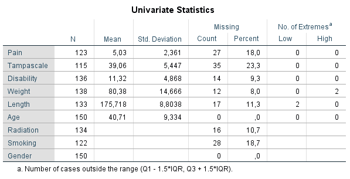
knitr::include_graphics("images/tab2.1b.png")

```

Another way to obtain information about the missing data patterns is by accessing the Multiple Imputation menu option. To access this menu, choose: 
> Analyze -> Multiple Imputation -> Analyze Patterns…  

```{r fig2-5, echo = FALSE, fig.cap="Analyse Patterns menu.", out.width='90%', fig.align='center'}
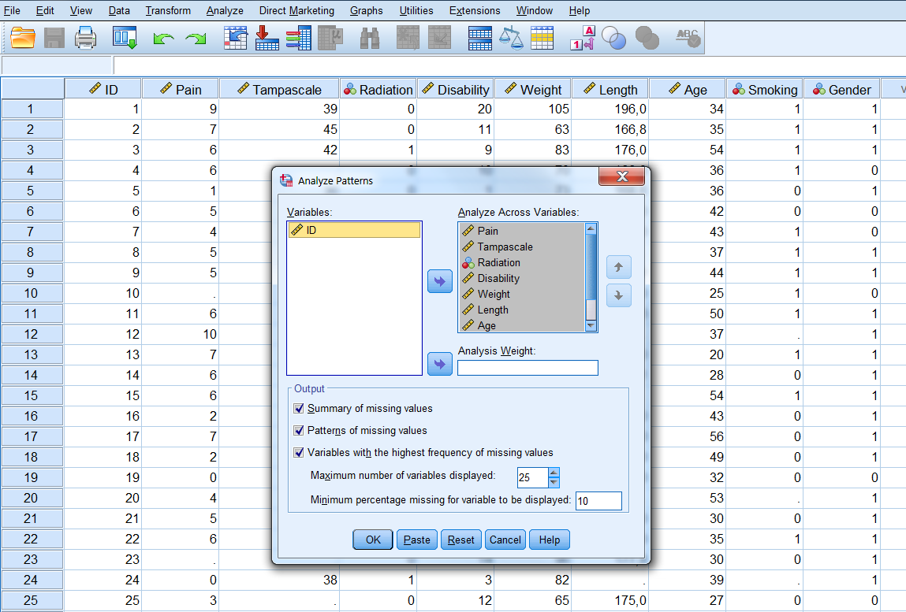
```

Now transfer all variables for the missing value analysis to the window “Analyze Across Variables”. The following output options can be selected: 

- Summary of missing values: displays missing data information in pie charts, Patterns of missing values (displays tabulated patterns of missing values. 
- Variables with the highest frequency of missing values: displays a table of analysis variables sorted by percent of missing values in decreasing order. .
- Minimum percentage missing for varaibles to be displayed: set at 0 to obtain the full list of all patterns.
- Adjust the maximum number of variables displayed.

The following output will be displayed after selecting all options:
```{r fig2-6, echo = FALSE, fig.cap="Output as a result of the Analyze Patterns menu under Multiple Imputation.", out.width='90%', fig.align='center'}
knitr::include_graphics("images/fig2.6a.png")
knitr::include_graphics("images/fig2.6b.png")
knitr::include_graphics("images/fig2.6c.png")
knitr::include_graphics("images/fig2.6d.png")
```

### Exploring Missing data patterns in R

To display the missing data patterns in R we can use the `mice` or `VIM` package. We start with the `mice` package. This  package contains the `md.pattern` function that produces the missing data pattern.

```{r echo=TRUE, message=FALSE, warning=FALSE}
library(mice)
md.pattern(dataset)
```

The first row contains the variable names. Each other row represents a missing data pattern. The 1’s in each row indicate that the variable is complete and the 0’s indicate that the variable in that pattern contains missing values. The first column on the left (without a column name) shows the number of cases with a specific pattern and the column on the right shows the number of variables that is incomplete in that pattern. The last row shows the total number of missing values for each variable.

To obtain a visual impression of the missing data patterns in R the `VIM` package can be used. That package contains the function `aggr` that produces the univariate proportion of missing data together with two graphs.

```{r echo=TRUE, message=FALSE, warning=FALSE}
library(VIM)
aggr(dataset, col=c('white','red'), numbers=TRUE, sortVars=TRUE, cex.axis=.7, gap=3, ylab=c("Percentage of missing data","Missing Data Pattern"))

```

The variable names are shown at the bottom of the figures. The red cells in the Missing data patterns figure indicate that those variables contain missing values. We see that 0.500 or 50% of the patterns do not contain missing values in any of the variables. Of the total patterns, 8.67% of the patterns have missing values in only the Tampa scale variable. 

##	Missing data Mechanisms

By evaluating the missing data patterns, we can get insight in the location of the missing data. With respect to the missing data mechanism we are interested in the underlying reasons for the missing values and the relationships between variables with and without missing data. In general, we can say that missing values are either random or non-random. Random missing values may occur because subjects accidentally do not answer some questions or that information of an entire subject is accidentally not assessed. For example, a study subject has to fill out some questionnaire instruments, gets distracted and misses a question accidently or a questionnaire gets lost in the mail. Non-random missing values may occur because subjects purposefully do not answer questions. For example, subjects may be reluctant to answer questions about sensitive topics like income, past crimes or sexual history. In 1976, Donald Rubin introduced a typology for missing data that distincts between random and non-random missing data situations, which are abbreviated as MCAR, MAR and MNAR (@Rubin1976). These types of missing data are still used as the basic missing data mechanisms. 
The key idea behind Rubin’s missing data mechanisms is that the probability of missing data in a variable may or may not be related to the values of other measured variables in the dataset. This means that we assume that there is some kind of probability model for the missing data. With probability we loosely mean the likelihood of a missing value to occur, i.e. if a variable has a lot of missing data, the probability of missing data in that variable is high. This probability can be related to other measured or not-measured variables. For example, when mostly older people have missing values, the probability for missing data is related to age. Moreover, the missing data mechanisms also assume a certain relationship (or correlation) between observed variables and variables with missing values in the dataset. The extend of the relation between observed variables and the probability of missing data, distinguishes the three missing data mechanisms. 
We will discuss the missing data mechanisms in more detail below. As an example, we will use a study on Low Back Pain (LBP). It is known that people with LBP may develop a fear of movement (which is assessed by the Tampa scale) due to their pain in the back. The idea is that these people believe that some underlying serious problem causes their back pain and in order to prevent more damage they are afraid to move their back and experience a high fear of movement. 

###	Missing Completely At Random

Data are Missing Completely At Random (MCAR) when the probability that a value is missing, is unrelated to the value of other observed (or unobserved) variables, and unrelated to values of the missing data variable itself. An MCAR example in the LBP study could be that, LBP patients had to come to a research center to fill in the Tampa scale (fear of movement) questionnaire and other information for the study and some of these patients were unable to leave their home, due to the flu. In that case, there is no relationship between having the flu and the scores on the Tampa scale or other study-related variables. This is realistic because there is no evidence that patients with the flu, fear their back problems more. For that reason, we can assume that the missing data are MCAR. Another example is when respondents accidentally skip questions in a questionnaire. Than the observed values of that questionnaire are just a random sample of the entire dataset. 

An MCAR missing data situation for the Tampa scale variable is visualized in the MCAR column in Figure 2.7 below. Note that in real live we do not know the completely observed data, but for educational reasons, the completely observed Tampa scale variable is displayed as well. When we compare the MCAR data to the complete Tampa scale variable scores, we can observe that in the MCAR situation an equal number of lower and higher values of the Tampa scale variable are missing (in total 4 Tampa scores are missing, 2 for lower and 2 for higher values). Also, the missing data in the Tampa scale do not seem to be related to the values of another variable like pain; an equal number of Tampa scale values is missing for patients with low pain scores as well as for patients with higher pain scores. This means that the (observed) probability of missing data in the Tampa scale variable will be equally large for lower and higher values of the Tampa scale and of other measured variables in the data (i.e. Pain).

```{r fig2-7, echo = FALSE, fig.cap="Examples of MCAR, MAR and MNAR data.", out.width='90%', fig.align='center'}
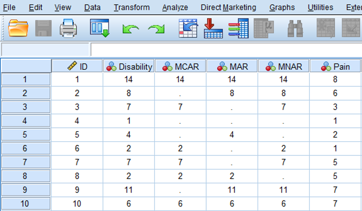
```

### Missing At Random

Data are Missing At Random (MAR) when the probability that a value for a variable is missing is related to other observed values in the dataset but not to the variable itself. An example of MAR data in the LBP study is presented in the MAR column of Figure \@ref(fig:fig2-7) and Figure \@ref(fig:tab2-3). In Figure \@ref(fig:fig2-7) you can see in the MAR column that 4 Tampa scale scores are missing for pain scores that are ≥ 6 and 1 for a pain score < 6, in other words the probability of missing data in the Tampa scale scores is higher for patients with higher pain scores. However, within the category of pain scores with values ≥ 6, the Tampa scale scores are MCAR, because within each category Tampa scale scores are randomly missing for lower and higher values. As a consequence, means and standard deviations do not differ between the observed and missing data for the Tampa scale variable. An explanation for this phenomenon can be that patients with higher Tampa scale scores were less likely to show up at a next Tampa scale measurement because their back hurted more. 

In a MAR missing data situation, missing values can be explained by other (observed) variables, like for the Tampa scale and Pain variable in the example above, due to the their (statistical) relationship in the dataset. Further, within categories of the pain variable (for low and high pain values) the Tampa scale scores are MCAR. However, it is not possible to test this assumption, because for that you need information of the missing values and in real-life, that is not possible. In general, excluding MAR data leads to biased parameter estimates and false results for your statistical tests. A missing data method that works well with MAR data is Multiple Imputation (Chapter 4). 

```{r tab2-3, echo = FALSE, fig.cap="MAR missing data in the Tampa scale variable.", out.width='90%', fig.align='center'}
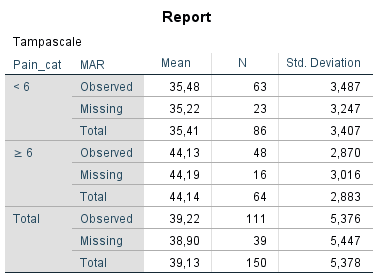
```

### Missing Not At Random

The data are MNAR when the probability of missing data in a variable is related to the scores of that variable itself, e.g. mostly high or low scores are missing. In the LBP study, MNAR data can occur when patients with the highest scores on the Tampa scale have missing Tampa scale values. This is shown in the MNAR column of Figure \@ref(fig:fig2-7). The MNAR column shows that the values that are most frequently missing are for the patients with the highest Tampa scale scores, i.e. for the patients that fear their back problems most. A reason may be that these patients were so afraid to move (which is assessed by the Tamp scale), that they were not able to visit an assessment center. MNAR missing data can also occur indirectly through the relationship of the variable with missing data with another variable that is not available in the dataset. For example, it could also be that patients with a high level of fear of movement, worry a lot and therefore do not want to be confronted with questions about their fear to move their back and therefore skip questions of the Tampa scale. In case of a positive relationship between worry and fear of movement, the highest values on the Tampa scale variable are missing. If worry is not measured in the study, the missing data in the Tampa scale variable is called MNAR. 
The difference with MAR is that with MNAR, the missing data problem cannot be handled by the observed variables in the dataset or by using a technique as Multiple Imputation. However, as with MAR data, MNAR data can also not be verified.

### The Missing Data Indicator

In the definitions of the missing data mechanisms in the previous paragraphs we used the term probability several times, to indicate that the relationship of variables with the probability of missingness in a variable distinguishes the missing data mechanisms. The probability of missing data can depend on other variables (MAR), on values of the variables itself (MNAR) or nether of these (MCAR). Rubin proposed that variables with missing data can be divided in a part that is observed and a part that is missing. The observed and missing data can be coded by a 0 and 1 respectively (@Rubin1987). In case of the Tampa scale variable this means that the observed data is coded by a 0 and a 1 is used for the Tampa scale values that are missing. This dichotomous coding variable is called the missing data indicator variable. Figure \@ref(fig:fig2-8) shows the missing data indicator variable for the observed and missing data in the Tampa scale variable. This indicator variable is now a single variable because there is missing data in only the Tampa scale variable. When more variables contain missing data, multiple indicator variables can be generated, one for each variable that contains missing data.

```{r fig2-8, echo = FALSE, fig.cap="The missing data in the Tampa scale variable coded according to the missing data indicator variable.", out.width='90%', fig.align='center'}
knitr::include_graphics("images/fig2.8.png")
```

Using the missing data indicator variable implies that missing values (or the probability of missing values) can be described by a statistical model. This model may consist of variables that have a relationship with the probability of missing data, in this case the indicator variable. A logistic regression model can be used to describe the relationship of variables with the probability of missing data in the Tampa scale variable. Graphically these models can be visualized as displayed in Figure 2.11 to 2.13 below. With logistic regression, the relationship of a dichotomous outcome variable (i.e. the missing data indicator variable) with other variables can be described. 

```{r fig2-9a, echo = FALSE, fig.cap="MCAR", out.width='90%', fig.align='center'}
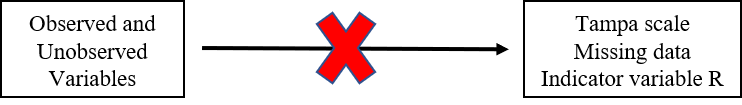
```

There is no relationship between, how the data became missing (indicated by R) and observed and unobserved variables.

```{r fig2-9b, echo = FALSE, fig.cap="MAR", out.width='90%', fig.align='center'}
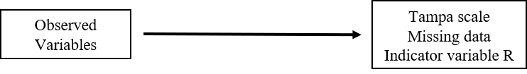
```

There is a relationship between, how the data became missing (indicated by R) and observed variables.

```{r fig2-9c, echo = FALSE, fig.cap="MNAR", out.width='90%', fig.align='center'}
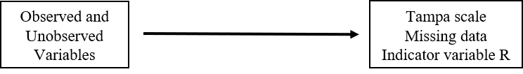
```

There is a relationship between, how the data got missing (indicated by R) and observed and unobserved variables.

The missing data mechanisms of Rubin can then be described by the following logistic regression functions, where $R_{Tampa}$ indicates the missing data indicator for the Tampa scale and $\beta$ the regression coefficient:

MCAR: No variables in or outside the dataset explain the missingness in the Tampa scale variable, the model would be empty: $$LN(\frac{R_{Tampa=1}}{1-R_{Tampa=1}}) = \beta_0$$

MAR: Variables in the dataset, like Pain and Radiation in the Leg explain the missingness in the Tampa scale variable and the model would be: $$LN(\frac{R_{Tampa=1}}{1-R_{Tampa=1}}) = \beta_0 + \beta_1 * Pain + \beta_2 * Radiation$$

MNAR: Missingness in the Tampa scale variable can be explained by variables in the dataset and by the score on the Tampa scale itself:

$$LN(\frac{R_{Tampa=1}}{1-R_{Tampa=1}}) = \beta_0 + \beta_1 * Pain + \beta_2 * Radiation + \beta_3 * Tampa$$

From these models we observe that the missing data models can be defined by other observed variables in the dataset and/or missing data (which we do not observe). It should be noted however, that we can never be completely sure about the reason why data are missing. The above mentioned relationships are therefore statistical relationships from descriptive models and not from causal models. In summary, the MCAR assumption is mostly very strict and not realistic in practice.The MAR assumption is more realistic and mostly assumed in practice.The difference bewteen MAR and MNAR is that in MNAR the probability of missingness is also related to the unobserved (missing) data.

### The Role of Auxiliary Variables

Usually, the probability of missing data is related to other variables and/or to the missing values itself (MAR or MNAR). Unfortunately, it is not possible to distinguish between MAR and MNAR mechanisms, because the missing values are unknown. Brand (@Brand1999) describes two examples that demonstrate how an initially MNAR missing data mechanism can change into MAR by including additional variables that are related to the probability of missing data. Accordingly, by including variables related to the probability of missing data a MNAR mechanism can get closer to a MAR mechanism. The MAR assumption can be made more plausible by including additional information in the missing data handling method (@Baraldi2010). Therefore, it is advised, to include extra variables that have a relationship with the missing data rate in other variables, i.e. have a relationship with the probability of missing data or that have a relationship (correlated) with the variables that contain the missing values (@Collins2001). These additional variables can help dealing with missing data as well and are called auxiliary variables. 

## Missing Data evaluation

The performance of missing data methods depends on the underlying missing data mechanism. As previously descirbed, the difference between the MCAR and not-MCAR mechanisms depend on the relationship between the probability for missing data and the observed variables. If this relationship cannot be detected we assume that the data is MCAR. If there is some kind of relationship, the missing data may be MAR or MNAR. We can never distinguish between MAR or MNAR data, because for that we need information about the missing values. Tests to distinguish the missing data assumptions are therefore limited to accept or reject the MCAR missing data assumption. In practice we study and measure outcomes and independent variables that are related to each other. This makes the MAR assumption mostly an accepted “working” missing data assumption in practice.

There are two approaches to evaluate the missing data mechanism. First, it is important to think about the most plausible reasons for the data being missing. Researchers mostly have some possible explanation about why data are missing and this information is very important. For example, when during web based data collection, the internet is sometimes disconnected, data of a few participants gets lost. When these malfunctions are coincidental, it can be assumed that the missing data are MCAR. However, when cognitive scores are assessed during this web based data collection and these are mostly not filled out by people that have decreased cognitive functions, the missing data can be assumed to be MNAR. 
Second, statistical tests can be used to get an idea about the missing data mechanism. In these statistical tests, the non-responders (i.e., participants with missing observations), can be compared to the responders on several characteristics. By doing this, we can test whether the missing data mechanism is likely to be MCAR or not-MCAR (because we cannot distinguish between MAR and MNAR missing data). There are several possibilities to compare the non-responders with the responders groups, for example using t-tests or Chi-square tests, logistic regressions with the missing data indicator as the outcome, or Little’s MCAR test (@Little1988).

Researchers need to be aware that the assumptions that underlie an independent t-test, logistic regression, and Chi-square test apply to these missing data mechanism procedures as well. This means that the residuals are assumed to be normally distributed and that the tests rely on a decent sample size.

### Missing data Evaluation in SPSS

#### Descriptive Statistics

Descriptive information of variables can be obtained via the following options of the Missing Value Analysis (MVA) module in the SPSS menu: 

> Analyze -> Missing Value Analysis... 

Transfer all variables in the correct Quantitative and Categorical variables window and then click 

> Descriptives option -> Univariate statistics -> Continue.

The following table will appear in the SPSS Output window.

```{r tab2-4, echo = FALSE, fig.cap="Univariate descriptive statistics of variables with and without missing data.", out.width='90%', fig.align='center'}
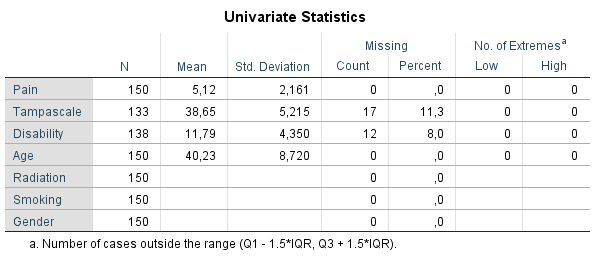
```

Under the column N, the information of all cases in the dataset are displayed. Further, for all continuous variables information about the Mean and Standard deviation are displayed. No descriptive information is given for categorical variables. Under the column Missing we get the number and percentage of missing values in each variable and under the column No. of Extremes we get information of cases that fall outside a range, which is specified under the table. These descriptive information of variables with missing data provide a quick overview of the amount of missing data in each variable. However, it does not provide us information about the relationship between variables with complete and missing data and therefore does not give us an idea about the potential missing data mechanism. Methods as T-tests, regression or Little’s MCAR test, discussed in the next section, can better be used for that purpose.

#### T-test procedure

For the t-test procedure, SPSS first separates cases with complete and missing values by creating an indicator variable of variables that ontain missing values. Then, group means of other variables are compared by using the indicator variable as group variable within the t-test procedure. You can apply his procedure by following:

> Analyze -> Missing Value Analysis... -> Descriptives -> click “t-tests with groups formed by indicator variables” and “include probabilities in table” -> Continue -> OK (Figure 2.15).

```{r fig2-11, echo = FALSE, fig.cap="The T-test procedure as part of the Missing Value Analysis menu", out.width='90%', fig.align='center'}
knitr::include_graphics("images/fig2.11.png")
```

SPSS will produce the following table.

```{r tab2-5, echo = FALSE, fig.cap="Output table of the t-test procedure.", out.width='70%', fig.align='center'}
knitr::include_graphics("images/tab2.5.png")
```

On the left side of the output table the names of the variables with missing values are presented which are the Tampa scale and Disability variables. Of these variables, indicator variables are defined which are used to compare group means of other variables, that can be tested for significance using independent t-tests. The results of these t-tests are shown in the table according to the information in separate rows on the left side with the t-value (t), degrees of freedom (df), P-value (P(2-tail)), numbers of observed and missing cases (# Present and # Missing) and means of observed and missing cases (Mean(Present) and Mean(Missing)) presented. The variables for which the indicator groups are compared, are listed in the columns of the table and are the Pain, Tampa scale, Disability and Age variables. For the Tampa scale variable that contain missing values, only the observed mean is presented, because for the missing cases the values are missing. Note that in the row of the Tampa scale variable the means of the Disability variable can still be compared between the observed and missing cases, because they do not miss values for exactly the same cases. Figure \@ref(fig:tab2-5) shows that patients that have observed values on the Tampa scale variable (row Mean(Present)) differ significantly from patients with missing values on the Tampa scale variable (row Mean(Missing)) on Pain (P(2-tail = 0.033) and Disability (P(2-tail = 0.039). When we look at the means of the Pain variable, we see that the mean of patients with missing values on the Tampa scale variable is higher compared to the mean of patients with observed scores. This means that there is a higher probability of missing data on the Tampa scale variable for patients with higher pain scores. If Tampa scale and Pain scores are correlated, the missing values on the Tampa scale variable can also be explained by the Pain score variable. This is also the case for the Age variable, however, the t-test is not significant. For the Disability variable, it is the other way around. We see more missing data on the Tampa scale variable for lower Disability scores.

In the Missing Value Analysis window another option is to select “Crosstabulations of categorical and indicator variables”. In that case a separate table is displayed for each categorical variable with missing values. For each category of the variable, the frequency and percentages of non-missing values for the other variables is displayed as well as the percentages of each type of missing value. To reduce the size of the table, you can omit statistics that are computed for only a small number of cases by adjusting the option “Omit variables missing less than % of cases”. Note that for these tables, the Chi-square tests and p-values are not performed. These can be obtained via the usual Crosstabs function, using a self-generated missing data indicator variable. 

> Analyze -> Descriptive Statistics -> Crosstabs

#### Logistic Regression Analysis

The missing data mechanism can also be evaluated with a logistic regression procedure (@Ridout1991). With logistic regression analysis, we can evaluate if the probability of missing data is related to other variables in the data. For this procedure, we first generate an indicator variable that separates the subjects with missing values from the participants with observed values. This indicator variable is used as the dependent variable in a logistic regression analysis. A backward regression can be used to determine the strongest predictors of missing data. The output for the logistic regression with the Tampa scale variable as the indicator outcome variable is presented below:

```{r tab2-6, echo = FALSE, fig.cap="Logistic regression analysis with variable that contain missing data as the outcome variable.", out.width='90%', fig.align='center'}
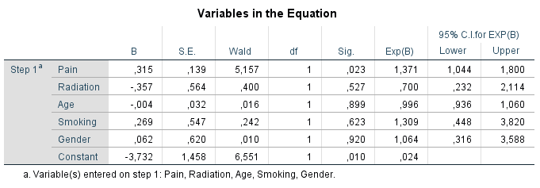
```

The variable Pain is significantly related to the missing data indicator variable of the Tampa scale variable, which indicates that the probability for missing data in the Tampa scale variable can be explained by the Pain variable. The positive coefficient of 0.315 indicates that the probability of missing data on the Tampa scale variable is higher for higher Pain scores. The other variables do not show a significant relationship with missing data on the Tampa scale variable. This logistic regression analysis procedure can be repeated for each variable with missing values in the dataset. 

#### Little's MCAR test in SPSS

Another possibility is to use a test that was developed by Roderick Little: Little’s MCAR test. This test is based on differences between the observed and estimated mean in each missing data pattern. This test is developed for continuous data. In this procedure, the missing data in the entire dataset is evaluated at once, because each missing data pattern is included in the analysis.

> Analyze -> Missing Value Analysis...-> select the continuous variables -> Select EM in the Estimation group -> OK


```{r fig2-12, echo = FALSE, fig.cap="EM selection in the Missing Value Analysis menu.", out.width='90%', fig.align='center'}
knitr::include_graphics("images/fig2.12.png")
```

```{r tab2-7, echo = FALSE, fig.cap="Output tables with information of Little’s MCAR test.", out.width='60%', fig.align='center'}
knitr::include_graphics("images/tab2.7a.png")
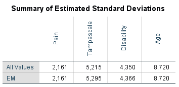
knitr::include_graphics("images/tab2.7c.png")
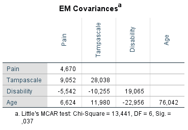
knitr::include_graphics("images/tab2.7e.png")
```

### Missing data Evaluation in R

#### Little's MCAR test in R

Little´s MCAR test is available in the `BaylorEdPsych` package for R from the `LittleMCAR` function. To apply the test, we select only the continuous variables. In the example we use the dataset of 150 low back pain patients with missing data in Gestatstional Age (GA). The p-value for the test is not-siginificant, indicating that the missings seem to be compeletely at random.

```{r echo=TRUE, message=FALSE, warning=FALSE}
library(BaylorEdPsych)
LittleMCAR(dataset[,c("Pain", "Tampascale","Disability", "GA")])

``` 
