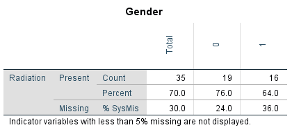
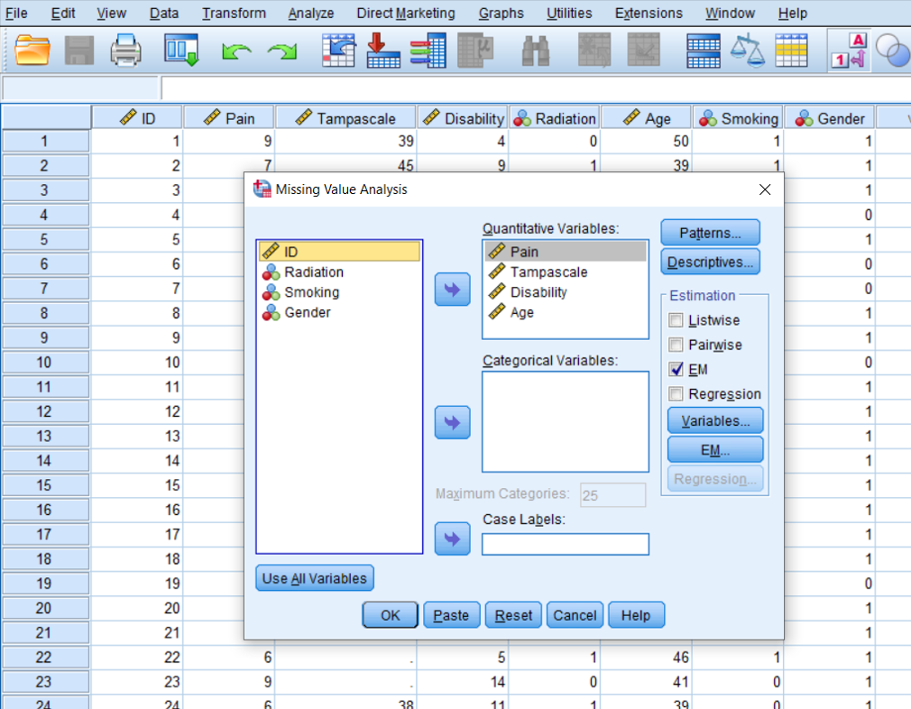
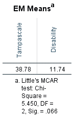

---
output:
  pdf_document: default
  html_document: default
---

# (PART) Part II: Basic Missing Data Handling {-}

# Missing Data Evaluation

When you define and evaluate missing data you can compose a missing data analysis plan to handle the missing data for your study situation. In this Chapter, you will learn how to evaluate the missing data that you can use for your missing data analysis plan. We start by the definition of missing data in SPSS and R. 

##	Missing Data definition in SPSS

Missing data in SPSS can be defined in two ways, as a system missing or user missing value. System missing data are missing data that is not present in the dataset and can be recognized by an empty cell (or dot). User missing data are data that are coded as missing values in the dataset by the user. Consider for example a small dataset with 50 Backpain patients consisting of male (coded as 1) and female (coded as 0) patients (Figure \@ref(fig:fig2-1)). 

```{r fig2-1, echo = FALSE, fig.cap="SPSS dataset containing variables with system and user missing data", out.width='90%', fig.align='center'}
knitr::include_graphics("images/fig2.1.png")
```

For the female patients in this dataset the duration of a previous pregnancy was regisered in the Gestational Age (GA) variable. This variable consists of different values: pregenancy durations in weeks, such as 36 and 29, but also the value 8 and empty cells. The value 8 is specified by the user to exclude males from further analysis because males cannot be pregnant. The system missing values are recognizable by the empty cells (or dots) in the dataset, and these indicate the missing GA values for women who did not report the GA for their pregnancy. It makes no difference if we code the missing values as a system or user missing value in SPSS, because both kinds of missing values will be excluded from further analyses.

##	Missing data definition in R

In R the missing values are denoted by `NA` which means “Not Available”. If we open the same dataset as above in R we get the following result.

```{r echo=TRUE, message=FALSE, warning=FALSE}
library(haven)
dataset <- read_sav("data/CH2 example.sav")
head(dataset,10) # Data of first 10 patients is shown
```

The Variable Gestational Age (GA) contains the values for GA (e.g. 36, 29, etc.), the value 8 for males and the NA’s. In R the value 8 will be treated as a real value, so we have to recode that value to `NA` by using the following code to convert an 8 into an `NA` for the males.

```{r echo=TRUE, message=FALSE, warning=FALSE}
dataset$GA[dataset$GA==8] <- NA
head(dataset,10)
```

Within most functions in R the handling of `NA` values has to be defined, otherwise the function returns an NA as a result. For example, the following code to obtain the mean of Gestational Age results in an `NA`. 

```{r echo=TRUE, message=FALSE, warning=FALSE}
mean(dataset$GA)
```

To obtain the mean of the observed data the statement `na.rm = TRUE` has to be added.

```{r echo=TRUE, message=FALSE, warning=FALSE}
mean(dataset$GA, na.rm = TRUE)
```

The `na.rm = TRUE` statement in the mean-function, indicates that values that are `NA` are removed before the analysis is executed. Another `NA` handling procedure that is regularly used in functions is called `na.action` with as options `na.fail`, `na.omit`, `NULL` (no action) and `na.exclude`. For more information about na.action options you can look at the help-file by typing `?na.action` in the Console window.

##	Missing data Patterns 

To get an idea about the complexity of the missing data problem in your dataset and information about the location of the missing values, the missing data pattern can be evaluated. 

###	Missing data patterns in SPSS

We use the options of the Missing Value Analysis (MVA) procedure in SPSS. The example dataset contains information on 9 study variables for 150 back pain patients. The continuous variables are Pain, Tampa scale, Disability, Body weight, Body length and Age. The dichotomous variables are Radiation in the leg, Smoking, and Gender. Only the variables Gender and Age are completely observed.

To access the MVA function in the SPSS menu choose: 

> Analyze -> Missing Value Analysis…  

In this menu, transfer all continuous variables to the Quantitative variables window and the categorical variables to the Categorical variables window. Then select the Patterns option. From the Patterns menu (Figure \@ref(fig:fig2-4)) select the options `Tabulated cases, grouped by missing value patterns` and `sort variables by missing value pattern`. To obtain the full list of all patterns that occur in the data, set the “Omit patterns with less than 1% of cases" at 0%, then click continue and OK. 

```{r fig2-4, echo = FALSE, fig.cap="The Patterns menu", out.width='90%', fig.align='center'}
knitr::include_graphics("images/fig2.4.png")
```

By default, univariate statistics are presented that include output information about the number and percentages of missing data and  descriptive statistics for each variable (Figure \@ref(fig:tab2-1)). 

Information about the missing data patterns is provided in the Tabulated patterns table. On the left column of that table, named “Number of Cases”, the number of cases are presented with that specific missing data pattern. In our example, there are 75 cases without any missing value and 13 cases with a missing value in only the Tampa scale variable (see row 1 and 2 in (Figure \@ref(fig:tab2-1)). In the right column of that table named “Complete if…”, the total number of subjects is presented if the variables that contain missing data in that pattern are not used in the analysis. Those variables are marked with the “X” symbol. For example, 88 subjects remain in the analysis when the variable tampa scale is not used in the analysis, these are the 75 subjects that have completely observed data on top of the 13 subjects with missing data in the Tampa scale variable only.

```{r tab2-1, echo = FALSE, fig.cap="Descriptive missing data statistics and the missing data patterns.", out.width='90%', fig.align='center'}
knitr::include_graphics("images/tab2.1a.png")
knitr::include_graphics("images/tab2.1b.png")

```

Another way to obtain information about the missing data patterns is by accessing the Multiple Imputation menu option. To access this menu, choose: 

> Analyze -> Multiple Imputation -> Analyze Patterns…  

```{r fig2-5, echo = FALSE, fig.cap="Analyse Patterns menu.", out.width='90%', fig.align='center'}
knitr::include_graphics("images/fig2.5.png")
```

Now transfer all variables for the missing value analysis to the window “Analyze Across Variables”. The following output options can be selected: 

- Summary of missing values: displays missing data information in pie charts, Patterns of missing values (displays tabulated patterns of missing values. 
- Variables with the highest frequency of missing values: displays a table of analysis variables sorted by percent of missing values in decreasing order. .
- Minimum percentage missing for varaibles to be displayed: set at 0 to obtain the full list of all patterns.
- Adjust the maximum number of variables displayed.

The following output will be displayed after selecting all options:

```{r fig2-6, echo = FALSE, fig.cap="Output as a result of the Analyze Patterns menu under Multiple Imputation.", out.width='90%', fig.align='center'}
knitr::include_graphics("images/fig2.6a.png")
knitr::include_graphics("images/fig2.6b.png")
knitr::include_graphics("images/fig2.6c.png")
knitr::include_graphics("images/fig2.6d.png")
```

### Missing data patterns in R

To display the missing data patterns in R we can use the `mice` or `VIM` package. We start with the `mice` package. This  package contains the `md.pattern` function that produces the missing data pattern.

```{r echo=TRUE, message=FALSE, warning=FALSE}
library(mice)
md.pattern(dataset)
```

The first row contains the variable names. Each other row represents a missing data pattern. The 1’s in each row indicate that the variable is complete and the 0’s indicate that the variable in that pattern contains missing values. The first column on the left (without a column name) shows the number of cases with a specific pattern and the column on the right shows the number of variables that is incomplete in that pattern. The last row shows the total number of missing values for each variable.

To obtain a visual impression of the missing data patterns in R the `VIM` package can be used. That package contains the function `aggr` that produces the univariate proportion of missing data together with two graphs.

```{r echo=TRUE, message=FALSE, warning=FALSE}
library(VIM)
aggr(dataset, col=c('white','red'), numbers=TRUE, sortVars=TRUE, cex.axis=.7, gap=3, ylab=c("Percentage of missing data","Missing Data Pattern"))

```

The variable names are shown at the bottom of the figures. The red cells in the Missing data patterns figure indicate that those variables contain missing values. We see that 0.500 or 50% of the patterns do not contain missing values in any of the variables. Of the total patterns, 8.67% of the patterns have missing values in only the Tampa scale variable. 

## The Missing Data Indicator

Rubin (@Rubin1987) proposed that variables with missing data can be divided in a part that is observed and a part that is missing. The observed and missing data can be coded by a 1 and 0 respectively. This dichotomous coding variable is called the missing data indicator variable. Figure \@ref(fig:fig2-8) shows the missing data indicator variable for the observed and missing data in the Tampa scale variable. This indicator variable is now a single variable because there is missing data in only the Tampa scale variable. When more variables contain missing data, multiple indicator variables can be generated, one for each variable that contains missing data.

```{r fig2-8, echo = FALSE, fig.cap="The missing data in the Tampa scale variable coded according to the missing data indicator variable.", out.width='80%', fig.align='center'}
knitr::include_graphics("images/fig2.8.png")
```

Using the missing data indicator variable implies that missing values (or the probability of missing values) can be described by a statistical model. This model may consist of variables that have a relationship with the probability of missing data, in this case the indicator variable. A logistic regression model can be used to describe the relationship of variables with the probability of missing data in the Tampa scale variable. 

##	Missing data Mechanisms

By evaluating the missing data patterns, we get insight in the location of the missing values. With respect to the missing data mechanism we are interested in the underlying reasons for the missing values and the relationships between variables with and without missing data. In 1976, Donald Rubin introduced a typology for missing data that distincts between random and non-random missing data situations, which are called Missing Completely At Random, Missing At Random and Missing Not At Random and abbreviated as MCAR, MAR and MNAR respectively (@Rubin1976).

The key idea behind Rubin’s missing data mechanisms is that the probability of missing data in a variable may or may not be related to the values of other measured variables in the dataset. With probability we loosely mean the likelihood of a missing value to occur, i.e. if a variable has a lot of missing data, the probability of missing data in that variable is high. This probability can be related to other measured or not-measured variables. For example, when mostly older people have missing values, the probability for missing data is related to age. Moreover, the missing data mechanisms also assume a certain relationship (or correlation) between observed variables and variables with missing values in the dataset. 

###	Missing Completely At Random

Data are Missing Completely At Random (MCAR) when the probability that a value is missing, is unrelated to the value of other observed (or unobserved) variables, and unrelated to values of the missing data variable itself. An MCAR example could be that, low back pain patients had to come to a research center to determine their level of disability by performing some physical tests and some of these patients were unable to leave their home, due to the flu. There is no assumed relationship between having the flu and scores on the disability variable which makes that this data is MCAR.  

An MCAR missing data situation for the disability variable is visualized in the MCAR column in Figure 2.7 below. Note that in real live we do not know the completely observed data, but for educational reasons, the completely observed values of the disability variable are displayed as well. We can observe that in the MCAR situation an equal number of lower and higher values of the disability variable are missing (in total 4 disability scores are missing, 2 for lower and 2 for higher values). Also, the missing data in the disability variable do not seem to be related to the values of another variable like pain; an equal number of disability values is missing for patients with low pain scores as well as for patients with higher pain scores. 

```{r fig2-7, echo = FALSE, fig.cap="Examples of MCAR, MAR and MNAR data.", out.width='90%', fig.align='center'}
knitr::include_graphics("images/fig2.7.png")
```

### Missing At Random

Data are Missing At Random (MAR) when the probability that a value for a variable is missing is related to other observed values in the dataset but not to the variable itself. An example of MAR data is presented in the MAR column of Figure \@ref(fig:fig2-7). Now 4 disability scores are missing for patients with pain scores ≤ 5. In other words the probability of missing data in the disability variable is higher for patients with lower pain scores. However, MAR also assumes that within the category of pain scores with values ≤ 5, the disability scores are MCAR, because disability scores are randomly missing for lower and higher values within that category. As a consequence, means and standard deviations do not differ between the observed and missing data for the disability variable. An explanation could be that patients with lower pain scores that were assessed by questionnaires that were sent to their home were less likely to visit the research center to determine their level of disability because they thought that information about their level of disability was not of interest anymore. 

It is not possible to test the MAR assumption, because for that you need information of the missing values and in real-life, that is not possible. In general, excluding MAR data leads to biased regression coefficient estimates and incorrect study results. A missing data method that works well with MAR data is Multiple Imputation (Chapter 4). 

### Missing Not At Random

The data are MNAR when the probability of missing data in a variable is related to the scores of that variable itself, e.g. mostly high or low scores are missing. In low back pain patients, MNAR data can occur when patients with the highest scores on the disability variable have missing disability values. This is shown in the MNAR column of Figure \@ref(fig:fig2-7). An explanation could be that these patients were not able to visit the research center due to their high level of disability. 

MNAR missing data can also occur indirectly through the relationship of the variable with missing data with another variable that is not available in the dataset. For example, it could also be that patients with a high level of disability also have a high fear of moving their back, and for that reason will not visit the research center. In case of a positive relationship between disability and fear of movement, the highest values on the disability variable are than missing. If fear of movement is not measured in the study, the missing data in the disability variable are called MNAR. 

The difference with MAR is that with MNAR, the missing data problem cannot be handled by using a technique as Multiple Imputation. However, as with MAR data, MNAR data can also not be verified because than information about the missing values is needed.

### The meaning of data being MAR

In a MAR missing data situation, missing values can be explained by other (observed) variables, like in the MAR data example of the disability and pain variables above. Further, it was stated that within the category of pain scores ≤ 5 the disability scores are MCAR. This means that the mean difference of disability between persons with low and high pain scores is the same between the observed and missing data. This is illustrated by using the mean disability values in table 2.1 below. 

In Table 2.1 the means of the disability variables are presented for the subgroups of patients with pain scores ≤ 5 and > 5. There is MAR missing data in the disability variable in the subgroup of patients with pain scores ≤ 5. The consequence is that the means are equal between the groups with complete and missing data, i.e 9.26 and 9.23 respectively. Consequently this also accounts for the mean difference of disability between patients with complete and missing data, i.e 5.30 (14.56 - 9.26) and 5.34 (14.56 - 9.23) respectively.  

This is an imporatnt consequence of MAR data, especially for multiple imputation where regression models are used to impute missing data. When, as part of this procedure, disability is imputed by using the pain variable, imputations are based on a correctly (unbiased) estimated regression coefficient. This is an important basis to generate valid imputed values. When pain and disability are also correlated imputation more than justified. To follow-up on this, it has been proven that imputations are improved when extra variables that have a relationship with the missing data rate in other variables, i.e. have a relationship with the probability of missing data or that have a relationship (correlated) with the variables that contain the missing values, are included in the imputation process (@Collins2001, @Baraldi2010). These additional variables can help dealing with missing data and are called auxiliary variables. More on this will be discussed in paragraph 4.2.5, 4.9 and 4.10 where we will deal with the imputation model. By the imputation model extra auxilliary variable can be included to improve imputations under the MAR assumption.  

## Missing Data evaluation

The performance of missing data methods depends on the underlying missing data mechanism. As previously descirbed, the difference between the MCAR and not-MCAR mechanisms depend on the relationship between the probability for missing data and the observed variables. If this relationship cannot be detected (and there are no specific reasons why data is missing) we assume that the data is MCAR. If there is some kind of relationship, the missing data may be MAR or MNAR. In practice we study and measure outcomes and independent variables that are related to each other. This makes the MAR assumption mostly an accepted “working” missing data assumption in practice.

It is important to think about the most plausible reasons for the data being missing. For example, when cognitive scores are assessed during data collection and these are mostly not filled out by people that have decreased cognitive functions, the missing data can be assumed to be MNAR. Statistical tests can also be used to get an idea about the missing data mechanism. In these statistical tests, the non-responders (i.e., participants with missing observations), can be compared to the responders on several characteristics. By doing this, we can test whether the missing data mechanism is likely to be MCAR or not-MCAR. There are several possibilities to compare the non-responders with the responders groups, for example using t-tests or Chi-square tests, logistic regressions with the missing data indicator as the outcome, or Little’s MCAR test (@Little1988).

Researchers need to be aware that the assumptions that underlie an independent t-test, logistic regression, and Chi-square test apply to these missing data mechanism procedures as well. This means that the residuals are assumed to be normally distributed and that the tests rely on a decent sample size.

## Missing data Evaluation in SPSS

### Descriptive Statistics

Descriptive information of variables can be obtained via the following options of the Missing Value Analysis (MVA) module in the SPSS menu: 

> Analyze -> Missing Value Analysis... 

Transfer all variables in the correct Quantitative and Categorical variables window and then click 

> Descriptives option -> Univariate statistics -> Continue.

The following table will appear in the SPSS Output window.

```{r tab2-4, echo = FALSE, fig.cap="Univariate descriptive statistics of variables with and without missing data.", out.width='90%', fig.align='center'}
knitr::include_graphics("images/tab2.4.png")
```

Under the column N, the information of all cases in the dataset are displayed. Further, for all continuous variables information about the Mean and Standard deviation are displayed. No descriptive information is given for categorical variables. Under the column Missing we get the number and percentage of missing values in each variable and under the column No. of Extremes we get information of cases that fall outside a range, which is specified under the table. These descriptive information of variables with missing data provide a quick overview of the amount of missing data in each variable. However, it does not provide us information about the relationship between variables with complete and missing data and therefore does not give us an idea about the potential missing data mechanism. Methods as T-tests, regression or Little’s MCAR test, discussed in the next section, can better be used for that purpose.

### Compare and test group comparisons

For the t-test procedure, SPSS first separates cases with complete and missing values by creating an indicator variable of variables that ontain missing values. This can be all type of variables. Then, group means of other (only continuous) variables are compared by using the indicator variable as group variable within the t-test procedure. You can apply his procedure by following:

> Analyze -> Missing Value Analysis... -> Descriptives -> click “t-tests with groups formed by indicator variables” and “include probabilities in table” -> Continue -> OK (Figure 2.15).

```{r fig2-11, echo = FALSE, fig.cap="The T-test procedure as part of the Missing Value Analysis menu", out.width='90%', fig.align='center'}
knitr::include_graphics("images/fig2.11.png")
```

SPSS will produce the following table.

```{r tab2-5, echo = FALSE, fig.cap="Output table of the t-test procedure.", out.width='70%', fig.align='center'}
knitr::include_graphics("images/tab2.5.png")
```

On the left side of the output table the names of the variables with missing values are presented which are the Tampa scale and Disability variables. Of these variables, indicator variables are defined which are used to compare group means of other variables, that can be tested for significance using independent t-tests. The results of these t-tests are shown in the table according to the information in separate rows on the left side with the t-value (t), degrees of freedom (df), P-value (P(2-tail)), numbers of observed and missing cases (# Present and # Missing) and means of observed and missing cases (Mean(Present) and Mean(Missing)) presented. The variables for which the indicator groups are compared, are listed in the columns of the table and are the Pain, Tampa scale, Disability and Age variables. For the Tampa scale variable that contain missing values, only the observed mean is presented, because for the missing cases the values are missing. Note that in the row of the Tampa scale variable the means of the Disability variable can still be compared between the observed and missing cases, because they do not miss values for exactly the same cases. Figure \@ref(fig:tab2-5) shows that patients that have observed values on the Tampa scale variable (row Mean(Present)) differ significantly from patients with missing values on the Tampa scale variable (row Mean(Missing)) on Pain (P(2-tail = 0.033) and Disability (P(2-tail = 0.039). When we look at the means of the Pain variable, we see that the mean of patients with missing values on the Tampa scale variable is higher compared to the mean of patients with observed scores. This means that there is a higher probability of missing data on the Tampa scale variable for patients with higher pain scores. If Tampa scale and Pain scores are correlated, the missing values on the Tampa scale variable can also be explained by the Pain score variable. This is also the case for the Age variable, however, the t-test is not significant. For the Disability variable, it is the other way around. We see more missing data on the Tampa scale variable for lower Disability scores.

In the Missing Value Analysis and subsequently the descriptives option, another possiblity is to select “Crosstabulations of categorical and indicator variables”. In that case a table is displayed to compare the percentage of present and missing data for categorical variables related to the indicator variable similarly defined as explained above. An example can be found in Figure \@ref(fig:tab2-8) that prodces SPSS when a missing data indicator variable is used for the Radiation variable, where for 11 cases data is missing.

```{r tab2-8, echo = FALSE, fig.cap="Output table of the Crosstabulations procedure.", out.width='70%', fig.align='center'}

```

You see in the table that Radiation values are more frequently missing for males (coded as 1 on the Gender variable) than for females (coded as 0). Note that for these tables, the Chi-square tests and p-values are not performed. These have to be obtained via the usual Crosstabs function, using a self-generated missing data indicator variable.

### Logistic Regression Analysis

With logistic regression analysis, we can evaluate if the probability of missing data is related to other variables in the data (@Ridout1991). For this procedure, we first generate an indicator variable that separates the subjects with missing values from the participants with observed values. This indicator variable can be used as the dependent variable in a logistic regression analysis. A backward regression can be used to determine the strongest predictors of missing data. The output for the logistic regression with the Tampa scale variable as the indicator outcome variable is presented in the table below:

```{r tab2-6, echo = FALSE, fig.cap="Logistic regression analysis with variable that contain missing data as the outcome variable.", out.width='90%', fig.align='center'}
knitr::include_graphics("images/tab2.6.png")
```

The variable Pain is significantly related to the missing data indicator variable of the Tampa scale variable, which indicates that the probability for missing data in the Tampa scale variable can be explained by the Pain variable. The positive coefficient of 0.315 indicates that the probability of missing data on the Tampa scale variable is higher for higher Pain scores. The other variables do not show a significant relationship with missing data on the Tampa scale variable. This logistic regression analysis procedure can be repeated for each variable with missing values in the dataset. 

### Little's MCAR test in SPSS

Another possibility is to use a test that was developed by Roderick Little: Little’s MCAR test. This test is based on differences between the observed and estimated means in each missing data pattern. This test is developed for continuous data. The test can be applied via: 

> Analyze -> Missing Value Analysis...-> select the continuous variables -> Select EM in the Estimation group -> OK

```{r fig2-12, echo = FALSE, fig.cap="EM selection in the Missing Value Analysis menu.", out.width='90%', fig.align='center'}

```

The following table that is called EM Means can be found in the output window of SPSS. Under the table the result of Little's MCAR test is displayed (tables that provide information of univariate statistics and a summary of estimated means and standard deviations are also provided. Further, tables that are called EM Covariances and EM Correlations are also generated, but they provide the same results for Little's MCAR test as under the EM Means table. These tables are not shown)

```{r tab2-7, echo = FALSE, fig.cap="Output tables with information of Little’s MCAR test.", out.width='40%', fig.align='center'}


```

## Missing data Evaluation in R

### Little's MCAR test in R

Little´s MCAR test is available in the `MissMech` package as the `TestMCARNormality` function. To apply the test, we select only the continuous variables. We use it for the same dataset as in the previous paragraph. The p-value for the test is siginificant, indicating that the missings does not seem to be compeletely at random. 

```{r echo=TRUE, message=FALSE, warning=FALSE}
library(haven)
dt <- read_sav("data/Backpain_test.sav")
df_select <- dt[,c("Pain", "Tampascale","Disability", "Age")]
library(MissMech)
res <- TestMCARNormality(data=df_select)
print(res)

``` 

### Compare and test group comparisons

In R also groups of the non-responders (i.e., participants with missing observations) can be compared to the responders (i.e. participants without missing observations). For this we can use the function `missing_compare` of the `finalfit` package. First we have to copy and rename the variables with missing data. We renamed the variables Tampa scale and Disability and called them Tampa_MAR and Disability_MAR respectively. The `missing_compare` function uses the Kruskal Wallis test for continuous variables and the Chi-squared test for categorical variables. This is the reason that the p-values in the tables might differ from those in Figure 2.10.        

```{r echo=TRUE, message=FALSE, warning=FALSE}

library(haven)
dt <- read_sav("data/Backpain_test.sav")
df_select <- data.frame(dt[,c("Pain", "Tampascale","Disability", "Age")])

# Copy variable with missing data and rename 
df_select$Tampa_MAR <- df_select$Tampascale
df_select$Disability_MAR <- df_select$Disability

library(finalfit)

explanatory = c("Pain", "Disability", "Age")
dependent = "Tampa_MAR"
df_select %>% 
  missing_compare(dependent, explanatory) %>% 
    knitr::kable(row.names=FALSE, align = c("l", "l", "r", "r", "r"), 
        caption = "Mean comparisons between values of responders (Not missing) and 
        non-responders (Missing) on the Tampa scale variable.") 

explanatory = c("Pain", "Tampascale", "Age")
dependent = "Disability_MAR"
df_select %>% 
  missing_compare(dependent, explanatory) %>% 
    knitr::kable(row.names=FALSE, align = c("l", "l", "r", "r", "r"), 
        caption = "Mean comparisons between values of responders (Not missing) and 
        non-responders (Missing) on the Disability variable.")

```
