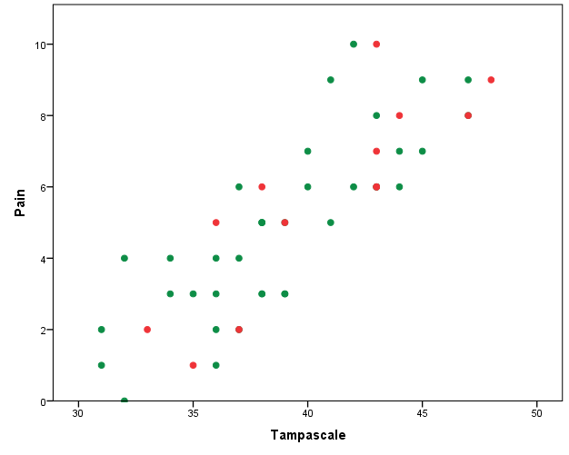
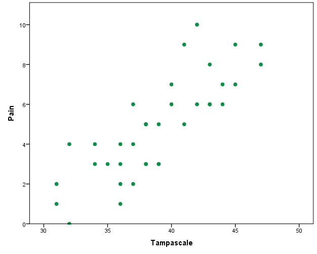
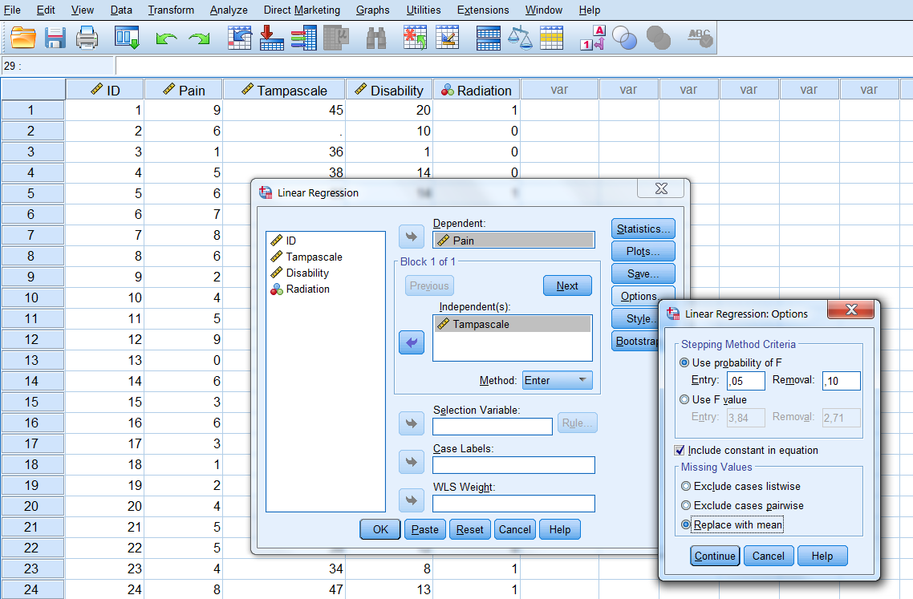
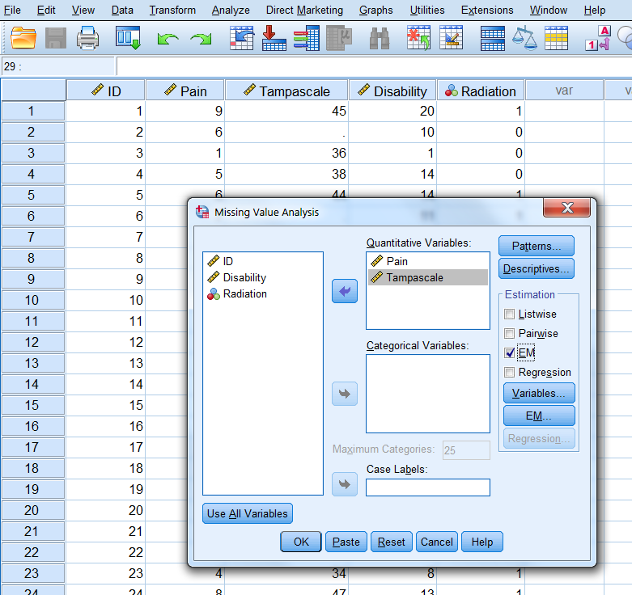
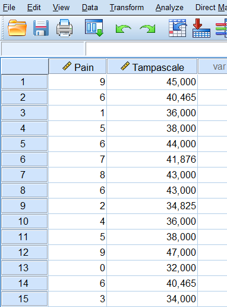
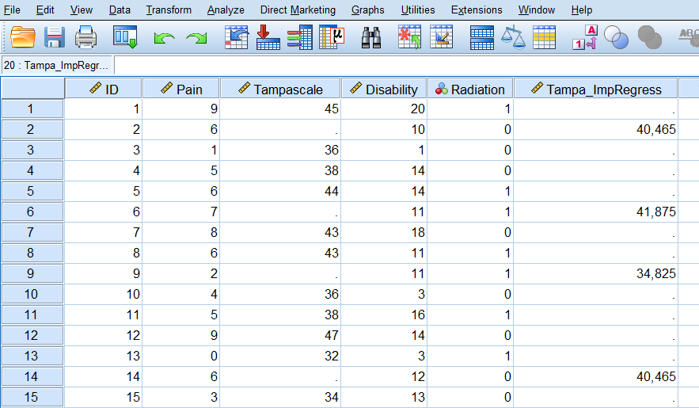
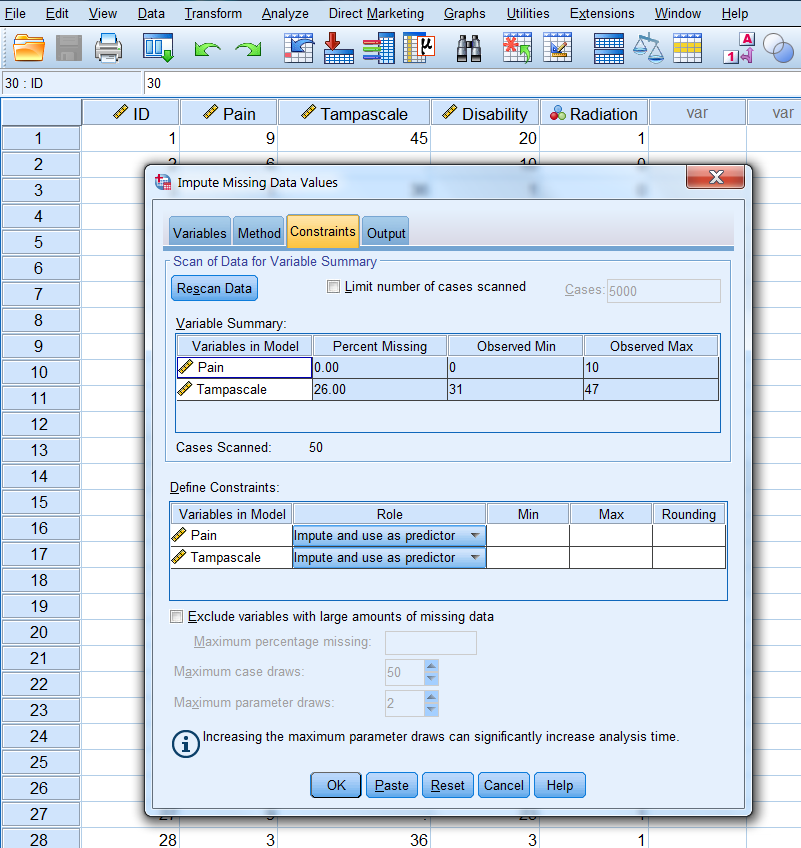
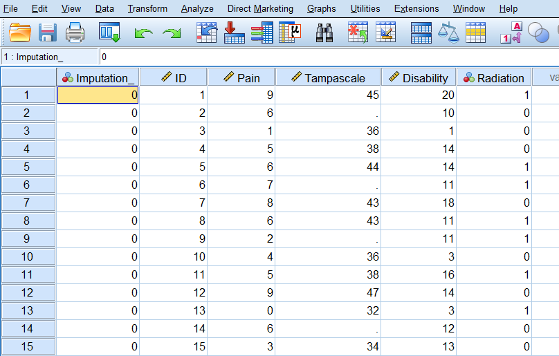
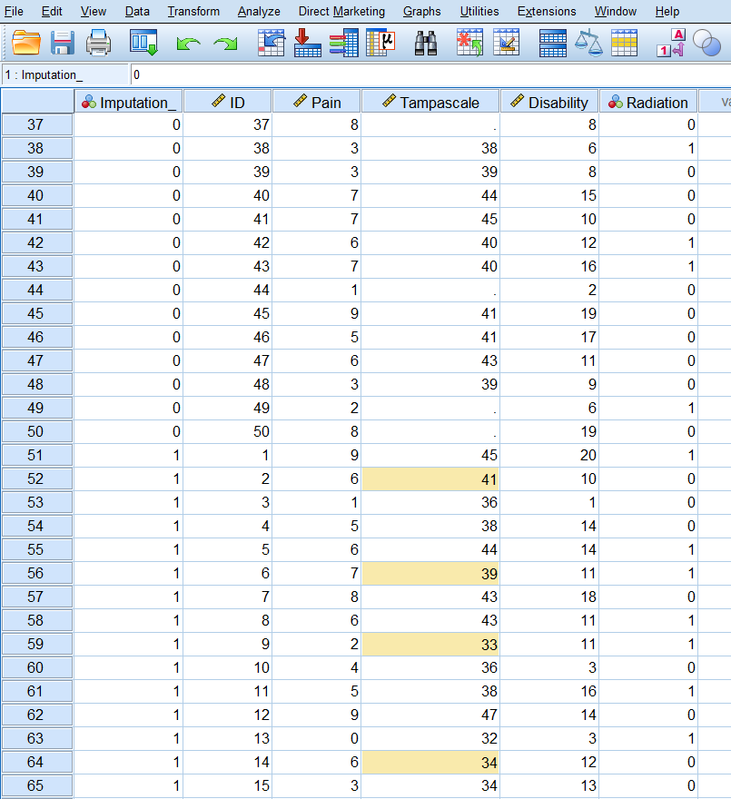

---
output:
  html_document: default
  pdf_document: default
---

# Single Missing data imputation

The topic of this Chapter is to explain how simple missing data methods like complete case analysis, mean and single regression imputation work. These procedures are still very often applied [@Eekhout2012] but generally not recommended because they decreases statistical power or lead to an incorrect estimation of standard errors when the data is MCAR, MAR and MNAR [@Eekhout2014; @VanBuuren2018; @enders2010applied].  

We use as an example data from a study about low back pain and we want to study if the Tampa scale variable is a predictor of low back pain. Both variables are continuous. Pain represents the intensity of the low back pain and the Tampa scale measures fear of moving the low back. The Tampa scale variable contains missing values. The number or type of missing values is not important because the main topic is to show how simple missing data methods work in SPSS and R.  

To get a first impression about the relationship between the Pain and the Tampa scale variables we make a scatterplot. The scatterplots with the complete and intended incomplete data is displayed in Figure \@ref(fig:fig3-1).

```{r fig3-1, echo = FALSE, fig.cap="Relationship between the Tampa scale and Pain variables (green dots are observed and red dots are the missing data", out.width='70%', fig.align="center"}

```

The green dots in Figure 3.1 represent the observed data and the red dots the missing data points. In practice, you work with the available points that are visualized in Figure \@ref(fig:fig3-2).   

```{r fig3-2, echo = FALSE, fig.cap="Relationship between the Tampa scale and Pain variable. Missing data are excluded", out.width='70%', fig.align='center'}

```

## Complete cases analysis

Complete case analysis (CCA) means that persons with a missing data point are excluded from the dataset before statistical analyses are performed. Nevertheless it is the default procedure in many statistical software packages such as SPSS. 

## Mean Imputation

With mean imputation the mean of a variable that contains missing values is calculated and used to replace all missing values in that variable. 

### Mean imputation in SPSS

*Descriptive Statistics*

The easiest method to do mean imputation is by calculating the mean using 

> Analyze -> Descriptive Statistics -> Descriptives

and than replace the missing values by the mean value by using the "Recode into Same Variables"under the Transform menu.

Other procedures for mean imputation are the *Replace Missing Values* procedure under Transform and by using the *Linear Regression* procedure. 

*Replace Missing Values procedure*

You can find the Replace Missing Values dialog box via 

> Transform -> Replace Missing Values. 

A new window opens. Transport the Tampa scale variable to the New variable(s) window (Figure \@ref(fig:fig3-3)). The default imputation procedure is Mean imputation or called “Series mean”. 

```{r fig3-3, echo = FALSE, fig.cap="Window for mean imputation of the Tampa scale variable.", out.width='70%', fig.align='center'}
knitr::include_graphics("images/fig3.6.png")
```

When you click on OK, a new variable is created in the dataset using the existing variable name followed by an underscore and a sequential number. The result is shown in Figure \@ref(fig:fig3-7).

```{r fig3-7, echo = FALSE, fig.cap="Mean imputation of the Tampa scale variable with the Replace Missing Values procedure.", out.width='70%', fig.align='center'}
knitr::include_graphics("images/fig3.7.png")
```

If we now make the scatterplot between the Pain and the Tampa scale variable it clearly shows the result of the mean imputation procedure, all imputed values are located at the mean value (Figure \@ref(fig:fig3-4)).

```{r fig3-4, echo = FALSE, fig.cap="Scatterplot between the Tampa scale and Pain variable, after the missing values of the Tampa scale variable have been replaced by the mean.", out.width='70%', fig.align='center'}
knitr::include_graphics("images/fig3.4.png")
```

*Linear Regression*

Mean imputation is also integrated in the Linear Regression menu via:

> Analyze -> Regression -> Linear -> Options. 

In the Missing Values group you choose for Replace with mean (Figure \@ref(fig:fig3-8)).

```{r fig3-8, echo = FALSE, fig.cap="The option Replace with mean in the Linear Regression menu.", out.width='70%', fig.align='center'}

```

### Mean imputation in R

```{r , echo=FALSE}
suppressWarnings(suppressMessages(library(foreign)))
suppressWarnings(suppressMessages(library(mice)))
```

You can do mean imputation by using the mice function in the mice package and choose as method "mean".

```{r }

library(foreign) # activate the foreign package to use the read.spss function
dataset <- read.spss(file="Backpain 50 missing.sav", to.data.frame=T)

library(mice) # Activate the mice package to use the mice function
imp_mean <- mice(dataset, method="mean", m=1, maxit=1)

```

You can extract the mean imputed dataset by using the complete function as follows: `complete(imp_mean)`

## Regression imputation

With regression imputation the information of other variables is used to predict the missing values in a variable by using a regression model. Commonly, first the regression model is estimated in the observed data and subsequently using the regression weights the missing values are predicted and replaced.  

### Regression imputation in SPSS

You can apply regression imputation in SPSS via the Missing Value Analysis menu. There are two options for regression imputation, the Regression option and the Expectation Maximization (EM) option. The Regression option in SPSS has some flaws in the estimation of the regression parameters [@hippel2004]. Therefore, we recommend the EM algorithm. This algorithm is a likelihood-based procedure. This means that the most likely values of the regression coefficients are estimated given the data and subsequently used to impute the missing value. This EM procedure gives the same results as first performing a simple regression analysis in the dataset and subsequently estimate the missing values from the regression equation. Both methods are described below.

#### EM procedure

Step 1, go to: 

> Analyze -> Missing Value Analysis...

In the main Missing Value Analysis dialog box, select the variable(s) and select EM in the Estimation group (Figure \@ref(fig:fig3-10)).

```{r fig3-10, echo = FALSE, fig.cap="EM Selection in the Missing Value Analysis window.", out.width='70%', fig.align='center'}

```

Step 2
click Variables, to specify predicted and predictor variables. Place the Tampascale variable in the Predicted variables window and the Pain variable in the Predictor Variables window (Figure \@ref(fig:fig3-11)).

```{r fig3-11, echo = FALSE, fig.cap="Transfer of the Tampascale and Pain variables to the Predicted and Predictor Variables windows.", out.width='70%', fig.align='center'}
knitr::include_graphics("images/fig3.11.png")
```

Step 3
Click on Continue -> EM and select Normal in the Distribution group. Than thick Save completed data and give the dataset a name, for example “ImpTampa_EM” (Figure \@ref(fig:fig3-12)). 

```{r fig3-12, echo = FALSE, fig.cap="Name of dataset to save the EM results in.", out.width='70%', fig.align='center'}
knitr::include_graphics("images/fig3.12.png")
```

Step 4
Click Continue -> OK. The new dataset “ImpTampa_EM” will open in a new window in SPSS. In this dataset the imputed data for the Tampascale Variable together with the original data is stored (Figure \@ref(fig:fig3-13), first 15 patients are shown). 

```{r fig3-13, echo = FALSE, fig.cap="Result of the EM procedure.", out.width='70%', fig.align='center'}

```

BNote that SPSS uses as default only quantitative variables to impute the missing values with the EM algorithm.

#### Normal Linear Regression imputation

We first estimate the relationship between Pain and the Tampa scale variable in the dataset with linear regression, by default subjects with missing values are excluded. Subsequently, we use the regression coefficients from this regression model to estimate the imputed values in the Tampa scale variable. 

To estimate the linear regression model, choose: 

> Analyze -> Regression -> Linear

Transfer the Tampa scale variable to the Dependent variable box and the Pain variable to the "Independent(s) in the Block 1 of 1 group. Then click OK. 

```{r fig3-14, echo = FALSE, fig.cap="Linear regression analysis with the Tampa scale as the outcome and Pain as the independent variable.", out.width='70%', fig.align='center'}
knitr::include_graphics("images/fig3.14.png")
```

```{r tab3-3, echo = FALSE, fig.cap="Result of the linear regression analysis.", out.width='70%', fig.align='center'}
knitr::include_graphics("images/table3.3.png")
```

The linear regression model can be described as: 

$$Tampascale = 32.005 + 1.410 × Pain$$

Now impute the missing values in the Tampa scale variable and compare them with the EM estimates. You see that the results are the same.

```{r fig3-15, echo = FALSE, fig.cap="Predictions of the missing Tampa scale values on basis of the regression model estimated in the dataset after the missing values were excluded.", out.width='70%', fig.align='center'}

```

In the scatterplot of the imputations from the regression model you see that, as expected, the imputed values are directly on the regression line (Figure \@ref(fig:fig3-16)).

```{r fig3-16, echo = FALSE, fig.cap="Relationship between the Tampa scale and the Pain variable.", out.width='70%', fig.align='center'}
knitr::include_graphics("images/fig3.16.png")
```

### Regression imputation in R

You can aply regression imputation in R with as method setting “norm.predict” in the mice function. The Pain variable is used to predict the missing values in the Tampa scale variable.

```{r }

library(foreign)
dataset <- read.spss(file="Mean imputation.sav", to.data.frame=T)
dataset <- dataset[, c("Pain", "Tampascale")]

imp.regress <- mice(dataset, method="norm.predict", m=1, maxit=1)
imp.regress$imp$Tampascale # Extract the imputed values

```

Expectantly, this gives comparable results as the regression imputation to SPSS above. The method “norm.predict” in the mice package fits a linear regression model in the dataset and generates the imputed values for the Tampa scale variable by using the regression coefficients of the linear regression model. The completed dataset can be extracted by using the complete function in the mice package.

### Stochastic regression imputation

In Stochastic regression models imputation uncertainty is accounted for by adding extra error variance to the predicted values from the linear regression model. Stochastic regression can be activated in SPSS via the Missing Value Analysis and the Regression Estimation option. However, the Regression Estimation option generates incorrect regression coefficient estimates [@hippel2004] and will therefore not further discussed.

### Stochastic regression imputation in R

You can apply stochastic regression imputation in R with the mice function using the method "norm.nob".

```{r }

dataset <- read.spss(file="Backpain 50 missing.sav", to.data.frame=T)
dataset <- dataset[, c("Pain", "Tampascale")]

imp_nob <- mice(dataset, method="norm.nob", m=1, maxit=1)

```

The completed dataset can be extracted by using the complete function in the mice package.

## Bayesian Stochastic regression imputation

With Bayesian Stochastic regression imputation uncertainty is not only accounted for by adding error variance to the predicted values but also by taking into account the uncertainty in estimating the regression coefficients of the imputation model. The Bayesian idea is used that there is not one (true) population regression coefficient but that the regression coefficients itself follows a distribution. For more information about the theory of Bayesian statistics we refer to the books of [@box2007bayesianinferencein; @enders2010applied; @gelman2014bayesian]. 

### Bayesian Stochastic regression imputation in SPSS

In SPSS Bayesian Stochastic regression imputation can be performed via the multiple imputation menu. To generate imputations for the Tampa scale variable, we use the Pain variable as the only predictor. 

**Step 1**

To start the imputation procedure, Go to 

> Analyze -> Multiple Imputation -> Impute Missing Data Values. 

In the first window you define which variables are included in the imputation model. Transfer the Tampa scale and Pain variable to the Variables in Model box. Than set the  number of imputed datasets to 1 under Imputations and give the dataset where the imputed values are stored under "Create a new dataset" a name. Here we give it the name “ImpStoch_Tampa” (Figure \@ref(fig:fig3-18)).

```{r fig3-18, echo = FALSE, fig.cap="The Variables window.", out.width='70%', fig.align='center'}
knitr::include_graphics("images/fig3.18.png")
```

**Step 2**

In the Methods tab, choose under Imputation Method for custom and then Fully conditional specification (MCMC). Set the Maximum iterations number at 50. This specifies the number of iterations as part of the FCS method (Figure \@ref(fig:fig3-19)). We further use the default settings.

```{r fig3-19, echo = FALSE, fig.cap="The Methods tab.", out.width='70%', fig.align='center'}
knitr::include_graphics("images/fig3.19.png")
```

**Step 3**

In the constraints window (Figure \@ref(fig:fig3-20)) click on the Scan Data button and further use the default settings. 

```{r fig3-20, echo = FALSE, fig.cap="Bayesian Stochastic regression imputation", out.width='70%', fig.align='center'}

```

**Step 4**

In the Output window we only use the default settings. 

```{r fig3-21, echo = FALSE, fig.cap="The Output tab.", out.width='70%', fig.align='center'}
knitr::include_graphics("images/fig3.21.png")
```

**Step 5**

Now click on OK button to start the imputation procedure

The output dataset consists of the original data with missing data plus a set of cases with imputed values for each imputation. The imputed datasets are stacked under each other. The file also contains a new variable, Imputation_, which indicates the number of the imputed dataset (0 for original data and more than 0 for the imputed datasets). The variable Imputation_ is added to the dataset and the imputed values are marked yellow. 

```{r fig3-22, echo = FALSE, fig.cap="Imputed dataset.", out.width='70%', fig.align='center'}

```

```{r fig3-23, echo = FALSE, fig.cap="Imputed dataset with the imputed values marked yellow.", out.width='70%', fig.align='center'}

```

When we make a scatterplot of the Pain and the Tampascale variable (Figure \@ref(fig:fig3-24)) we see that there is more variation in the Tampascale variable, or you could say that the variation in the Tampascale variable is “repaired”.

```{r fig3-24, echo = FALSE, fig.cap="Scatterplot of the relationship between Tampascale and the Pain variable, including the imputed values for the Tampascale variable (red dots).", out.width='70%', fig.align='center'}
knitr::include_graphics("images/fig3.24.png")
```

The full Multiple Imputation procedure will be discussed in more detail in the next Chapter.

### Bayesian Stochastic regression imputation in R

The package mice also include a Bayesian stochastic regression imputation procedure. You can apply this imputation procedure with the mice function and use as method "norm". The pain variable is the only predictor variable for the missing values in the Tampa scale variable.

```{r }
library(haven)
dataset <- read_sav(file="Backpain 50 missing.sav")
dataset <- dataset[, c("Pain", "Tampascale")]

imp_b <- mice(dataset, method="norm", m=1, maxit=1)

```

The completed dataset can be extracted by using the `complete` function in the `mice` package.
