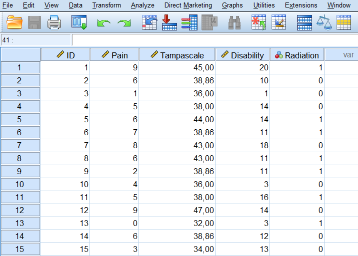
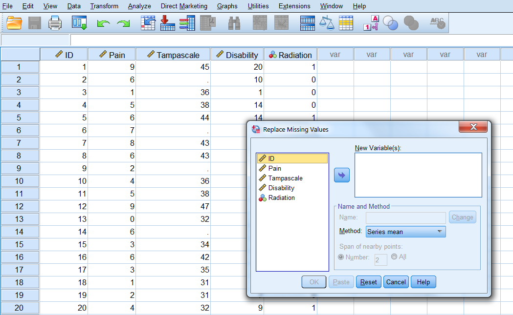
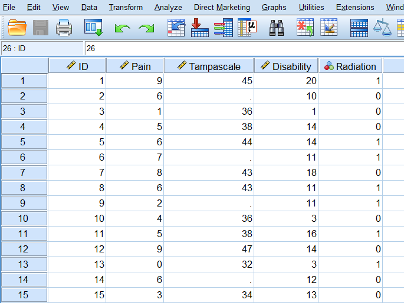

# Single Missing data imputations

In the previous Chapter the missing data patterns and mechanisms were evaluated and discussed. Both provide information about the locations of the missing values in the dataset and the relationship of variables with missing data and with other complete variables. Historically, this was important because some imputation methods worked best with a specific missing data pattern, or assumed missing data mechanism. Nowadays, advanced imputation methods as multiple imputation can deal with almost any missing data pattern. For the missing data mechanisms, it is still important to provide a strong idea about variables that can explain the missing data. When these variables are available in the dataset these can be used to impute the missing values. We will start this Chapter with a discussion of a in most missing data situations insufficient missing data method, complete case analysis.

## Complete cases analysis

Complete case analysis (CCA) means that the statistical analysis is performed in the dataset, after each missing data point has been excluded. This procedure is still one of the most use missing data handling procedures (Eekhout et al. 2012) and only results in correct mean or regression coefficient estimates when the data is MCAR. However, this method can have a large impact on the precision of the statistical test results because the main drawback of using CCA is that much of the information in the dataset will be excluded. It also leads to an incorrect estimation of standard errors when the data is MCAR, MAR and MNAR (Eekhout et al. 2014). It is for that reason not recommended. 
	There is only one situation in which CCA gives comparable results under MAR data. That is the situation when only outcome data is missing in randomized controlled trials (RCT) and observational study designs and adjustment for covariates is required (Groenwold et al. 2011). This situation gives the same results as with Multiple Imputation when the covariates are predictive of the missing data. Groenwold et al. therefore recommend the use of CCA because CCA would be more transparent compared to Multiple Imputation. Luiblinska and Rubin (2012) however, argued against this argument because the case of only outcome missing data is limited and therefore not realistic for many missing data situations where missing data is detected in more variables. This makes that CCA can be used in one rare missing data situation and that makes Multiple Imputation are more flexible procedure to use.

## Missing data imputation

In this Chapter, we will discuss several single imputation methods. These imputation methods will be considered by using a dataset containing information of 50 Low Back Pain (LBP) patients. Although, this dataset is small, the methods easily generalize to larger datasets with missing values in more variables. From these 50 patients, data is obtained about Pain, Tampa scale, Disability and if Radiation in the leg is present or not. The SPSS dataset is shown in (Figure \@ref(fig:fig31)) (first 15 patients are shown):

```{r fig31, echo = FALSE, fig.cap="SPSS dataset with missing values in the Tampa scale variable", out.width='90%', fig.align='center'}
knitr::include_graphics("images/fig3.1.png")
```

Assume that we are interested in the relationship between Pain and the Tampa scale variable. To get a first impression about this relationship we make a scatterplot. The scatterplots of the complete and incomplete datasets are displayed in (Figure \@ref(fig:fig32) and \@ref(fig:fig33)):

```{r fig32, echo = FALSE, fig.cap=" Relationship between the Tampa scale and Pain variables (green dots are observed and red dots are assumed to be missing data", out.width='90%', fig.align='center'}
knitr::include_graphics("images/fig3.2a.png")
```

```{r fig33, echo = FALSE, fig.cap="Relationship between the Tampa scale and Pain variable. Missing data are excluded", out.width='90%', fig.align='center'}
knitr::include_graphics("images/fig3.2b.png")
```

The green dots represent the observed data and the red dots the missing data points. In essence, in our dataset we have the data points that are visualized in Figure \@ref(fig:fig33). We will use this relationship to discuss what it means when we use single imputation methods. These will be discussed below.

## Mean Imputation

### Mean imputation in SPSS

Mean imputation in SPSS can be applied by using three different methods. One is to first compute the mean of the variable by using *Descriptive Statistics*, and replace all missing values by the mean value, the other is by using the *Replace Missing Values* procedure under Transform and the last one is by using the *Linear Regression* procedure. We will start with the first. 

Descriptive Statistics
Via Analyze -> Descriptive statistics, the descriptive statistics are calculated. The results are shown in Figure\@ref(fig:fig34). 
```{r fig34, echo = FALSE, fig.cap="Descriptive statistics of the complete data of the Tampa scale variable.", out.width='90%', fig.align='center'}
knitr::include_graphics("images/table3.2.png")
```

The mean of the Tampa scale variable is 38.86. Replacing the missing values by the mean result in the following complete dataset (Figure \@ref(fig:fig35)). We see that all missing values have the same value, which is 38.86, i.e. the mean value of the Tampa scale variable in the dataset after the missing values have been replaced (first 15 patients are shown). 

```{r fig35, echo = FALSE, fig.cap="Mean imputation of missing values of the Tampascale variable.", out.width='90%', fig.align='center'}

```

The scatterplot between the Pain and the Tampa scale variable clearly shows the result of this imputation procedure, all imputed values are located at the mean value (Figure \@ref(fig:fig36)).

```{r fig36, echo = FALSE, fig.cap="Scatterplot between the Tampa scale and Pain variable, after the missing values of the Tampa scale variable have been replaced by the mean.", out.width='90%', fig.align='center'}
knitr::include_graphics("images/fig3.4.png")
```

*Replace Missing Values procedure*
You can also find the Replace Missing Values dialog box via Transform -> Replace Missing Values. The following window will appear (Figure \@ref(fig:fig37)).

```{r fig37, echo = FALSE, fig.cap="Window for mean imputation via the Replace Missing Values procedure.", out.width='90%', fig.align='center'}

```

Now transport the Tampa scale variable to the New variable(s) window (Figure \@ref(fig:fig38)). The default imputation procedure is Mean imputation or called “Series mean”. 

```{r fig38, echo = FALSE, fig.cap="Window for mean imputation of the Tampa scale variable.", out.width='90%', fig.align='center'}
knitr::include_graphics("images/fig3.6.png")
```

When you click on OK, a new variable is created in the dataset using the existing variable name followed by an underscore and a sequential number. The result of the procedure is shown in Figure \@ref(fig:fig39.

```{r fig39, echo = FALSE, fig.cap="Mean imputation of the Tampa scale variable with the Replace Missing Values procedure.", out.width='90%', fig.align='center'}
knitr::include_graphics("images/fig3.7.png")
```

*Linear Regression*
Mean imputation in SPSS is also integrated in the Linear Regression menu. This can be approached by following the route:

Analyze -> Regression -> Linear -> Options. In the Missing Values group you can choose for Replace with mean (Figure \@ref(fig:fig40)).

```{r fig40, echo = FALSE, fig.cap="The option Replace with mean in the Linear Regression menu.", out.width='90%', fig.align='center'}
knitr::include_graphics("images/fig3.8.png")
```

### Mean imputation in R

We use the same Backpain dataset as above to impute the missing data in the Tampa scale variable. First, we read in the dataset in R (first 15 patients are shown).  

```{r , echo=FALSE}
suppressWarnings(suppressMessages(library(foreign)))
suppressWarnings(suppressMessages(library(mice)))
```

```{r }

library(foreign)
dataset <- read.spss(file="Backpain 50 missing.sav", to.data.frame=T)

```

With the following code we apply mean imputation:

```{r }

library(mice) # Activate the mice package to use the mice function
imp_mean <- mice(dataset, method="mean", m=1, maxit=1)
imp_mean

```

The information under iter and imp means that we used one step (1 iteration) to impute the missing values with the mean in one dataset, indicated by the 1 under imp. The mice function is designed to use multiple imputation. This function will be explained in more detail in Chapter 4. The following R code 3.3 can be used to extract the imputed values in the Tampa scale variable:

```{r }

imp_mean$imp$Tampascale

```

The completed dataset can be extracted by using the following R code (first 15 shown):

```{r eval=FALSE}

complete(imp_mean)

```

## Regression imputation

### Regression imputation in SPSS

In SPSS regression imputation can be done via the Missing Value Analysis procedures. There are two options that can be used for regression imputation, the Regression option and the EM option. This latter abbreviation stands for Expectation Maximization (EM). Because the Regression option in SPSS has some flaws in the estimation of the regression parameters (see paper von Hippel 2004) we take as an example the EM algorithm. This algorithm is a likelihood-based procedure. This means that the most likely values of the regression coefficients are estimated given the data and these regression coefficients are subsequently used to impute the missing value. This EM procedure gives the same results as first performing a normal regression analysis in the dataset and subsequently estimate the missing values from the regression equation, after the missing values have been excluded. We will compare the EM and regression procedures below. We take as an example the imputations that are used for the missing values in the Tampa scale variable by the regression of the Tampa scale on Pain. In other words, we use for this example one predictor variable for the missing data in the Tampa scale variable. With this prediction model that is used to impute the missing data in the Tampa scale variable, the Tampa scale variable becomes the outcome variable. We will use the Backpain 50 missing.sav dataset. Step 1 to 5 below explains how to apply the procedures. 

Step 1
From the menus choose: Analyze -> Missing Value Analysis...

```{r fig41, echo = FALSE, fig.cap="The Missing Value Analysis dialog box.", out.width='90%', fig.align='center'}
knitr::include_graphics("images/fig3.9.png")
```

Step 2
In the main Missing Value Analysis dialog box, select the variable(s) that you want to use for the regression method and select EM in the Estimation group (Figure \@ref(fig:fig42)).

```{r fig42, echo = FALSE, fig.cap="EM Selection in the Missing Value Analysis window.", out.width='90%', fig.align='center'}
knitr::include_graphics("images/fig3.10.png")
```

Step 3
To specify predicted and predictor variables, click Variables. Place the Tampascale variable in the window of the Predicted variables and the Pain variable in the Predictor Variables window (Figure \@ref(fig:fig43)).

```{r fig43, echo = FALSE, fig.cap="Transfer of the Tampascale and Pain variables to the Predicted and Predictor Variables windows.", out.width='90%', fig.align='center'}
knitr::include_graphics("images/fig3.11.png")
```

Step 4
Click on Continue -> EM and Choose for Normal in the Distribution group. Than thick Save completed data and give the dataset a name, for example “ImpTampa_EM” (Figure \@ref(fig:fig44)). 

```{r fig44, echo = FALSE, fig.cap="Name of dataset to save the EM results in.", out.width='90%', fig.align='center'}
knitr::include_graphics("images/fig3.12.png")
```

Step 5
Then Click Continue -> OK. The new dataset “ImpTampa_EM” will open in a new window in SPSS. In this dataset the imputed data of the Tampascale Variable together with the original data is stored (Figure \@ref(fig:fig45), first 15 patients are shown). Adjust the Width and Decimals of the Tampa scale variable in the Variable View window to 4 and 3 respectively to get the same results as in Figure 3.13. 

```{r fig45, echo = FALSE, fig.cap="Result of the EM procedure.", out.width='90%', fig.align='center'}
knitr::include_graphics("images/fig3.13.png")
```

The imputations are generated from the linear regression model of the relationship between Pain and Function. 
	Be aware that SPSS uses as default only quantitative variables to impute the missing values with the EM algorithm. If you want to include categorical variables in the imputation model as auxiliary variables, you have to define them as scale variables.
	Let’s now compare the EM procedure with a two-step procedure. We first estimate the relationship between Pain and the Tampa scale variable in the dataset with linear regression after we have excluded the cases with missing values in the Tampa scale variable. Subsequently, we use the regression coefficients from this regression model to estimate the imputed values in the Tampa scale variable. We start by estimating the linear regression model with the Tampa scale variable as outcome variable (because we have to predict missing values in this variable). The Pain variable is now the independent variable.

To estimate the linear regression model:
From the menus choose: Analyze -> Regression -> Linear

```{r fig46, echo = FALSE, fig.cap="Linear regression analysis with the Tampa scale as the outcome and Pain as the independent variable.", out.width='90%', fig.align='center'}
knitr::include_graphics("images/fig3.14.png")
```

Transfer the Tampa scale variable to the Dependent variable window and the Pain variable to the window of the Block 1 of 1 group. Then click OK. The following coefficients will be estimated (Figure \@ref(fig:fig47)).

```{r fig47, echo = FALSE, fig.cap="Result of the linear regression analysis.", out.width='90%', fig.align='center'}
knitr::include_graphics("images/table3.3.png")
```

The linear regression model can be described as: 

Tampascale=32.005+1.410 ×Pain

When we use this regression model to impute the missing values in the Tampa scale variable and we compare them with the EM estimates, we see that the results are the same.

```{r fig48, echo = FALSE, fig.cap="Predictions of the missing Tampa scale values on basis of the regression model estimated in the dataset after the missing values were excluded.", out.width='90%', fig.align='center'}
knitr::include_graphics("images/fig3.15.png")
```

When we make a scatterplot of the imputations from the regression model we see that as expected the imputed values lie directly on the regression line (Figure \@ref(fig:fig49)).

```{r fig49, echo = FALSE, fig.cap="Relationship between the Tampa scale and the Pain variable.", out.width='90%', fig.align='center'}
knitr::include_graphics("images/fig3.16.png")
```

The Tampa scale variable is located on the y-axis. The imputed values of the Tampa scale variable (red dots) are located on the regression line that was used to generate the imputed values. The green dots are the observed data values.

### Regression imputation in R

We will now continue with the application of regression imputation in R. We use the same dataset as we did for regression imputation in SPSS above. Regression imputation can be done in R by using the R code 3.5 with as method “norm.predict”. Only the Pain variable will be used to predict the missing values in the Tampa scale variable.

```{r }

library(foreign)
dataset <- read.spss(file="Mean imputation.sav", to.data.frame=T)
dataset <- dataset[, c("Pain", "Tampascale")]

imp.regress <- mice(dataset, method="norm.predict", m=1, maxit=1)
imp.regress$imp$Tampascale # Extract the imputed values

```

Expectantly, this gives comparable results as the regression imputation with SPSS above. The method “norm.predict” in the mice package is a short notation of the function mice.impute.norm.predict. This function fits a linear regression model in the dataset without missing data and generates the imputed values for the Tampa scale variable by using the regression coefficients of the linear regression model. The same regression coefficients are used to predict the missing values in the Tampa scale variable as was shown in Table 3.3. The completed dataset can be extracted by using the complete function in the mice package.

### Stochastic regression imputation

Multiple Imputation accounts for the uncertainty in the estimation of imputed values. This imputation uncertainty can be accounted for by using Stochastic regression models. With Stochastic regression models the imputation uncertainty is accounted for by adding extra error variance to the predicted values that are generated by the linear regression model. Stochastic regression can be activated in SPSS via the Missing Value Analysis and the Regression Estimation option. However, the Regression Estimation option generates incorrect regression coefficient estimates (von Hippel, 2004) and will therefore not further discussed or applied in this manual. Stochastic regression models estimated using Bayesian methods (where extra error variance is also added to the regression coefficients) can be applied in SPSS by using the Multiple Imputation procedure. This is the topic of paragraph 3.5.1. We will continue with the application of stochastic regression imputation in R. 

### Stochastic regression imputation in R

In R stochastic regression imputation can be done with the mice function. There are two versions available in the mice function to apply stochastic regression imputation, one that is non-Bayesian and one that is called Bayesian stochastic regression imputation.
We start with non-Bayesian stochastic regression imputation. We will use only the Pain variable to predict the missing values in the Tampa scale variable. The function that mice uses for this procedure is the mice.impute.norm.nob function. We will use for the example the same dataset as above including 50 low back pain patients with missing values in the Tampa scale variable. 
Stochastic regression imputation is applied in R code 3.7 by using the “norm.nob” method.

```{r }

dataset <- read.spss(file="Backpain 50 missing.sav", to.data.frame=T)
dataset <- dataset[, c("Pain", "Tampascale")]

imp_nob <- mice(dataset, method="norm.nob", m=1, maxit=1)
imp_nob$imp$Tampascale # Extract the imputed values

```

The completed dataset can be extracted by using the complete function in the mice package.

## Bayesian Stochastic regression imputation

The difference between non-Bayesian and Bayesian imputation is that to the latter imputed values also extra variation is added to the (population) regression coefficients. In other words, we use the idea that there is not one true (population) regression coefficient but that the regression coefficient as the true population parameter follows a (probability) distribution itself. This is in contrast to a frequentist idea, which assume that there is one true population parameter and that the uncertainty (by using a confidence interval) around the population parameter is interpreted as a probability statement of the result if the research would be repeatedly conducted. 	
Bayesian methods also incorporate uncertainty in the parameters estimates of the regression model, which are the regression coefficients and the residual variance. In the context of missing data, Bayesian estimates are used to incorporate parameter uncertainty that estimate the missing values (above adding error variance). In the missing data literature, it is said that the missing values are drawn from the posterior predictive distribution, conditional on the values of other variables. This means in the context of imputation that for the parameters of the regression model, which are the regression coefficients and the error variance, the posterior distribution is estimated first. For more information about the theory of Bayesian statistics we refer to the books of Box and Tiao (1992), Enders (2012) and Gelman et al. (2004). 
Bayesian stochastic regression imputation can be applied in SPSS and R. We start with an explanation of Bayesian Stochastic regression imputation in SPSS, followed by an application in R.

### Bayesian Stochastic regression imputation in SPSS

Bayesian Stochastic regression imputation can be performed via the multiple imputation menu in SPSS (IBM Cooperation 2016). The Multiple Imputation procedure in SPSS, and its settings, will be discussed in more detail in the next Chapter. For now, we will show the steps that have to be taken to apply Stochastic regression imputation. Again, we will make use of the same dataset as above with missing data in only the Tampa scale variable. To generate the imputations, we will make use of the Pain variable as the only predictor variable in the imputation model (Figure \@ref(fig:fig50), first 15 patients shown). 

```{r fig50, echo = FALSE, fig.cap="The example dataset with missing data in the Tampa scale variable.", out.width='90%', fig.align='center'}

```

To apply Bayesian stochastic regression imputation, we make use of Multiple Imputation procedure. That will be explained in Step 1 to 5 below.

Step 1

To start the imputation procedure, Go to Analyze -> Multiple Imputation -> Impute Missing Data Values. The first window that appears is the Variables window. In this window you can define which variables you want to include in the imputation model, which are the Tampascale and Pain variables. The number of imputed datasets you want to generate, which you have to set to 1, and the name of the dataset where you want to copy your imputed Tampascale values to. We give this dataset the name “ImpStoch_Tampa”, as in Figure \@ref(fig:fig51).

```{r fig51, echo = FALSE, fig.cap="The Variables window.", out.width='90%', fig.align='center'}
knitr::include_graphics("images/fig3.18.png")
```

Step 2

In the Methods window you have two options for the Imputation Method. The Automatic and the Custom method. We would not advise you to use the automatic procedure. With this procedure the data will be scanned by SPSS and a monotone imputation method will be used if the data shows a monotone pattern of missing values (see paragraph on missing data patterns). Otherwise, fully conditional specification is used. You can better customize your imputation method so that you are sure the best procedure for your data will be used. We will use the Custom option and choose for fully conditional specification (MCMC). Set the Maximum iterations number at 50. This specifies the number of iterations, that is part of the FCS method (Figure \@ref(fig:fig52)). We further use the default settings.

```{r fig52, echo = FALSE, fig.cap="The Methods window.", out.width='90%', fig.align='center'}
knitr::include_graphics("images/fig3.19.png")
```

Step 3
In the constraints window (Figure \@ref(fig:fig53)) you can scan the data and put constraints on the minimum and maximum values of the imputed variables. It is also possible to constrain the variables in the imputation model. This will further be discussed in the next Chapter. For now, we scan the data and use for other settings the default setting. 

```{r fig53, echo = FALSE, fig.cap="Stochastic regression imputation", out.width='90%', fig.align='center'}
knitr::include_graphics("images/fig3.20.png")
```

Step 4
In the Output window we only use the default settings. 

```{r fig54, echo = FALSE, fig.cap="The Output window.", out.width='90%', fig.align='center'}
knitr::include_graphics("images/fig3.21.png")
```

Step 5
After you click on OK the imputation procedure will start.
The output dataset consists of the original data with missing data plus a set of cases with imputed values for each imputation. These imputed datasets are stacked under each other. The file also contains a new variable, Imputation_, a numeric variable that indicates the number of the imputed dataset (0 for original data and > 0 for the imputed datasets). Figure \@ref(fig:fig55) and Figure \@ref(fig:fig56) are the imputed datasets. In Figure \@ref(fig:fig55) the variable Imputation_ is added to the dataset and in Figure \@ref(fig:fig56), the imputed values are marked yellow. 

```{r fig55, echo = FALSE, fig.cap="Imputed dataset with the variable Imputation_ to distinguish the original and imputed datasets.", out.width='90%', fig.align='center'}
knitr::include_graphics("images/fig3.22a.png")
```

```{r fig56, echo = FALSE, fig.cap="Imputed dataset with the imputed values marked yellow.", out.width='90%', fig.align='center'}
knitr::include_graphics("images/fig3.22b.png")
```

When we make a scatterplot of the Pain and the Tampascale variable (Figure \@ref(fig:fig57)) we see that there is more variation in the Tampascale variable, or you could say that the variation in the Tampascale variable is “repaired”.

```{r fig57, echo = FALSE, fig.cap="Scatterplot of the relationship between Tampascale and the Pain variable, including the imputed values for the Tampascale variable (red dots).", out.width='90%', fig.align='center'}
knitr::include_graphics("images/fig3.23.png")
```

### Bayesian Stochastic regression imputation in R

The package mice also include a Bayesian stochastic regression imputation procedure. This method also accounts for imputation uncertainty, not only via the residuals (error variance), but also via the regression coefficients, which means that extra noise (or random error) is added to the regression coefficients. This imputation procedure is done by using the mice.impute.norm function. For the example to apply this method in R code 3.8 we use the same dataset as above with missing values in the Tampa scale variable and the pain variable as the only predictor variable for these missing values.

```{r }

dataset <- read.spss(file="Backpain 50 missing.sav", to.data.frame=T)
dataset <- dataset[, c("Pain", "Tampascale")]

imp_b <- mice(dataset, method="norm", m=1, maxit=1)
imp_b$imp$Tampascale # Extract the imputed values

```

The completed dataset can be extracted by using the complete function in the mice package.

## Predictive Mean Matching

Predictive mean matching (PMM) is an imputation method that predicts values and subsequently selects observed values to be used to replace the missing values. It is the default imputation procedure in the mice package to impute missing data in continuous variables (Rubin, 1987, p. 168). It is applied in combination with stochastic regression imputation. 

### A data example of Predictive Mean Matching

We use the LBP dataset and the Tampa scale and Pain variables, with missing data in the Tampa scale variable and complete data in the Pain variable. We will show how PMM works for the first missing value in the Tampa scale variable. The first missing value is located in ID 2, i.e. in the second row and is marked white (R code 3.9)

```{r }

dataset <- read.spss(file="Backpain 50 missing.sav", to.data.frame=T)
dataset <- dataset[, c("ID", "Pain", "Tampascale")]
head(dataset, 15)

```

At the first step a simple linear regression analysis is applied in the complete cases (i.e. complete case analysis), with the Tampa scale variable as the outcome and Pain as the predictor variable. By using this model, all observed Tampa scale values are replaced by the predicted values using the intercept, the regression coefficient for Pain and the Pain values of the observed patients. This is the same as applying simple regression imputation, where the predicted values are taken from the regression line. We call these values the Predictedobserved values. Subsequently, all missing values of the Tampa scale variable are replaced by values that are generated by using Bayesian stochastic regression imputation and these values are called the Predictedmissing values. These values are predicted according to the same steps as for simple linear regression, but now Bayesian versions of the regression coefficients for Pain are used to generate the predicted values of the Tampa scale variable. The Predictedobserved and the Predictedmissing values for the Tampa scale variable are shown as the Tampascale_Pred variable in R code 3.10.
	R code 3.10 shows the original dataset with the Pain and Tampa scale variables, the Tampascale_Pred variable and a group variable, to indicate if a Tampa scale value is missing (Group=1) or not (Group=0). At the next step the first value that is predicted for the first missing value of ID 2 (the value 40.55550 under Tampascale_Pred) is subtracted from all observed predicted values. These differences can be found under the column that is called d. In this column the differences between the Predictedobserved values and the value 40.55550 (first predicted value for the first missing value of the Tampa scale variable) can be found, i.e. 44.69636 - 40.55550 = 4.14086. This d value is used to select the donors that contain the smallest difference between the Predictedobserved and the Predictedmissing values for the Tampa scale and that will be used to replace the missing values. In our example the smallest difference is 0.09006. Finally, one of these donors is selected randomly and the observed Tampa scale value that is related to that donor is used to replace the first missing value in the Tampa scale variable. In our example the first missing value in the Tampascale variable, when we would use 3 donors to randomly draw from, would get the value 42, 37 or 40. This procedure is repeated for every missing value. 

To summarize, the following steps are followed by PMM to replace missing values:

1.	Predicted values of observed Tampa scale values are estimated by using the Pain variable as predictor and the regression coefficients estimated in the observed data (complete case analysis). In other words, only the observed data is used to generate predicted Tampa scale values. These values are the Predictedobserved values. This regression model can be described by the red regression line in Figure 3.21.
2.	From the regression coefficients under 1, draws are taken from the Bayesian posterior distribution to get Bayesian estimates and these are used to generate predicted values for the missing Tampa scale values by using the Pain variable as predictor. These are the Predictedmissing values and can be derived from the blue regression line in Figure 3.21.
3.	From all Predictedobserved values, each Predictedmissing value is subtracted, i.e. starting with the first Predictedmissing value to replace the first missing value. The first value that is subtracted is the value 40.5555, which is marked white in R code 3.9 above. That subtraction results in the values under the column named d.
4.	These differences in the d column are sorted from low to high.
5.	The three cases with the lowest values are than matched to the observed values of the Tampa scale variable. These are recognizable by the numbers 1, 2 and 3 in the R code 3.10 above. To prevent duplicate values, a small value is added to these values (not shown). Than from these cases a random selected value of the observed Tampa scale variable is drawn, i.e. from the values 42, 37 and 40 when 3 donors are used.
6.	Finally, one value of these observed values is randomly chosen and used to replace the missing value in the Tampa scale variable.
7.	This process is repeated for each case with a missing value in the Tampa scale variable.

Note that matching of donors is done using the predicted values (of the observed and missing values) of the variable with missing data, and not on the observed values. The observed values are used to fill in the missing values.

