---
output:
  html_document: default
  pdf_document: default
---

# (PART) Part III: Multiple Imputation {-}

# Multiple Imputation

In this Chapter we discuss an advanced missing data handling method, Multiple Imputation (MI). With MI, each missing value is replaced by several different values and consequently several different completed datasets are generated. The concept of MI can be made clear by the following figure \@ref(fig:fig4-1).

```{r fig4-1, echo = FALSE, fig.cap="Graphical presentation of the MI procedure.", out.width='90%', fig.align='center'}
knitr::include_graphics("images/fig4.1.png")
```

In the first step, the dataset with missing values (i.e. the incomplete dataset) is copied several times. Then in the next step, the missing values are replaced with imputed values in each copy of the dataset. In each copy, slightly different values are imputed due to random variation. This results in mulitple imputed datasets. In the third step, the imputed datasets are each analyzed and the study results are then pooled into the final study result. In this Chapter, the first phase in multiple imputation, the imputation step, is the main topic. In the next Chapter, the analysis and pooling phases are discussed. 

## Multivariate Imputation by Chained Equations

Multivariate imputation by chained equations (MICE) [@VanBuuren2018] is also known as Sequential Regression Imputation, Fully Conditional Specification or Gibbs sampling. In the MICE algorithm, a chain of regression equations is used to obtain imputations, which means that variables with missing data are imputed one by one. The regression models use information from all other variables in the model, i.e. (conditional) imputation models. In order to add sampling variability to the imputations, residual error is added to create the imputed values. This residual error can either be added to the prediced values directly, which is esentially similar to repeating stochastic regression imputation over several imputation runs. Or, the residual variance can be added via the parameter estimates of the regression model, which is a Bayesian sampling method. The Bayesian method is the default in the `mice` package in R. The MICE procedure became available in SPSS when version 17 was released.   

## Multiple imputation in SPSS

The MI procedure in SPSS is based on the MICE algorithm that was developed in R. It is therefore no surprise that most  options of the mice function in R are also available in SPSS. Note that before you start the MI procedure it is important to set the measurement level of the variables with missing data in the Variable View window of your data. They are important for the regression model that is used to estimate the missing values in that variable. For example, if you define a variable as scale, then linear regression models are used, for categorical variables, logistic regression models are used. 

We use as an example a dataset with 50 patient with low back pain. In these patients information was measured about their Pain, Tampa scale, Disability and Radiation. The variables Tampa scale and Disability contain missing values of 26% and 18% respectively.

The multiple imputation procedure is started by navigating to 

>Analyze -> Multiple Imputation -> Impute Missing Data Values.

Than a window opens that consists of 4 tabs, a Variables, a Method, a Constraints and an Output tab. You have to visit these tabs to specify the imputation settings before you can start the imputation process by clicking the OK button.

### The Variables tab

```{r fig4-6, echo = FALSE, fig.cap="The variables Tab", out.width='90%', fig.align='center'}
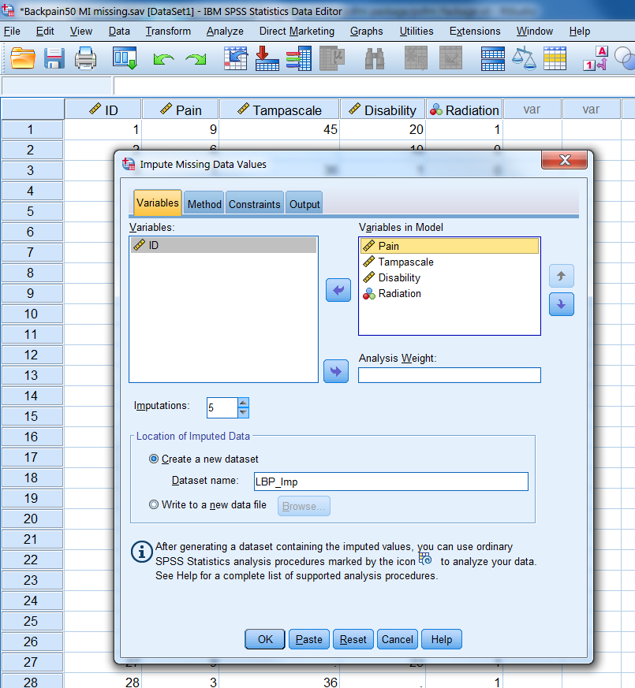
```

The first window is the Variables tab (Figure \@ref(fig:fig4-6)). Here you can transport the complete and incomplete variables that you want to include in the imputation model to the window “Variables in Model”. The variables are imputed sequentially in the order in which they are listed in the variables list. These variables are here Pain, Tampa scale, Disability and Radiation. In our example the Tampa scale variable is imputed before the Disability variable because the Tampa scale variable was first listed. Further, the number of imputed datasets can be defined in the "Imputations"" box, we choose 5 here. Than you go to "Create a new Dataset" and choose a name for the dataset to which the imputed data values are saved, which is called “LBP_Imp”. If you are finished you visit the Methods Tab where you can define the imputation method.

### The Method tab

```{r fig4-7, echo = FALSE, fig.cap="The Methods Tab", out.width='90%', fig.align='center'}
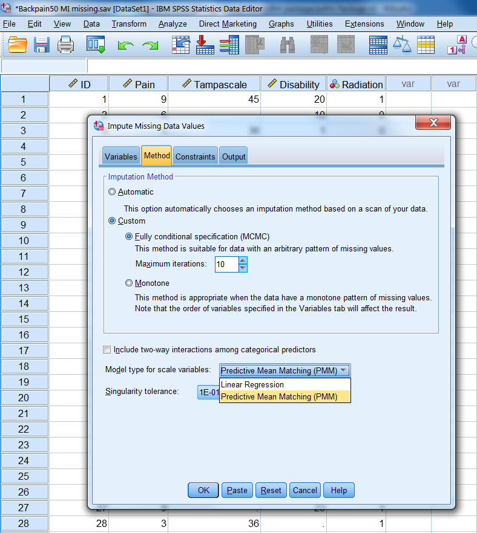
```

In the Method tab (Figure \@ref(fig:fig4-7)) you choose the imputation algorithm. We choose for “Custom” under Imputation Method and for Fully conditional specification (FCS). FCS is the Bayesian regression imputation method as explained in *Chapter 3*. You can also change the maximum number of Iterations which has a default setting of 10. It is recommended to increase that number to 50. Under Model type for scale (continuous) variables we choose for Predictive Mean Matching (PMM) (see paragraph 4.6 for a more detailed explanation of PMM). PMM is the default procedure in the `mice` package to impute continuous variables. In SPSS the default is the linear regression procedure. It is better to change it into PMM. Now visit the Constraints Tab.

### The Constraints tab

```{r fig4-8, echo = FALSE, fig.cap="The Constraints Tab", out.width='90%', fig.align='center'}
knitr::include_graphics("images/fig4.8.png")
```

In the Constraints tab (Figure \@ref(fig:fig4-8)) the minimum and maximum allowable imputed values for continuous variables can be defined when for scale variables the Linear Regression model is chosen in the Method tab. To obtain the current range of variable values you can click on the "Scan" button, subseqeuntly these values can be adjusted. When the PMM method is selected in the Method Tab, the Constraints tab can be skipped. You can also restrict the analysis to variables with less than a maximum percentage of missing values when you select "Exclude variables with large amounts of missing data". 
In the Constraints tab also the role of variables in the imputation model can be defined (see paragraph 4.2.5). In the last Output Tab the generated output can be selected.

### The Output tab

```{r fig4-9, echo = FALSE, fig.cap="The Output Tab", out.width='90%', fig.align='center'}
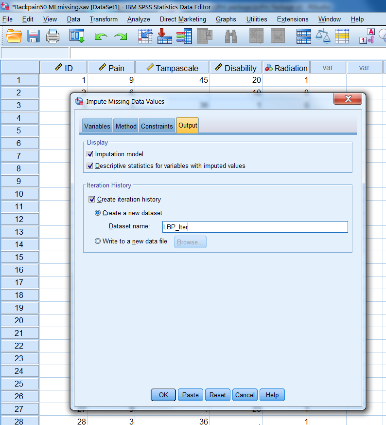
```

In the Output tab (Figure \@ref(fig:fig4-9)) descriptive statistics of variables that are imputed can be exctracted by selecting "Imputation model" and "the Descriptive statistics for variables with imputed values" options. You can also request a dataset that contains iteration history data, which we name “Iter_Backpain”. The dataset contains the means and standard deviations of the imputed scale variables at each iteration. You can use this data to check for irregularities during imputation by making convergence plot that will be discussed in paragraph 4.5. 

### Customizing the Imputation Model

The content of the imputation model, i.e. regression model used to impute missing values, is important to generate valid imputed values. The role of variables in the imputation model before MI is started can be customized in SPSS in the Constraints tab. As default all variables that are transported to the window “Variables in Model” in the first Variables tab will be imputed or used as a predictor in the imputation model by using the default setting "Impute and use as predictor". This setting means that any variable is used as a predictor in the imputation model to predict missing values in any other variable. This role of variables can be adjusted in the Constraints tab by using a variable as a predictor only, by the setting "Use as predictor only" or to exclude variables from being used as predictors in the imputation model by the setting "Impute only" for example for variables with larger percentages of missing data. Note that when in SPSS a variable is used as a predictor to impute variables with missing data, that variable will be part of each imputation model to impute every other variable with missing data. This may lead to large imputation models that may contain variables that are not the best predictors to impute missing values when their correlation with other variables is low.     

## Random number generator

Before you start the multiple imputation procedure, it is possible to set the starting point of the random number generator in SPSS at a fixed value of 950 (in R we use the seed for this). In this way you are able to reproduce results exactly. later. It is also a good idea to store the multiple imputed datasets. 

We set the random number generator in SPSS via 

>Transform -> Random Number Generators -> Set Starting point -> Fixed Value

```{r fig4-5, echo = FALSE, fig.cap="Set the Random Number Generator ", out.width='70%', fig.align='center'}
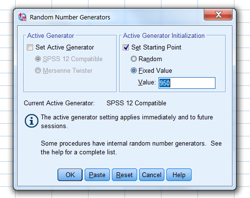

```

## The output of Multiple imputation in SPSS

### The Imputed datasets

After multiple imputation, the multiple imputed datasets are stored in a new SPSS file and are stacked on top of each other. A new variable that is called `Imputation_` is added to the dataset and can be found in the first column. This Imputation_ variable is a nominal variable that separates the original from the imputed datasets. This is also indicated in the corner on the right side below in the Data View and Variable View windows by the note “Split by imputation_”. You can compare the use of this variable with the Split File option in SPSS where all analyses are done separately for the categories of the variable used to split the analyses. The difference is that with the `Imputation_` variable you also obtain pooled estimates for the statistical analyses. When missing values are imputed with any another software program, and you read in the imputed data in SPSS and add an `Imputation_` variable yourself the data is recognized by SPSS as multiple imputed data. The imputed values are marked yellow. By these marking SPSS recognized the dataset as an (multiple) imputed dataset which is important for further statistical analyses (see Chapter 5, paragraph 5.1)

Figure \@ref(fig:fig5-1) shows an example of a multiple imputed dataset with imputed values marked yellow. 

```{r fig5-1, echo = FALSE, fig.cap="Example of SPSS dataset after MI has been applied.", out.width='90%', fig.align='center'}
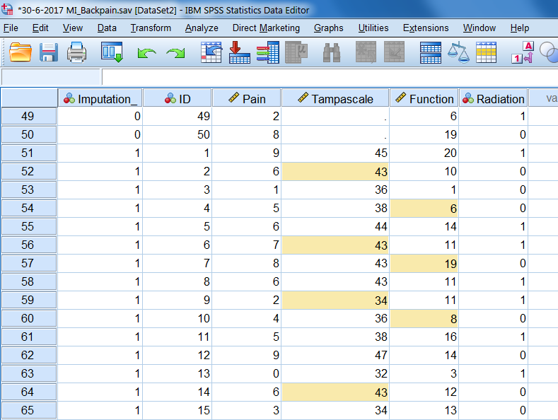
```

You can mark and unmark the imputed values by using the option “Mark Imputed Data” under the View menu in the Data View window (Figure \@ref(fig:fig5-2)). 

> View -> Mark Imputed data

```{r fig5-2, echo = FALSE, fig.cap="Procedure to mark imputed values in SPSS.", out.width='90%', fig.align='center'}
knitr::include_graphics("images/fig5.2.png")
```

This marking and unmarking can also be done in the Data view window via the button with yellow and white squares on the right site above (Figure \@ref(fig:fig4-11)). If you click the button, a selection box appears with “Original data” selected,where you can easily move to the different imputed datasets. 

```{r fig4-11, echo = FALSE, fig.cap="Button and selection box to mark imputed values", out.width='90%', fig.align='center'}
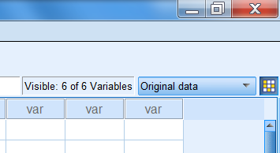

```

### Imputation history

The iteration history is stored in the Iter_Backpain dataset as we defined in the Output window. In this dataset the means and standard deviations of the imputed values at each iteration are stored. These values can be used to construct Convergence plots. More about making convergence plots will be discussed in the next paragraph.

```{r fig4-12, echo = FALSE, fig.cap="The iteration history data", out.width='90%', fig.align='center'}
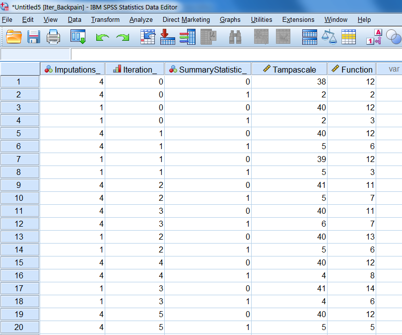

```

### Output tables

Based on our settings, SPSS produces the following results in the output window. In the Imputation Specifications table, information is provided on the imputation method used, the number of imputations, the model used for the scale variables, if interactions were included in the imputation models, the setting for the maximum percentage of missing values and the setting for the maximum number of parameters in the imputation model (Figure \@ref(fig:tab4-4)).

```{r tab4-4, echo = FALSE, fig.cap="Imputation Specifications table", out.width='90%', fig.align='center'}
knitr::include_graphics("images/tab4.4.png")

```

A second table, called Imputation Results, is presented with information about the imputation method, the number of fully conditional specification methods, the variables that are imputed and not imputed and the imputation sequence(Figure \@ref(fig:tab4-5)).

```{r tab4-5, echo = FALSE, fig.cap="Imputation Results", out.width='90%', fig.align='center'}
knitr::include_graphics("images/tab4.5.png")

```

The Imputation Models table presents information about the imputation models used for the variables with missing data (Figure \@ref(fig:tab4-6)). Information is provided about the method of imputation, under the type column, the effect estimates used to impute the missing values, the number of missing and imputed values. For example for the Tampascale variable 13 values were missing and m=5 times 13 is 65 values were imputed.

```{r tab4-6, echo = FALSE, fig.cap="Imputation Models", out.width='90%', fig.align='center'}
knitr::include_graphics("images/tab4.6.png")

```

The Descriptive statistics display the descriptive information of the original, imputed and completed data of the Tampascale and the Disability variable. In this way you can compare the completed data after MI with the original data.

```{r tab4-7, echo = FALSE, fig.cap="Descriptive statistics", out.width='90%', fig.align='center'}
knitr::include_graphics("images/tab4.7.png")
knitr::include_graphics("images/tab4.8.png")

```

## Checking Convergence after Multiple imputation in SPSS

The dataset Iter_Backpain in the previous paragraph contains the means and standard deviations of the imputed values at each iteration and imputation round. This information is similar as the 
information in `imp$chainMean` in R. This dataset can be used to generate convergence plots, to check if the imputed values have the expected variation between the iterations.The iteration can be checked for the means and standard deviations seperately. In order to obtain seperate plots for these summary statistics, the split file option in SPSS can be activated. 

```{r fig4-17, echo = FALSE, fig.cap="Split file", out.width='90%', fig.align='center'}
knitr::include_graphics("images/fig4.17.png")

```

After activation of the split file option, the Graph menu in SPSS can be used to make the plots. 

>Graph -> Chart Builder.

```{r fig4-13, echo = FALSE, fig.cap="Graph menu", out.width='90%', fig.align='center'}
knitr::include_graphics("images/fig4.13.png")

```

Two windows will open that can be used to build a chart:

```{r fig4-14, echo = FALSE, fig.cap="Chart Builder", out.width='90%', fig.align='center'}
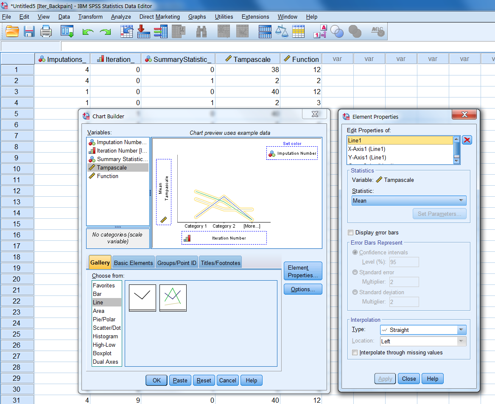

```

On the x-axis the put the `iteration number` variable and on the y-axis the variable for which we want to display the iteration history. The `Imputation Number` variable is dragged to the `set color` top-right.   

```{r fig4-15, echo = FALSE, fig.cap="Chart Builder", out.width='90%', fig.align='center'}
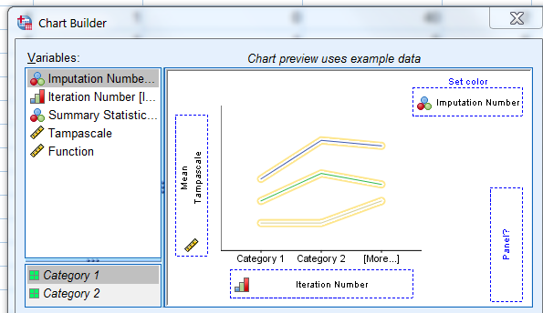

```

As a result two plots appear with the iteation history for each imputation run. 

```{r fig4-18, echo = FALSE, fig.cap="Convergence plots", out.width='90%', fig.align='center'}
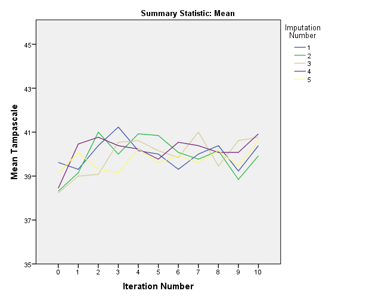
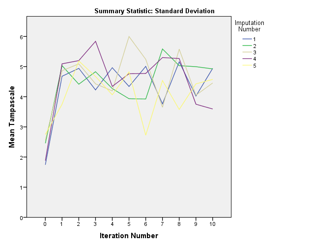

```

## Multiple Imputation in R

In R multiple imputation (MI) can be performed with the `mice` function from the `mice` package. As an example dataset to show how to apply MI in R we use the same dataset as in the previous paragraph that included 50 patients with low back pain. The variables Tampa scale and Disability contain missing values and the Pain and Radiation variables are complete. 

The following default settings are used in the `mice` function to start MI, `m=5`, to generate 5 imputed datasets, `maxit=10`, to use 10 iterations for each imputed dataset, `method=”pmm”` to use predictive mean matching (see paragraph 4.8). For an elobate explanation of all options withing the mice function, see `?mice`.

```{r }
library(mice)
library(foreign)
data <- read.spss(file="Backpain50 MI missing.sav", to.data.frame=T)[, -1] # Read in dataset an exclude ID variable
imp <- mice(data, m=5, maxit=10, method="pmm")
```

By default, the `mice` fucntion returns information about the iteration and imputation steps of the imputed variables under the columns named “iter”, “imp” and “variable” respectively. This information can be turned off by setting the `mice` function parameter `printFlag = FALSE`, which results in silent computation of the missing values. A summary of the imputation results can be obtained by calling the `imp` object.

```{r}
imp
```

This imp object returns information about the number of imputed datasets, the imputation methods for each variable, information of the PredictorMatrix (used to customize the imputation model, see paragraph 4.6.2). 

The imputed datasets can be extracted by using the `complete` function. The settings `action = ”long”` and `include = TRUE` return a data.frame where the imputed datasets are stacked under each other and the original dataset (with missings) is included on top.

```{r, eval=FALSE}
complete(imp, action = "long", include = TRUE)
```

In the imputed datasets two variables are added, an `.id` variable and an `.imp` variable to distinguish cases and the imputed datasets. To extract the first imputed dataset, only the setting `action = 1` is needed in the `complete` function. (see ?complete for more possibilities to extract the imputed datasets).The imputed datasets can further be used in mice to conduct pooled analyses or to store them for further use. 

## The mice MI Shiny app 

During the imputation process the `mice` fucntion returns information about the iteration and imputation steps of the imputed variables under the columns named “iter”, “imp” and “variable” respectively. During this process missing values are filled in by using a chain of regression models. This is a rather complicated process. To get some more insight in what happens during the interation and imputation steps we shortly describe the imputation of the missing values in the Tampa scale and Disability variables during the first two iteration steps below. 

We have also developed a Shiny app to explain MI in more detail. This is an interactive learning app of how MI with `mice` works and shows how the imputed values in the Tampa scale and Disability variables are calculated. Click on [Shiny app](https://mwheymans.shinyapps.io/mi2variables/) to use the app.   

*Iteration 0*
Per imputed dataset at iteration number 0 values are randomly drawn from the observed values of the Tampa scale and Disability variable and these are used to replace the missing values in these variables. 

*Iteration 1*
At this step the Tampa scale values are set back to missing. Subsequently, a linear regression model is applied in the available data (i.e. all subjects with observed Tampa scale values) using the Tampa scale as the dependent variable and the Pain, Disability and Radiation variables as independent variables. From this regression model the missing Tampa scale values are imputed. Note that for this regression model the imputed values for the Disability variable are used from the previous iteration step of 0. The Baysian stochastic regression imputation method adds uncertainty to the imputed values via the error variance (residuals) and the regression coefficients. This regression model is defined as: 

$Tampa_{mis} = \beta_0 + \beta_1Pain + \beta_2Disability + \beta_3Radiation$

The same procedure is repeated for the Disability variable. The Disability scores are first set back to missing, then the regression coefficients for the Pain, Tampa scale and Radiation variables are obtained from the subjects without missing Disability values. Note that now the imputed values for the Tampa scale variable. The imputed values for Disability are estimated using (Bayesian) regression coefficients with additional error variance to the residuals. This regression model is defined as:

$Disability_{mis} = \beta_0 + \beta_1Pain + \beta_2Tampa + \beta_3Radiation$

*Iteration 2*
For iteration 2 the Tampa scale values are again set back to missing and (new) updated regression coefficients for Pain, Disability and Radiation are obtained, using the imputed values for Disability from iteration 1. Accordingly, missing values are estimated from the regression model, again using Bayesian regression coefficients. The same holds for the Disability variable. The imputed values for the Disability variable are estimated from the regression model using the imputed values in the Tampa scale variable within the same iteration number. 

This process is repeated in each following iteration until the final iteration where the imputed values are used for the first imputed dataset. For the next imputed dataset, the entire process of iterations is repeated.

## Customizing the Imputation model

During MI in the example of paragraph 4.6 above the variables Tampa scale and Disability were imputed with the help of the variables Pain and Radiation. The latter two variables are called auxiliary variables when they are not part of the main analysis model but they help to impute the Tampa scale and Disability variables. These variables are included in the imputation model to impute the missing data in the Tampa scale and Disability variables. 

To define the imputation model for variables with missing data `mice` makes use of a predictor matrix. The predictor matrix is a matrix with the names of the variables in the dataset listed in the rows and the columns. The variables in the columns are used to impute the row variables. They are part of the imputation model. As a default setting all variables that are included in the dataset are used as predictors to impute missing values. The predictor matrix that is used in the `mice` function can be obtained by typing:

```{r }
imp$predictorMatrix
```

Variables in the columns can be switched on or off by using a 1 or a 0 to in- or exclude them from the imputation model. In this way the imputation models for each variable with missing data can be customized. For example, the variable in the second row, i.e. the Tampa scale variable, contains missing values and the 1´s in this row mean that the column variables Pain, Disability and Radiation are included in the imputation model to impute the Tampa scale variable. For the Disability variable, the variables Pain, Tampa scale and Radiation are used. 

The predictor matrix can be adapted when for example a variable that contains a high percentage of missing data should be excluded from the imputation model. If we want to exclude the variable Disability from the imputation model of the Tampa scale variable we can change the value of 1 for the Disability variable into 0. 

```{r }
pred <-imp$predictorMatrix
pred["Tampascale", "Disability"] <- 0
pred
```

This adjusted predictor matrix could than be re-used in the `mice` function by refrerring to it. 

```{r, eval=FALSE}
imp <- mice(data,m=5, maxit=10, method="pmm", predictorMatrix = pred)
```

The diagonal of the predictor matrix always contains zeroes, because variables cannot be included in their own imputation model.

There are several guidelines that can be used to set the predictor matrix (@Collins2001, @VanBuuren2018, @Rubin1976). To summarize:

1. Include all variables that are part of the analysis model, including the dependent (outcome) variable.
2. Include the variables at the same way in the imputation model as they appear in the analysis model (i.e. if interaction terms are in the analysis model they also have to be included in the imputation model).
3.	Include additional (auxiliary) variables that are related to missingness or to variables with missing values.

## Output of the `mice` function

The mice function returns a mids (multiple imputed data set) object. In this object, imputation information is stored and can be extracted by typing `imp$`, followed by the type of information you want to obtain. 

```{r, eval=FALSE}
imp$m
imp$nmis
imp$seed
imp$iteration
```
The above objects contain the the number of imputed datasets, missing values in each variable, the specified seed value (NA here because we did not define one) and the number of iterations.

The original data can be found in:
```{r, eval=FALSE}
imp$data
```

The imputed values for each variable in the imptued values can be found under:
```{r, eval=FALSE}
imp$imp
```

The imputation methods used:
```{r, eval=FALSE}
imp$method
```

The predictor matrix:
```{r, eval=FALSE}
imp$predictorMatrix
```

The sequence of the variables used in the impution procedure:
```{r, eval=FALSE}
imp$visitSequence
```

### Checking Convergence in R

The convergence of the imputation procedure can be evaluated. The means of the imputed values for each iteration can be extracted as `chainMean`.  

```{r}
imp$chainMean
```

The number of chains is equal to the number of imputed datasets. A chain refers to the chain of regression models that is used to generate the imputed values. The length of each chain is equal to the number of iterations.

The convergence can be visualised by plotting the means in a convergence plot. For our example, the convergence plots are shown below. In this plot you see that the variance between the imputation chains is almost equal to the variance within the chains, which indicates healthy convergence. 

```{r}
plot(imp)
```

### Imputation diagnostics in R

It can also be of interest to compare the values that are imputed with those that are observed. For that, the `stripplot` function can be used in `mice`. This function visualises the observed and imputed values in one plot. By comparing the observed and the imputed data points we get an idea if the imputed values are in range of the observed data. If there are no large differences between the imputed and observed values than we can conclude the imputed values are plausible.

```{r}
stripplot(imp)

```

## Predictive Mean Matching or Regression imputation

Within the mice algorithm continuous variables can be imputed by two methods, linear regression imputation or Predictive Mean Matching (PMM). PMM is an imputation method that predicts values and subsequently selects observed values to be used to replace the missing values. We recommend to use PMM during imputation. It is the default imputation procedure in the mice package [@Rubin1987]. In SPSS the default imputation procedure is linear regression. 

### Predictive Mean Matching, how does it work?

The Predictive Mean Matching algorithm takes place in several steps:

We take as an example a dataset with 10 cases with 3 missing values in the Tampa scale variable. They are defined as `NA` in the dataset below. The Pain variable is used to predict the missing Tampa scale values.

```{r echo=FALSE}

library(foreign)
dataset <- suppressWarnings(suppressMessages(read.spss(file="PMM 10 missing.sav", to.data.frame = T)))
dataset

```

**Step 1**: Estimate a linear regression model 

A linear regression model is estimated with the Tampa scale variable as the outcome and the Pain variable as the predictor variable. We define the regression coefficient for Pain as $\hat{\beta_{Pain}}$.

**Step 2**: Determine Bayesion version of regression coefficient 

A Bayesian regression coefficient for the Pain variable is determined. We define this regression coefficient as $\beta_{Pain}^*$.

**Step 3**: Predict Missing values

_Observed_ Tampa scale valueas are predicted by the Pain regression coefficient $\hat{\beta_{Pain}}$ from step 1 and the Pain data, we call these values $Tampa_{Obs}$ and can be found in the Table below.

```{r , echo=FALSE, eval=FALSE}
suppressWarnings(suppressMessages(library(knitr)))
suppressWarnings(suppressMessages(library(kableExtra)))
suppressWarnings(suppressMessages(library(mice)))
suppressWarnings(suppressMessages(library(float)))
```

```{r , echo=FALSE}
library(float)
library(foreign)
library(mice)
library(knitr)
library(kableExtra)
dataset <- suppressWarnings(suppressMessages(read.spss(file="PMM 10 missing.sav", to.data.frame = T)))

y <- dataset$Tampascale
ry <- !is.na(y)

x <- as.matrix(dataset[, 1])
dimnames(x) <- list(NULL, "Pain")

donors = 3
type = 1
ridge = 1e-05

  x <- cbind(1, as.matrix(x))
  ynum <- y

  set.seed(3281)
  parm <- .norm.draw(ynum, ry, x, ridge = ridge)
  
  yhatobs <- x[ry, ] %*% parm$coef
  yhatmis <- x[!ry, ] %*% parm$beta
  
y[is.na(y)] <- yhatmis  
x[ry, ] <- yhatobs
x[!ry, ] <- yhatmis
dataset <- data.frame(dataset, x[, 1], ry, y)

# predicted missing value = 1, predicted observed value =0
# Prepare dataset to make plot
dataset$ry <- ifelse(dataset$ry, 0, 1)

names(dataset) <- c("ID", "Pain", "Tampascale", "Tampa_Obs", "Group", "Tampascale_Complete")

dataset <- dataset[, -c(5, 6)]
dataset <- round(dataset, 3)
dataset$Tampa_Obs[which(is.na(dataset$Tampascale))] <- NA

kable(dataset, "latex", booktabs = T)
```

_Missing_ Tampa scale valueas are predicted by the regression coefficient $\beta_{Pain}^*$ from step 2 and the Pain data, we call these $Tampa_{Pred}$.

These values for the three missing Tampa scale are: 43.594, 41.456 and 39.852.

**Step 4**: Find closest donor

Find the closest donor for the first missing value by subtracting the first $Tampa_{Pred}$ value of 43.594 from all predicted observed values in the $Tampa_{Obs}$ column. These differences are shown in the column Difference in the table below. 

```{r , echo=FALSE}
library(foreign)
library(mice)
dataset <- suppressWarnings(suppressMessages(read.spss(file="PMM 10 missing.sav", to.data.frame = T)))

y <- dataset$Tampascale

ry <- !is.na(y)

x <- as.matrix(dataset[, 1])
dimnames(x) <- list(NULL, "Pain")

donors = 3
type = 1
ridge = 1e-05

  x <- cbind(1, as.matrix(x))
  ynum <- y

  set.seed(3281)
  parm <- .norm.draw(ynum, ry, x, ridge = ridge)
  
  yhatobs <- x[ry, ] %*% parm$coef
  yhatmis <- x[!ry, ] %*% parm$beta
  
y[is.na(y)] <- yhatmis  
x[ry, ] <- yhatobs
x[!ry, ] <- yhatmis
dataset <- data.frame(dataset, x[, 1], ry, y)

# predicted missing value = 1, predicted observed value =0
# Prepare dataset to make plot
dataset$ry <- ifelse(dataset$ry, 0, 1)

names(dataset) <- c("ID", "Pain", "Tampascale", "Tampa_Obs", "Group", "Tampascale_Complete")

dataset <- dataset[, -c(5, 6)]
#dataset$Col <- ry
dataset <- round(dataset, 3)
dataset$Tampa_Obs[which(is.na(dataset$Tampascale))] <- NA

z <- as.array(yhatmis)
yhat = yhatobs
y = y[ry]
donors = donors

# subtract first missing value from all predicted values of observed data
dataset$Difference <- abs(round(dataset$Tampa_Obs, 3)-43.594)
dataset <- round(dataset, 3)

kable(dataset, "html")
```

The smallest differences are 1.574, 1.970 and 2.168 and these belong to the cases with observed Tampa scale values of 40, 41 and 42 respectively. Subsequently, a value is randomly drawn from these observed values and used to impute the first missing Tampa scale value. Other missing values are imputed by following the same procedure, i.e. now subtracting the second $Tampa_{Pred}$ value of 41.456 from all predicted observed alues and finding the closest match. 

The strength of PMM is that missing data is replaced by data that is observed in the dataset and not replaced by unrealistic values (as negative Tampa scale scores). PMM can therefore handle better the imputation of variables with skewed distributions or non-linear relationships between variables.   

## Number of Imputed datasets and iterations

Researchers assume that the number of imputations needed to generate valid imputations has to be set at 3-5 imputations. This idea was based on the work of Rubin (@Rubin1987). He showed that the precision of a pooled parameter becomes lower when a finite number of multiply imputed datasets is used compared to an infinite number (finite means a limited number of imputed datasets, like 5 imputed datasets and infinite means unlimited and can be recognized by the mathematical symbol ∞). The precision of a parameter is often represented by the sampling variance (or standard error (SE) estimate; the sampling variance is equal to SE2) of for example a regression coefficient. In case of multiple imputed datasets precision is determined by the pooled sampling variance or pooled SE. A measure to value the amount of precision (i.e. between the pooled sampling variance estimated in a finite compared to an infinite number of imputed datasets) is the relative efficiency ($RE$). The $RE$ is low when the number of imputations is high (and the precision becomes larger) and is defined as:


$$RE=  \frac{1}{1+ \frac{FMI}{m}}$$

FMI is the fraction of missing information and m is the number of imputed datasets. Where FMI is roughly equal to the percentage of missing data in the simplest case of one variable with missing data. When there are more variables in the imputation model, and these variables are correlated with the variables with missing data the FMI becomes lower.

The relationship between the $RE$ and the pooled sampling variance ($T_) can be written as (@VanBuuren2018):
$$T_{Pooled,finite}=RE×T_{Pooled,infinite}$$
which is equal to:
$$SE_{Pooled,finite}^2=RE×SE_{Pooled,infinite}^2 $$

These can be interpreted as follows: if the $RE$ is 0.93 for FMI=0.4 and m=5, $T_{Pooled,finite}$ is:

$$T_{Pooled,finite}=0.93×T_{Pooled,infinite}$$

Accordingly, when 5 imputed datasets are used, the standard error $SE$ is √0.93=0.96 times as large as the $SE$ when an infinite number of imputed datasets are used. Because the $RE$ is divided by 1, when 5 imputed datasets are used, the $SE$ is 1/√0.93=1.04 times larger (or 4%) than the $SE$ when an infinite number of imputed datasets are used. Graham (@Graham2007) also studied the loss in power when infinite numbers of imputed datasets are used. They recommended that at least 20 imputed datasets are needed to restrict the loss of power when testing a relationship between variables. Bodner (@Bodner2008) proposed the following guidelines after a simulation study using different values for the FMI to determine the number of imputed datasets. For FMI´s of 0.05, 0.1, 0.2, 0.3, 0.5 the following number of imputed dataets are needed: ≥3, 6, 12, 24, 59, respectively. Following the study of Bodner (@Bodner2008), White et al. (@White2011), proposed a rule of thumb, based on the idea that the FMI is frequently lower than the percentage of missing cases. Their rule of thumb states that the number of imputed datasets should be at least equal to the percentage of missing cases. This means that when 10% of the subjects have missing values, at least 10 imputed datasets should be generated.

Iterations
Van Buuren (@VanBuuren2018) states that the number of iterations may depend on the correlation between variables and the percentage of missing data in variables. He proposed that a number of 5-20 iterations is enough to reach convergence. This number may be adjusted when the percentage of missing data is high. Nowadays computers are fast so that a higher number of iterations can easily be used. 


