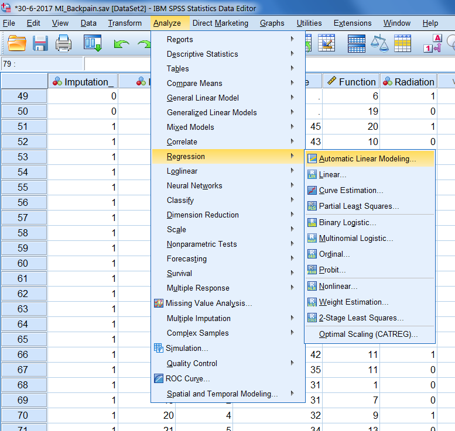

---
output:
  pdf_document: default
  html_document: default
---

# Data analysis after Multiple Imputation

In the previous Chapter we discussed multiple imputation (MI) and how imputations in multiple datasets are generated. After the imputations have been generated, the data analysis and pooling steps follow. This chapter explains these steps. In the data analysis step, the statistical model is applied in the imputed datasets. In the pooling step, the analysis results from the analysis step, are summarized into one final result. The biggest challenge is to summarize the statistical results into one estimate with the related pooled standard errors, confidence intervals and a pooled p-value. Rubin (1987) provided rules which can be applied to many different statistical tests. Rubin's rules are not available for all statistical procedures in SPSS. Many test procedures that do not have pooling results not available in SPSS are available in R. 
	We will start this Chapter with an example of applying t-tests in multiple imputed datasets. With this procedure we can explain the use of Rubin's Rules (RR), and the derivation of the degrees of freedom for hypothesis testing, which can become complex. We will further discuss missing data measures that are derived from RR, such as the fraction of missing information (FMI), the relative increase in variance due to missing data (Relative Increase Variance) and Relative Efficiency. We will further show other pooling procedures for frequently used statistical techniques and how to apply them in multiply imputed datasets. The availability of each method in SPSS and R, are discussed and their application is presented. Specific pooling methods that are not available in SPSS are discussed by using examples in R.

## Rubin's Rules - A first example

Rubin proposed methods to combine statistical test results into one (pooled) summary estimate. These so-called Rubin´s Rules (RR) are designed to pool parameter estimates, such as means differences and regression coefficients, standard errors and to derive confidence intervals and p-values. T-tests are frequently used and suitable to discuss all aspects of using RR, from pooling parameter estimates to deriving degrees of freedom and p-values. We will first illustrate the use of RR with a t-test example in 3 generated multiple imputed datasets in SPSS. In this example we will pool the mean differences and standard errors. The derivation of the test statistic t for hypothesis testing, degrees of freedom and p-value may differ between the statistical method used. These derivations are explained but also discussed in more detail. As an illustration, we use de LBP study again, and test the Tampascale mean difference (dependent variable) between backpain patients with and without radiation in the leg (dependent variable). The output of the t-test in the multiple imputed data can be found in (Figure \@ref(fig:tab5-1a)). 

```{r tab5-1a, echo = FALSE, fig.cap="T-test for difference in mean Tampascale values between patients with and without Radiation in the leg applied in multiple imputed datasets.", out.width='90%', fig.align='center'}
knitr::include_graphics("images/table5.1.png")
```

```{r tab5-1b, echo = FALSE, fig.cap="b.T-test for difference in mean Tampascale values between patients with and without Radiation in the leg applied in multiple imputed datasets.", out.width='90%', fig.align='center'}
knitr::include_graphics("images/table5.1b.png")
```

In (Figure \@ref(fig:tab5-1a)) the relationship in the original dataset is presented in the row that is indicated by Imputation_ number 0 as well as in each imputed dataset which are indicated by Imputation_ number 1 to 3. In the last row which is indicated as “Pooled”, the summary estimates of the parameters are presented. With parameters we mean the parameters of interest which are here the mean differences and standard errors. We will explain now by using RR how these pooled mean differences and standard errors are estimated.

### Pooling Parameters

When RR are used, it is assumed that the repeated parameter estimates in each imputed dataset (e.g. mean differences), are normally distributed. This cannot be assumed for all statistical test statistics, e.g. correlation coefficients. For these test statistics, transformations have to be performed before RR can be applied to assume normality (will be discussed below).  To illustrate the use of RR, we start with the T-test example of (Figure \@ref(fig:tab5-1a)) 

To calculate the pooled parameter estimate the following formula is used \@ref(eq:p-param):

\begin{equation}
  \bar{\theta} = \frac{1}{m}\left (\sum_{i=1}^m{\theta_i}\right )
  (\#eq:p-param)
\end{equation} 

In this formula, $\bar{\theta}$ is the pooled parameter estimate, m is the number of imputed datasets, $\theta_i$ means taking the sum of the parameter estimate (i.e. mean difference) in each imputed dataset i. This formula is equal to the basic formula of taking the mean value of a sequence of numbers. 

When we use the values in (Figure \@ref(fig:tab5-1a)), $\theta_i$ is the mean difference of the Tampascale variable between patients with and without radiation in the leg in each imputed dataset, we get the following result:

$$\bar{\theta} = \frac{1}{3}(2.174 + 1.965+1.774)=1.971$$

This value of 1.971 is the pooled value for the Tampascale variable in (Figure \@ref(fig:tab5-1a)). 

## Pooling Standard errors

The pooled standard error is derived from different components that reflect the within and between sampling variance of the parameter of interest. To calculate the within and between sampling variance in the t-test example, the mean difference and the related standard errors are needed. The calculation of these components is discussed below.

*Within imputation variance*
The within imputation variance is the average of the variance of the estimates in each imputed dataset. This reflects the sampling variance, i.e. the precision of the parameter of interest in each completed dataset. This value will be large in small samples and small in large samples. The within imputation variance is computed by taking the mean of the within variance estimate, i.e. squared standard error, in each imputed dataset:

\begin{equation}
V_W = \frac{1}{m}\left (\sum_{i=1}^m{SE_i^2}\right )
  (\#eq:var-w)
\end{equation}

In this formula $V_W$ is the within imputation variance, m is the number of imputed datasets,  $SE_i^2$ means taking the sum of the squared Standard Error (SE), estimated in each imputed dataset i. Using the data in (Figure \@ref(fig:tab5-1a)), we get the following result:

$$V_W = \frac{1}{3}(0.896^2 + 0.882^2 + 0.898^2)=0.7957147$$

*Between imputation variance*
The between imputation variance reflects the extra variance due to the missing data. This is estimated by taking the variance of the parameter of interest estimated over imputed datasets. This value is large when the level of missing data is high and smaller when the level of missing data is small.

\begin{equation}
V_B\sqrt{\frac{\sum_{i=1}^m (\theta_i - \overline{\theta})^2}{N-1} }
  (\#eq:var-b)
\end{equation}

In this formula, $V_B$ is the between imputation variance, m is the number of imputed datasets, $\overline{\theta}$ is the pooled estimate, $\theta_i$ is the parameter estimate in each imputed dataset i. Accordingly,  ${\sum_{i=1}^m(\theta_i - \overline{\theta})^2}$ , indicates taking the sum of the squared differences, between the individual and pooled parameter estimates in each imputed dataset. This formula is equal to the formula for the (sample) variance which is commonly used in statistics. Using the data in (Figure \@ref(fig:tab5-1a)), we get the following result for the between imputation variance:

$$V_W = \frac{1}{3-1}((2.174-1.971)^2+ (1.965-1.971)^2+(1.774-1.971)^2)=0.7957147$$

$$V_B = \frac{V_B}{m}$$

\begin{equation}
V_{Total} = V_W + V_B + \frac{V_B}{m}
  (\#eq:var-t)
\end{equation}


$$V_{Total} = 0.7957147+0.040027 + \frac{0.040027}{3}$$

$$SE_{Pooled} = \sqrt{V_{Total}} = \sqrt{0.849084} = 0.9214575$$

This value is equal to the (rounded) pooled standard error value of 0.921 in (Figure \@ref(fig:tab5-1a)).

## Significance testing

For significance testing of the pooled parameter, i.e. the mean difference in (Figure \@ref(fig:tab5-1a)), Formula 5.6 is used. This is the univariate Wald test (Rubin 1987, van Buuren 2013, Marshall, 2009). This test  is defined as:

\begin{equation}
Wald_{Pooled} =\frac{(\overline{\theta} - {\theta_0})^2}{V_T}
  (\#eq:wald-pooled)
\end{equation}

where $\overline{\theta}$ and $V_T$ is the total variance and is equal to the $SE_P$ or the pooled standard error that was derived in the previous paragraph), and θ_0  is the parameter value under the null hypothesis (which is mostly 0). The univariate Wald test can be used to test all kind of univariate parameters of interest, mean differences and univariate regression coefficients in linear and logistic regression models. In our example, we use the univariate Wald test to test the pooled mean difference for significance.  The univariate Wald test in our example is calculated using the values from (Figure \@ref(fig:tab5-1a)):

$$Wald_{Pooled} =\frac{(\overline{\theta} - {\theta_0})^2}{V_T}=\frac{1.971}{\sqrt{0.849084}}=2.139$$
The univariate pooled Wald value follows a t-distribution. This distribution is used to derive the p-value. The value for t depends on the degrees of freedom, according to:

\begin{equation}
t_{df,1-\alpha/2}
  (\#eq:t-distr)
\end{equation}

Where df is degrees of freedom and $\alpha$ is the reference level of significance, which is usually set at 5%. The derivation of the degrees of freedom for the t-test is complex because there exist different formula´s to calculate the degrees of freedom. This is explained in the next paragraph.

Because $t^2$ is equal to F at the same number of degrees of freedom, we can also test for significance using a F-distribution, according to:

\begin{equation}
F_{1, df}=t^2_{df,1-\alpha/2}
  (\#eq:f-distr)
\end{equation}

The degrees of freedom are equal to the degrees of freedom for the t-test above. 

## Degrees of Freedom and P-values 

The derivation of the degrees of freedom (df) and the resulting p-value for the pooled T-test is not straightforward, because there are different formulas to calculate the df. There exists an older version of the formula to calculate the degrees of freedom (df) and an adjusted version (Van Buuren 2012). The older method to calculate the dfs results in a higher df than those in each imputed dataset. An example of this is shown in (Figure \@ref(fig:tab5-2)). It can be seen that the degrees of freedoms is 148 in each imputed dataset (in the row for equal variances assumed) and 507 for the pooled result.
	Although this difference in df may seem small, using different values for the degrees of freedom leads to different p-values. In SPSS the old way to calculate the dfs is used. Adjusted versions are used in the mice package for R. The differences between the older and adjusted method to calculate the dfs is illustrated below. 

```{r tab5-2, echo = FALSE, fig.cap="Part of Output of Figure 5.1. The value for the dfs are presented in the df column.", out.width='90%', fig.align='center'}
knitr::include_graphics("images/table5.2.png")
```

The (older method) to calculate df for the t-distribution is described in Rubin (1987) and Van Buuren (2012) and is defined as:

\begin{equation}
df_{Old} = \frac{m-1}{lambda^2} = (m-1) * (1 + \frac{1}{r^2})
  (\#eq:df-old)
\end{equation}

Where m is the number of imputed datasets and lambda can be interpreted as the Fraction of Missing information (FMI), calculated by Formula 5.13 (Raghunathan, 2016), and r is the relative increase in variance due to nonresponse, calculated by Formula 5.14. The calculation of lambda and r values are discussed in more detail below. 
The lambda value that is used in Formula 5.9 (and often used as alternative for the FMI) is not the same FMI value of 0.067 that SPSS presents in (Figure \@ref(fig:tab5-1a)). The FMI value of 0.067 is calculated by Formula 5.16 and is called FMI in this manual. 

When $df_{old}$ is calculated with the information in (Figure \@ref(fig:tab5-1a)), we get:

$$df_{Old} = \frac{3-1}{0.06283485^2} = 506.5576$$

This (rounded) value is equal to the df value in the row Pooled of 507 in (Figure \@ref(fig:tab5-1a)). 
Formula 5.9 leads to a larger df for the pooled result, compared to the dfs in each imputed dataset, which is inappropriate. Therefore, Barnard and Rubin (1999) adjusted this df by using Formula 5.10:

\begin{equation}
df_{Adjusted} = \frac{df_{Old}*{df_{Observed}}}{df_{Old}+{df_{Observed}}}
  (\#eq:df-adj)
\end{equation}

Where $df_{Old}$ is defined as in Formula 5.9 and $df_{Observed}$ is defined as:

\begin{equation}
df_{Observed} = \frac{(n-k)+1}{(n-k)+3}*(n-k)(1-lambda)
  (\#eq:df-obs)
\end{equation}

Where n is the sample size in the imputed dataset, k the number of parameters to fit and lambda is obtained by Formula 5.13.

By filling in the formulas 5.11 and 5.10 we get for $df_{observed}$ and $df_{adjusted}$ respectively:

$$df_{Observed} = \frac{(150-2)+1}{(150-2)+3}*(150-2)(1- 0.06283485)=136.8633$$

$$df_{Adjusted} = \frac{(506.5576* 136.8633)}{(506.5576+ 136.8633)}=107.7509$$

This number of 107.7509 is equal to the df used by mice.

We can now derive the p-value for the mean difference in the Tampascale between patients with and without Radiation in the leg. This two-sided p-value is:

In SPSS:

$$t_{df,1-\alpha/2}=2.139_{df{Old}}=0.03289185$$

$$t_{df,1-\alpha/2}=2.139_{df{Adjusted}}=0.03467225$$
## Confidence Intervals

For the 95% confidence interval (CI), the general formula can be used:

\begin{equation}
\bar{\theta} ± t_{df,1-\alpha/2} * SE_{Pooled}
  (\#eq:conf)
\end{equation}

In this formula, $\bar{\theta}$ is the pooled estimate, t is the t-statistic, df is degrees of freedom and $SE_{Pooled}$ is the pooled standard error (Formula 5.5). 

## Measures of Missing data information

In this paragraph we will discuss measures that can be derived from values of the between, and within imputation variance and the total variance. These measures are the Fraction of Missing information (FMI), the relative increase in variance due to nonresponse and the Relative Efficiency. There exist two versions of the FMI, which are referred to as lambda and FMI. 

### Fraction of Missing Information 

The Fraction of Missing information, lambda, (van Buuren, 2012; Raghunathan, 2016) can be derived from the between and total missing data variance as: 

\begin{equation}
Lambda = \frac{V_B + \frac{V_B}{m}}{V_T}
  (\#eq:lambda)
\end{equation}

Where m is the number of imputed datasets and ${V_B}$ and ${V_T}$ are the between and total variance respectively. This value can be interpreted as the proportion of variation in the parameter of interest due to the missing data.

When we use the ${V_B}$ and ${V_T}$ values that were calculated in paragraph 5.1.2, this value will be:

$$Lambda = \frac{0.040027 + \frac{0.040027}{3}}{0.849084}=0.06283485$$

This specific value for the FMI, lambda, is not reported by SPSS, but is reported by the mice package in R. Confusingly, van Buuren (2012) and Enders (2010) use the same formula to calculate this type of missing data information, but van Buuren calls it lambda and Enders FMI.

### Relative increase in variance

Another related measure is the relative increase in variance (RIV) due to nonresponse. This value is calculated as:

\begin{equation}
Lambda = \frac{V_B + \frac{V_B}{m}}{V_W}
  (\#eq:riv)
\end{equation}

Where ${V_B}$ and ${V_W}$ are the between and within variance respectively. This value can be interpreted as the proportional increase in the sampling variance of the parameter of interest that is due to the missing data.

Filling in this formula with the example from paragraph 5.1.2 will result in:

$$Lambda = \frac{V_B + \frac{V_B}{m}}{V_W}=\frac{0.040027 + \frac{0.040027}{3}}{0.7957147}=0.06704779$$

This value is also presented in (Figure \@ref(fig:tab5-1a)) in the column Relative Increase Variance.

### Fraction of Missing Information - FMI

\begin{equation}
FMI = \frac{RIV + \frac{2}{df+3}}{1+RIV}
  (\#eq:riv)
\end{equation}

Where RIV is the relative increase in variance due to missing data (see Formula 5.14) and df is the degrees of freedom for the pooled result. The degrees of freedom for the pooled result can be obtained in two ways:  df_Old or df_Adjusted. 

In SPSS, FMI is calculated using df_Old, which results in:

$$FMI = \frac{RIV + \frac{2}{df+3}}{1+RIV}=\frac{0.06704779 + \frac{2}{506.5576+3}}{1+0.06704779}=0.0665132$$

In R package mice, FMI is calculated using the formula for df_Adjusted, that results in:

$$FMI = \frac{RIV + \frac{2}{df_{Adjusted}+3}}{1+RIV}=\frac{0.06704779 + \frac{2}{107.7509+3}}{1+0.06704779}=0.0797587$$

The difference between lambda and FMI is that FMI is adjusted for the fact that the number of imputed datasets that are generated is not unlimitedly large. These measures differ for a small value of the df.

### Relative Efficiency

The Relative Efficiency (RE) is defined as:

\begin{equation}
RE = \frac{1}{1+\frac{FMI}{m}}
  (\#eq:re)
\end{equation}

FMI is the fraction of missing information and m is the number of imputed datasets.

The RE value is only provided by SPSS and is calculated by filling in the values of (Figure \@ref(fig:tab5-1a)) as follows:

$$RE = \frac{1}{1+\frac{FMI}{m}}=\frac{1}{1+\frac{0.0665132}{3}}=0.9783098$$

The RE gives information about the precision of the parameter estimate as the standard error of a regression coefficient.

## Pooling Data Analytic results after MI in SPSS and R

In Chapter 4 we discuss that when multiple imputation is applied, the multiple imputed datasets can be stored in a separate SPSS file. In order to obtain pooled analysis results in SPSS, the imputed values must be marked yellow (i.e. the file should be split by the Imputation_ variable). See (Figure \@ref(fig:tab5-1a)) for an example of a multiple imputed dataset with imputed values marked yellow. 

```{r fig5-1, echo = FALSE, fig.cap="Example of SPSS dataset after MI has been applied.", out.width='90%', fig.align='center'}
knitr::include_graphics("images/fig5.1.png")
```

If SPSS does not recognize the dataset as a multiple imputed dataset, the data will be treated as one large dataset, which is wrong. Marking the values can be done by using the option “Mark Imputed Data” under the View menu in the Data View window ((Figure \@ref(fig:fig5-1))). The Imputation_ variable is a nominal variable that separates the original from the imputed datasets. It is used as a variable that splits the file into separate groups for analysis based on the different categories. This is also indicated in the corner on the right side below in the Data View and Variable View windows by the remark “Split by imputation_”.

```{r fig5-2, echo = FALSE, fig.cap="Procedure to mark imputed values in SPSS.", out.width='90%', fig.align='center'}
knitr::include_graphics("images/fig5.2.png")
```

When imputation markings are turned on, a special icon is displayed next to procedures that support pooling after multiple imputation ((Figure \@ref(fig:fig5-3))). 

```{r fig5-3, echo = FALSE, fig.cap="Multiple Imputation icon.", out.width='5%', fig.align='center'}
knitr::include_graphics("images/fig5.3.png")
```

This icon is shown in the analyze menu in SPSS ((Figure \@ref(fig:fig5-4a)) and (Figure \@ref(fig:fig5-4b))). In (Figure \@ref(fig:fig5-4b)) the imputed values are not marked. SPSS assumes that the dataset is just a normal dataset and the special icon is not visible when you use Analyze > Regression. When the imputed values are marked as in (Figure \@ref(fig:fig5-4b)), the special icon appears again. 

```{r fig5-4a, echo = FALSE, fig.cap="The dataset is not recognized as an imputed dataset (no special icon visible).", out.width='90%', fig.align='center'}

```

```{r fig5-4b, echo = FALSE, fig.cap="The dataset is recognized as an imputed dataset (special icon visible).", out.width='90%', fig.align='center'}
knitr::include_graphics("images/fig5.4b.png")
```

In Appendix C a list of SPSS procedures is presented that support multiple imputed datasets. SPSS provides two levels of pooling, which are called the Naïve and Univariate combination. The Naïve combination only shows the pooled parameter (if available). The Univariate combination shows the pooled parameter, its standard error, test statistic, effective degrees of freedom, p-value, confidence interval, and pooling diagnostics (fraction of missing information, relative efficiency, relative increase in variance), when available. Although the special icon in SPSS to indicate that the dataset is recognized as a multiple imputed dataset appears for many analysis procedures, it is not always clear what procedures also provide the Univariate combination output. It is therefore recommended to explore what kind of pooled information is provided by SPSS before MI is applied.
	The mice package is considered the main package in this manual to APPLY multiple imputation in R. Many pooling procedures are available in the mice package. However, for some specific statistical procedures, other packages are required to obtain pooled estimates. For example, pooling ANOVA results is not available in the mice package itself, the miceadds package has to be used for that  by using the function mi.anova. The consequence is that if you are planning to do an ANOVA analysis in multiply imputed datasets you may have to use the mice and the miceadds packages. For a complete list of available procedures in different R packages see Appendix D. 
In this chapter we will provide pooled results in SPSS and R. In other words, we will show results of statistical procedures for which pooled information is available. 
As an example we use a dataset for 150 patients with Back pain. The variables that contain missing data are the Tampascale and the Function variable. We will generate three imputed datasets, so that output Tables remain readable, although the examples easily generalize to a larger number of imputed datasets.

### Pooling Means and Standard deviations in SPSS

The pooled means are automatically presented in SPSS output when you obtain descriptive statistics via Analyze > Descriptive Statistics. In (Figure \@ref(fig:tab5-3)) you see in the “Pooled” row that the mean values of the Tampascale variable are pooled. This is done by just taking the average of the mean values of each imputed dataset. The standard deviations are not automatically pooled in SPSS. The mean value of the standard deviations can be calculated by computing the average over the standard deviations. 

```{r tab5-3, echo = FALSE, fig.cap="Pooling results of descriptive statistics.", out.width='90%', fig.align='center'}
knitr::include_graphics("images/table5.3.png")
```

### Pooling Means and Standard Deviations in R

```{r , echo=FALSE}
suppressWarnings(suppressMessages(library(foreign)))
suppressWarnings(suppressMessages(library(mice)))
```

```{r }

library(foreign)
dataset <- read.spss(file="Backpain 150 Missing MI datasets.sav", to.data.frame=T)

library(mice)
imp <- mice(dataset, m=3, maxit=50, seed=2375, printFlag = F) # generate 3 imputed datasets

# Extract each imputed dataset and call it dataset1-dataset3
dataset1 <- subset(dataset, Imputation_==1)
dataset2 <- subset(dataset, Imputation_==2)
dataset3 <- subset(dataset, Imputation_==3)

# Calculate the mean of the Tampascale variable and assign to m1-m3
m1 <- mean(dataset1$Tampascale)
m2 <- mean(dataset2$Tampascale)
m3 <- mean(dataset3$Tampascale)

# Calculate the standard deviation of the Tampascale variable and assign to sd1-sd3.
sd1 <- sd(dataset1$Tampascale)
sd2 <- sd(dataset2$Tampascale)
sd3 <- sd(dataset3$Tampascale)
 
# Calculate the mean of the means m1-m3 and assign to object pool.m
# Calculate the mean of the sds sd1-sd3 and assign to object pool.sd
pool.m <- mean(c(m1, m2, m3))
pool.sd <- mean(c(sd1, sd2, sd3))

# Show value of the mean
pool.m

# Show value of the sd
pool.sd

# The same results are obtained by the following (shorter) lines of code
imp <- mice(dataset, m=3, maxit=50, seed=2375, printFlag = F)
 
# stack imputed datasets in long format, exclude the original data
impdat <- complete(imp,action="long",include = FALSE)
# compute mean and standard deviation in each imputed dataset
desc <- with(impdat, by(impdat, .imp, function(x) c(mean(x$Tampascale),sd(x$Tampascale))))
desc
Reduce("+",desc)/length(desc)

```

### 5.3.3	The Pooled Correlation coefficient

Some statistical estimates need to be transformed before pooling, when a normal distribution of the estimate cannot be assumed. This is the case with Pearsons correlation coefficient. To get a pooled version of the correlation coefficient, we first have to apply Fishers Z transformation of the correlation coefficient. For this transformation, we use the following formulas (Raghunathan 2016, van Buuren 2012 and Enders 2010):

\begin{equation}
Z_i = \frac{1}{2}ln\frac{1+r_i}{1-r_i}
  (\#eq:cor)
\end{equation}

The ${Z_i}$ means the calculation of Fisher's Z-value in each imputed dataset.

Also, the variance of the correlation can be calculated using:

\begin{equation}
Var_Z=\frac{1}{n-3}
  (\#eq:var-cor)
\end{equation}

n is the sample size in the imputed dataset. Now we can use Rubin's Rules to calculate the Pooled correlation and variance. These values will be calculated with the transformed Z values.

To obtain the pooled p-value for the correlation coefficient we use the formula:

\begin{equation}
Z=\frac{Z_{Pooled}}{\sqrt{Var_Z}} = \frac{Z_{Pooled}}{\frac{1}{\sqrt{n-3}}}=Z_{Pooled}\times\sqrt{n_i-3}
  (\#eq:z-cor)
\end{equation}

In this formula z is the z-score and follows a standard normal distribution, $Z_{Pooled}$ is the pooled Z transformation and $Var_Z$ is the pooled variance.

Finally, back transformation to the original scale of r is done by:

\begin{equation}
r_{Pooled} = \frac{e^{2\times\\Z_{Pooled}}-1}{e^{2\times\\Z_{Pooled}}+1}
  (\#eq:exp-cor)
\end{equation}

#### Pooling Correlation coefficients in SPSS

A pooled Pearsons correlation coefficient can be extracted in SPSS by using Analyse -> Correlate -> Bivariate. As an example, we are interested in the Pearson correlation between the Tampascale and Age. These pooled results are calculated by using Formulas 5.19 - 5.22 and can be found in (Figure \@ref(fig:tab5-4)).

```{r tab5-4, echo = FALSE, fig.cap="Pearson correlation between the Tampascale variable and Age.", out.width='90%', fig.align='center'}
knitr::include_graphics("images/table5.4.png")
```

The pooled results are shown in (Figure \@ref(fig:tab5-4)), in the row called Pooled. The pooled correlation is 0.255, and the significance level is 0.002. These correlations are calculated using Fishers Z transformation before pooling. After pooling they are back-transformed. 

#### Pooling Correlation Coefficients in R

We illustrate the procedure of pooling the Pearsons correlation coefficients in R, using the same imputed datasets as used for the example in SPSS in the previous paragraph. 

In R the function micombine.cor in the miceadds package can be used to obtain pooled correlation coefficients. This function is compatible with the mice function.

```{r , echo=FALSE}
suppressWarnings(suppressMessages(library(foreign)))
suppressWarnings(suppressMessages(library(mice)))
suppressWarnings(suppressMessages(library(mitools)))
suppressWarnings(suppressMessages(library(miceadds)))
```

```{r }
# Read in the dataset 

dataset <- read.spss(file="Backpain 150 missing.sav", to.data.frame=T)[, -1]

# Impute missing data using the mice function, with printFlag is F(alse), 
# which means that the imp and iter information is hided (called silent 
# computation)

imp <- mice(dataset, m=3, maxit=50, seed=2375, printFlag=F)

# Run the micombine.cor function for the variables in column 2 
# and 5, i.e. variables Tampascale and Age

res.mi.cor <- micombine.cor(mi.res=imp, variables = c(2,5) )
res.mi.cor

# 	Ouput of the micombine.cor function, with in the columns:
# 	r: Pooled Pearsons correlation coefficient.
#	rse: Standard error of pooled correlation.
#	fisher_r: Transformed pooled r
# 	fisher_rse: Standard error of transformed pooled r
#	fmi: Fraction of missing information.
#	t: T-value.
#	p: P-value.
# 	lower95 and upper95: 95% lower and upper confidence intervals.

```

### The Pooled Independent T-test

For the independent t-test, Rubin´s Rules can be used to calculate the pooled mean differences and standard errors. Subsequently degrees of freedom and p-values can be derived. These steps were discussed in detail using SPSS output in paragraph 5.1.

#### Pooling Independent T-tests in R with mice

We will now discuss the pooled independent t-test procedure in R, using the pool function in the mice package. Although, the mice package itself does not have a pooled t-test option, it is possible to conduct a pooled linear regression analysis. A linear regression analysis with a continuous outcome variable and an independent dichotomous variable is the same procedure as an independent t-test. We will use the lm procedure in mice with as independent variable Radiation and dependent variable Tampascale.

```{r }
# Reading in the dataset
library(foreign)
library(mice)

dataset <- read.spss(file="Backpain 150 missing.sav", to.data.frame=T)[, -1]

# Impute the missing values using the mice function 
imp <- mice(dataset, m=3, maxit=50, seed=2375, printFlag=F)
 
# Conduct an independent t-test in each imputed dataset
fit.t.test <- with(data=imp, exp=lm(Tampascale ~ Radiation))
t.test.estimates <- pool(fit.t.test)
summary(t.test.estimates)

```

We see in the output, under est and se the same values as in SPSS (Figure \@ref(fig:tab5-4)), the pooled value of 1.97 and 0.92 for the mean difference and standard error respectively. Under the column df in R output 5.3 you see that the dfs for the mean differences in the Tampascale variable are much smaller than those in (Figure \@ref(fig:tab5-4)) above. This is due to the different formulas used to calculate the df. SPSS uses the older version and mice the adjusted one. This latter adjustment is the Barnard-Rubin adjustment for small samples (Barnard and Rubin, 1999). 
The mice package uses another procedure to calculate the df, which is called the adjusted df, according to Formula 5.10.

A measure that is also shown in (Figure \@ref(fig:tab5-4)) is the relative increase in variance due to missing data. This measure is calculated with Formula 5.14. 

#### Pooling Independent T-tests in R with mi.t.test

To apply an independent t-test you can also use the mi.t.test function in the MKmisc package. Before you can use this function to compare the means between two groups, the grouping variable has to be converted into a factor variable and the imputed datasets have to be assigned to a list object. Note that the mi.t.test function uses the parameter setting var.equal is True when equal variances are assumed and var.equal is False when equal variances are not assumed (the default setting is var.equal is False). 

```{r }
# Read in the dataset
dataset <- read.spss(file="Backpain 150 missing.sav", to.data.frame=T)[, -1]

# Use the mice function to impute the missing data
imp <- mice(dataset, m=3, maxit=50, seed=2375, printFlag=F)
 
# Extract the imputed datasets and define the Radiation variable as a 
# factor variable
dataset1 <- complete(imp,1)
dataset1$Radiation <- factor(dataset1$Radiation)
dataset2 <- complete(imp,2)
dataset2$Radiation <- factor(dataset2$Radiation)
dataset3 <- complete(imp,3)
dataset3$Radiation <- factor(dataset3$Radiation)
 
# Assign the imputed datasets to the list object dataset.imp

dataset.imp <- list(dataset1, dataset2, dataset3)
 
# Start the MKmisc library and run the mi.t.test function to get pooled 
# results  of the t-test

library(MKmisc)
# Result of the pooled t-test
mi.t.test(dataset.imp, x = "Tampascale", y = "Radiation", var.equal = T)

```

With the mi.t.test function also a one sample and a paired t-tests can be conducted.

## Pooling Chi-square tests

The pooling of Chi-square values as a result of the Chi-square test is not available in SPSS. This lack of reporting of the Chi-Square test is shown in (Figure \@ref(fig:tab5-6)). The Chi-square test is presented in the original dataset and in each imputed dataset, but a pooled Chi-square value and pooled p-value is missing. Procedures to pool Chi-square values are available in the miceadds and semtools packages. The pooling functions are based on formulas that are found in the paper of Marshall (2009) and the book of Enders (2012) and are referred to as the D2 statistic. The Examples of using these packages to pool Chi-square values will be provided below in Rcode 5.7 to 5.9. More procedures to pool Chi-square like tests and examples to pool overall Wald Chi-square values to obtain a p-value for a categorical variable in a logistic regression model will be discussed in the next Chapter. In the example below we use a categorical version of the Tampascale variable with the categories 0 = low fear of movement, 1 = middle fear of movement and 2 is a high fear of movement. This variable contains missing data and we impute the missing data with MI. We will use 5 imputed datasets, to generate the Chi-square values.  

```{r tab5-6, echo = FALSE, fig.cap="Chi-square test in 5 imputed dataset to test the relationship between the Tampascale variable and Radiation, where a pooled estimate is missing.", out.width='90%', fig.align='center'}
knitr::include_graphics("images/table5.6.png")
```

In R there are several options to get a pooled Chi-square test and related p-values. They use themiPoolChi function. This procedure is also called the D2 statistic and is presented in the paper of Marshall et al. (2009) in Figure 2, row C. 

The function micombine.chisquare that is used by the miceadds package gives the same result.

```{r }
library(miceadds)
micombine.chisquare(c(1.829, 1.311, 2.861, 1.771, 3.690), 2, display = TRUE, version=1)
```

The function micombine.chisquare also has a parameter setting that is called “version”. The default version=1 refers to the correct formula as in Enders (2010), while version=0 uses an incorrect formula as printed in Allison (2001). 

## Analysis of Variance (ANOVA) pooling

The pooling of Analysis of Variance (ANOVA) statistics is not available in SPSS, but available in R. As an example, we will compare the Function means between three Tampascale variable groups. There is missing data in the categorical Tampascale and in the Function variable. After the dataset has been imputed we can apply an ANOVA procedure to compare the three Tampascale groups on their Function scores. (Figure \@ref(fig:tab5-7)) presents the results after the application in SPSS. It is clear from the Figure that the pooled results are lacking.

(Figure \@ref(fig:tab5-7)). ANOVA in SPSS without a pooled result.

```{r tab5-7, echo = FALSE, fig.cap="ANOVA in SPSS without a pooled result.", out.width='90%', fig.align='center'}
knitr::include_graphics("images/table5.7.png")
```

We will show below how we can derive a pooled analysis result in R. 
The pooled ANOVA procedure uses the same function as was used in the previous paragraph to derive the pooled Chi-square value, because the Chi and the F-value are related. The easiest way to obtain a p-value for the ANOVA is by using the mi.anova function in the miceadds package. In this function a regression based formula can be defined to get a p-value. 

```{r }
# Read in the dataset
dataset <- read.spss(file="Backpain 150 Missing_Tampa_Cat.sav", to.data.frame=T)[, -1]

names(dataset)

# Generate 5 impued datasets 
# and set printFlag = F for a silent imputation
imp.Tampa.cat <- mice(dataset, m=5, maxit=50, seed=2345, printFlag = F)
 
# Apply the mi.anova function
library(miceadds)
mi.anova(mi.res=imp.Tampa.cat, formula="Function ~ Tampa_Cat" )

```

The pooled F and p-values are reported under the columns F value and Pr(>F) respectively. The mi.anova function makes use of the micombine.F function, that can also be found in the miceadds package. 

##	Pooling Regression models

###	The Pooled Linear Regression Model

To pool the results from a linear regression analysis Rubin´s Rules can be used to calculate the pooled regression coefficients and standard errors. Subsequently degrees of freedom and p-values can be derived. This will be illustrated by studying the relationship between the Tampascale (independent) and Function (dependent) variables.

The relationship between the Tampascale (independent variable) and the Function (dependent variable) variables is presented in (Figure \@ref(fig:tab5-8)). This linear regression procedure can be done in SPSS by Analyze -> Regression -> Linear. Information is provided in the row called Pooled about the parameter estimates, i.e. regression coefficients, standard errors, t-values, p-values and confidence interval. Further, information is provided about the Fraction of Missing Information, Relative Increase Variance and Relative Efficiency.

```{r tab5-8, echo = FALSE, fig.cap="Relationship between Tampascale and Function estimated with linear regression in SPSS.", out.width='90%', fig.align='center'}
knitr::include_graphics("images/table5.8.png")
```

We have seen in paragraph 5.1.1 how pooled estimates are calculated using RR and in paragraph 5.1.4 which formulas are used to calculate the degrees of freedom (df) to derive the p-value using the pooled t-statistic. 

####	Pooling Linear regression models in R

A pooled linear regression analyses can be produced by using the with and pool functions in the mice package. The object fit contains the results of fitting the linear regressions over the imputed datasets. After that, we use the pool function to pool the parameters, i.e. regression coefficients and standard errors using Rubin´s Rules. When we use the summary function we get more information of the pooled analysis. We get information about the fmi, which contains the fraction of missing information. The lambda is the proportion of total variance that is attributable to the missing data. 

```{r }
dataset <- read.spss(file="Backpain 150 missing.sav", to.data.frame=T)[, -1]

imp <- mice(dataset, m=3, maxit=50, seed=3715, printFlag=F)

fit <- with(data=imp,exp=lm(Function ~ Tampascale))
lin.pool <- pool(fit)
summary(lin.pool)

# 	Results of the pooled procedure, with:
#	est: Pooled regression coefficient.
#	se: Standard error of pooled regression coefficient.
#	t: T-value.
#	df: Degrees of freedom.
#	Pr(>|t|): P-value.
#	lo 95 and hi 95: 95% lower and upper confidence intervals.
#	nmis: number of missing observations.
#	fmi: fraction of missing information.
#	Lambda: Proportion of the variation attributable to the missing data 

```

The value 0.6710426 in the column named fmi for the Tampascale is calculated according to 
the Formula 5.17. The value 0.5711275 under the column named lambda is calculated 
according to Formula 5.13. 

###	Pooling Logistic Regression models

Pooling logistic regression models is possible by using Rubin´s Rules (RR). With these rules the regression coefficients and standard errors can be pooled. The pooled p-values can be derived from the pooled univariate Wald test (Formula 5.6).
The univariate Wald test can be used to test for significance of univariate regression coefficients. For categorical variables in logistic regression models, different methods are available to test the variable as a whole for significance. These so called Multiparameter tests are not available in SPSS, but they are available in R. These tests will be discussed in the next Chapter. We will start with an example of univariate pooling in SPSS.

####	Pooling Logistic regression models in SPSS

We will now discuss an example with a dichotomous outcome variable to study the relationship between the Tampascale variable (independent variable) and Radiation in the leg with the variable Radiation (dependent variable). This procedure can be done in SPSS by Analyze -> Regression -> Binary Logistic. The output is presented in (Figure \@ref(fig:tab5-9)). 

```{r tab5-9, echo = FALSE, fig.cap="Logistic Regression in SPSS.", out.width='90%', fig.align='center'}
knitr::include_graphics("images/table5.9.png")
```

In the output (Figure \@ref(fig:tab5-9)), information is provided in the row called Pooled about the parameter estimates, i.e. regression coefficients (B), standard errors (S.E.), p-values (Sig.), odds ratio´s (Exp(B) and 95% confidence intervals around the OR (95% C.I. for EXP(B). Further, information is provided about the Fraction of Missing Information, Relative Increase Variance and Relative Efficiency. For the pooled coefficient and standard error Rubin´s Rules (RR) are used. The significance level for the pooled OR is derived by using the pooled Wald test. The pooled Wald test is calculated as:

$$Wald_{Pooled} =\frac{-0.067}{0.046}=$$

This Wald pooled value follows a t-distribution with degrees of freedom (df) according to Formula 5.9.

$$df_{Old} = \frac{m-1}{lamda^2}$$

For this Formula we need information of lambda, which is calculated as:

$$lambda = \frac{V_B + \frac{V_B}{m}}{lamda^2}$$

Using the values of the regression coefficients and standard errors, estimated in each imputed dataset of (Figure \@ref(fig:tab5-9)) we can calculate the following values for the between imputation and the total variance.

$$V_B= \frac{(-0.090+0.067)^2 + (-0.061+0.067)^2 +(-0.051+0.067)^2}{2}=\frac{0.000821}{2}=0.0004105$$

To calculate the total variance also the within imputation variance is needed. The within imputation variance can be calculated using Formula 5.2:

$$V_W= \frac{0.039^2 + 0.040^2 + 0.039^2}{3}=0.001547333$$

The total variance becomes:

$$V_{Total} = 0.001547333+0.0004105+ \frac{0.0004105}{3}=0.002094666$$

Now we can calculate lambda using:

$$lambda = \frac{0.0004105 + \frac{0.0004105}{m}}{0.002094666}=0.2612986$$

The lambda value is not presented by SPSS, but only in R using mice. Now we know the value for lambda, we can calculate the degrees of freedom to derive the p-value:

$$df_{Old} = \frac{m-1}{lamda^2}=\frac{2}{0.2612986^2}=29.29246$$

Which results in a p-value of: 0.1502045.

#### Pooling Logistic Regression models in R

You can use mice to get pooled results after logistic regression. In combination with the pool function you have to use the following R code.

```{r }
dataset <- read.spss(file="Backpain 150 missing.sav", to.data.frame=T)[, -1]

imp.LR <- mice(dataset, m=3, maxit=50, seed=2268, printFlag = FALSE)
fit <- with(data=imp.LR, exp=glm(Radiation ~ Function, family = binomial))

summary(pool(fit))

# 	Results of the pooled procedure, with:
#	est: Pooled regression coefficient.
#	se: Standard error of pooled regression coefficient.
#	t: T-value.
#	df: Degrees of freedom.
#	Pr(>|t|): P-value.
#	lo 95 and hi 95: 95% lower and upper confidence intervals.
#	nmis: number of missing observations.
#	fmi: fraction of missing information.
#	Lambda: Proportion of the variation attributable to the missing data 
```

Under the Line with the R code summary(pool(fit)), the pooled estimates are provided. The fmi and lambda values are calculated using Formulas 5.13 and 5.17 respectively. To extract the ORs and the corresponding 95% Confidence intervals you have to apply the following code:

Another procedure to get the pooled estimates fror a logistic regression model is by using the micombine function in the MITOOLS package. 

```{r }

library(mitools)
dataset <- read.spss(file="Backpain 150 missing.sav", to.data.frame=T)[, -1]
 
imp <- mice(dataset, m=3, maxit=50, seed=2268, printFlag = F)
dataset1 <- complete(imp,1)
dataset2 <- complete(imp,2)
dataset3 <- complete(imp,3)
 
dataset.imp <- list(dataset1, dataset2, dataset3)
 
imp.LR <- lapply(dataset.imp, function(x) {
   glm(Radiation ~ Function, family = binomial, data = x)
  })
coef <- MIextract(imp.LR, fun=coef) 
se <- MIextract(imp.LR, fun=vcov) 
 
summary.fit <- summary(MIcombine(coef, se) )

pool.OR <- exp(summary.fit[, -c(2, 5)]) 
colnames(pool.OR) <- (c("OR", "95% LO", "95% UP"))
pool.OR

```

However, the pooled p-value is still missing. These pooled p-values can be extracted from the mi.inference function in the NORM package. 

```{r , echo=FALSE}
suppressWarnings(suppressMessages(library(norm)))
```

```{r }
library(norm)
se <- lapply(se, function(x) sqrt(diag(x)) )
 
res <- mi.inference(coef,se)
res.pool <- matrix(unlist(res), 2, 8, byrow=F)
colnames(res.pool) <- names(res)
rownames(res.pool) <- names(res$est)
res.pool

pool.OR <- exp(res.pool[, -c(2:4, 7, 8)]) 
colnames(pool.OR) <- (c("OR", "95% LO", "95% UP"))
pool.OR

```

The p-value in the NORM package is equal to the p-value in SPSS. This means that the NORM package also uses the older method to calculate the degrees of freedom.

### Pooling Cox regression models

One of the most used statistical models for survival data is the Cox regression model. With survival data you have two outcome measures, the status variable and the time to event variable. As a guideline, all variables of the main analysis, including the outcome variable have to be part of the imputation model. The best way to include the outcome variable in a Cox regression model is not by using the Time variable itself, but by using the cumulative hazard to the survival time. This value has to be included in the imputation model together with the status variable and the auxiliary variables. 

####	Pooling Cox regression models in SPSS

The cumulative hazard value can easily be calculated in SPSS by using the Survival menu and then choose for -> Cox Regression ((Figure \@ref(fig:fig5-5))). 

```{r fig5-5, echo = FALSE, fig.cap="The survival options in SPSS.", out.width='90%', fig.align='center'}
knitr::include_graphics("images/fig5.5.png")
```

In the Cox Regression menu, choose for -> Save and the following window will open ((Figure \@ref(fig:fig5-6))):

```{r fig5-6, echo = FALSE, fig.cap="The Save menu under Cox regression.", out.width='90%', fig.align='center'}
knitr::include_graphics("images/fig5.6.png")
```

Here you can choose for Hazard function. Then click on Continue and OK. A new variable will we added to the dataset, which is called HZA_1 ((Figure \@ref(fig:fig5-7)), first 15 cases shown).

```{r fig5-7, echo = FALSE, fig.cap="The data view window including the values for the Hazard.", out.width='90%', fig.align='center'}
knitr::include_graphics("images/fig5.7.png")
```

The cumulative hazard variable can be included in the imputation model to impute missing data in the Pain variable.

The pooling of the Cox regression model will be done in the datasets that are imputed in R. Than we can compare the output from the pooled model in SPSS and in R. The pooled model in SPSS can be found in (Figure \@ref(fig:tab5-10)).

```{r tab5-10, echo = FALSE, fig.cap="The pooled Cox regression model estimated in SPSS.", out.width='90%', fig.align='center'}
knitr::include_graphics("images/table5.10.png")
```

This procedure provides a pooled value for the regression coefficient, standard error, p-value (of 0.000589), hazard ratio and related 95% confidence intervals and provides information about the fraction of missing information, the relative increase in variance and the relative efficiency.

####	Pooling Cox regression models in R

Now we will show how to pool Cox regression models in R. For this procedure we can make use of the pool function that is available in the mice package. We start by using the mice function to impute missing data in the Pain variable by first calculating the cumulative hazard values. After that we customize the predictorMatrix so that the Time variable is not used to predict the missing values (we use the cumulative hazard function instead) in the Pain variable and subsequently the imputed datasets will be pooled to get a summary estimate. Note that you also have to activate the package SURVIVAL before you can run the coxph function in R. 

```{r }
# Read in the dataset
library(survival)
dataset <- read.spss(file="Backpain 150 Survival Missing.sav", to.data.frame=T)

# Compute the cumulative hazard, attach it to the dataset
# and omit the ID variable (first column)
Hazard <- nelsonaalen(dataset, Time, Status)
dataset <- data.frame(dataset[, -1], Hazard)

# Adapt the PredictorMatrix so that the
# Time variable is not included in the imputation model
Cox.imp <- mice(dataset, m=1, maxit=0, seed=2795, printFlag=F)
Pred <- Cox.imp$predictorMatrix
Pred[3, "Time"] <- 0
Pred

# Start imputations using mice
Cox.imp <- mice(dataset, m=3, maxit=50, predictorMatrix=Pred, seed=2795, printFlag=F)

fit.Cox <- with(data=Cox.imp, exp=coxph(Surv(Time, Status) ~ Pain))
Cox.pool <- pool(fit.Cox)
summary(Cox.pool)

# 	Results of the pooled procedure, with:
#	est: Pooled regression coefficient.
#	se: Standard error of pooled regression coefficient.
#	t: T-value.
#	df: Degrees of freedom.
#	Pr(>|t|): P-value.
#	lo 95 and hi 95: 95% lower and upper confidence intervals.
#	nmis: number of missing observations.
#	fmi: fraction of missing information.
#	Lambda: Proportion of the variation attributable to the missing data 

```

The value of 0.3319019 in the column named fmi for the Pain variable is calculated according to the Formula 5.17 for FMI. The value 0.2811114 under the column named lambda is calculated according to Formula 5.13. 


