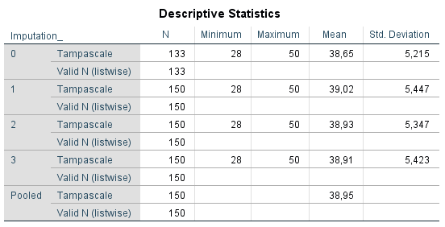
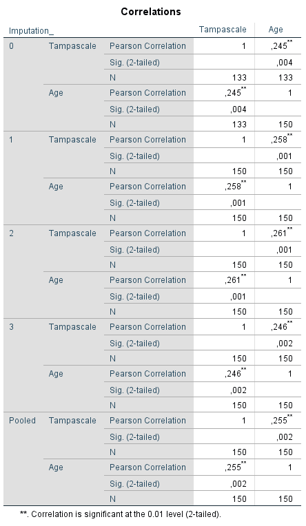
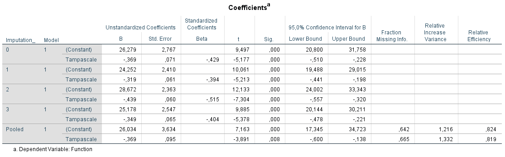
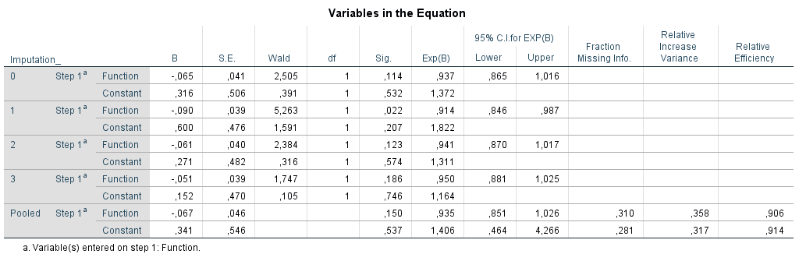
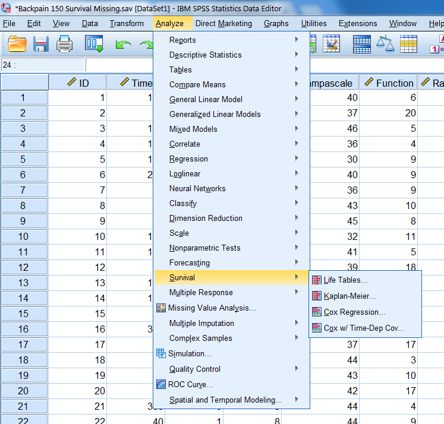
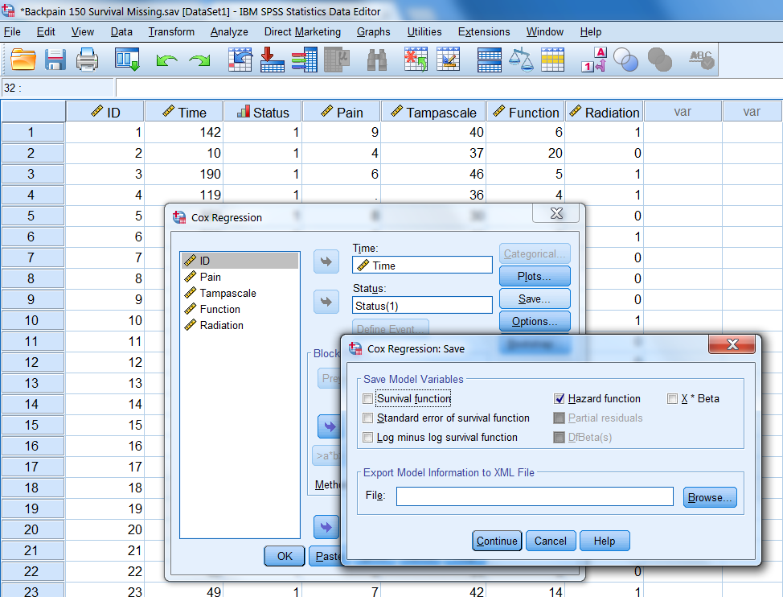

---
output:
  html_document: default
  pdf_document: default
---

# (PART) Part IV: Data Analysis After Multiple Imputation {-}

# Data analysis after Multiple Imputation 

After Multiple Imputation has been performed, the next steps are to apply statistical tests in each imputed dataset and to pool the results to obtain summary estimates. In SPSS and R these steps are mostly part of the same analysis step. In SPSS pooling results of statistical tests can be obtained by navigating to the familiar options for statistical tests under Analyze. In R, many pooling procedures are available as part of the mice package. However, for some specific statistical tests, other packages have to be installed. How to retrieve pooled statistical test results in SPSS and R is the topic of this Chapter. 
 
For the data examples in this Chapter We use three imputed datasets, to keep the output Tables readable. The examples easily generalize to a larger number of imputed datasets.

## Data analysis in SPSS

### Special pooling icon

In order to obtain pooled analysis results, the imputed values must be marked yellow. Than SPSS recognizes the dataset as an "imputed" dataset and is able to generate pooled analyses results. If SPSS does not recognize the dataset as a multiple imputed dataset, the data will be treated as one large dataset.

When imputation markings are turned on, a special icon is displayed in front of the statistical test procedures in the analyze menu. This icon shows you if a pooled result will be generated after multiple imputation is used ((Figure \@ref(fig:fig5-3))). 

```{r fig5-3, echo = FALSE, fig.cap="Multiple Imputation icon.", out.width='5%', fig.align='center'}
knitr::include_graphics("images/fig5.3.png")
```

This icon is shown in the analyze menu in SPSS (Figure \@ref(fig:fig5-4b))). 

```{r fig5-4b, echo = FALSE, fig.cap="The dataset is recognized as an imputed dataset (special icon visible).", out.width='90%', fig.align='center'}
knitr::include_graphics("images/fig5.4b.png")
```

SPSS provides two levels of pooling, which are called the Naïve and Univariate combination. The Naïve combination only shows the pooled parameter (if available). The Univariate combination shows the pooled parameter, its standard error, test statistic, effective degrees of freedom, p-value, confidence interval, and pooling diagnostics (fraction of missing information, relative efficiency, relative increase in variance), when available. Although the special icon in SPSS to indicate that the dataset is recognized as a multiple imputed dataset appears for many statistical analysis procedures, it is not always clear what procedures really provide a summary estimate that contains the pooled estimate, related confidence intervals and p-value. It is therefore recommended to visit the help index in SPSS to expplore what kind of pooled information is provided by SPSS before MI is applied.

## Pooling Statistical tests

### Pooling Means and Standard deviations in SPSS

To get pooled means you just use 

> Analyze > Descriptive Statistics. 

Figure \@ref(fig:tab5-3) shows that in the “Pooled” row the mean values of the Tampascale variable are pooled. The standard deviations are not automatically pooled in SPSS. The mean value of the standard deviations can be calculated by computing the average over the standard deviations. 

```{r tab5-3, echo = FALSE, fig.cap="Pooling results of descriptive statistics.", out.width='90%', fig.align='center'}

```

### Pooling Means and Standard Deviations in R

To pool the means and standard deviations you use the with function in mice.

```{r , echo=FALSE}
suppressWarnings(suppressMessages(library(foreign)))
suppressWarnings(suppressMessages(library(mice)))
```

```{r }
# Read in the SPSS dataset
library(foreign)
dataset <- read.spss(file="Backpain 150 Missing MI datasets.sav", to.data.frame=T)

library(mice)
# Apply multiple imputation
imp <- mice(dataset, m=3, maxit=50, seed=2375, printFlag = F)
 
# Stack imputed datasets in long format, exclude the original data
impdat <- complete(imp,action="long",include = FALSE)

# compute mean and standard deviation in each imputed dataset
pool_mean <- with(impdat, by(impdat, .imp, function(x) c(mean(x$Tampascale),sd(x$Tampascale))))
pool_mean
Reduce("+",pool_mean)/length(pool_mean)

```

### Pooling Correlation coefficients

When a normal distribution of the parameter estimates cannot be assumed, like for the correlation coefficients, a Fishers Z transformation has to be performed before pooling (see Part VII, Chapter 11). This is automatically done in SPSS and R.

#### Pooling Correlation coefficients in SPSS

A pooled Pearsons correlation coefficient between for example, the Tampa scale and Age variables can be extracted using 

> Analyse -> Correlate -> Bivariate. 

Than transfer the variable Tampa scale and Age to the variables window and click on OK. The pooled results are shown in (Figure \@ref(fig:tab5-4)), in the row called Pooled. The pooled correlation is 0.255, and the significance level is 0.002. These correlations are calculated using Fishers Z transformation before pooling and after pooling they are back-transformed. 

```{r tab5-4, echo = FALSE, fig.cap="Pearson correlation between the Tampascale variable and Age.", out.width='70%', fig.align='center'}

```

#### Pooling Correlation Coefficients in R

You can use the `micombine.cor` function in the `miceadds` package to obtain pooled correlation coefficients. 

```{r , echo=FALSE}
suppressWarnings(suppressMessages(library(haven)))
suppressWarnings(suppressMessages(library(mice)))
suppressWarnings(suppressMessages(library(mitools)))
suppressWarnings(suppressMessages(library(miceadds)))
```

```{r }
# Read in the dataset 
dataset <- read_sav(file="Backpain 150 Missing.sav")

# Impute missing data using the mice function, with printFlag is FALSE, 
# which means that the imp and iter information is hided (called silent 
# computation)
imp <- mice(dataset, m=3, maxit=50, seed=2375, printFlag=FALSE)

# Run the micombine.cor function for the variables in column 2 
# and 5, i.e. variables Tampascale and Age
res.mi.cor <- micombine.cor(mi.res=imp, variables = c(2,5) )
res.mi.cor

```

The Ouput of the micombine.cor function, shows in the columns:
  r: Pooled Pearsons correlation coefficient.
  rse: Standard error of pooled correlation.
  fisher_r : Transformed pooled r
  fisher_rse: Standard error of transformed pooled r
  fmi: Fraction of missing information.
  t: T-value.
  p: P-value.
  lower95 and upper95: 95% lower and upper confidence intervals.

### The Pooled Independent T-test

#### Pooling Independent T-tests in SPSS

To get a pooled t-test result to estimate the difference in mean Tampa scale values between patients with and without Radiation in the leg you go to:

> Analyze -> Compare Means -> Independent-Samples T Test

Transport the Tampa Scale variable to the Test Variable(s) window and the Radiation variable to the Grouping Variable window. Than Click on Define Groups and Define Group 1 as "1" and Group 2 as "0". Than Click on Continue and OK. The following output table will show up, Figure \@ref(fig:tab5-1a).

```{r tab5-1a, echo = FALSE, fig.cap="T-test for difference in mean Tampascale values between patients with and without Radiation in the leg applied in multiple imputed datasets.", out.width='90%', fig.align='center'}
knitr::include_graphics("images/table5.1.png")
```

```{r tab5-1b, echo = FALSE, fig.cap="b.T-test for difference in mean Tampascale values between patients with and without Radiation in the leg applied in multiple imputed datasets.", out.width='90%', fig.align='center'}
knitr::include_graphics("images/table5.1b.png")
```

The result in the original dataset (including missing values) is presented in the row that is indicated by Imputation_ number 0. Results in each imputed dataset are shown in the rows starting with number 1 to 3. In the last row which is indicated as “Pooled”, the summary estimates of the mean differences, standard errors, p-values and 95% Confidence Interval are presented. For these calculations Rubin´s Rules are used. A detailed example of the calculations can be found in Part VII, Chapter 9.

#### Pooling Independent T-tests in R with mice

The `mice` package itself does not have a pooled t-test option. Instead a linear regression analysis has to be conducted. A linear regression analysis with a continuous outcome variable and an independent dichotomous variable is the same procedure as an independent t-test. Use for this the lm procedure in `mice` with as independent variable Radiation and dependent variable Tampascale.

```{r }
# Reading in the dataset
library(foreign)
library(mice)

dataset <- read.spss(file="Backpain 150 Missing.sav", to.data.frame=T)

# Impute the missing values using the mice function 
imp <- mice(dataset, m=3, maxit=50, seed=2375, printFlag=F)
 
# Conduct an independent t-test via lm in each imputed dataset
fit.t.test <- with(data=imp, exp=lm(Tampascale ~ Radiation))
t.test.estimates <- pool(fit.t.test)
summary(t.test.estimates)

```

We see in the output, under est and se the same values as in SPSS (Figure \@ref(fig:tab5-4)), the pooled value of 1.97 and 0.92 for the mean difference and standard error respectively. 

Under the column df in R you see that the dfs for the mean differences in the Tampascale variable are much smaller than those in (Figure \@ref(fig:tab5-4)) above. This is due to the different formulas used to calculate the df. SPSS uses an older version and mice an adjusted one (see Part VII, Chapter 9, for more information about different ways to calculate the df between SPSS and R)

#### Pooling Independent T-tests in R with mi.t.test

you can also use the `mi.t.test` function in the `MKmisc` package. Note that the `mi.t.test` function uses the parameter setting `var.equal = TRUE` when equal variances are assumed and `var.equal = FALSE` when equal variances are not assumed (the default setting is `var.equal = FALSE`). 

```{r }
# Read in the dataset
dataset <- read.spss(file="Backpain 150 Missing.sav", to.data.frame=TRUE)

# Use the mice function to impute the missing data
imp <- mice(dataset, m=3, maxit=50, seed=2375, printFlag=FALSE)
 
# Extract the imputed datasets and define the Radiation variable  
# as a factor variable
dataset1 <- complete(imp,1)
dataset1$Radiation <- factor(dataset1$Radiation)
dataset2 <- complete(imp,2)
dataset2$Radiation <- factor(dataset2$Radiation)
dataset3 <- complete(imp,3)
dataset3$Radiation <- factor(dataset3$Radiation)
 
# Assign the imputed datasets to the list object dataset.imp
dataset.imp <- list(dataset1, dataset2, dataset3)
 
# Start the MKmisc library and run the mi.t.test function to get pooled 
# results  of the t-test
library(MKmisc)

# Result of the pooled t-test
mi.t.test(dataset.imp, x = "Tampascale", y = "Radiation", var.equal = TRUE)

```

With the `mi.t.test` function also a one sample and a paired t-test can be conducted.

### Pooling Chi-square tests

#### Pooling Chi-square tests in SPSS

The pooling of Chi-square values as a result of the Chi-square test is not available in SPSS. This lack of reporting of the Chi-Square test is shown in (Figure \@ref(fig:tab5-6)) where the association between the Tampa scale variable as a categorical variable (with the categories 0 = low fear of movement, 1 = middle fear of movement and 2 is a high fear of movement) and Radiation in the leg is studied. The Chi-square test is presented in the original dataset and in each imputed dataset, but a pooled Chi-square value and pooled p-value is missing. This is remarkable because when you choose for Descriptive Statistics -> Crosstabs to conduct the Chi-square test the special Multiple Imputation icon is shown. This is an indication that you would get pooled results, however in this case it is not.  

```{r tab5-6, echo = FALSE, fig.cap="Chi-square test in 5 imputed dataset to test the relationship between the Tampascale variable and Radiation, where a pooled estimate is missing.", out.width='70%', fig.align='center'}
knitr::include_graphics("images/table5.6.png")
```

#### Pooling Chi-square tests in R

Procedures to pool Chi-square values are available in the `miceadds` package. The pooling functions are based on formulas that can be found in Marshall (@Marshall2009MedResMeth) and Enders (@enders2010applied) and are referred to as the D2 statistic. 

To pool the Chi-square values of the SPSS example you use:  

```{r }
library(miceadds)
micombine.chisquare(c(1.829, 1.311, 2.861, 1.771, 3.690), 2, display = TRUE, version=1)
```

The function `micombine.chisquare` also has a parameter setting that is called “version”. The default version=1 refers to the correct formula as in Enders (@enders2010applied), while version=0 uses an incorrect formula as printed in Allison (@Allison2002). 

### Analysis of Variance (ANOVA) pooling

#### Analysis of Variance (ANOVA) pooling in SPSS

The pooling of Analysis of Variance (ANOVA) statistics is not available in SPSS. In Figure \@ref(fig:tab5-7) the table is shown as a result of ANOVA after multiple imputation. It is clear from the Figure that the pooled results are lacking.

```{r tab5-7, echo = FALSE, fig.cap="ANOVA in SPSS without a pooled result.", out.width='90%', fig.align='center'}
knitr::include_graphics("images/table5.7.png")
```

#### Analysis of Variance (ANOVA) pooling in R

The pooled ANOVA procedure uses the same function as the one to derive the pooled Chi-square value, because the Chi and the F-value are related. The easiest way to obtain a p-value for the ANOVA is by using the `mi.anova` function in the `miceadds` package. In this function a regression based formula can be defined to get a p-value. 

To compare the Function means between three Tampascale variable groups, you use: 

```{r }
# Read in the dataset
dataset <- read.spss(file="Backpain 150 Missing_Tampa_Cat.sav", to.data.frame=TRUE)

# Generate 5 impued datasets 
# and set printFlag = F for a silent imputation
imp.Tampa.cat <- mice(dataset, m=5, maxit=50, seed=2345, printFlag = FALSE)

# Apply the mi.anova function
library(miceadds)
mi.anova(mi.res=imp.Tampa.cat, formula="Function ~ Tampa_Cat")

```

The pooled F and p-values are reported under the columns F value and Pr(>F) respectively.  

###	Pooling Regression models

####	Pooling Linear Regression Models in SPSS

To pool the results from a linear regression analysis Rubin´s Rules are used. To study the relationship between the Tampascale (independent) and Function (dependent) variables go to:

> Analyze -> Regression -> Linear.

Transport the variable Function to the Dependent box and the Tampa scale variable to the Independent(s) box. To get pooled 95% Confidence Intervals, go to Statistics and select the Confidence Intervals option. Than click on Continue and OK. 

```{r tab5-8, echo = FALSE, fig.cap="Relationship between Tampascale and Function estimated with linear regression in SPSS.", out.width='90%', fig.align='center'}

```

Information is provided in the row called Pooled about the parameter estimates, i.e. regression coefficients, standard errors, t-values, p-values and confidence interval. Further, information is provided about the Fraction of Missing Information, Relative Increase Variance and Relative Efficiency.

####	Pooling Linear regression models in R

A pooled linear regression analyses can be produced by using the `with` and `pool` functions in the `mice` package.  

```{r }
dataset <- read.spss(file="Backpain 150 Missing.sav", to.data.frame=TRUE)

imp <- mice(dataset, m=3, maxit=50, seed=3715, printFlag=FALSE)

fit <- with(data=imp,exp=lm(Function ~ Tampascale))
lin.pool <- pool(fit)
summary(lin.pool)
```

The pooled procedure shows:
  est: Pooled regression coefficient.
  se: Standard error of pooled regression coefficient.
  t: T-value.
  df: Degrees of freedom.
  Pr(>|t|): P-value.
  lo 95 and hi 95: 95% lower and upper confidence intervals.
  nmis: number of missing observations.
  fmi: fraction of missing information.
  Lambda: Proportion of the variation attributable to the missing data 

####	Pooling Logistic Regression models in SPSS

To study the relationship between the variables Function (independent variable) and Radiation in the Leg (dependent variable) we need Logistic regression. This procedure can be done in SPSS via

> Analyze -> Regression -> Binary Logistic. 

Transport the variable Radiation in the Leg to the Dependent box and the Function variable to the Covariates window. To get pooled 95% Confidence Intervals, go to Options and select the CI for exp(B) option. Than click on Continue and OK. 

```{r tab5-9, echo = FALSE, fig.cap="Logistic Regression in SPSS.", out.width='90%', fig.align='center'}

```

information is provided in the row called Pooled about the parameter estimates, i.e. regression coefficients (B), standard errors (S.E.), p-values (Sig.), odds ratio´s (Exp(B) and 95% confidence intervals around the OR (95% C.I. for EXP(B). Further, information is provided about the Fraction of Missing Information, Relative Increase Variance and Relative Efficiency. For the pooled coefficient and standard error Rubin´s Rules (RR) are used. 

#### Pooling Logistic Regression models in R

You can use the `mice` package to get pooled results after logistic regression. In combination with the `pool` function you have to use the following R code.

```{r }
dataset <- read.spss(file="Backpain 150 Missing.sav", to.data.frame=T)

imp.LR <- mice(dataset, m=3, maxit=50, seed=2268, printFlag = FALSE)
fit <- with(data=imp.LR, exp=glm(Radiation ~ Function, family = binomial))
summary(pool(fit))
```

The results of the pooled procedure are:
  est: Pooled regression coefficient.
  se: Standard error of pooled regression coefficient.
  t: T-value.
  df: Degrees of freedom.
  Pr(>|t|): P-value.
  lo 95 and hi 95: 95% lower and upper confidence intervals.
  nmis: number of missing observations.
  fmi: fraction of missing information.
  Lambda: Proportion of the variation attributable to the missing data

Under the Line with the R code summary(pool(fit)), the pooled estimates are provided. To extract the ORs and the corresponding 95% Confidence intervals you have to apply the following code:

```{r }
summary.fit <- summary(pool(fit))
pool.OR <- exp(cbind(summary.fit[,1], (summary.fit[,1]-1.96*(summary.fit[,2])), 
           (summary.fit[,1]+1.96*(summary.fit[,2]))))
colnames(pool.OR) <- (c("OR", "95% LO", "95% UP"))
pool.OR
```

exp(cbind(summary.fit[,1],summary.fit[,6],summary.fit[,7]))

Another procedure to get the pooled estimates from a logistic regression model is by using the `micombine` function in the `mitools` package. 

```{r }

library(mitools)
dataset <- read.spss(file="Backpain 150 Missing.sav", to.data.frame=T)
 
imp <- mice(dataset, m=3, maxit=50, seed=2268, printFlag = F)
dataset1 <- complete(imp,1)
dataset2 <- complete(imp,2)
dataset3 <- complete(imp,3)
 
dataset.imp <- list(dataset1, dataset2, dataset3)
 
imp.LR <- lapply(dataset.imp, function(x) {
   glm(Radiation ~ Function, family = binomial, data = x)
  })
coef <- MIextract(imp.LR, fun=coef) 
se <- MIextract(imp.LR, fun=vcov) 
 
summary.fit <- summary(MIcombine(coef, se) )

pool.OR <- exp(summary.fit[, -c(2, 5)]) 
colnames(pool.OR) <- (c("OR", "95% LO", "95% UP"))
pool.OR

```

However, the pooled p-value is still missing. You can get the pooled p-values from the `mi.inference` function in the `NORM` package. 

```{r , echo=FALSE}
suppressWarnings(suppressMessages(library(norm)))
```

```{r }
library(norm)
se <- lapply(se, function(x) sqrt(diag(x)) )
 
res <- mi.inference(coef,se)
res.pool <- matrix(unlist(res), 2, 8, byrow=F)
colnames(res.pool) <- names(res)
rownames(res.pool) <- names(res$est)
res.pool

pool.OR <- exp(res.pool[, -c(2:4, 7, 8)]) 
colnames(pool.OR) <- (c("OR", "95% LO", "95% UP"))
pool.OR

```

The p-value in the `NORM` package is equal to the p-value in SPSS. This means that the `NORM` package also uses the older method to calculate the degrees of freedom.

### Pooling Cox regression models

One of the most used statistical models for survival data is the Cox regression model. With survival data you have two outcome measures, the status variable and the time to event variable. As a guideline, all variables of the main analysis, including the outcome variable have to be part of the imputation model. The best way to include the outcome variable in a Cox regression model is not by using the Time variable itself, but by using the cumulative hazard to the survival time. This value has to be included in the imputation model together with the status variable and the auxiliary variables. 

####	Pooling Cox regression models in SPSS

The cumulative hazard value can easily be calculated in SPSS by using the Survival menu and then choose for 

> Analyze -> Cox Regression 

```{r fig5-5, echo = FALSE, fig.cap="The survival options in SPSS.", out.width='90%', fig.align='center'}

```

Than choose for Save and the following window will open.

```{r fig5-6, echo = FALSE, fig.cap="The Save menu under Cox regression.", out.width='90%', fig.align='center'}

```

Here you can choose for Hazard function. Then click on Continue and OK. A new variable will we added to the dataset, which is called HZA_1. This cumulative hazard variable can be included in the imputation model to impute missing data in the Pain variable.

To get a pooled result of the Cox regression model you use:

> Analyze -> Survival -> Cox Regression

Transport the survival time variable to the Time box, the event variable to the Status box and the independent variable Pain to the Covariates window. To get pooled 95% Confidence Intervals, go to Options and select the CI for exp(B) option. Than click on Continue and OK. 

```{r tab5-10, echo = FALSE, fig.cap="The pooled Cox regression model estimated in SPSS.", out.width='90%', fig.align='center'}
knitr::include_graphics("images/table5.10.png")
```

This procedure provides a pooled value for the regression coefficient, standard error, p-value (of 0.000589), hazard ratio and related 95% confidence intervals and provides information about the fraction of missing information, the relative increase in variance and the relative efficiency.

####	Pooling Cox regression models in R

For this procedure we can make use of the `pool` function that is available in the `mice` package. 

We start by using the `mice` function to impute missing data in the Pain variable by first calculating the cumulative hazard values. After that we customize the predictorMatrix so that the Time variable is not used to predict the missing values (we use the cumulative hazard function instead) in the Pain variable and subsequently the imputed datasets will be pooled to get a summary estimate. Note that you also have to activate the package `survival` before you can run the coxph function in R. 

```{r }
# Read in the dataset
library(survival)
dataset <- read.spss(file="Backpain 150 Survival Missing.sav", to.data.frame=T)

# Compute the cumulative hazard, attach it to the dataset
# and omit the ID variable (first column)
Hazard <- nelsonaalen(dataset, Time, Status)
dataset <- data.frame(dataset, Hazard)

# Adapt the PredictorMatrix so that the
# Time variable is not included in the imputation model
Cox.imp <- mice(dataset, m=1, maxit=0, seed=2795, printFlag=F)
Pred <- Cox.imp$predictorMatrix
Pred[3, "Time"] <- 0
Pred

# Start imputations using mice
Cox.imp <- mice(dataset, m=3, maxit=50, predictorMatrix=Pred, seed=2795, printFlag=F)

fit.Cox <- with(data=Cox.imp, exp=coxph(Surv(Time, Status) ~ Pain))
Cox.pool <- summary(pool(fit.Cox))
Cox.pool

```

Results of the pooled procedure are:
  est: Pooled regression coefficient.
  se: Standard error of pooled regression coefficient.
  t: T-value.
  df: Degrees of freedom.
  Pr(>|t|): P-value.
  lo 95 and hi 95: 95% lower and upper confidence intervals.
  nmis: number of missing observations.
  fmi: fraction of missing information.
  Lambda: Proportion of the variation attributable to the missing data 

Calculation of the Hazard ratio.

```{r }
Cox.pool <- summary(pool(fit.Cox))
pool.HR <- exp(cbind(Cox.pool[,1], (Cox.pool[,1]-1.96*(Cox.pool[,2])), 
           (Cox.pool[,1]+1.96*(Cox.pool[,2]))))
colnames(pool.HR) <- (c("HR", "95% LO", "95% UP"))
pool.HR

pool.HR %>%
  kable() %>%
  kable_styling(bootstrap_options = "striped", full_width = F, position = "left")

```

