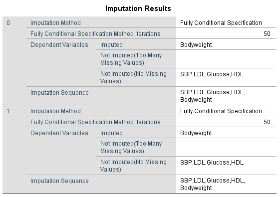

---
output:
  html_document: default
  pdf_document: default
---

# More topics on Multiple Imputation and Regression Modelling 

This Chapter is a follow-up on the previous Chapter 5 about data analysis with Multiple Imputation. In this Chapter, we will deal with some specific topics when you perform regression modeling in multiple imputed datasets. 

## Regression modeling with categorical covariates 

For categorical covariates, SPSS does not generate a pooled p-value for the overall Wald test. This is equal to not presenting a pooled Chi-square value in SPSS because the overall Wald value is a Chi-square value that represents the relationship between variables with > 2 categories and the outcome. An example is shown in Figure \@ref(fig:fig6-1), where the relationshp between a categorical version of the Tampa scale variable (categories 0 = low fear of movement, 1 = middle fear of movement and 2 is a high fear of movement) and the outcome Radiation (in the leg, 1=yes, 0=no) is pesented after MI in 5 imputed datasets. The overall Wald test and p-value is presented for each imputed dataset (in the row with a df of 2), but is missing for the pooled model. This is also the case for Cox regression models.

```{r fig6-1, echo = FALSE, fig.cap="Logistic Regresion with an independent categorical variable.", out.width='90%', fig.align='center'}
knitr::include_graphics("images/fig6.1_logistic.png")
```

There are several procedures to derive a pooled p-value for categorical variables, the pooled sampling variance or D1 method, the multiple parameter Wald test or D2 method, and the Meng and Rubin pooling procedure (@VanBuuren2018; @enders2010applied; @Eekhout2017; @Meng1992; @Mistler2013; @Marshall2009MedResMeth). A more simple procedures to derive a pooled p-value for the overall Wald test is just taking the median of the p-values from the overall Wald test of all imputed datasets, this rule is called the Median P Rule (MPR) (@Eekhout2017). These methods can only be performed in R.

##Logistic regression with a categorical variable in R

Pooling can be done by using the psfmi package that is downloadable via Github. The package needs R version 3.4.4 or higher. The package contains a function called `psfmi_lr` for pooling of logistic regression models and `psfmi_coxr`, to pool right censored Cox regression models. Install the package by first running:

`install.packages("devtools")`

`library(devtools)`

`devtools::install_github("mwheymans/psfmi")`

`library(psfmi)`

Than run the following code to pool the logistic regression model with as independent variable the categorical Tampa scale variable and as outcome the Radiation variable. To derive the pooled p-value for the overall Wald test, the D1 method is used. Other settings that can be used for `method=`, are "D2" for the D2 pooling method, "MR" for the Meng and Rubin method and "MPR" for the Median P Rule. 

```{r }
library(foreign)
library(psfmi)
data <- read.spss(file="Backpain 150 Missing_Tampa_Cat Imp.sav", to.data.frame = TRUE) 

psfmi_lr(data=data, nimp=5, impvar="Imputation_", Outcome="Radiation",
  cat.predictors=c("Tampa_Cat"), method="D1")

```

Pooling a multivariable regression model that contains a mix of continuous, dichotomous and categorical variables can easily be performed with the `psfmi_lr` function. With the following code example, pooling is done in 10 multiple imputed datasets that are stored in the file `lbpmilr` (see `?lbpmilr` for more information about the dataset) . The relationship with the outcome variable "Chronic" is estimated, using a model with 2 dichotomous, 4 continuous and 2 categorical variables. The pooling method is the Meng and Rubin procedure, indicated by `method="MR"`.

```{r }
library(foreign)
library(psfmi)

psfmi_lr(data=lbpmilr, nimp=10, impvar="Impnr", Outcome="Chronic",
  predictors=c("Gender", "Smoking", "Function", "JobControl", "JobDemands",
  "SocialSupport"), cat.predictors = c("Carrying", "Satisfaction"), 
  method="MR", print.method = FALSE)

```

In the final table that is called "Mixed p-values (MR & RR)", the pooled p-values can be found for all variables, including the categorical variables that are pooled by the Meng and Rubin procedure. For the dichotomous and continuous variables the pooled p-value estimated by Rubin's Rules is reported. Set `print.method = TRUE`, to obtain the table with the pooled p-values by the Meng and Rubin method for all variables.

## Cox Regression with a categorical variable in R

In the psfmi package, a function is also available to obtain overall pooled p-values for categorical variables in Cox regression models, because this is also not possible in SPSS. All pooling methods can be applied, except for the Meng and Rubin procedure. The Meng and Rubin procedure is not recommended to use for Cox regression models (@Marshall2009MedResMeth). The MPR pooling procedure is only extensively tested for the logistic regression model, and still experimental for the Cox regression models. More research to this method is on the way.

 
For more information of the possibilities of pooling logistic and Cox regression models with the psfmi package see `?psfmi_lr` or `?psfmi_coxr`.

## Variable selection
Prediction models are frequently developed by using selection procedures in logistic and Cox regression models. As a selection procedure, backward selection is recommended (Moons et al 2015). Predictor selection in multiple imputed datasets may be challenging. Predictor selection in each imputed dataset separately, may result in a different set of selected variables. Royston (2008) showed that the best choice to select predictors from multiply imputed datasets is to select from the pooled model, i.e. the model that is estimated in each imputed dataset and subsequently regression coefficients are pooled. From these pooled estimates the backward selection procedure can start. This is possible in SPSS when the model includes continuous and dichotomous variables. This is however not possible in SPSS when the model contains categorical variables. Because categorical variables are estimated and selected by using an overall Wald Chi-square value and as we have seen in paragraph 6.2, these Chi-square tests cannot be pooled in SPSS. This makes variable selection when categorical variables are included, not possible in SPSS. We have therefore developed an R package, that contains functions to select predictors  multiple imputed datasets and we have integrated the pooling procedures that were discussed in the previous paragraphs within these predictor selection functions. We will discuss these functions in the next paragraphs by running the code and we will discuss the output. The package can be installed via the Github website (code to install the packages will be provided below). 
As an example, we will use a dataset of 426 patients who received a new hip after a hip fracture. The outcome is recovery at 6 months which was defined as 1=no recovery and 0 = recovery. All functions work more or less in the same way and comparable function parameter settings are used. We start by showing the parameters settings that are used in these functions.

###Predictor Selection functions in R

The functions are developed for Logistic and Cox regression models. They are called:
psfmi.log
psfmi.log.MR
psfmi.cox

To activate these functions, you have to install the psfmi package from the Github website. Before that you have to install and activate the devtools package. The following code in the Console window can be used:


```{r}

## voorbeeld laten zien voor predictor selectio met psfmi package - verder niet uitwijden over inhoud. Alleen voorbeeld laten zien!

```


##Interaction terms in model

When the analysis model contains an interaction term, and one of the variables that is part of the interaction term contain missing data, it is important to pay extra attention to the imputation procedure. The challenge in this situation is that the imputation model should also include the interaction term, otherwise the imputation model is not compatible with the analysis model and this results in incorrect imputed values. For example, the relationship between (body)weight and blood pressure, with gender as effect modifier. The main aim of this model is to study the relationship between (body)weight and blood pressure. The interaction term between (body)weight and gender investigates whether this relationship depends on gender, i.e. is stronger or less strong for males compared to females. The analysis model is:

SBP=β_0+β_1×BodyWeight+β_2×Gender+β_3×BodyWeight×Gender

Assume now that there is missing data in the weight variable. As a result, there will also be missing data in the interaction term between weight and gender. 

When an imputation model only includes the following formula:

〖BodyWeight〗_mis=β_0+β_1×SBP+β_2×Gender

The imputation model is not consistent (not compatible) with the analysis model and would therefore not be able to generate valid imputations. We have to use  an imputation model that includes the interaction term, such as:

〖BodyWeight〗_mis=β_0+β_1×SBP+β_2×Gender+ β_3×〖BodyWeight〗_mis×Gender

The imputation of weight should take the interaction between weight and gender in relation to blood pressure into account. A method that we can apply is that we impute the relationship between blood pressure and weight separately for males and females. That way, we account for the possibility that the relationship between weight and blood pressure differs between males and females and the imputed values can then differ too. Not taking into account this interaction during the imputation process will result in biased coefficients and standard error estimates (Bartlett et al. 2015). The steps that we have to follow to impute the missing data in the weight variable in SPSS, taking into account the interaction between weight and gender is illustrated in the next paragraph.

###Imputation of interaction terms in SPSS

To impute the missing data in the Bodyweight variable in the example, the fact that the relation between bodyweight and blood pressure depends on gender needs to be taken into account in the imputation. This can be done by using the Split file procedure in SPSS. The example dataset contains information about the variables that are presented in \@ref(fig:fig6-2).


```{r fig6-2, echo = FALSE, fig.cap="Bodyweight dataset with missing values in the Bodyweight variable.", out.width='90%', fig.align='center'}
knitr::include_graphics("images/fig6.2.png")
```

Compare Groups and move the Gender variable to the window: Group based on, then click OK. In the right corner below it you see the information “Split by Gender”, which means that for the next analyses procedures the procedures will be done separately for males and females.

```{r fig6-3, echo = FALSE, fig.cap="The Split File procedure in SPSS.", out.width='90%', fig.align='center'}
knitr::include_graphics("images/fig6.3.png")
```

Perform MI and use all variables in the imputation model, except for the Gender variable. Because the Gender variable was used as a split variable it cannot be included in the imputation model. MI will now be separately performed for Males and Females. Set M=20, use Predictive Mean Matching and 50 iterations and store the imputed datasets in the file Imp_Bodyweight.  In the SPSS output file, in the Imputation Results and the Imputation Models tables you can check that the imputation process was performed for males and females separately.


```{r fig6-4, echo = FALSE, fig.cap="Imputation models, splitted for males and Females", out.width='90%', fig.align='center'}


```

Compute the Interaction term of Bodyweight times Gender in the dataset that contains the imputed values.Now turn on the split on the variable Imputation_. That will automatically turn off the split on the Gender variable in the imputed datasets (in the Data View window of the imputed datasets in the corner on the right below you see the statement “Split by Imputation_ Gender”. To include the variable Gender in the model we first have to unsplit the data by Gender). 

Then the analysis can be performed as planned with th interaction term as one of the predictors. 

###Imputation of interaction terms in R

The split file procedure that we used in SPSS in the previous paragraph to impute missing data and to take interaction terms into account can also be applied in R. First you have to split the data, impute the missing values, merge the data again and generate the interaction term in the dataset . Then results of the analysis model can be pooled. 
There is also another procedure in R that can be used. This procedure is called Substantive Model Compatible Fully Conditional Specification (SMC-FCS). This is a fairly complex procedure that can generate valid imputations by taking into account interaction terms. More about this procedure can be found in the technical paper of Bartlett et al.( 2015). To apply the procedure we need the smcfcs function which is available in the smcfs package (Bartlett, 2015). To get pooled analysis results we also have to install the mitoolspackage. An example of using the SMC-FCS is presented below.

```{r}

# Read in SPSS File "BodyWeight" and assign to object set
#set <- read.spss(file = "BodyWeight.sav", to.data.frame = T) ##IE: change to haven package

#set <- set[, -1]## do this in prediction model - otherwise ID variable is lost! 
#et$Int <- set$Bodyweight*set$Gender
 
# Perform SMCFCS, set seed to reproduce results
# impute missing values, taking account of the interaction term 
 
#imp.smcfcs <- smcfcs(set, smtype="lm", m=5, numit=10, rjlimit=2000,
#                smformula="SBP ~ Bodyweight + Gender + Int",
#                method=c("","","","","", "norm","Bodyweight*Gender"))

# fit analysis model and get pooled results
#smcfcs.model <- imputationList(imp.smcfcs$impDatasets)
# model.res <- with(smcfcs.model, lm(SBP~ Bodyweight + Gender + Int))
# summary(MIcombine(model.res))
```


We are currently updating this Chapter.
