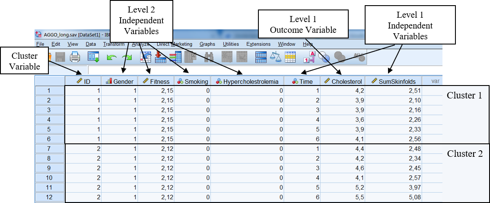
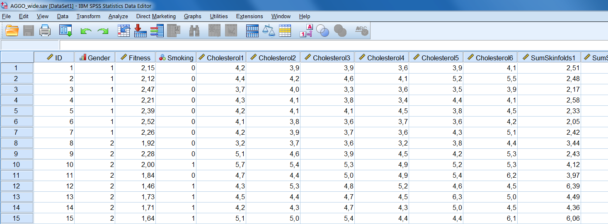
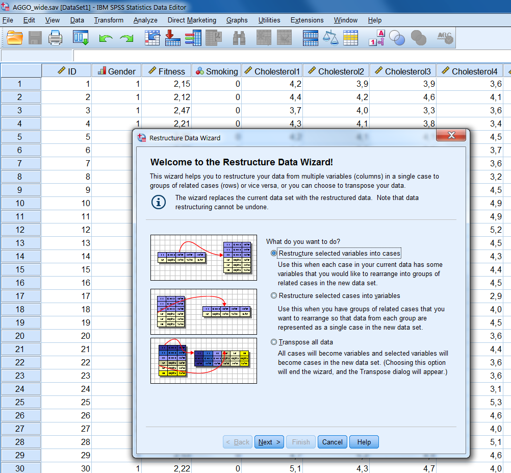
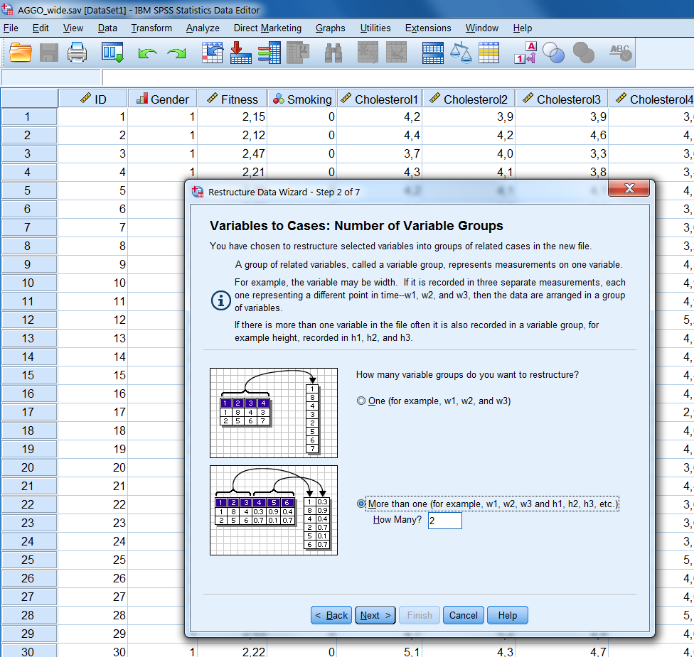
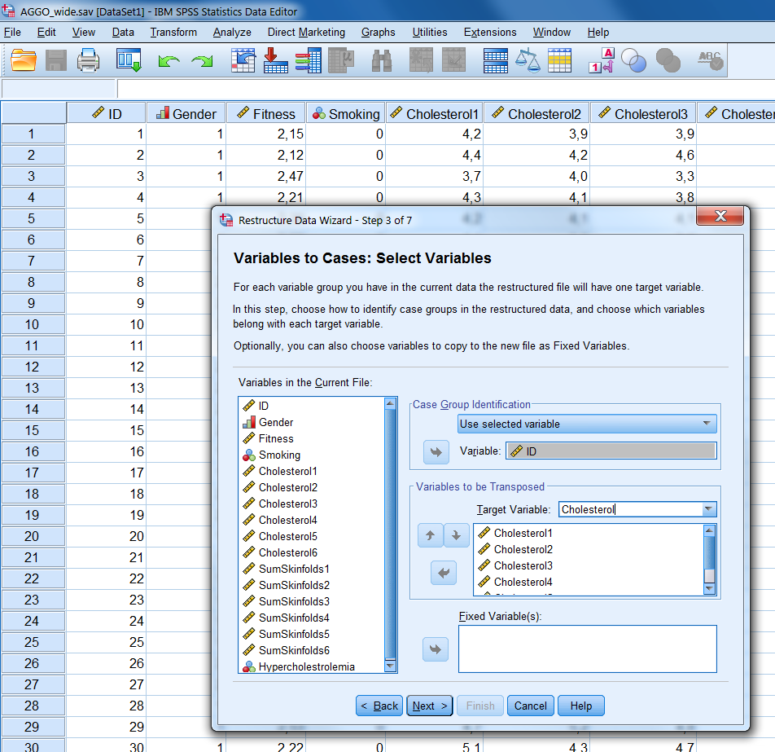
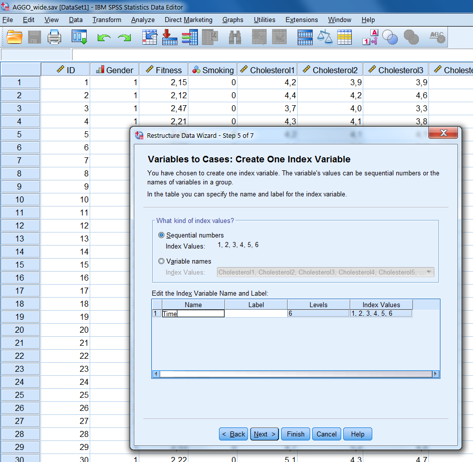
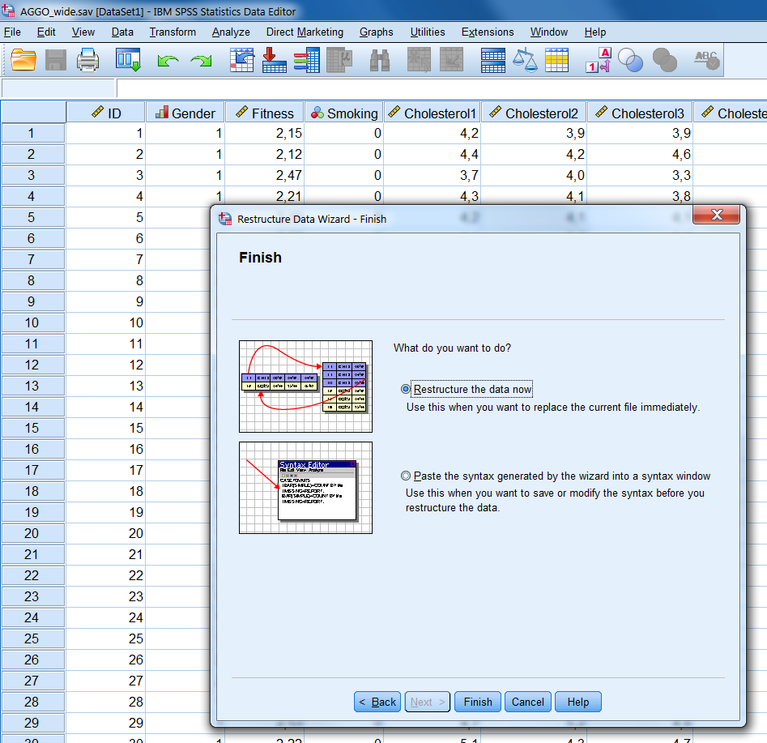

---
output:
  html_document: default
  pdf_document: default
---

# (PART) Part V: Advanced Multiple Imputation methods {-}

We are currently updating this Chapter.

# Multiple Imputation models for Multilevel data

## Advanced Multiple Imputation models for Multilevel data

In this Chapter, we will apply more advanced imputation models. With “advanced”, we mean multiple imputation models for Multilevel data, which are also called Mixed models. We start this Chapter with a brief introduction about multilevel data. Subsequently, we will shortly discuss the locations of missing data in Multilevel data. Finally, we will show examples of imputation procedures. 

## Characteristics of Multilevel data

Multilevel data is also known as clustered data, where collected data is clustered into groups. Examples are observations of patients within the same hospitals or observations of students within the same schools. These data is clustered (or correlated) because assessments of patients or students within the same hospital or school (or cluster) are more equal to each other than assessments of patients or students between different hospitals or schools (@twisk2006appliedmultilevelanalysis). It is called multilevel data because data is assessed at different levels. Data can be assessed at the level of the school when we would be interested in the school type, i.e. private or public. This data is assessed at two levels, i.e. the school level (highest level or level 2) and the students level (lowest level or level 1). 

Data that is repeatedly assessed within the same person over time is another example of multilevel data. Examples are when blood parameters or variables as bodyweight are repeatedly assessed within the same individuals (clusters) over time. Here the clusters are the individuals. This type of data is also called longitudinal data. In this example, also, assessments within the same individual may be more alike than assessments between individuals. This kind of data is also assessed at two levels, now the individuals are the highest level (level 2) and the time measurements are the lowest level (level 1). The different types of Multilevel data are graphically displayed in Figure 7.1a and b. Multilevel data may also consist of data assessed at more than 2 levels, i.e. data that is assessed in different schools, classes and students or different regions, hospitals and patients.

## Multilevel data - from wide to long

In this Chapter we use an example dataset from The Amsterdam Growth and Health Longitudinal Study (AGGO). In this study persons were repeatedly assessed over time and growth, health and life-style factors were measured. Assessments are available of Gender, Fitness, Smoking, Hypercholestrolemia, Cholesterol level and Sum of Skinfolds. The dataset contains information of 147 patients which are assessed six times, once at baseline and at 5 repeated measurement occasions. 
	Usually, a dataset contains one row per subject and the separate variables are placed in the columns. When subjects are repeatedly assessed, additional variables are added for new assessments. This is also called a wide data format (Figure \@ref(fig:fig71)). 

```{r fig71, echo = FALSE, fig.cap="Two-level data structure with measurements in different students within each school (left) and Two-level data structure with repeated assessments within individuals over time (right)", out.width='90%', fig.align='center'}
knitr::include_graphics("images/fig7.1.png")
```

## Multilevel data - from wide to long

In this Chapter we use an example dataset from The Amsterdam Growth and Health Longitudinal Study (AGGO). In this study persons were repeatedly assessed over time and growth, health and life-style factors were measured. Assessments are available of Gender, Fitness, Smoking, Hypercholestrolemia, Cholesterol level and Sum of Skinfolds. The dataset contains information of 147 patients which are assessed six times, once at baseline and at 5 repeated measurement occasions. 
	Usually, a dataset contains one row per subject and the separate variables are placed in the columns. When subjects are repeatedly assessed, additional variables are added for new assessments. This is also called a wide data format (Figure \@ref(fig:fig72)). 

```{r fig72, echo = FALSE, fig.cap="Example of the AGGO dataset in wide format.", out.width='90%', fig.align='center'}
knitr::include_graphics("images/fig7.2.png")
```

In order to apply multilevel analyses, we need a long version of the data. For the analysis we have to convert the dataset into a long data format, which is explained in paragraph 7.4.1 and 7.4.2. An example of a long dataset is presented in Figure 7.3. The variable that separates the clusters is called the ID variable and the variable that distinguishes the measurements at different time points is the Time variable. This means that repeated assessment within a subject are stacked under each other. Each subject has multiple rows, one row for each repeated measurement. 

```{r fig73, echo = FALSE, fig.cap="Example of the AGGO dataset in long format.", out.width='90%', fig.align='center'}
knitr::include_graphics("images/fig7.3.png")
```

##	Multilevel data - Clusters and Levels

In the previous paragraph we have seen an example of a long dataset that is needed for multilevel analyses. We can organize this kind of multilevel information by level of assessment in the following way (Figure \@ref(fig:fig74)):

```{r fig74, echo = FALSE, fig.cap="7.4. AGGO dataset with level 1 and 2 variables.", out.width='90%', fig.align='center'}

```

1)	Level 1 outcome variable: This is for example the Cholesterol variable that is repeatedly assessed over time within persons. Other examples may be math test scores of individual students in a class or their Intelligent Quotient (IQ) scores. In other words, level one outcome information varies within a cluster or the value changes over time (i.e. does not have a fixed value). 

2)	Level 1 independent variable: These are variables that vary within a cluster, but now are used as independent variables. Examples are the Time or Sum of Skinfold measurements that are repeatedly assessed within persons over time or hours that students in a class spent on their homework each week or the level of education of their parents. 

3)	Level 2 independent variables. These variables do not vary within a cluster but vary only between clusters. An example is the Gender or Fitness variable which is only assessed at the start of the study, or in case of schools, if the school is a private or public school.

4)	Level 4 is the cluster variable itself. This is a special variable which distinguishes the clusters. This could be the school identification number which form the blocks of measurement or the identification number that distinguishes individuals with repeated information over time.

In the next paragraph the type of statistical model is defined that is used to analyze multilevel data.

## Restructuring datasets from wide to long in SPSS

We start with the dataset in wide format, which is presented in (Figure \@ref(fig:fig76)). In this dataset, information is repeatedly assessed over time for the Cholesterol and Sum of Skinfold variables and this information is stored in the column variables. The repeated assessments are distinguished by the numbers at the end of the variable names. The number 1 indicates the first measurement, number 2, the second, etc. The Gender and Smoking variable is not repeatedly assessed over time. Each row represents a separate case.

```{r fig76, echo = FALSE, fig.cap="7.6. Example of a dataset in wide format.", out.width='90%', fig.align='center'}

```

Now click on Data Restructure and following the next steps:

Step1
A new window opens with three options (Figure \@ref(fig:fig77)). The default is to Restructure selected variables into cases and that is exactly what we want to do if we want to restructure from wide to long data files. 

```{r fig77, echo = FALSE, fig.cap="Step 1 of the Restructure Data Wizard.", out.width='90%', fig.align='center'}

```

Step 2
Click Next and a new window opens (Figure \@ref(fig:fig78)). In this window, you can choose how many variables you wish to restructure. Here we should think of the number of time varying variables (level 1) we have that we wish to examine. In our example dataset, we have two such variables: Cholesterol and Sum of Skinfolds. Therefore, we click the option More than one and type 2.

```{r fig78, echo = FALSE, fig.cap="Step 2 of the Restructure Data Wizard.", out.width='90%', fig.align='center'}

```

Step 3
We click Next and a new window opens (Figure \@ref(fig:fig79)). In this window, we should first define which variable should be used as our case group identifier. SPSS by default makes a new variable for this named Id. You can also use the ID variable in your dataset (you usually have such a variable): by clicking the arrow next to the Use case number option, you can select Use selected variable and after that drag the ID variable in your dataset (here ID) to this pane. Subsequently, we should define the variables in our broad dataset that should be restructured to one new long variable under Variables to be transposed. In our case this refers to two new variables. We rename trans1 into Cholesterol and select the 6 Cholesterol variables by holding down the Ctrl or Shift key. Next, we move these variables to the pane on the right and continue with the second variable (Figure 7.9). Now we change trans2 into SumSkinfolds and repeat the procedures for the Sum of Skinfolds variables. 

```{r fig79, echo = FALSE, fig.cap="Step 3 of the Restructure Data Wizard.", out.width='90%', fig.align='center'}

```

Step 4
We click Next and a new window opens (Figure \@ref(fig:fig80)). In this window, we can create so called Index variables. In longitudinal data analyses the index variable refers to the time points. We therefore only want one index variable. This is the default, so we can click Next again.

```{r fig80, echo = FALSE, fig.cap="Step 4 of the Restructure Data Wizard.", out.width='90%', fig.align='center'}
knitr::include_graphics("images/fig7.10.png")
```

Step 5
A new window opens again (Figure \@ref(fig:fig81)). This window allows us to create the index/time variable. The default is to use sequential numbers, which we also choose. In case of unequal time points you can redefine these numbers later in the long file with the Compute command in SPSS. We can change the name index1, by double clicking on it. Rename it in “Time”. In addition we can define a label for this variable in the same way.

```{r fig81, echo = FALSE, fig.cap="Step 5 of the Restructure Data Wizard.", out.width='90%', fig.align='center'}

```

Step 6
Click Next and a new window opens again (Figure \@ref(fig:fig82)). Here the only important thing is that we should choose what to do with the other variables in our dataset. We can either Drop them, meaning that we will not be able to use them in the subsequent analyses, or Keep them and treat them as fixed (time independent). In this case we choose this latter option. 

```{r fig82, echo = FALSE, fig.cap="Step 6 of the Restructure Data Wizard.", out.width='90%', fig.align='center'}
knitr::include_graphics("images/fig7.12.png")
```

Click on Next and the last window will open (Figure \@ref(fig:fig83)). 

```{r fig83, echo = FALSE, fig.cap="Last step of the Restructure Data Wizard.", out.width='90%', fig.align='center'}

```

This is the final step. Click on Finish (if we wish to paste the syntax we can choose for that here). Be aware that your converted dataset replaces now your original dataset (Figure \@ref(fig:fig84)). To keep both datasets, use for Save as in the menu file and choose another file name for the converted file.

```{r fig84, echo = FALSE, fig.cap="Example of the AGGO dataset in wide format.", out.width='90%', fig.align='center'}
knitr::include_graphics("images/fig7.14.png")
```

Figure 7.14. Converted wide to long dataset.

### Restructuring a dataset from wide to long in R

To convert a dataset in R from wide to long, you can use the reshape function. Before you convert a wide dataset, it is a good idea to redesign the dataset a little bit and to place all variables in the order of their names. It is than easier to apply the reshape function. You see an example in the R code below, where all Cholesterol variables are nicely ordered.

```{r , echo=FALSE}
suppressWarnings(suppressMessages(library(foreign)))
```

```{r }

library(foreign)
dataset <- read.spss(file="AGGO_wide.sav", to.data.frame = T)
head(dataset, 10)

```

Now it is easy to convert the dataset by using the following code. The object dataset_long shows the results (first 10 patients shown):

```{r , echo=FALSE}
suppressWarnings(suppressMessages(library(foreign)))
```

```{r }
# Reshape wide to long
dataset_long <- reshape(dataset, idvar = "ID", varying = list(5:10, 11:16), timevar="Time", 
         v.names = c("Cholesterol", "SumSkinfolds"), direction = "long")
#dataset_long
```

The long dataset is not ordered yet by ID and Time. This can be done by using the order function.

```{r }
dataset_long <- dataset_long[order(dataset_long$ID, dataset_long$Time), ]
#dataset_long

```

Now that we have restructured the dataset we are going to discover how missing data in multilevel data can be imputed. 

## Missing data at different levels

Missing data in multilevel studies can occur at the same levels as measurements as was discussed above. In other words, missing data can occur at the level of:

1)	The Level 1 outcome variable:
Missing data is present in the Cholesterol variable when this variable is repeatedly assessed over time or in math scores of pupils within a class. Note that when Mixed models are used and there is only missing data in the outcome variable, imputation of missing values is not necessary. Full information maximum likelihood procedures, that are used to estimate the parameters of a mixed model, can be used to get estimates of regression coeficients and standard errors.

2)	The Level 1 independent variable:
Missing data occur at the level of the independent variables that vary within a cluster. Examples are missing data in the Sum of Skinfold variable or the age or IQ scores of students within a class.

3)	The Level 2 independent variables:
Missing values are located in the variables that have a constant value within a cluster. For example, in the Fitness variable assessed at baseline or if data is missing for the variable if a school is a private or public school. Other examples are when data is missing for variables as gender or educational level of persons that were repeatedly assessed over time.

4)	The Cluster level variable:
Missing data may be present in the cluster variable itself, for example if students did not fill in the name of the school or patients did not fill in the name of the hospital they were treated.

We are currently working on this Chapter.
