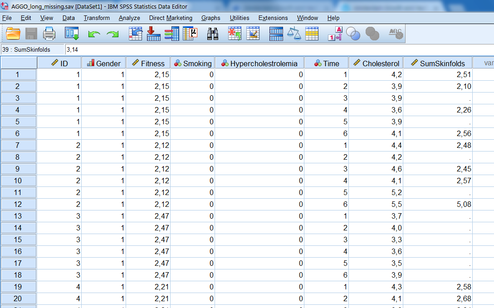
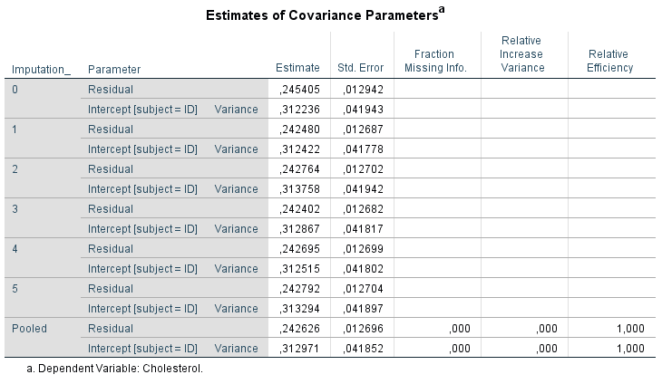

# Advanced Multiple Imputation models for Multilevel data

In this Chapter, we will apply more advanced imputation models. With “advanced”, we mean multiple imputation models for multilevel data, which are also called mixed models. We start this Chapter with a brief introduction about multilevel analyses and the structure of the data followed by a conceptual description of different methods of multilevel imputation. Subsequently, we will shortly discuss the basic principles of mixed models and the levels of data that are used in these models. After that, we will discuss the levels of missing data that you can encounter when you have a multilevel dataset and we will show some examples of how to apply multilevel imputation models. 

## Characteristics of Multilevel data

Multilevel data is also known as clustered data, where collected data is clustered into groups. Examples are observations of patients within the same hospitals or observations of students within the same schools. We say that these data are clustered (or correlated) because assessments of patients or students within the same hospital or school (or cluster) are more equal to each other than assessments of patients or students between different hospitals or schools (Twisk 2006). It is called multilevel data because data is assessed at different levels. Data can be assessed at the level of the school when we would be interested in the school type, i.e. private or public. We say than that the data is assessed at two levels, i.e. the school level (highest level or level 2) and the students level (lowest level or level 1). Another example of multilevel data are data that are repeatedly assessed within the same person over time, for example when blood parameters or variables as bodyweight are repeatedly assessed within the same individuals (clusters) over time. Here the clusters are the individuals. This type of data is also called longitudinal data. In this example, also, assessments within the same individual may be more alike than assessments between individuals. This kind of data is also assessed at two levels, now the individuals are the highest level (level 2) and the time measurements are the lowest level (level 1). The different types of Multilevel data are graphically displayed in Figure 7.1a and b. Multilevel data may also consist of data assessed at more than 2 levels, i.e. data that is assessed in different schools, classes and students or different regions, hospitals and patients.

## Multilevel data - from wide to long

In this Chapter we use an example dataset from The Amsterdam Growth and Health Longitudinal Study (AGGO). In this study persons were repeatedly assessed over time and growth, health and life-style factors were measured. Assessments are available of Gender, Fitness, Smoking, Hypercholestrolemia, Cholesterol level and Sum of Skinfolds. The dataset contains information of 147 patients which are assessed six times, once at baseline and at 5 repeated measurement occasions. 
	Usually, a dataset contains one row per subject and the separate variables are placed in the columns. When subjects are repeatedly assessed, additional variables are added for new assessments. This is also called a wide data format (Figure \@ref(fig:fig71)). 

```{r fig71, echo = FALSE, fig.cap="Two-level data structure with measurements in different students within each school (left) and Two-level data structure with repeated assessments within individuals over time (right)", out.width='90%', fig.align='center'}
knitr::include_graphics("images/fig7.1.png")
```

## Multilevel data - from wide to long

In this Chapter we use an example dataset from The Amsterdam Growth and Health Longitudinal Study (AGGO). In this study persons were repeatedly assessed over time and growth, health and life-style factors were measured. Assessments are available of Gender, Fitness, Smoking, Hypercholestrolemia, Cholesterol level and Sum of Skinfolds. The dataset contains information of 147 patients which are assessed six times, once at baseline and at 5 repeated measurement occasions. 
	Usually, a dataset contains one row per subject and the separate variables are placed in the columns. When subjects are repeatedly assessed, additional variables are added for new assessments. This is also called a wide data format (Figure \@ref(fig:fig72)). 

```{r fig72, echo = FALSE, fig.cap="Example of the AGGO dataset in wide format.", out.width='90%', fig.align='center'}
knitr::include_graphics("images/fig7.2.png")
```

In order to apply multilevel analyses, we need a long version of the data. For the analysis we have to convert the dataset into a long data format, which is explained in paragraph 7.4.1 and 7.4.2. An example of a long dataset is presented in Figure 7.3. The variable that separates the clusters is called the ID variable and the variable that distinguishes the measurements at different time points is the Time variable. This means that repeated assessment within a subject are stacked under each other. Each subject has multiple rows, one row for each repeated measurement. 

```{r fig73, echo = FALSE, fig.cap="Example of the AGGO dataset in long format.", out.width='90%', fig.align='center'}
knitr::include_graphics("images/fig7.3.png")
```

##	Multilevel data - Clusters and Levels

In the previous paragraph we have seen an example of a long dataset that is needed for multilevel analyses. We can organize this kind of multilevel information by level of assessment in the following way (Figure \@ref(fig:fig74)):

```{r fig74, echo = FALSE, fig.cap="7.4. AGGO dataset with level 1 and 2 variables.", out.width='90%', fig.align='center'}
knitr::include_graphics("images/fig7.4.png")
```

1)	Level 1 outcome variable: This is for example the Cholesterol variable that is repeatedly assessed over time within persons. Other examples may be math test scores of individual students in a class or their Intelligent Quotient (IQ) scores. In other words, level one outcome information varies within a cluster or the value changes over time (i.e. does not have a fixed value). 

2)	Level 1 independent variable: These are variables that vary within a cluster, but now are used as independent variables. Examples are the Time or Sum of Skinfold measurements that are repeatedly assessed within persons over time or hours that students in a class spent on their homework each week or the level of education of their parents. 

3)	Level 2 independent variables. These variables do not vary within a cluster but vary only between clusters. An example is the Gender or Fitness variable which is only assessed at the start of the study, or in case of schools, if the school is a private or public school.

4)	Level 4 is the cluster variable itself. This is a special variable which distinguishes the clusters. This could be the school identification number which form the blocks of measurement or the identification number that distinguishes individuals with repeated information over time.

In the next paragraph the type of statistical model is defined that is used to analyze multilevel data.

## The Multilevel model

In the analysis model of multilevel data, the clustered structure of the data has to be accounted for. In other words, the model corrects for the correlations within clusters. This is done by adding a random effect to the model, additional to the fixed effects. Fixed effects are the regression coefficients that are estimated as in normal regression models as fixed intercept or slope effects. They estimate the average effect of a whole group. The random effects are the cluster specific effects and can be embedded in the model as random intercept and random slope effects. Accordingly, multilevel models contain a “mix” of both random and fixed effects and are therefore often referred to as mixed effects models or random effects models. The multilevel model can be defined as depicted in (Figure \@ref(fig:fig75)):

```{r fig75, echo = FALSE, fig.cap="Definition of Multilevel model.", out.width='40%', fig.align='center'}
knitr::include_graphics("images/fig7.5.png")
```

The i indicates the different clusters and the j the repeated measurements within each cluster.
Yij: is the level 1 outcome variable.
Xij: is the level 1 or 2 independent variable.
B: is the fixed effect regression coefficient (for the intercept and the slope).
bi: is the random effect regression coefficient (for the intercept and the slope).
eij: is the error variance.

For example, if it would be of interest to examine the relationship between the Sum of Skinfolds and Cholesterol over time using the information in (Figure \@ref(fig:fig74)), the analysis model would be:

$$Cholesterol_{ij} = \beta_0 1 + Time_{ij}\beta_1 + SumSkinfolds_{ij}\beta_2 + b_i + \varepsilon_i$$ 

With the outcome and independent variables as level 1 variables in the model.
	In the next paragraph we explain how to restructure a dataset from wide to long in SPSS and R, needed to analyze multilevel data. We use the longitudinal AGGO data as an example. 

## Restructuring datasets from wide to long in SPSS

We start with the dataset in wide format, which is presented in (Figure \@ref(fig:fig76)). In this dataset, information is repeatedly assessed over time for the Cholesterol and Sum of Skinfold variables and this information is stored in the column variables. The repeated assessments are distinguished by the numbers at the end of the variable names. The number 1 indicates the first measurement, number 2, the second, etc. The Gender and Smoking variable is not repeatedly assessed over time. Each row represents a separate case.

```{r fig76, echo = FALSE, fig.cap="7.6. Example of a dataset in wide format.", out.width='90%', fig.align='center'}
knitr::include_graphics("images/fig7.6.png")
```

Now click on Data Restructure and following the next steps:

Step1
A new window opens with three options (Figure \@ref(fig:fig77)). The default is to Restructure selected variables into cases and that is exactly what we want to do if we want to restructure from wide to long data files. 

```{r fig77, echo = FALSE, fig.cap="Step 1 of the Restructure Data Wizard.", out.width='90%', fig.align='center'}
knitr::include_graphics("images/fig7.7.png")
```

Step 2
Click Next and a new window opens (Figure \@ref(fig:fig78)). In this window, you can choose how many variables you wish to restructure. Here we should think of the number of time varying variables (level 1) we have that we wish to examine. In our example dataset, we have two such variables: Cholesterol and Sum of Skinfolds. Therefore, we click the option More than one and type 2.

```{r fig78, echo = FALSE, fig.cap="Step 2 of the Restructure Data Wizard.", out.width='90%', fig.align='center'}
knitr::include_graphics("images/fig7.8.png")
```

Step 3
We click Next and a new window opens (Figure \@ref(fig:fig79)). In this window, we should first define which variable should be used as our case group identifier. SPSS by default makes a new variable for this named Id. You can also use the ID variable in your dataset (you usually have such a variable): by clicking the arrow next to the Use case number option, you can select Use selected variable and after that drag the ID variable in your dataset (here ID) to this pane. Subsequently, we should define the variables in our broad dataset that should be restructured to one new long variable under Variables to be transposed. In our case this refers to two new variables. We rename trans1 into Cholesterol and select the 6 Cholesterol variables by holding down the Ctrl or Shift key. Next, we move these variables to the pane on the right and continue with the second variable (Figure 7.9). Now we change trans2 into SumSkinfolds and repeat the procedures for the Sum of Skinfolds variables. 

```{r fig79, echo = FALSE, fig.cap="Step 3 of the Restructure Data Wizard.", out.width='90%', fig.align='center'}
knitr::include_graphics("images/fig7.9.png")
```

Step 4
We click Next and a new window opens (Figure \@ref(fig:fig80)). In this window, we can create so called Index variables. In longitudinal data analyses the index variable refers to the time points. We therefore only want one index variable. This is the default, so we can click Next again.

```{r fig80, echo = FALSE, fig.cap="Step 4 of the Restructure Data Wizard.", out.width='90%', fig.align='center'}
knitr::include_graphics("images/fig7.10.png")
```

Step 5
A new window opens again (Figure \@ref(fig:fig81)). This window allows us to create the index/time variable. The default is to use sequential numbers, which we also choose. In case of unequal time points you can redefine these numbers later in the long file with the Compute command in SPSS. We can change the name index1, by double clicking on it. Rename it in “Time”. In addition we can define a label for this variable in the same way.

```{r fig81, echo = FALSE, fig.cap="Step 5 of the Restructure Data Wizard.", out.width='90%', fig.align='center'}
knitr::include_graphics("images/fig7.11.png")
```

Step 6
Click Next and a new window opens again (Figure \@ref(fig:fig82)). Here the only important thing is that we should choose what to do with the other variables in our dataset. We can either Drop them, meaning that we will not be able to use them in the subsequent analyses, or Keep them and treat them as fixed (time independent). In this case we choose this latter option. 

```{r fig82, echo = FALSE, fig.cap="Step 6 of the Restructure Data Wizard.", out.width='90%', fig.align='center'}
knitr::include_graphics("images/fig7.12.png")
```

Click on Next and the last window will open (Figure \@ref(fig:fig83)). 

```{r fig83, echo = FALSE, fig.cap="Last step of the Restructure Data Wizard.", out.width='90%', fig.align='center'}
knitr::include_graphics("images/fig7.13.png")
```

This is the final step. Click on Finish (if we wish to paste the syntax we can choose for that here). Be aware that your converted dataset replaces now your original dataset (Figure \@ref(fig:fig84)). To keep both datasets, use for Save as in the menu file and choose another file name for the converted file.

```{r fig84, echo = FALSE, fig.cap="Example of the AGGO dataset in wide format.", out.width='90%', fig.align='center'}
knitr::include_graphics("images/fig7.14.png")
```

Figure 7.14. Converted wide to long dataset.

### Restructuring a dataset from wide to long in R

To convert a dataset in R from wide to long, you can use the reshape function. Before you convert a wide dataset, it is a good idea to redesign the dataset a little bit and to place all variables in the order of their names. It is than easier to apply the reshape function. You see an example in the R code below, where all Cholesterol variables are nicely ordered.

```{r , echo=FALSE}
suppressWarnings(suppressMessages(library(foreign)))
```

```{r }

library(foreign)
dataset <- read.spss(file="AGGO_wide.sav", to.data.frame = T)
head(dataset, 10)

```

Now it is easy to convert the dataset by using the following code. The object dataset_long shows the results (first 10 patients shown):

```{r , echo=FALSE}
suppressWarnings(suppressMessages(library(foreign)))
```

```{r }
# Reshape wide to long
dataset_long <- reshape(dataset, idvar = "ID", varying = list(5:10, 11:16), timevar="Time", 
         v.names = c("Cholesterol", "SumSkinfolds"), direction = "long")
#dataset_long
```

The long dataset is not ordered yet by ID and Time. This can be done by using the order function.

```{r }
dataset_long <- dataset_long[order(dataset_long$ID, dataset_long$Time), ]
#dataset_long

```

Now that we have restructured the dataset we are going to discover how missing data in multilevel data can be imputed. 

## Missing data at different levels

Missing data in multilevel studies can occur at the same levels as measurements as was discussed in paragraph 7.3. In other words, missing data can occur at the level of:

1)	The Level 1 outcome variable:
Missing data is present in the Cholesterol variable when this variable is repeatedly assessed over time or in math scores of pupils within a class. Note that when Mixed models are used and there is only missing data in the outcome variable, imputation of missing values is not necessary. Full information maximum likelihood procedures, that are used to estimate the parameters of a mixed model, can be used to get estimates of regression coeficients and standard errors.

2)	The Level 1 independent variable:
Missing data occur at the level of the independent variables that vary within a cluster. Examples are missing data in the Sum of Skinfold variable or the age or IQ scores of students within a class.

3)	The Level 2 independent variables:
Missing values are located in the variables that have a constant value within a cluster. For example, in the Fitness variable assessed at baseline or if data is missing for the variable if a school is a private or public school. Other examples are when data is missing for variables as gender or educational level of persons that were repeatedly assessed over time.

4)	The Cluster level variable:
Missing data may be present in the cluster variable itself, for example if students did not fill in the name of the school or patients did not fill in the name of the hospital they were treated.

##	Multilevel imputation models

In order to deal with missing values in multilevel data, the structure of the data needs to be accounted for. In Chapter 4 we have described that the imputation model for multiple imputation, needs to be compatible to the analysis model. Since the analysis model for multilevel data, uses random effects, the imputation model should ideally contain these random effects as well. Accordingly, multilevel imputation model need to be used, which are more complicated than non-multilevel imputation model.  
	Several procedures are available for multilevel imputation that are compatible with the mice package. In this Chapter, we will use two procedures. One procedure is the application of a one stage imputation method using fully conditional specification (FCS), also called the FCS-GLM approach. The other is a two-stage multilevel imputation procedure using fully conditional specification, which is called the FCS-2stage procedure. Both procedures are available in the micemd package (Audigier, 2017) and follow the MICE procedure to impute missing values. Accordingly, a chain of multilevel imputation models is used and a lot of parameter settings that are used in the mice function can also be used to impute multilevel data. The FCS-2stage procedure slightly differs from the FCS-GLM procedure, because imputations are generated in two steps. The procedures will be discussed in more detail with examples of how to apply them.
	As was discussed in Chapter 4, for missing data, Bayesian estimates are used in the imputation model to estimate the missing values. The imputed values are drawn from the posterior predictive distribution, conditional on the values of other variables. These procedures are also incorporated in the multilevel imputation procedures in the micemd package. The steps that are used to impute missing multilevel data are mathematically complex and we will therefore only explain these steps conceptually. Readers who are more interested in the mathematical details are referred to the papers of Jolani et al (2015), Resche-Rigon & White (2016) and Audigier et al (to appear).

###	Sporadically and Systematically missing data

In paragraph 7.5 it was discussed that missing data in multilevel datasets can occur at different levels. Another distinction can be made between sporadically and systematically missing values. Sporadically missing values are values that are sometimes missing within a cluster and systematic missing data is when all values within a cluster are missing. In (Figure \@ref(fig:fig85)). an example of sporadically and systematically missing data in the Sum of Skinfolds variable is presented. For patient number 1 and 2 the values are sporadically missing, i.e. some values are missing within the cluster of measurements of patients 1 and 2 and for patient number 3 the data is systematically missing, i.e. all Sum of Skinfold values are missing. In the next paragraph, solutions are presented of both types of missing data.

```{r fig85, echo = FALSE, fig.cap="Example of Sporadically and systematic missing data in the Sum of Skinfolds variable. For ID number 1 and 2 some values are (sporadically) missing and for ID number 3 all Sum of Skinfolds data is (systematically) missing.", out.width='90%', fig.align='center'}

```

## One stage Multilevel Imputation

One stage Multilevel imputation can be performed in R by using the micemd package. This package is compatible with the MICE package and in this package several procedures are available for multilevel imputation. The one stage Fully Conditional Specification Generalized Linear Mixed (FCS-GLM) imputation procedure is one of these methods. The FCS-GLM procedure uses the function mice.impute.2l.glm.norm and works best when there are few clusters and not so many individuals per cluster (see Box 2 below). This procedure follows roughly the same route as for Bayesian stochastic regression imputation only now linear mixed models are used to generate the imputations. For more information about these procedures see the papers of Jolani et al (2015), Resche-Rigon & White (2016) and Audigier (to appear).

With the one stage imputation procedure missing values are imputed using basically the following steps:
1.	A random effects multilevel model is estimated in the available data to determine the regression coefficients, between cluster variance-covariance matrix and the residual (within cluster) error variance.
2.	(Bayesian) estimates of the parameters estimated at step 1 are obtained, drawn from their posterior distribution. This means that error variation is added to the regression coefficients, variance-covariance matrix and residual error variance.
3.	Cluster specific regression coefficients are derived using the Bayesian estimates of step 2.
4.	These cluster specific effects are used to generate the imputed values using cluster specific regression models.
The FCS-GLM procedure assumes that the within cluster error variance is constant (i.e. has the same value) over all clusters. Systematic and sporadically missing values can be imputed by the one stage FCS-GLM procedure. 

### One stage Multilevel Imputation in R

We will now show how to impute missing data by using the FCS-GLM procedure in the longitudinally measured AGGO dataset. In the dataset, missing values exist in the independent Sum of Skinfolds variable and the outcome variable is Cholesterol. Both these variables are repeatedly assessed. There are also other variables in the dataset, as Gender, and Fitness score which can be used as auxiliary variables to improve the imputations. ID is the cluster variable. For this example, there is sporadically missing data in de dataset within the clusters 1, 2, 4 and 5 and systematically missing data in cluster 3, which means that within clusters 1, 2, 4 and 5, for 1 or 2 some repeated measured values are missing and that within cluster 3 all values are missing. The longitudinal dataset is (the first 5 persons are shown):  
```{r , echo=FALSE}
suppressWarnings(suppressMessages(library(foreign)))
```

```{r }
dataset <- read.spss(file="Aggo_long_missing.sav",to.data.frame = T)
#dataset

```

The long dataset is not ordered yet by ID and Time. This can be done by using the order function:

```{r }
dataset_long <- dataset_long[order(dataset_long$ID, dataset_long$Time), ]
#dataset_long

```

Now that we have restructured the dataset we are going to discover how missing data in multilevel data can be imputed. 

##	Missing data at different levels

Missing data in multilevel studies can occur at the same levels as measurements as was discussed in paragraph 7.3. In other words, missing data can occur at the level of:

1)	The Level 1 outcome variable:
Missing data is present in the Cholesterol variable when this variable is repeatedly assessed over time or in math scores of pupils within a class. Note that when Mixed models are used and there is only missing data in the outcome variable, imputation of missing values is not necessary. Full information maximum likelihood procedures, that are used to estimate the parameters of a mixed model, can be used to get estimates of regression coeficients and standard errors.

2)	The Level 1 independent variable:
Missing data occur at the level of the independent variables that vary within a cluster. Examples are missing data in the Sum of Skinfold variable or the age or IQ scores of students within a class.

3)	The Level 2 independent variables:
Missing values are located in the variables that have a constant value within a cluster. For example, in the Fitness variable assessed at baseline or if data is missing for the variable if a school is a private or public school. Other examples are when data is missing for variables as gender or educational level of persons that were repeatedly assessed over time.

4)	The Cluster level variable:
Missing data may be present in the cluster variable itself, for example if students did not fill in the name of the school or patients did not fill in the name of the hospital they were treated.

## Multilevel imputation models

In order to deal with missing values in multilevel data, the structure of the data needs to be accounted for. In Chapter 4 we have described that the imputation model for multiple imputation, needs to be compatible to the analysis model. Since the analysis model for multilevel data, uses random effects, the imputation model should ideally contain these random effects as well. Accordingly, multilevel imputation model need to be used, which are more complicated than non-multilevel imputation model.  
	Several procedures are available for multilevel imputation that are compatible with the mice package. In this Chapter, we will use two procedures. One procedure is the application of a one stage imputation method using fully conditional specification (FCS), also called the FCS-GLM approach. The other is a two-stage multilevel imputation procedure using fully conditional specification, which is called the FCS-2stage procedure. Both procedures are available in the micemd package (Audigier, 2017) and follow the MICE procedure to impute missing values. Accordingly, a chain of multilevel imputation models is used and a lot of parameter settings that are used in the mice function can also be used to impute multilevel data. The FCS-2stage procedure slightly differs from the FCS-GLM procedure, because imputations are generated in two steps. The procedures will be discussed in more detail with examples of how to apply them.
	As was discussed in Chapter 4, for missing data, Bayesian estimates are used in the imputation model to estimate the missing values. The imputed values are drawn from the posterior predictive distribution, conditional on the values of other variables. These procedures are also incorporated in the multilevel imputation procedures in the micemd package. The steps that are used to impute missing multilevel data are mathematically complex and we will therefore only explain these steps conceptually. Readers who are more interested in the mathematical details are referred to the papers of Jolani et al (2015), Resche-Rigon & White (2016) and Audigier et al (to appear).

###	Sporadically and Systematically missing data

In paragraph 7.5 it was discussed that missing data in multilevel datasets can occur at different levels. Another distinction can be made between sporadically and systematically missing values. Sporadically missing values are values that are sometimes missing within a cluster and systematic missing data is when all values within a cluster are missing. In Figure 7.15. an example of sporadically and systematically missing data in the Sum of Skinfolds variable is presented. For patient number 1 and 2 the values are sporadically missing, i.e. some values are missing within the cluster of measurements of patients 1 and 2 and for patient number 3 the data is systematically missing, i.e. all Sum of Skinfold values are missing. In the next paragraph, solutions are presented of both types of missing data.

```{r fig86, echo = FALSE, fig.cap="Example of Sporadically and systematic missing data in the Sum of Skinfolds variable. For ID number 1 and 2 some values are (sporadically) missing and for ID number 3 all Sum of Skinfolds data is (systematically) missing.", out.width='90%', fig.align='center'}

```

### One stage Multilevel Imputation

One stage Multilevel imputation can be performed in R by using the micemd package. This package is compatible with the MICE package and in this package several procedures are available for multilevel imputation. The one stage Fully Conditional Specification Generalized Linear Mixed (FCS-GLM) imputation procedure is one of these methods. The FCS-GLM procedure uses the function mice.impute.2l.glm.norm and works best when there are few clusters and not so many individuals per cluster (see Box 2 below). This procedure follows roughly the same route as for Bayesian stochastic regression imputation only now linear mixed models are used to generate the imputations. For more information about these procedures see the papers of Jolani et al (2015), Resche-Rigon & White (2016) and Audigier (to appear).

With the one stage imputation procedure missing values are imputed using basically the following steps:
1.	A random effects multilevel model is estimated in the available data to determine the regression coefficients, between cluster variance-covariance matrix and the residual (within cluster) error variance.
2.	(Bayesian) estimates of the parameters estimated at step 1 are obtained, drawn from their posterior distribution. This means that error variation is added to the regression coefficients, variance-covariance matrix and residual error variance.
3.	Cluster specific regression coefficients are derived using the Bayesian estimates of step 2.
4.	These cluster specific effects are used to generate the imputed values using cluster specific regression models.
The FCS-GLM procedure assumes that the within cluster error variance is constant (i.e. has the same value) over all clusters. Systematic and sporadically missing values can be imputed by the one stage FCS-GLM procedure. 

### One stage Multilevel Imputation in R

We will now show how to impute missing data by using the FCS-GLM procedure in the longitudinally measured AGGO dataset. In the dataset, missing values exist in the independent Sum of Skinfolds variable and the outcome variable is Cholesterol. Both these variables are repeatedly assessed. There are also other variables in the dataset, as Gender, and Fitness score which can be used as auxiliary variables to improve the imputations. ID is the cluster variable. For this example, there is sporadically missing data in de dataset within the clusters 1, 2, 4 and 5 and systemat ically missing data in cluster 3, which means that within clusters 1, 2, 4 and 5, for 1 or 2 some repeated measured values are missing and that within cluster 3 all values are missing.   

```{r }
dataset <- read.spss(file="Aggo_long_missing.sav",to.data.frame = T)
#dataset

```

The analysis model is:

$$Cholesterol_{ij} = \beta_0 1 + Time_{ij}\beta_1 + SumSkinfolds_{ij}\beta_2$$ 

For the imputation of the Sum of Skinfolds variable we will use all variables in the analysis model and two extra variables, Gender and Fitness. The Imputation model will be:

$$SumSkinfolds_{ij} = \beta_0 1 + Time_{ij}\beta_1 + Cholesterol_{ij}\beta_2 + Gender_{ij}\beta_3 + Fitness_{ij}\beta_4 + b_i + \varepsilon_i$$ 

To impute the missing data in the Sum of Skinfolds variable we first have to adjust the Predictormatrix that is used by mice to define which variable is the cluster variable. 

```{r , echo=FALSE}
suppressWarnings(suppressMessages(library(mice)))
suppressWarnings(suppressMessages(library(micemd)))
suppressWarnings(suppressMessages(library(miceadds)))
```

```{r }
# The value 1 is used as column location for the cluster variable 
ind.clust<- 1
 
# The following code is to adjust the predictorMatrix
# so that all variables are used in the imputation model
# to impute the Sum of Skinfolds variable 

predmatrix.adj <-mice(dataset,m=1,maxit=0)
predmatrix.adj$pred[ind.clust,ind.clust]<-0
predmatrix.adj$pred[-ind.clust,ind.clust]<- -2

predmatrix.adj$pred[predmatrix.adj$pred==1]<-2
predictor.matrix<-predmatrix.adj$pred
predictor.matrix

```

The predictormatrix contains the values 0, -2 and 2. As explained in paragraph 4.5 in the column are the names of the variables that are used in the imputation model to estimate the missing data in the row variable. In our example, all variables in the columns are used to impute the Sum of Skinfolds variable. The diagonal of the matrix is always zero. All complete variables do not have to be imputed so the rows of all complete variables are always zero. A -2 is an indication of the location of the cluster variable. The ID variable in the dataset is here defined as “ID”. The value 2 means the location of the random effects variables. In the imputation model, all variables will be defined as having a fixed and a random effect. 

To extract a completed dataset, for example completed dataset 1, we use the complete function that is available in the MICE package.

## Two stage Multilevel Imputation

Now, we will use as an example the two-stage multilevel imputation procedure that is available in the MICEMD package. This package is also compatible with the MICE package.

For two stage multilevel imputation the mice.impute.2l.2stage.norm function is used. With this function multilevel imputation models are applied in two stages. At the first stage regression models are estimated within each cluster and at the second stage a meta-analysis is conducted to get a pooled estimate. This pooled estimate is used to generate cluster specific coefficients and variance estimates, but than for the (Bayesian) posterior distribution. For more information about these procedures see the papers of Jolani et al (2015), Resche-Rigon & White (2016) and Audigier (to appear). Roughly, the following steps are taken for a continuous variable with missing data:
1.	In each cluster a linear regression model is fitted in the complete cases (complete case analysis). This produces (cluster-specific) regression coefficients and (cluster-specific) variance estimates.
2.	A meta-analysis is performed with as input the cluster specific regression coefficients and variance estimates from step 1. 
3.	From step 2 the pooled regression coefficient and the random-effects variance-covariance matrix are obtained.
4.	MICE is a Bayesian imputation procedure. A pooled regression coefficient from the posterior distribution is drawn and the same is done for the random-effects variance-covariance matrix.
5.	Cluster specific regression coefficients are drawn from the posterior distribution using the (Bayesian) estimates from step 4 (the regression coefficient and random-effects variance-covariance matrix).
6.	The same 2 stage procedures are repeated for the residual variance estimates to take account of different error variance estimates in each cluster, i.e. heteroscedastic error variance. This is not possible with the FCS-GLM method.
7.	Cluster specific effects are used to generate the imputed values using cluster specific regression models.

The difference with the FCS-GLM method described above and the FCS-2stage procedure is that the FCS-2stage procedure allows for a different residual variance within each cluster of the cluster specific imputation model (heteroskedastic variance instead of homoscedastic variance). The advantage of this method is that imputations are more correct. 

### Two stage Multilevel Imputation in R

To show how to impute the missing according to the two-stage procedure we use a dataset were persons are assessed in different training centers. The dataset contains 880 measurements, of 110 persons obtained in 8 different centers. Lifestyle factors were assessed in individuals (Level 1) at different centers (Level 2). The centers are the clusters of information. Missing values are present in the independent Sum of Skinfolds variable and the outcome variable is Cholesterol. The two-stage multilevel imputation method works best in datasets with a lot of values within each cluster (see Box 2). Again, we take as an example sporadically and systematically missing data, with sporadically missing data in cluster 1 and systematically missing data in cluster 2. This means that in cluster 2 for all 110 persons the Sum of Skinfold data is missing! 

Before we are going to impute the missing data we first have to adjust the Predictormatrix that is used by MICE to define which variable is the cluster variable. For this we have to run the same code as in the previous paragraph.

```{r }
ind.clust<-1 #index for the cluster variable
# to obtain the predictorMatrix
predmatrix.adj <-mice(dataset,m=1,maxit=0)
predmatrix.adj$pred[ind.clust,ind.clust]<-0
predmatrix.adj$pred[-ind.clust,ind.clust]<- -2
 
predmatrix.adj$pred[predmatrix.adj$pred==1]<-2
predictor.matrix<-predmatrix.adj$pred
predictor.matrix

```

Now we can start with imputing the missing data.

```{r }
#res.mice.md <- mice(dataset,m=5,predictorMatrix = predictor.matrix,
#                     method=c("", "",  "", "", "", "2l.2stage.norm"), 
#                     maxit=10, seed=23087)

```

The completed dataset can be extracted using the complete function.

```{r }
#complete(res.mice.md, 1)
```

Now the dataset can be used for further analyses.

## The micemd Package

In this paragraph a short description is given of some other imputation procedures that are available in the micemd package. For a full description of all procedures we refer to the reference manual of the micemd package, written by Vincent Audigier and Matthieu Resche-Rigon (2017).

One stage imputation methods:

mice.impute.2l.glm.bin
Imputes univariate missing data using a Bayesian logistic mixed model based on non-informative prior distributions. The method is dedicated to a binary outcome stratified in severals clusters. Should be used with few clusters and few individuals per cluster. Can be very slow to perform otherwise.

mice.impute.2l.glm.norm
Imputes univariate missing data using a Bayesian linear mixed model based on non-informative prior distributions. The method is dedicated to a continuous outcome stratified in severals clusters. Should be used with few clusters and few individuals per cluster. Can be very slow to perform otherwise.

mice.impute.2l.glm.pois
Imputes univariate missing data using a Bayesian mixed model (Poisson regression) based on noninformative prior distributions. The method is dedicated to a count outcome stratified in severals clusters. Should be used with few clusters and few individuals per cluster. Can be very slow to perform otherwise.

mice.impute.2l.jomo
Univariate imputation by a Bayesian multivariate generalized model based on conjugate priors. Can be used for a continuous or binary incomplete variable. For continuous variables, the modelling assumes heteroscedasticity for errors. For a binary variable, a probit link and a latent variables framework are used. 

Two stage imputation methods:

mice.impute.2l.2stage.bin 
Imputes univariate two-level binary variable from a logistic model. The imputation method is based on a two-stage estimator: at step 1, a logistic regression model is fitted to each observed cluster; at step 2, estimates obtained from each cluster are combined according to a linear random effect model.

mice.impute.2l.2stage.norm
Imputes univariate two-level continuous variable from a heteroscedastic normal model. The imputation method is based on a two-stage estimator: at step 1, a linear regression model is fitted to each observed cluster; at step 2, estimates obtained from each cluster are combined according to a linear random effect model.
 
mice.impute.2l.2stage.pmm
Similarly to mice.impute.2l.stage.norm, this function imputes univariate two-level continuous variable from a heteroscedastic normal model. The difference consists in replacing missing values by observed values instead of adding a parametric noise to the prediction of a linear model with random effects (as done in mice.impute.2l.stage.norm.mm and mice.impute.2l.stage.norm.reml).

mice.impute.2l.2stage.pois
Imputes univariate two-level count variable from a Poisson model. The imputation method is based on a two-stage estimator: at step 1, a Poisson regression model is fitted to each observed cluster; at step 2, estimates obtained from each cluster are combined according to a linear random effect model.

The function find.defaultMethod
The micemd package contains the function find.defaultMethod. With this function it is possible to get an advice about the imputation method on basis of the type of variables with missing data and the multilevel data structure. An example of how to apply this function is presented in Box 2 below.

Insert Box 1 here.

## Pooling Multilevel models

###	Pooling Multilevel Models in R

After multilevel data has been imputed, pooling the result of a multilevel analysis in R is easy because you can make use of the pool function in the mice package. The following R code does the job.

```{r , echo=FALSE}
suppressWarnings(suppressMessages(library(lme4)))
```

```{r }
library(lme4)

# lmer is used to specify the mixed model
#fit <-with(res.mice.md, lmer(Cholesterol ~ Time + SumSkinfolds + ( 1 | ID)))

# summary shows the result in each imputed dataset
#summary(fit)

# pool gives the pooled result
#summary(pool(fit))

```

###	Pooling Multilevel Models in SPSS

It is also possible to impute the missing data in R and then to transport the imputed datasets to SPSS. In SPSS you have to add a variable that distinguishes the imputed datasets and rename this variable into Imputation_. Than SPSS recognizes the dataset as a multiple imputed dataset. 
	In SPSS there are two ways to run multilevel models. Both procedures can be found via Analyze -> Mixed Models. One way is by using the Linear procedure for running Linear Mixed models when the outcome is continuous and the other is by using the Generalized Linear procedure for running Generalized Linear Mixed models when the outcome is continuous, dichotomous, etc. As is shown in (Figure \@ref(fig:fig87)), only for the Linear procedure the dataset is recognized as being a multiple imputed dataset because for that procedure the special mark before the word “Linear” is shown. 

```{r fig87, echo = FALSE, fig.cap="The Mixed Linear menu.", out.width='90%', fig.align='center'}

```

In other words, only with the Linear procedure pooled estimates can be generated and not for the Generalized Linear Mixed Models. This means that for example Multilevel logistic regression models cannot be pooled. The Mixed procedure in the imputed datasets will provide the following results (Figure \@ref(fig:fig88)) and (Figure \@ref(fig:fig89)).

```{r fig88, echo = FALSE, fig.cap="Table 7.2. Fixed effect parameters as a result of applying a linear mixed effects model in imputed datasets.", out.width='90%', fig.align='center'}
knitr::include_graphics("images/table7.2.png")
```

```{r fig89, echo = FALSE, fig.cap="Table 7.2. Fixed effect parameters as a result of applying a linear mixed effects model in imputed datasets.", out.width='90%', fig.align='center'}
knitr::include_graphics("images/table7.3.png")
```

As is shown in (Figure \@ref(fig:fig88)), SPSS also provides the pooled covariance parameter estimates (in this case the pooled residual and random intercept variances). These pooled values are estimated using Rubin´s Rules. This information is not provided by the mice package.

## Pooling GEE models

###	Pooling GEE Models in R

Pooling of Generalized Estimating Equation (GEE) models is not possible with the pool function in the mice package, because this function requires the variance-covariance matrix of the GEE model. Other pooling procedures can be applied to get pooled results in R after you have imputed the data. One possibility is by using the MIextract and MIcombine functions in the mitools package. 

```{r , echo=FALSE}
suppressWarnings(suppressMessages(library(geepack)))
```

```{r }
# Activate the geepack library to make use of the geeglm procedure
library(geepack)
 
# Run the GEE model in each imputed dataset 
#fit <-with(res.mice.md, geeglm(Cholesterol ~ Time + SumSkinfolds, id=ID, 
#       corstr = "exchangeable"))

# Activate the mitools package
#library(mitools)
 
# Extract the coefficients from the GEE model
#gee.coeff <- MIextract(fit$analyses , fun = coef)

# Extract the sampling variances (standard errors squared)
#var.gee <- lapply(fit$analyses , FUN = function(x){
#   gee.var <- (summary(x)$coefficients[, "Std.err"])^2
# })

#summary(MIcombine(results=gee.coeff, variances=var.gee))

```

Another possibility is by using the pool_mi function that is available in the miceadds package. For this function the standard errors or the sampling variances can be used to get the pooled results. The results are comparable with the MIcombine function.

```{r }
# Extract the standard errors
#se.gee <- lapply(fit$analyses , FUN = function(x){
#   gee.se <- summary(x)$coefficients[, "Std.err"]
# })

# Run the pool_mi function
#summary(pool_mi(qhat=gee.coeff, se=se.gee))

```

###	Pooling GEE Models in SPSS

Generalized Estimating Equations (GEE) models can also be applied in SPSS over imputed datasets. The missing data can first be imputed in R and after that transported to SPSS. Then an imputation variable has to be added to the dataset and renamed into Imputation_ to separate the imputed datasets. Then, SPSS recognizes the dataset as a multiple imputed dataset. The GEE procedure in SPSS is accessible via Analyse -> Generalized Linear Models -> Generalized Estimating Equations ((Figure \@ref(fig:fig90)).

```{r fig90, echo = FALSE, fig.cap="Access of the Generalized Estimating Equations procedure via the Analyze menu.", out.width='90%', fig.align='center'}
knitr::include_graphics("images/fig7.16.png")
```

With this procedure also multilevel analyses can be conducted, although the number of levels is restricted if you compare this procedure with using Mixed models. When GEE is used in multiple imputed datasets, the following output will be generated (Figure \@ref(fig:fig91)).

```{r fig91, echo = FALSE, fig.cap="Parameter estimates as a result of applying a GEE model in multiple imputed datasets.", out.width='90%', fig.align='center'}

```


