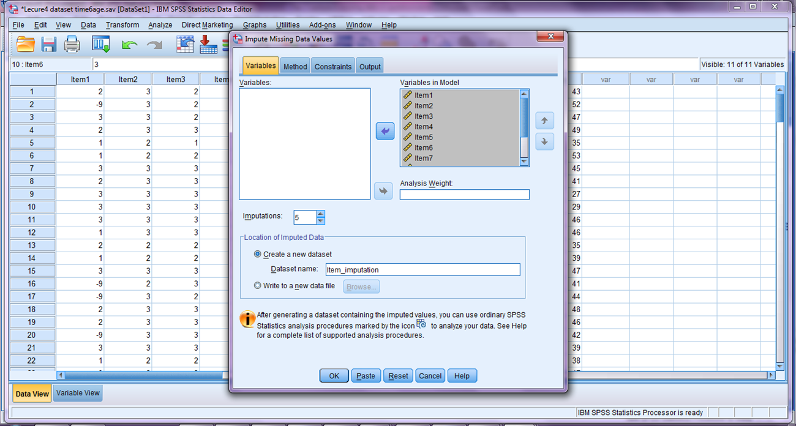
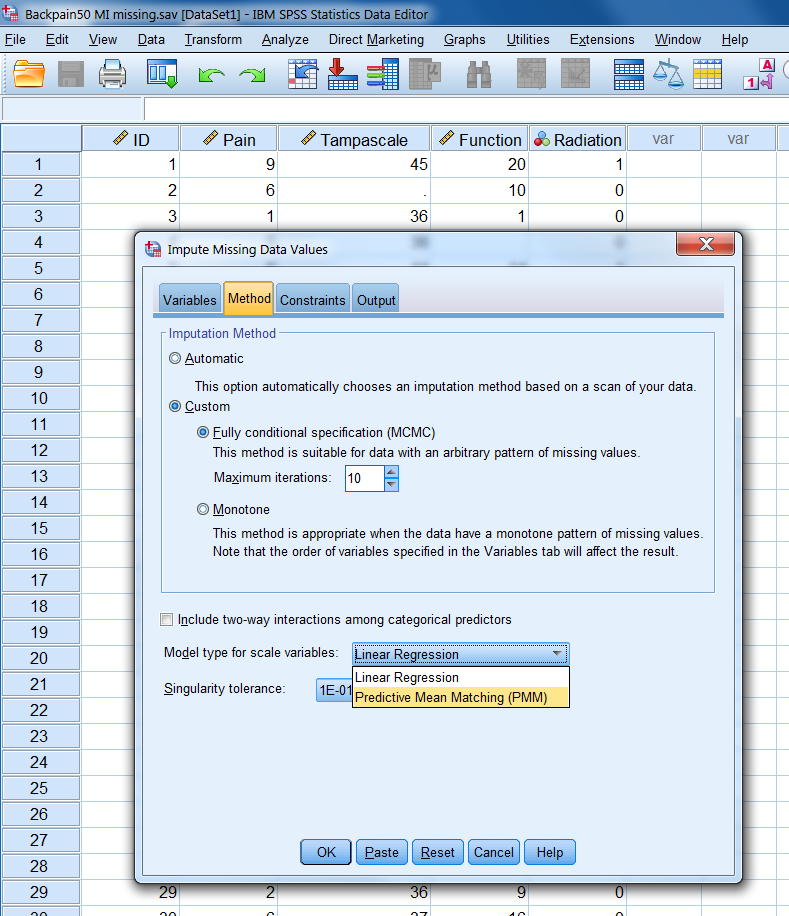
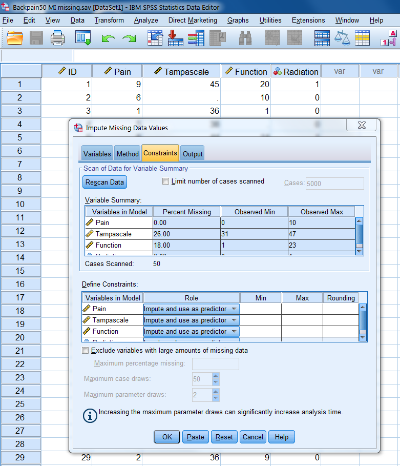
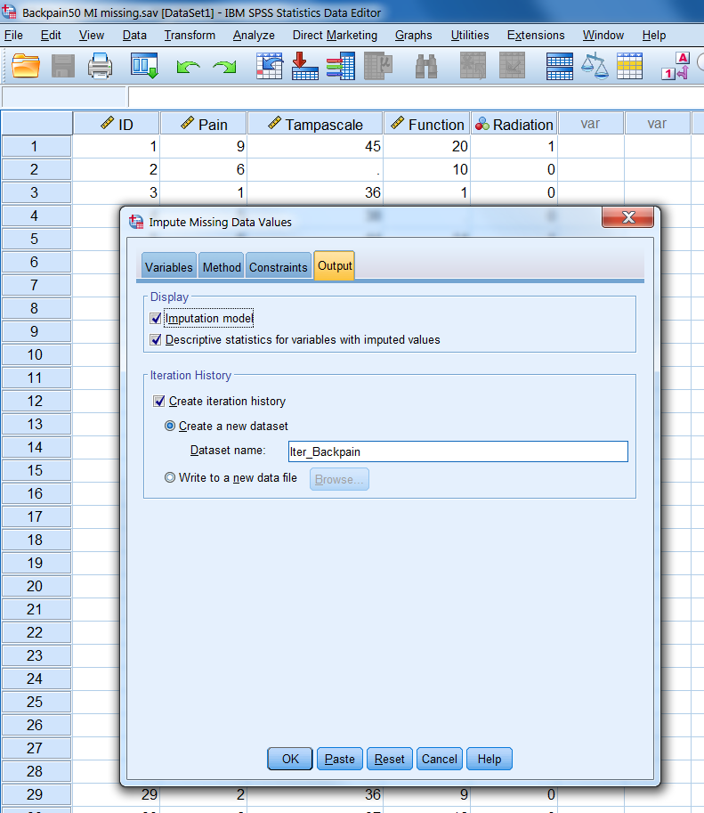
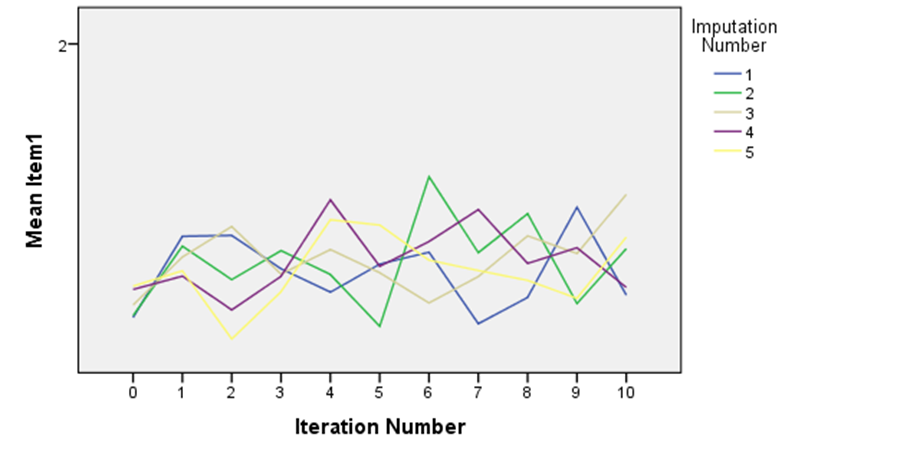
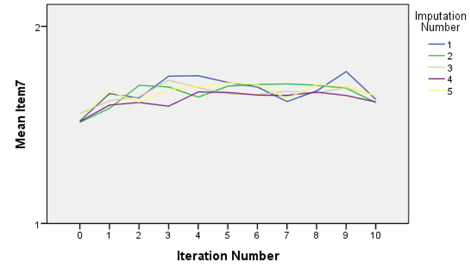
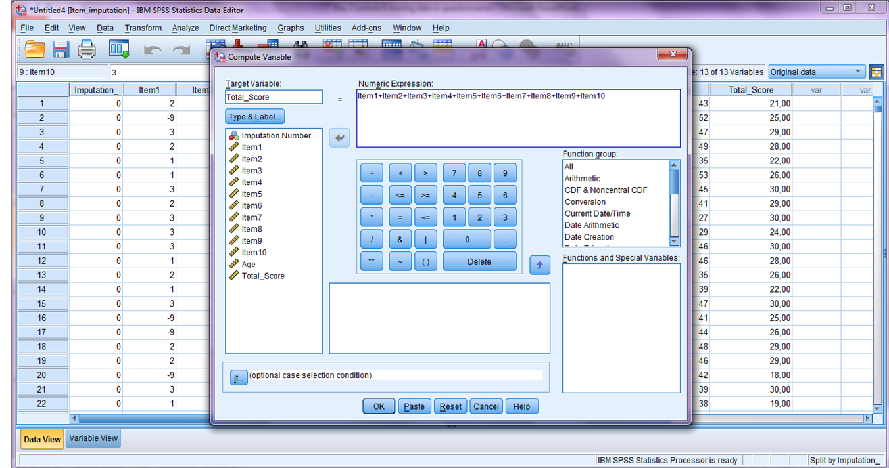
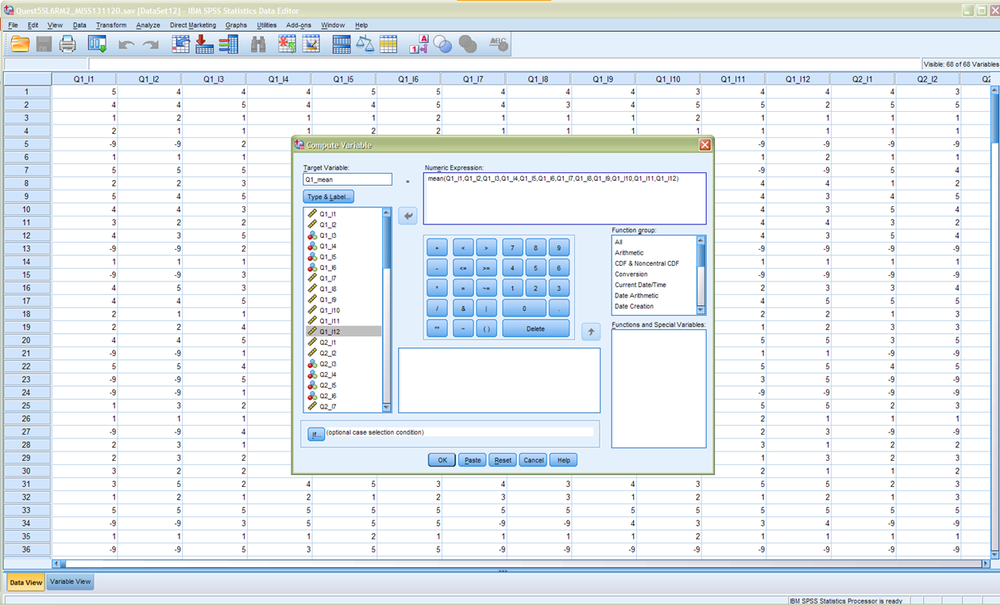
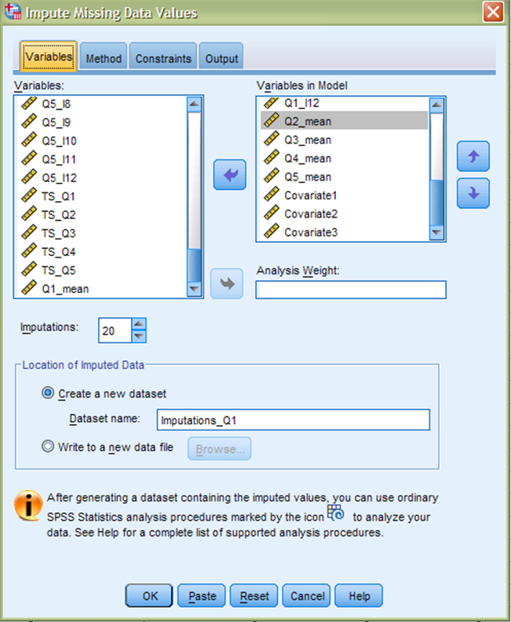
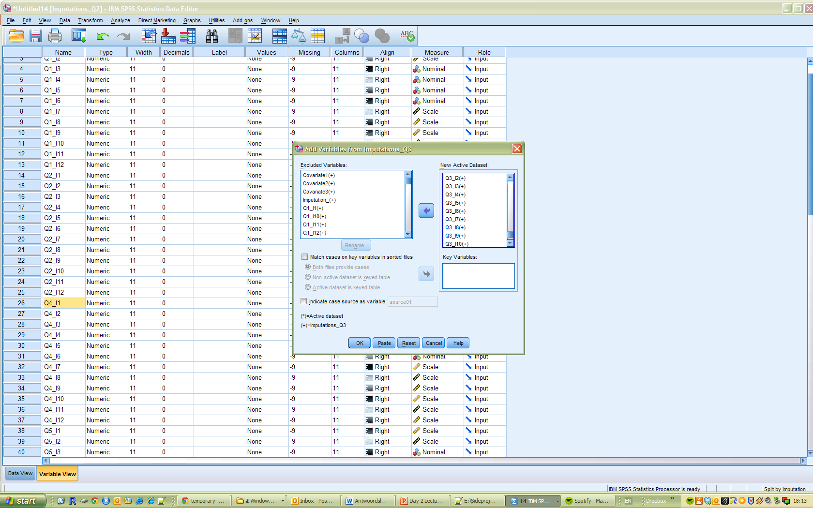

---
output:
  html_document: default
  pdf_document: default
---

# (PART) Part VI: Missing Data in Questionnaires {-}

# Missing data in questionnaires

In this Chapter, we discuss a special case of missing data, namely missing data in questionnaire data. With questionnaires we mean assessment instruments that consist of several items to measure one underlying construct, sometimes referred to as a scale. An example is an instrument to obtain a score for physical functioning, where 10 items are assess the extent to which a respondent is limited in performing an activity (e.g. lifting or carrying groceries, climbing one flight of stairs or walking half a mile). The items can be rated by 1= limited a lot, 2= limited a little, 3= not limited, and the sum score of the 10 items represents the total physical activity score. Missing data in questionnaires such as these, is special, because the missing data can occur in two different locations. Missing data can occur on the item scores, when one or more items is not scored by the respondent, or missing data can occur on the total score directly, when the entire questionnaire was not filled in. The missing data in the item scores, in the end also results in missing data on the total score, because the missing scores impair the calculation of the sum score. In dealing with missing data in questionnaires, one should take the location of the missing data into account. In this chapter we describe some available methods to deal with missing questionnaire data and its pros and cons and subsequently we will elaborate on some practical challenges with questionnaire data using illustrative case studies.

## Methods for missing questionnaire data
The methods to deal with missing questionnaire data, compare mostly to missing data methods discussed in previous chapters. However, the consequence of the applied method can differ due to the fact that the missing data can occur in the item scores and methods can therefore be applied to the item scores before calculating the total score. Studies have shown, that the application of missing data methods to the item scores results in a substantial gain for power and should therefore always be preferred over applying a missing data method to the total scores directly (@Eekhout2014). Additionally, there are methods developed to deal with missing item scores specifically. We will discuss a selection of available missing data methods for questionnaire data applied to the item scores below, with the advantages and disadvantages for using them.


###Complete case analysis
A complete case analysis on questionnaire data with missing observations, compares to a complete case analysis on non-questionnaire data. Only subjects with fully observed data are used in the analysis. However, when some item scores are missing, often times there are also item scores observed. The information in the observed item scores is ignored in the analysis, but can potentially include valuable information for the analysis. This is an important disadvantage of complete case analysis in questionnaire data. On the other hand a complete case analysis is very easy to apply can result in unbiased estimates when the missing data are missing completely at random (MCAR). Nevertheless, generally, in any case, power is lost in a complete case analysis and estimates will be biased when the missing data are missing at random (MAR) or missing not at random (MNAR).

###Mean imputation
In questionnaire data, there are two possible kinds of mean imputation. The first kind is item mean imputation. This compares to mean imputation in general variables. The mean score for the item is computed for the observed data, and any missing item score in that item will be imputed with that mean score. After imputation of these missing item scores, the total score can be calculated and used in the analysis. This methods is quite easy to apply, however analysis results will be biased regardless of the missing data mechanism. The variability in the item scores is decreased, and therefore, so is the variability in the total score. By imputing the mean score of the item, it is assumed that everyone who did not fill in the item would score average. This assumption is mostly unrealistic. 
Another kind of mean imputation is called person mean imputation (also know as imputing the average over the available items). For each respondent, the mean over the observed item scores is calculated and imputed for the missing item observations. For each subject a different imputed value is obtained and imputed. Subsequently, the total score is computed. This results in the same total score as calculating the average over the available items and multiplying that with the number of items in the questionnaire. This is again an easy to apply methods, and contrary to item mean imputation this methods can result in unbiased results. However, this methods does not always work, especially when the correlation between the items is low the method can introduce bias.

###(Stochastic) regression imputation
In regression imputation, the imputed values are estimated from a regression equation using the information from the complete items and additionally information from other variable that might be informative for the imputation. Regression imputation is also known as conditional mean imputation imputation and also decreases the variability in the data. In order to introduce the natural variability, a stochastic algorithm can be used. This means that the on top of the predicted regression estimated, residual error is added. This error is drawn from a normal distribution that is similar to the distribution of the residual error from the observed data. That way the variability in the data is retained. Also the correlation between the items is saved and a large advantage is that other variables can also be considered in the estimations. This method can give unbiased results and is the only single imputation methods that assumes MAR. The disadvantage is that this methods does not include the uncertainty about the missing data.

###Multiple imputation
In multiple imputation, missing item scores are imputed multiple times, resulting in multiple completed data sets. Each of these data sets is analyzed by standard analysis methods. Subsequently, the multiple sets of results are pooled into one final result. In Chapter 4 the multiple imputation procedures is described more in debt, which is similar when applied to the item scores, except that when multiple imputation is applied to the item scores, that before the analysis is performed, the total score is calculated with the imputed item scores. In the imputation model, all items are included additional to other relevant variables for imputation. Note that the total score for the questionnaire should not be included in the imputation. For the imputation of Likert score items, both predictive mean matching as the regression algorithm work well (@Eekhout2014). The convergence of the imputation should be checked for each imputed item. After the imputation, the total scores should be computed in each of the imputed datasets and can then be used in the analyses. The advantage of this method is that all available information is used, the most optimal estimates are obtained for incomplete data and the missing data uncertainty is taken into account. Nevertheless, this method can be somewhat difficult to apply and for the method to work well, it is vital that the imputation model is specified correctly. Additionally, with many questionnaires, or large questionnaires with many items, imputation applied to the item scores might not work. 


####Multiple imputation of item scores in R

```{r include = FALSE}
library(haven)
library(mice)
```

First we load the data in R and quickly inspect the dataset by displaying the first few rows. We can observe that the Total score for physical functioning has missing values when one or more item scores are missing (row 1 and row 2).

```{r eval=TRUE, include=TRUE}
dat <- read_sav("data/Questionnaire.sav")
dat[dat == -9] <- NA
dat$Total_Score <- rowSums(dat[,c(paste0("Item", 1:10))])
head(dat)
```

In R we impute the data with the mice function from the mice package. In this package all variables in the dataset are automatically included in the imputation. In this example we want to exclude the Total score from the imputation. So we need to exclude that variable from the predictor matrix first.

```{r eval=TRUE, include=TRUE}
imp0 <- mice(dat, maxit = 0)
pred <- imp0$predictorMatrix
#Exclude Total Score as imputed variable
pred["Total_Score",] <- 0 
#Exclude Total Score as predictor variable
pred[,"Total_Score"] <- 0
```

Next, we apply the imputation to the dataset without the total score. So, only the items are included and the Age variable.

```{r eval=TRUE, include=TRUE}
imp <- mice(dat, m = 5, maxit = 10, pred = pred, printFlag = FALSE)
```

Then the convergence can be checked by using the plot function to display the iteration plots for the imputed items.

```{r eval=TRUE, include=TRUE}
plot(imp, c("Item1", "Item4", "Item7"))
```

In questionnaire data we mostly want to use the total score for the items in the analysis. So we first have to compute this total score prior to analyzing the data. The imputed data from mice is stored as a mids object. This object can be transformed into a data frame where the imputed datasets are stacked as long data. In this long data we can compute the total score of the items and subsequently, we can transform the long data back into a mids object for the analysis (R code 8.5). Note that the “include” option is set as TRUE, in which case the original data is included on top of the data. This is similar as the imputed data resulting from SPSS. Accordingly this first line of code can be used to obtain a dataset that can later be analyzed in SPSS.

```{r eval=TRUE, include=TRUE}
imp1 <- data.frame(complete(imp, include = TRUE, action = "long"))
imp1$Total_Score <- rowSums(imp1[c(paste0("Item", 1:10))])
imp2 <- as.mids(imp1)
```

Finally we can analyze the imputed data and pool the results.

```{r eval=TRUE, include=TRUE}
fit <- with(imp2, lm(Total_Score ~ Age))
pool(fit)
```

####Multiple imputation of item scores in SPSS

The multiple imputation procedure in SPSS can be started via 

> Analyze -> Multiple Imputation -> Impute Missing Data Values. 

The window that opens is called the Variables window:

```{r fig8-1, echo = FALSE, fig.cap=". The options of the Variables Tab", out.width='90%', fig.align='center'}

```

In the Variables tab the item scores should be included in the model, as well as the variables that are of interest in the analyses. Additional (auxiliary) variables can be added to improve the imputations. Auxiliary variables are variables that are related to the variables with missing data and/or to the probability of missing data. These variables can therefore help improve the imputations of the missing data. In the Variables tab, the number of imputations can be defined and the name of the dataset that later will contain the multiple imputations. 
Note that the type of variable for the items is set to scale. This needs to be done prior to performing the imputations, otherwise the imputation procedure in SPSS will not work well. 

In the methods tab the model type can be defined and the number of iterations \@ref(fig:fig8-2), in the Constraints tab any constraints for the imputations can be specified \@ref(fig:fig8-3) and in the Output tab the returned output can be selected and creating the iteration history to obtain convergence plots \@ref(fig:fig8-4). Details about the options can be reviewed in Chapter 4 (paragraph 9). For imputing item scores, sometimes it may be feasible to constrain the minimum and maximum imputed values (when using the regression model type. Otherwise, imputations may contain values that can exceed the maximum and minimum score option of the items. 


```{r fig8-2, echo = FALSE, fig.cap="The options of the Methods Tab", out.width='90%', fig.align='center'}

```


```{r fig8-3, echo = FALSE, fig.cap="The options of the Constraints Tab", out.width='90%', fig.align='center'}

```


```{r fig8-4, echo = FALSE, fig.cap="The options of the Output Tab", out.width='90%', fig.align='center'}

```

Before analyzing the imputed data, the convergence of the imputations should be checked in iteration plots for each imputed item. In Chapter 4 paragraph 11 the procedure for creating iteration plots is described. In \@ref(fig:fig8-5) you can observe iteration plots for two items. The first plot presents an iteration plot of a converged imputation, however the second plot presents a less well converged imputed item. This might be due to high correlations between that item and other items or variables in the imputation model. 


```{r fig8-5, echo = FALSE, fig.cap="Examples of convergenge plots", out.width='90%', fig.align='center'}



```


After convergence is checked and accepted, the total score needs to be calculated in the imputed data. In \@ref(fig:fig8-6) an example is shown of how the total score can be obtained (via Transform > Compute). The total score will automatically be calculated in all imputed datasets and will turn yellow if its based on imputed item scores. Afterwards, the analysis can be performed using the total score that is calculated from the imputed item scores. 

```{r fig8-6, echo = FALSE, fig.cap="Compute the total score for the imputed items", out.width='90%', fig.align='center'}

```

##	Practical issues with missing data in questionnaires
The practical issue that most often occurs with missing data in questionnaire data, is that when studies use many questionnaires, that the number of variables will exceed the number of respondents. Since multiple imputation is based on regression, the same assumptions as in regressions apply. Accordingly, when the number of variables exceeds the number of subjects in the data, regression models cannot be estimated, and therefore estimating the imputed values will be problematic.
There are two possible methods to deal with this problem: parcel summary score imputation or passive imputation. The first methods is more pragmatic and can be performed in any statistical software package that can perform multiple imputation. Passive imputation requires a more advanced adaptation of the imputation process and is not possible in SPSS, however it can be performed in R. 

###Parcel summary multiple imputation
When the number of variables in the imputation model exceeds the number of respondents in the data, which can be the case when many questionnaire scales are included in one study, the imputations cannot be estimated. In order for multiple imputation to work, the number of variables in the imputation model needs to be reduced somehow. For the imputation model, it is important to include all information from the analyses. If the imputation model is not compatible to the analysis model, bias can occur in analysis estimates. Reducing the number of variables in the imputation model, needs to be done carefully, without losing important information. One way to do this is to use parcel summary scores as predictors for the imputation of items from other scales. A parcel summary score for a questionnaire or scale is the average over the available items. Previously, we stated that using the average of the available items as an imputation methods is not recommended. However, in this case we use the average of the available items (i.e. parcel summary scores) as a surrogate for the item scores itself. We use this information as a predictor to impute items from other scales. That way, information from other questionnaires is used in the imputation, but the number of variables is reduced (from all items to one parcel summary score). The parcel summary score multiple imputation can be performed in five steps:

Step1: calculate the parcel summary scores for each questionnaire. For each questionnaire in the data, a temporary score is calculating by taking the average over the available item scores. This results in as many additional columns in the data as there are questionnaires. The goals is not to replace the total score of the questionnaire by this parcel summary score, because this temporary score is only used in the imputation process.

Step 2: impute the item scores per questionnaire. The main dataset should be separated as many sub-datasets as there are questionnaires. Each sub-dataset contains the item scores of a questionnaire, the parcel summary scores of the other questionnaires and all other variables that should be used in the imputation model. In each of these sub-datasets the multiple imputation procedure can be performed, including the item scores of that questionnaire, the parcel summary scores of the other questionnaires and the other relevant variables for imputation. Make sure that the setting for the multiple imputations are each time the same (i.e. the number of iterations and the number of imputations).

Step 3: Merge all imputed datasets. The imputed datasets created in step 2 should be merged into one main multiple imputation dataset with all imputed item scores. 

Step 4: Calculate the total scores for the questionnaires with the imputed item scores. In the merged main multiple imputation data the total scores are calculated with the imputed item scores. 

Step 5: Analyze the data and pool the results. In the final step the multiple imputed data is analyzed and the results from the analyses are pooled into one final result. 

The downside of this methods, is that the multiple imputation procedure need to be performed multiple times. This results in multiple files with multiple imputed datasets that need to be merged after all imputation procedures are finished. This requires quite some time and good administration during the procedure. Nevertheless, this method results in optimal power for the analysis results, and incorporates all available item information in the missing data handling (@Eekhout2018). Furthermore, this procedure can be performed in any software package. 


####Parcel summary imputation in R
We will also follow the five steps for parcel summary imputation for an example in R. First we load the data. In R code 8.7 the variable names are displayed. The data contains five questionnaires, each questionnaire contains 12 items. Additionally there are 3 covariates.  

```{r eval=TRUE, include=TRUE}

dat <- read_sav("data/ManyQuestionnaires.sav")
dat[dat == -9] <- NA
names(dat)
```

In step 1 the parcel summary scores are calculated for each questionnaire (R code 8.8). Note that the “na.rm” option is set as TRUE in order to obtain an average score over the observed scores, also if one or more item scores are missing. 

```{r eval=TRUE, include=TRUE}
dat$Q1_parcel <- rowMeans(dat[,c("Q1_I1","Q1_I2","Q1_I3","Q1_I4","Q1_I5","Q1_I6","Q1_I7","Q1_I8","Q1_I9","Q1_I10","Q1_I11","Q1_I12")], na.rm=TRUE)
dat$Q2_parcel <- rowMeans(dat[,c("Q2_I1","Q2_I2","Q2_I3","Q2_I4","Q2_I5","Q2_I6","Q2_I7","Q2_I8","Q2_I9","Q2_I10","Q2_I11","Q2_I12")], na.rm=TRUE)
dat$Q3_parcel <- rowMeans(dat[,c("Q3_I1","Q3_I2","Q3_I3","Q3_I4","Q3_I5","Q3_I6","Q3_I7","Q3_I8","Q3_I9","Q3_I10","Q3_I11","Q3_I12")], na.rm=TRUE)
dat$Q4_parcel <- rowMeans(dat[,c("Q4_I1","Q4_I2","Q4_I3","Q4_I4","Q4_I5","Q4_I6","Q4_I7","Q4_I8","Q4_I9","Q4_I10","Q4_I11","Q4_I12")], na.rm=TRUE)
dat$Q5_parcel <- rowMeans(dat[,c("Q5_I1","Q5_I2","Q5_I3","Q5_I4","Q5_I5","Q5_I6","Q5_I7","Q5_I8","Q5_I9","Q5_I10","Q5_I11","Q5_I12")], na.rm=TRUE)

```

In step 2 the item scores are imputed per questionnaire. First the data is separated per questionnaire. For each questionnaire subset the item scores are selected for that questionnaire, with the parcel summary scores from the other questionnaires. And each time the covariates are also included. For questionnaire 1 this would be: 

```{r eval=TRUE, include=TRUE}
dat_Q1 <- dat[,c("Q1_I1","Q1_I2","Q1_I3","Q1_I4","Q1_I5","Q1_I6","Q1_I7","Q1_I8","Q1_I9","Q1_I10","Q1_I11","Q1_I12", 
                    "Q2_parcel", "Q3_parcel", "Q4_parcel", "Q5_parcel",
                    "Covariate1", "Covariate2", "Covariate3")]

```

```{r, eval=TRUE, include=TRUE}
dat_Q2 <- dat[,c("Q2_I1","Q2_I2","Q2_I3","Q2_I4","Q2_I5","Q2_I6","Q2_I7","Q2_I8","Q2_I9","Q2_I10","Q2_I11","Q2_I12", 
                    "Q1_parcel", "Q3_parcel", "Q4_parcel", "Q5_parcel",
                    "Covariate1", "Covariate2", "Covariate3")]
dat_Q3 <- dat[,c("Q3_I1","Q3_I2","Q3_I3","Q3_I4","Q3_I5","Q3_I6","Q3_I7","Q3_I8","Q3_I9","Q3_I10","Q3_I11","Q3_I12", 
                    "Q1_parcel", "Q2_parcel", "Q4_parcel", "Q5_parcel",
                    "Covariate1", "Covariate2", "Covariate3")]

dat_Q4 <- dat[,c("Q4_I1","Q4_I2","Q4_I3","Q4_I4","Q4_I5","Q4_I6","Q4_I7","Q4_I8","Q4_I9","Q4_I10","Q4_I11","Q4_I12", 
                    "Q1_parcel", "Q2_parcel", "Q3_parcel", "Q5_parcel",
                    "Covariate1", "Covariate2", "Covariate3")]
dat_Q5 <- dat[,c("Q5_I1","Q5_I2","Q5_I3","Q5_I4","Q5_I5","Q5_I6","Q5_I7","Q5_I8","Q5_I9","Q5_I10","Q5_I11","Q5_I12", 
                    "Q1_parcel", "Q2_parcel", "Q3_parcel", "Q4_parcel",
                    "Covariate1", "Covariate2", "Covariate3")]

```

For each questionnaire, the dataset can then be imputed. Since we already stored the variables that we need to use for the imputation per questionnaire, we can use that object (e.g dat_Q1 for questionnaire 1) for the imputation. 

```{r eval=TRUE, include=TRUE}
imp_Q1 <- mice(dat_Q1, m = 5, maxit = 10, printFlag = FALSE)
```

```{r eval=TRUE, include=TRUE}
imp_Q2 <- mice(dat_Q2, m = 5, maxit = 10, printFlag = FALSE)
imp_Q3 <- mice(dat_Q3, m = 5, maxit = 10, printFlag = FALSE)
imp_Q4 <- mice(dat_Q4, m = 5, maxit = 10, printFlag = FALSE)
imp_Q5 <- mice(dat_Q5, m = 5, maxit = 10, printFlag = FALSE)
```

Step 2 is repeated for each questionnaire. In step 3 the imputed item scores are merged from each dataset into one final imputed dataset. First, the imputed datasets are stacked as a long file again for each questionnaire.

```{r eval=TRUE, include=TRUE}
mi_Q1 <- data.frame(complete(imp_Q1, include=TRUE, action="long"))
mi_Q2 <- data.frame(complete(imp_Q2, include=TRUE, action="long"))
mi_Q3 <- data.frame(complete(imp_Q3, include=TRUE, action="long"))
mi_Q4 <- data.frame(complete(imp_Q4, include=TRUE, action="long"))
mi_Q5 <- data.frame(complete(imp_Q5, include=TRUE, action="long"))
```

Subsequently, from each data frame, the item scores are selected and combined into one final imputed dataset with the covariates. Note that the first variable “.imp” indicates the imputed dataset number. This is similar to the “Imputation_” variable in SPSS. This variable needs to be included in order to be able to transform the data frame object back to a mids object for analysis.
```{r eval=TRUE, include=TRUE}
dat_imp <-data.frame(.imp=mi_Q1[,".imp"],
                        mi_Q1[,paste0("Q1_I", 1:12)],
                        mi_Q2[,paste0("Q2_I", 1:12)],
                        mi_Q3[,paste0("Q3_I", 1:12)],
                        mi_Q4[,paste0("Q4_I", 1:12)],
                        mi_Q5[,paste0("Q5_I", 1:12)],
                        mi_Q1[,c("Covariate1", "Covariate2", "Covariate3")]
                        )
```

In step 4 the total score for the imputed item scores are calculated. Note that the “na.rm” option is set to FALSE in order to make sure that a total score is missing when one or more item scores are missing. This is just an extra check, because all item scores are imputed and therefore this should not occur. 

```{r eval=TRUE, include=TRUE}
dat_imp$Q1_TS <- rowSums(dat_imp[,c("Q1_I1","Q1_I2","Q1_I3","Q1_I4","Q1_I5","Q1_I6","Q1_I7","Q1_I8","Q1_I9","Q1_I10","Q1_I11","Q1_I12")], na.rm=FALSE)
dat_imp$Q2_TS <- rowSums(dat_imp[,c("Q2_I1","Q2_I2","Q2_I3","Q2_I4","Q2_I5","Q2_I6","Q2_I7","Q2_I8","Q2_I9","Q2_I10","Q2_I11","Q2_I12")], na.rm=FALSE)
dat_imp$Q3_TS <- rowSums(dat_imp[,c("Q3_I1","Q3_I2","Q3_I3","Q3_I4","Q3_I5","Q3_I6","Q3_I7","Q3_I8","Q3_I9","Q3_I10","Q3_I11","Q3_I12")], na.rm=FALSE)
dat_imp$Q4_TS <- rowSums(dat_imp[,c("Q4_I1","Q4_I2","Q4_I3","Q4_I4","Q4_I5","Q4_I6","Q4_I7","Q4_I8","Q4_I9","Q4_I10","Q4_I11","Q4_I12")], na.rm=FALSE)
dat_imp$Q5_TS <- rowSums(dat_imp[,c("Q5_I1","Q5_I2","Q5_I3","Q5_I4","Q5_I5","Q5_I6","Q5_I7","Q5_I8","Q5_I9","Q5_I10","Q5_I11","Q5_I12")], na.rm=FALSE)

```

The data can be analyzed and pooled in step 5, after transforming the data frame with the stacked imputed dataset back to a mids object.

```{r eval=TRUE, include=TRUE}

dat_imp2 <- as.mids(dat_imp)
fit <- with(dat_imp2, lm(Q1_TS~ Q2_TS+Q3_TS+Q4_TS+Q5_TS+Covariate1))
pool(fit)
```


####	Parcel summary imputation in SPSS
The parcel summary imputation method can be applied in SPSS by using the five steps. The procedure for SPSS is illustrated by using an example dataset that contains five questionnaires and three covariates. Each questionnaire is constructed by 12 items. In step 1 the parcel summary scores are calculated for each questionnaire in the data. This temporary score is the average score of the observed item scores of the twelve items. Make sure to use the mean() function in the compute variable option in SPSS, because then the mean is also calculated when one or more item scores are missing. 


```{r fig8-7, echo = FALSE, fig.cap="Calculate the parcel summary score for questionnaire 1.", out.width='90%', fig.align='center'}

```
In step 2 the items for each questionnaire are imputed in separated multiple imputed datasets. In Figure 8.9 the settings are shown for questionnaire 1. In the “Variables in Model” box you can observe that the items of questionnaire 1 are included, the parcel summary scores for questionnaire 2 to 5 and the three covariates. The imputed dataset is save in this example in a dataset named “Imputations_Q1”. Make sure that you use a different name for each questionnaire, that way sub-datasets are generated that contain the imputed item scores of a questionnaire, the parcel summary scores of the other questionnaires and the three covariates. 

```{r fig8-8, echo = FALSE, fig.cap="Settings to impute missing item scores of questionnaire 1 by parcel summary imputation.", out.width='90%', fig.align='center'}

```
In step 3 the imputed datasets are merged into one file. This can be done by the “merge” function in SPSS. Make sure to select the correct items (i.e. the imputed items) from each imputed dataset. Start with the imputed dataset for questionnaire 1 and remove the (not imputed) items from the other questionnaires from that file. Then gradually add imputed items from the other imputed datasets. In Figure 8.10 the imputed item scores from questionnaire 3 are added to the main merged imputed dataset using the merge function in SPSS. 

```{r fig8-9, echo = FALSE, fig.cap="Merge the imputed item scores from questionnaire 3 with the final imputed dataset using the merge function in SPSS", out.width='90%', fig.align='center'}

```

In step 4, the total scores for each questionnaire can be calculated on imputed item scores in the final imputed dataset. Subsequently, in step 5, the imputed datasets can be analyzed. Make sure that the dataset is analyzed as an imputed dataset by SPSS. 


###Passive multiple imputation

A more advanced method to deal with imputing questionnaire data when many scale items are involved is passive multiple imputation. In passive multiple imputation, the derived variables (i.e. the total score of the items) are updated from recent imputed value during the imputation procedure. As can be reviewed in chapter 4 paragraph 4, the MICE algorithm generates imputations based on regression imputation models for each variable with missing data in a sequential process. The sequential process is performed until each variable with missing values is imputed, and then the iteration is finished. The imputation process is repeated for several iterations, until one imputed dataset is set aside. In each iteration, all item scores with missing values are imputed. In passive imputation, we can update the total score from the imputed item scores after each iterations. And since, for each variable with missing data a separate regression model is specified, it is also possible to adapt this regression model per variable. For the item scores of a questionnaire, we can use the other item scores of the questionnaires and the updated total scores form the other questionnaires as predictors in the imputation model. The process of updating the total scores between the iterations is the passive part of the imputation model. After the imputation procedure is completed, the total score should be recalculated from the imputed item scores before analyses can be performed.
This methods is more complicated, because it requires an adaptation of the imputation procedure. In SPSS this method cannot be used, however, in the MICE package in R it can. Other software packages that include options for passive imputation are the MI procedure in STATA (ref) and IVEware in SAS. The advantage is that in passive imputation, the missing data for all scales is handled in one procedure.  

###Passive multiple imputation in R
To illustrate passive imputation we can use the same example data as was used for the parcel summary imputation. First, the entire dataset used to run an empty imputation in order to obtain the initial settings for the imputation for the predictor matrix and the methods. In the example below, the total score forthe items are calculated first. 

```{r eval=TRUE, include=TRUE}
dat <- read_sav("data/ManyQuestionnaires.sav")
dat[dat == -9] <- NA

dat$Q1_TS <- rowSums(dat[,paste0("Q1_I", 1:12)], na.rm=FALSE)
dat$Q2_TS <- rowSums(dat[,paste0("Q2_I", 1:12)], na.rm=FALSE)
dat$Q3_TS <- rowSums(dat[,paste0("Q3_I", 1:12)], na.rm=FALSE)
dat$Q4_TS <- rowSums(dat[,paste0("Q4_I", 1:12)], na.rm=FALSE)
dat$Q5_TS <- rowSums(dat[,paste0("Q5_I", 1:12)], na.rm=FALSE)

imp0 <- mice(dat, maxit=0, printFlag = FALSE)
predmat2 <- imp0$pred
method2 <- imp0$method
```

The predictor matrix needs to be adapted for the item scores, for the total scores and for the covariates in such a way that the imputation models for each variable that needs to be imputed is not too large. The predictor matrix, as explained in Chapter 4 paragraph 5, is a square matrix that has the target variables for imputation in the rows and the predictors in the columns. A ‘1’ in the matrix indicates that the predictor in the column is used for imputing the variable in that row; and a ‘0’ in the matrix indicates that the predictor in the column is not used for imputing the target in the row. 
Accordingly, for the imputation of the item scores of questionnaire1, we include only the items of questionnaire1 and the total score for questionnaire 2 to 5, by changing the 0s in the Q1 item rows to 1s for the item columns of questionnaire1 and the total score of the other questionnaires. Note that the paste0 function is used to “paste” item number 1 to 12 to the first part of the item name “Q1_I”. Finally the covariates are used as predictors for all items. 


```{r eval=TRUE, include=TRUE}
predmat2 <- imp0$predictorMatrix
predmat2[paste0("Q1_I", 1:12),] <- 0
predmat2[paste0("Q1_I", 1:12),paste0("Q1_I", 1:12)] <- 1
predmat2[paste0("Q2_I", 1:12),c("Q2_TS","Q3_TS","Q4_TS","Q5_TS")] <- 1
predmat2[paste0("Q2_I", 1:12),] <- 0
predmat2[paste0("Q2_I", 1:12),paste0("Q2_I", 1:12)] <- 1
predmat2[paste0("Q2_I", 1:12),c("Q1_TS","Q3_TS","Q4_TS","Q5_TS")] <- 1
predmat2[paste0("Q3_I", 1:12),] <- 0
predmat2[paste0("Q3_I", 1:12),paste0("Q3_I", 1:12)] <- 1
predmat2[paste0("Q3_I", 1:12),c("Q2_TS","Q1_TS","Q4_TS","Q5_TS")] <- 1
predmat2[paste0("Q4_I", 1:12),] <- 0
predmat2[paste0("Q4_I", 1:12),paste0("Q4_I", 1:12)] <- 1
predmat2[paste0("Q4_I", 1:12),c("Q2_TS","Q3_TS","Q1_TS","Q5_TS")] <- 1
predmat2[paste0("Q5_I", 1:12),] <- 0
predmat2[paste0("Q5_I", 1:12),paste0("Q5_I", 1:12)] <- 1
predmat2[paste0("Q5_I", 1:12),c("Q2_TS","Q3_TS","Q4_TS","Q1_TS")] <- 1

predmat2[,c("Covariate1", "Covariate2", "Covariate3")] <- 1 #covariates as predictors for all items
predmat2 <- predmat2*imp0$pred
predmat2

``` 


In `mice`, the imputation methods are by default set to “pmm” for all (continuous) variables. In passive imputation, the total score should not be imputed directly. However, the total score should be the sum of the imputed item scores for that questionnaire. The method for imputation of the total score is therefore the calculation of the sum. 

```{r eval=TRUE, include=TRUE}
method2["Q1_TS"] <- "~I(Q1_I1+Q1_I2+Q1_I3+Q1_I4+Q1_I5+Q1_I6+Q1_I7+Q1_I8+Q1_I9+Q1_I10+Q1_I11+Q1_I12)"
method2["Q2_TS"] <- "~I(Q2_I1+Q2_I2+Q2_I3+Q2_I4+Q2_I5+Q2_I6+Q2_I7+Q2_I8+Q2_I9+Q2_I10+Q2_I11+Q2_I12)"
method2["Q3_TS"] <- "~I(Q3_I1+Q3_I2+Q3_I3+Q3_I4+Q3_I5+Q3_I6+Q3_I7+Q3_I8+Q3_I9+Q3_I10+Q3_I11+Q3_I12)"
method2["Q4_TS"] <- "~I(Q4_I1+Q4_I2+Q4_I3+Q4_I4+Q4_I5+Q4_I6+Q4_I7+Q4_I8+Q4_I9+Q4_I10+Q4_I11+Q4_I12)"
method2["Q5_TS"] <- "~I(Q5_I1+Q5_I2+Q5_I3+Q5_I4+Q5_I5+Q5_I6+Q5_I7+Q5_I8+Q5_I9+Q5_I10+Q5_I11+Q5_I12)"
```

The imputation of the data can now be performed, while using the adapted predictor matrix and imputation methods. In passive imputation we mostly need more iterations to reach convergence, in this example we used 30. The iteration plots can be checked for the passively imputed total scores. The trace plots for the total scores are displayed. 

```{r eval=TRUE, include=TRUE}
imp <- mice(dat, predictorMatrix = predmat2, method = method2, m=15, maxit=30)
plot(imp,c("Q1_TS", "Q2_TS","Q3_TS","Q4_TS","Q5_TS"))
```


When the convergence checks out, we can analyze the data. We do not have to compute the total scores again, because these were updated from the imputed items during the imputations and can directly be used in the analysis. 

```{r eval=TRUE, include=TRUE}
fit <- with(imp, lm(Q1_TS~ Q2_TS+Q3_TS+Q4_TS+Q5_TS+Covariate1))
pool(fit)
```
