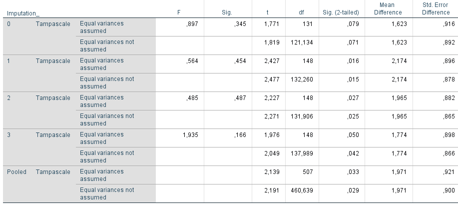

---
output:
  pdf_document: default
  html_document: default
---
# Background information to Statistical Methods

# Rubin's Rules

Rubin´s Rules (RR) are designed to pool parameter estimates, such as means differences and regression coefficients, standard errors and to derive confidence intervals and p-values. Rubin's rules are not available for all statistical procedures in SPSS. Many test procedures that do not provide pooling results in SPSS are available in R. 

We illustrate the use of RR with a t-test example in 3 generated multiple imputed datasets in SPSS. The t-test is used to estimate the difference in mean Tampascale values between patients with and without Radiation in the leg. The output of the t-test in the multiple imputed data is presented in Figure \@ref(fig:tab9-1).

```{r tab9-1, echo = FALSE, fig.cap="T-test for difference in mean Tampascale values between patients with and without Radiation in the leg applied in multiple imputed datasets.", out.width='90%', fig.align='center'}
knitr::include_graphics("images/table5.1.png")
```

```{r tab9-2, echo = FALSE, fig.cap="b.T-test for difference in mean Tampascale values between patients with and without Radiation in the leg applied in multiple imputed datasets.", out.width='90%', fig.align='center'}
knitr::include_graphics("images/table5.1b.png")
```

The result in the original dataset (including missing values) is presented in the row that is indicated by Imputation_ number 0. Results in each imputed dataset are shown in the rows starting with number 1 to 3. In the last row which is indicated as “Pooled”, the summary estimates of the mean differences and standard errors are presented. We now explain how these pooled mean differences and standard errors are estimated using RR.

## Pooling Effect estimates

When RR are used, it is assumed that the repeated parameter estimates (e.g. mean differences) are normally distributed. This cannot be assumed for all statistical test statistics, e.g. correlation coefficients. For these test statistics, transformations are performed before RR can be applied to assume normality (will be discussed below). 

To calculate the pooled mean differences of (Figure \@ref(fig:tab5-1a)) the following formula is used \@ref(eq:p-param):

\begin{equation}
  \bar{\theta} = \frac{1}{m}\left (\sum_{i=1}^m{\theta_i}\right )
  (\#eq:p-param)
\end{equation} 

In this formula, $\bar{\theta}$ is the pooled parameter estimate, m is the number of imputed datasets, $\theta_i$ means taking the sum of the parameter estimate (i.e. mean difference) in each imputed dataset i. This formula is equal to the basic formula of taking the mean value of a sequence of numbers. 

When we use the values of (Figure \@ref(fig:tab5-1a)), we get the following result:

$$\bar{\theta} = \frac{1}{3}(2.174 + 1.965+1.774)=1.971$$

This value of 1.971 is the pooled value for the Tampascale variable in (Figure \@ref(fig:tab5-1a)). 

## Pooling Standard errors

The pooled standard error is derived from different components that reflect the within and between sampling variance of the mean difference. The calculation of these components is discussed below.

*Within imputation variance*
The within imputation variance is the average of the variance of the estimates in each imputed dataset. This reflects the sampling variance, i.e. the precision of the parameter of interest in each completed dataset. This value will be large in small samples and small in large samples. The within imputation variance is computed by taking the mean of the within variance estimate, i.e. squared standard error, in each imputed dataset:

\begin{equation}
V_W = \frac{1}{m}\left (\sum_{i=1}^m{SE_i^2}\right )
  (\#eq:var-w)
\end{equation}

In this formula $V_W$ is the within imputation variance, m is the number of imputed datasets, $SE_i^2$ means taking the sum of the squared Standard Error (SE), estimated in each imputed dataset i. Using the data of (Figure \@ref(fig:tab5-1a)), we get the following result:

$$V_W = \frac{1}{3}(0.896^2 + 0.882^2 + 0.898^2)=0.7957147$$

*Between imputation variance*
The between imputation variance reflects the extra variance due to the missing data. This is estimated by taking the variance of the parameter of interest estimated over imputed datasets. This value is large when the level of missing data is high and smaller when the level of missing data is small.

\begin{equation}
V_B\sqrt{\frac{\sum_{i=1}^m (\theta_i - \overline{\theta})^2}{N-1} }
  (\#eq:var-b)
\end{equation}

In this formula, $V_B$ is the between imputation variance, m is the number of imputed datasets, $\overline{\theta}$ is the pooled estimate, $\theta_i$ is the parameter estimate in each imputed dataset i. 
This formula is equal to the formula for the (sample) variance which is commonly used in statistics. Using the data of (Figure\@ref(fig:tab5-1a)), we get the following result:

$$V_W = \frac{1}{3-1}((2.174-1.971)^2+ (1.965-1.971)^2+(1.774-1.971)^2)=0.7957147$$

$$V_B = \frac{V_B}{m}$$

\begin{equation}
V_{Total} = V_W + V_B + \frac{V_B}{m}
  (\#eq:var-t)
\end{equation}

$$V_{Total} = 0.7957147+0.040027 + \frac{0.040027}{3}$$

$$SE_{Pooled} = \sqrt{V_{Total}} = \sqrt{0.849084} = 0.9214575$$

This value is equal to the (rounded) pooled standard error value of 0.921 in (Figure \@ref(fig:tab5-1a)).

## Significance testing

For significance testing of the pooled parameter, i.e. the mean difference in (Figure \@ref(fig:tab5-1a)), Formula 5.6 is used. This is the univariate Wald test (Rubin 1987, van Buuren 2013, Marshall, 2009). This test  is defined as:

\begin{equation}
Wald_{Pooled} =\frac{(\overline{\theta} - {\theta_0})^2}{V_T}
  (\#eq:wald-pooled)
\end{equation}

where $\overline{\theta}$ and $V_T$ is the total variance and is equal to the $SE_P$ or the pooled standard error that was derived in the previous paragraph), and $\theta_0$  is the parameter value under the null hypothesis (which is mostly 0). The univariate Wald test can be used to test all kind of univariate parameters of interest, mean differences and univariate regression coefficients in linear and logistic regression models. The univariate Wald test in our example is calculated using the values from (Figure \@ref(fig:tab5-1a)):

$$Wald_{Pooled} =\frac{(\overline{\theta} - {\theta_0})^2}{V_T}=\frac{1.971}{\sqrt{0.849084}}=2.139$$

The univariate pooled Wald value follows a t-distribution. This distribution is used to derive the p-value. The value for t depends on the degrees of freedom, according to:

\begin{equation}
t_{df,1-\alpha/2}
  (\#eq:t-distr)
\end{equation}

Where df is degrees of freedom and $\alpha$ is the reference level of significance, which is usually set at 5%. The derivation of the degrees of freedom for the t-test is complex. There exist different formula´s to calculate the degrees of freedom and these are explained in the next paragraph.

Because $t^2$ is equal to F at the same number of degrees of freedom, we can also test for significance using a F-distribution, according to:

\begin{equation}
F_{1, df}=t^2_{df,1-\alpha/2}
  (\#eq:f-distr)
\end{equation}

The degrees of freedom are equal to the degrees of freedom for the t-test above. 

## Degrees of Freedom and P-values 

The derivation of the degrees of freedom (df) and the resulting p-value for the pooled T-test is not straightforward, because there are different formulas to calculate the df. There exists an older version of the formula to calculate the degrees of freedom (df) and an adjusted version (Van Buuren 2012). The older method to calculate the dfs results in a higher df than those in each imputed dataset. An example of this is shown in (Figure \@ref(fig:tab9-3)). It can be seen that the degrees of freedoms is 148 in each imputed dataset (in the row for equal variances assumed) and 507 for the pooled result.
	This is important to relize because different values for the degrees of freedom leads to different p-values. In SPSS the old way to calculate the dfs is used. Adjusted versions are used in the mice package for R. The differences between the older and adjusted method to calculate the dfs is illustrated now. 

```{r tab9-3, echo = FALSE, fig.cap="Part of Output of Figure 5.1. The value for the dfs are presented in the df column.", out.width='90%', fig.align='center'}

```

The (older method) to calculate df for the t-distribution is described in Rubin (1987) and Van Buuren (2012) and is defined as:

\begin{equation}
df_{Old} = \frac{m-1}{lambda^2} = (m-1) * (1 + \frac{1}{r^2})
  (\#eq:df-old)
\end{equation}

Where m is the number of imputed datasets and lambda can be interpreted as the Fraction of Missing information (FMI), calculated by Formula 5.13 (Raghunathan, 2016), and r is the relative increase in variance due to nonresponse, calculated by Formula 5.14. The calculation of lambda and r values are discussed in more detail later. 
The lambda value that is used in Formula 5.9 (and often used as alternative for the FMI) is not the same FMI value of 0.067 that SPSS presents in (Figure \@ref(fig:tab9-1)). The FMI value of 0.067 is calculated by Formula 5.16 and is called FMI in this manual. 

When $df_{old}$ is calculated with the information in (Figure \@ref(fig:tab5-1a)), we get:

$$df_{Old} = \frac{3-1}{0.06283485^2} = 506.5576$$

This (rounded) value is equal to the df value in the row Pooled of 507 in (Figure \@ref(fig:tab9-1)). Formula 5.9 leads to a larger df for the pooled result, compared to the dfs in each imputed dataset, which is inappropriate. Therefore, Barnard and Rubin (1999) adjusted this df by using Formula 5.10:

\begin{equation}
df_{Adjusted} = \frac{df_{Old}*{df_{Observed}}}{df_{Old}+{df_{Observed}}}
  (\#eq:df-adj)
\end{equation}

Where $df_{Old}$ is defined as in Formula 5.9 and $df_{Observed}$ is defined as:

\begin{equation}
df_{Observed} = \frac{(n-k)+1}{(n-k)+3}*(n-k)(1-lambda)
  (\#eq:df-obs)
\end{equation}

Where n is the sample size in the imputed dataset, k the number of parameters to fit and lambda is obtained by Formula 5.13.

By filling in the formulas 5.11 and 5.10 we get for $df_{observed}$ and $df_{adjusted}$ respectively:

$$df_{Observed} = \frac{(150-2)+1}{(150-2)+3}*(150-2)(1- 0.06283485)=136.8633$$

$$df_{Adjusted} = \frac{(506.5576* 136.8633)}{(506.5576+ 136.8633)}=107.7509$$

This number of 107.7509 is equal to the df used by mice.

We can now derive the p-value for the mean difference in the Tampascale between patients with and without Radiation in the leg. This two-sided p-value is:

In SPSS:

$$t_{df,1-\alpha/2}=2.139_{df{Old}}=0.03289185$$

In R:

$$t_{df,1-\alpha/2}=2.139_{df{Adjusted}}=0.03467225$$

## Confidence Intervals

For the 95% confidence interval (CI), the general formula can be used:

\begin{equation}
\bar{\theta} ± t_{df,1-\alpha/2} * SE_{Pooled}
  (\#eq:conf)
\end{equation}

In this formula, $\bar{\theta}$ is the pooled estimate, t is the t-statistic, df is degrees of freedom and $SE_{Pooled}$ is the pooled standard error (Formula 5.5). 

# Measures of Missing data information 

These measures are the Fraction of Missing information (FMI), the relative increase in variance due to nonresponse and the Relative Efficiency. They are derived from values of the between, and within imputation variance and the total variance. There exist two versions of the FMI, which are referred to as lambda and FMI. 

### Fraction of Missing Information 

The Fraction of Missing information, lambda, (van Buuren, 2012; Raghunathan, 2016) can be derived from the between and total missing data variance as: 

\begin{equation}
Lambda = \frac{V_B + \frac{V_B}{m}}{V_T}
  (\#eq:lambda)
\end{equation}

Where m is the number of imputed datasets and ${V_B}$ and ${V_T}$ are the between and total variance respectively. This value can be interpreted as the proportion of variation in the parameter of interest due to the missing data.

When we use the ${V_B}$ and ${V_T}$ values that were calculated in paragraph 5.1.2, this value will be:

$$Lambda = \frac{0.040027 + \frac{0.040027}{3}}{0.849084}=0.06283485$$

This specific value for the FMI, lambda, is not reported by SPSS, but is reported by the mice package in R. Confusingly, van Buuren (2012) and Enders (2010) use the same formula to calculate this type of missing data information, but van Buuren calls it lambda and Enders FMI.

### Relative increase in variance

Another related measure is the relative increase in variance (RIV) due to nonresponse. This value is calculated as:

\begin{equation}
Lambda = \frac{V_B + \frac{V_B}{m}}{V_W}
  (\#eq:riv)
\end{equation}

Where ${V_B}$ and ${V_W}$ are the between and within variance respectively. This value can be interpreted as the proportional increase in the sampling variance of the parameter of interest that is due to the missing data.

Filling in this formula with the example from paragraph 5.1.2 will result in:

$$Lambda = \frac{V_B + \frac{V_B}{m}}{V_W}=\frac{0.040027 + \frac{0.040027}{3}}{0.7957147}=0.06704779$$

This value is also presented in (Figure \@ref(fig:tab5-1a)) in the column Relative Increase Variance.

### Fraction of Missing Information - FMI

\begin{equation}
FMI = \frac{RIV + \frac{2}{df+3}}{1+RIV}
  (\#eq:riv)
\end{equation}

Where RIV is the relative increase in variance due to missing data and df is the degrees of freedom for the pooled result. The degrees of freedom for the pooled result can be obtained in two ways: df_Old or df_Adjusted. 

In SPSS, FMI is calculated using df_Old, which results in:

$$FMI = \frac{RIV + \frac{2}{df+3}}{1+RIV}=\frac{0.06704779 + \frac{2}{506.5576+3}}{1+0.06704779}=0.0665132$$

In R package mice, FMI is calculated using the formula for df_Adjusted, that results in:

$$FMI = \frac{RIV + \frac{2}{df_{Adjusted}+3}}{1+RIV}=\frac{0.06704779 + \frac{2}{107.7509+3}}{1+0.06704779}=0.0797587$$

The difference between lambda and FMI is that FMI is adjusted for the fact that the number of imputed datasets that are generated is not unlimitedly large. These measures differ for a small value of the df.

### Relative Efficiency

The Relative Efficiency (RE) is defined as:

\begin{equation}
RE = \frac{1}{1+\frac{FMI}{m}}
  (\#eq:re)
\end{equation}

FMI is the fraction of missing information and m is the number of imputed datasets.

The RE value is only provided by SPSS and is calculated by filling in the values of (Figure \@ref(fig:tab5-1a)) as follows:

$$RE = \frac{1}{1+\frac{FMI}{m}}=\frac{1}{1+\frac{0.0665132}{3}}=0.9783098$$

The RE gives information about the precision of the parameter estimate as the standard error of a regression coefficient.

# Pooling correlation coefficients

To pool correlation coefficients after multiple imputation Fishers Z transformation is used. The following formulas are used for this (Raghunathan 2016, van Buuren 2012 and Enders 2010):

\begin{equation}
Z_i = \frac{1}{2}ln\frac{1+r_i}{1-r_i}
  (\#eq:cor)
\end{equation}

The ${Z_i}$ means the calculation of Fisher's Z-value in each imputed dataset.

Also, the variance of the correlation can be calculated using:

\begin{equation}
Var_Z=\frac{1}{n-3}
  (\#eq:var-cor)
\end{equation}

n is the sample size in the imputed dataset. Now we can use Rubin's Rules to calculate the Pooled correlation and variance. These values will be calculated with the transformed Z values.

To obtain the pooled p-value for the correlation coefficient we use the formula:

\begin{equation}
Z=\frac{Z_{Pooled}}{\sqrt{Var_Z}} = \frac{Z_{Pooled}}{\frac{1}{\sqrt{n-3}}}=Z_{Pooled}\times\sqrt{n_i-3}
  (\#eq:z-cor)
\end{equation}

In this formula z is the z-score and follows a standard normal distribution, $Z_{Pooled}$ is the pooled Z transformation and $Var_Z$ is the pooled variance.

Finally, back transformation to the original scale of r is done by:

\begin{equation}
r_{Pooled} = \frac{e^{2\times\\Z_{Pooled}}-1}{e^{2\times\\Z_{Pooled}}+1}
  (\#eq:exp-cor)
\end{equation}

## Pooled Wald test

The significance level for the pooled OR is derived by using the pooled Wald test. The pooled Wald test is calculated as:

$$Wald_{Pooled} =\frac{-0.067}{0.046}=$$

This Wald pooled value follows a t-distribution with degrees of freedom (df) according to Formula 5.9.

$$df_{Old} = \frac{m-1}{lamda^2}$$

For this Formula we need information of lambda, which is calculated as:

$$lambda = \frac{V_B + \frac{V_B}{m}}{lamda^2}$$

Using the values of the regression coefficients and standard errors, estimated in each imputed dataset of (Figure \@ref(fig:tab5-9)) we can calculate the following values for the between imputation and the total variance.

$$V_B= \frac{(-0.090+0.067)^2 + (-0.061+0.067)^2 +(-0.051+0.067)^2}{2}=\frac{0.000821}{2}=0.0004105$$

To calculate the total variance also the within imputation variance is needed. The within imputation variance can be calculated using Formula 5.2:

$$V_W= \frac{0.039^2 + 0.040^2 + 0.039^2}{3}=0.001547333$$

The total variance becomes:

$$V_{Total} = 0.001547333+0.0004105+ \frac{0.0004105}{3}=0.002094666$$

Now we can calculate lambda using:

$$lambda = \frac{0.0004105 + \frac{0.0004105}{m}}{0.002094666}=0.2612986$$

The lambda value is not presented by SPSS, but only in R using mice. Now we know the value for lambda, we can calculate the degrees of freedom to derive the p-value:

$$df_{Old} = \frac{m-1}{lamda^2}=\frac{2}{0.2612986^2}=29.29246$$

Which results in a p-value of: 0.1502045.

