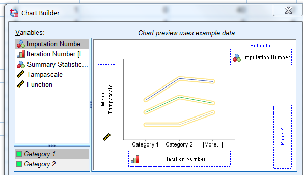
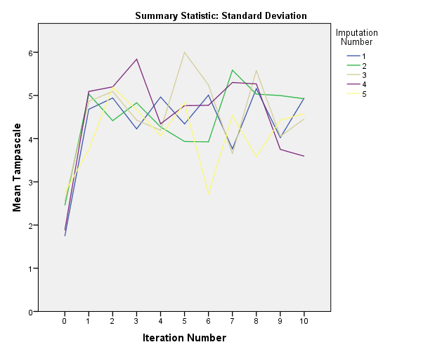
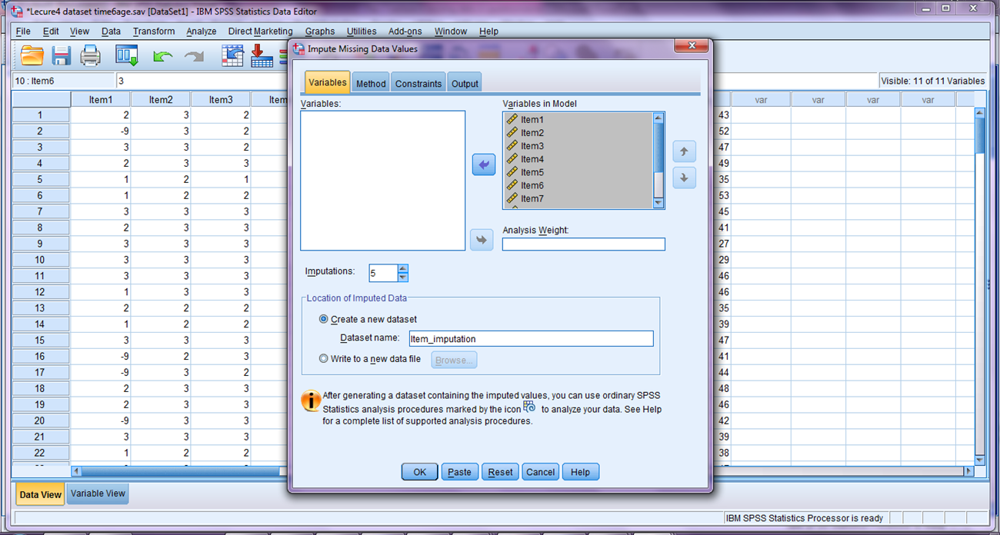
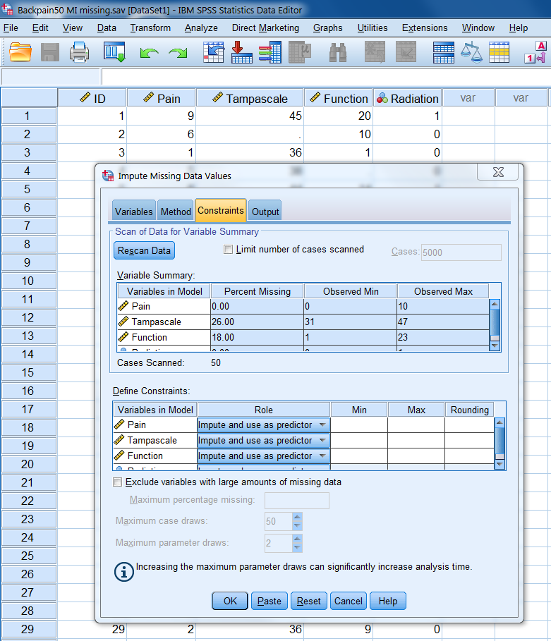
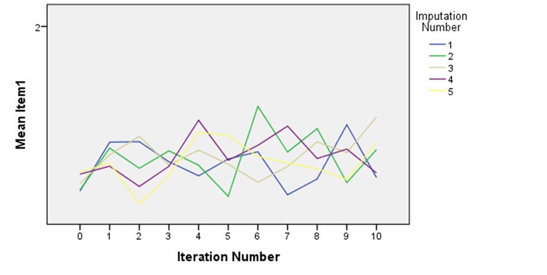
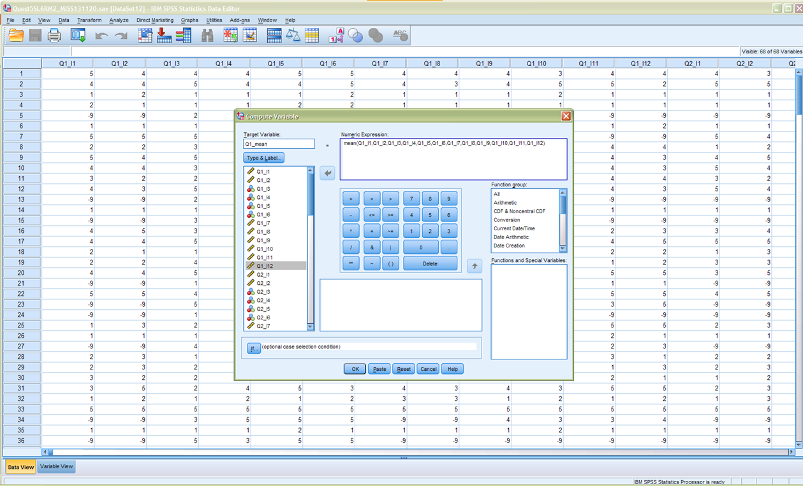
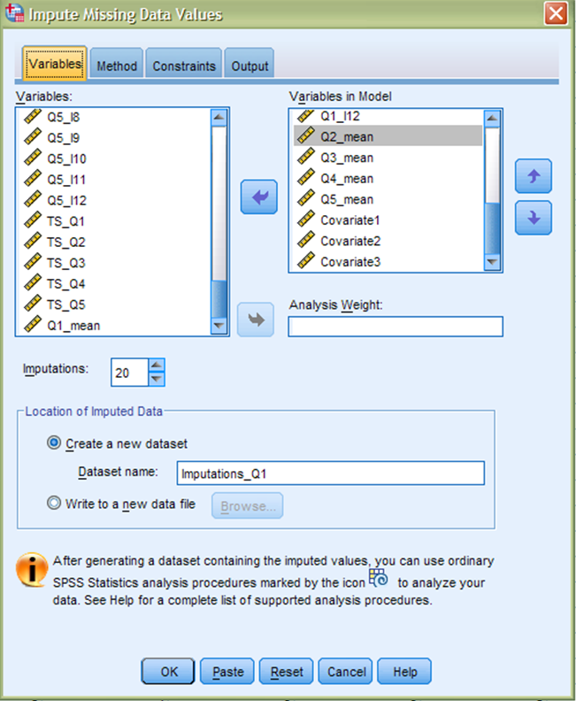
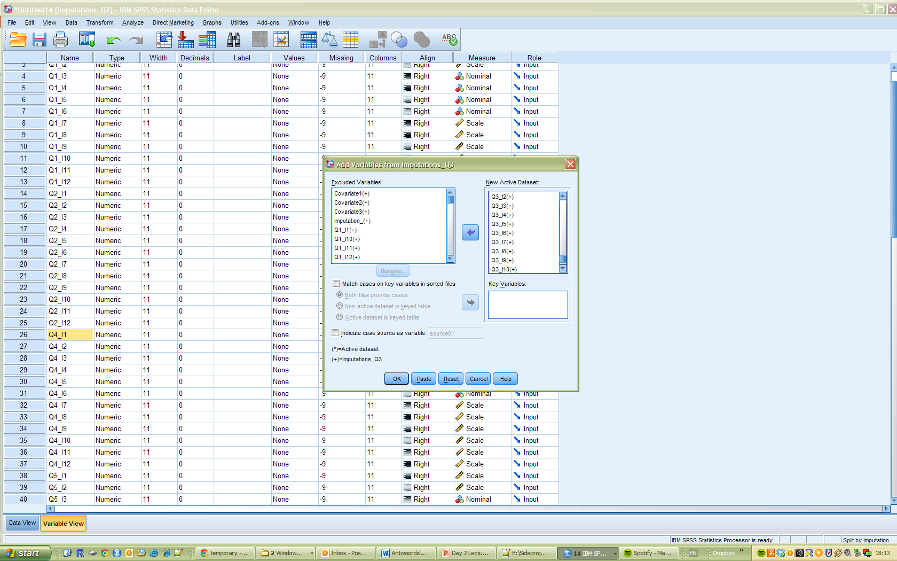

--- 
date: "`r Sys.Date()`"
site: bookdown::bookdown_site
documentclass: book
bibliography: [appliedmiss.bib]
biblio-style: apalike
link-citations: yes
output:
  pdf_document: default
  html_document: default

---

# {-}

```{r fig.align='center', echo=FALSE, include=identical(knitr:::pandoc_to(), 'html') }
knitr::include_graphics("images/cover2.png", dpi = NA)
```

Copyright ©2019 by Heymans and Eekhout

All rights reserved. No part of this book may be reproduced or utilized in any form or by any means, electronic or mechanical, including photocopying, recording, or by any information storage and retrieval system, without permission in writing from the authors.

# Foreword {-}

In the past decades, the attention for missing data has grown and so has the need for researchers to apply suitable methods to deal with missing data. Leading methodologists and statisticians have published papers in leading journals about the problems of missing data and recommended researchers to take missing data seriously. Examples can be found in the British Medical Journal (BMJ, @sterne2009multiple), New England Journal of Medicine, (NEJM, @little2012prevention) and the Journal of the American Medical Association (JAMA, @Li2015). From our experience, applied researchers still find it difficult to reserve extra time to evaluate the missing data in their study and to find a suitable solution to handle their missing data for their primary data analysis.
This book is developed for those researchers who are looking for a solution for a missing data problem or who want to learn more about dealing with missing data. The book is initially developed for a missing data course for epidemiologist, but we feel that applied researchers from other disciplines may also find this book useful. Further, we are active in giving statistical advice in general and more specific about missing data. Because our time for consultations is mostly limited, this practical guide may be useful to help researchers get started with their missing data problem. 
With this book we provide an overview of the currently available methods to deal with missing data. The use of the methods are thoroughly explained and supported by practical examples. We hope you will enjoy this book and that you find it useful, at that as a result you will use  recommended methods to solve your missing data problem.

## SPSS and R Software {-}

In this book the software packages SPSS and R play a central role. SPSS is one of the most popular software package for applied researchers, worldwide, to use for statistical analyses. Currently, R is growing in popularity fast and will probably become the most popular software packages for statistical analysis, also for applied researchers.

Both SPSS and R have their own specific characteristics. One of the main differences between SPSS and R is that SPSS works with a click-menu that makes windows appear. In these windows you can drag variables into boxes. Subsequently, by clicking the OK button the statistical analysis procedure you specified will run and the output results are automatically presented in a new window. A limitation of working with SPSS is that you are overloaded with statistical output that may not all be needed to answer your research question. Also, newly developed methods are not immediately available, but have to be included in a new version update by the developers. 

R is a software package that needs code to access statistical procedures and you need to be familiar with some R-language in order to use it. However, once you know the language, R can be used for any statistical procedure you can think of. Moreover, R is free and an open source program that anybody can download and use. It enables users to get insight into the statistical calculations that are programmed. Anyone can contribute by developing packages and functions for statistical procedures. Consequently, state-of-the-art statistical methods are very quickly available in R, and if they are not, you can develop them yourself.

In this book the handling of missing data is the main topic. We will show how to apply methods in both software packages SPSS and R. Of note is that multiple imputation methods run with random starting procedures. Both SPSS and R have their own internal random number generators. Therefore, results might slightly differ between the software packages, even when exactly the same procedures are applied. Our intention is not to compare the software packages, both packages are reliable, but we aim to provide readers with an overview of all possible missing data methods.

In this book we use SPSS version 24 and R software version 3.5.1. The R examples will be presented by using the output from RStudio version (Version 1.1.463 – © 2009-2018 RStudio, Inc). RStudio is an integrated development environment (IDE) for R. RStudio includes a wide range of productivity enhancing features and runs on all major platforms. 

## Notation in this book {-}

Annotation in this book 

The name of R packages and libraries are used as published under their original names. The name of R functions is in R code form, like the `mice` function.

Book examples in R code language can be found in grey text boxes, for example:
to read in the dataset Backpain 50 missing.sav.

```{r echo=T}
# Activate the foreign package and read in the SPSS dataset

library(foreign)
dataset <- read.spss(file="data/Backpain 50 missing.sav", to.data.frame=T)

```

## Acknowledgement {-}

We first want to thank our students and colleagues in the Amsterdam UMC hospital for their interesting questions about missing data during lectures and statistical consultations.

The book is written with the R Bookdown package (@R-bookdown) and R Markdown (@R-rmarkdown). We thank the developers for making these awsome packages freely available.


<!--chapter:end:index.Rmd-->

---
output:
  pdf_document: default
  html_document: default
---

# (PART) Part I: Working with Software {-}

# Working with SPSS and R

This book is about working with missing data methods in SPSS and R. This chapter shows some basic data management methods in SPSS and R that makes working with both software programs easier.   

## Data management in SPSS

When you open SPSS you are in the SPSS Data Editor window. Now you have the possibility to go to the Data View and Variable View windows. In the Data View window, you can enter data yourself or read in data by using the options in the file menu. In (Figure \@ref(fig:fig2)) you see an example of a dataset in the Data View window. Each row in the Data View window represents a case and in the columns you find the variable names. In the Data View window, you can start all kind of data manipulations by using the different menu’s above in the window. 

```{r fig2, echo = FALSE, fig.cap="Data View window in SPSS", out.width='95%', fig.align='center'}
knitr::include_graphics("images/fig1.2.png")
```

In the lower left corner of the window you can click on the tab Variable View and the Variable view window will appear (Figure \@ref(fig:fig3)).

```{r fig3, echo = FALSE, fig.cap="Variable View window in SPSS", out.width='95%', fig.align='center'}
knitr::include_graphics("images/fig1.3.png")
```

In the Variable View window, you can add new variables, by entering the name in the name column. Further, you can change variable options as: Type: e.g. numeric or string variable; Width: number of digits; Decimals: the number of decimal places displayed; Label: add some extra information about the type of information in the variable; Values: To assign numbers to the categories of a variable; Missing: you can define specified data values as user-missing or system missing; Columns: To change the number of characters displayed in the Data View window; Align: to specify the alignment of the data; Measure: to specify the level of each variable, scale (continuous), ordinal or nominal; Role: Here you can define the role of the variable during your analysis. Examples are, Input for independent variable, Target for dependent or outcome variable, Both, independent and dependent variable. There are more possibilities, but most of the times you use the default Input setting.

## Analyzing data in SPSS

All statistical procedures in SPSS can be found under the Analyze button (Figure \@ref(fig:fig4)). Here you also find the option “Multiple Imputation” which plays an important role in this manual. 

```{r fig4, echo = FALSE, fig.cap="Statistical procedures that can be found under the Analyze menu in SPSS", out.width='95%', fig.align='center'}
knitr::include_graphics("images/fig1.4.png")
```

## The Output window in SPSS

If you have run your analyses in SPSS, an SPSS Output (or viewer) Window will pop-up. The main body of the Output Window consists of two panes (left and right panes). In the left pane you find an outline of the output. In the right pane you find the actual output of your statistical procedure (Figure \@ref(fig:fig5)).

```{r fig5, echo = FALSE, fig.cap="Part of the Output or Viewer window in SPSS after making use of Descriptive Statistics under the Analyze menu", out.width='95%', fig.align='center'}
knitr::include_graphics("images/fig1.5.png")
```

## The Syntax Editor in SPSS

In the syntax editor of SPSS, you use the SPSS syntax programming language. You can run all SPSS procedures by typing in commands in this syntax editor window, instead of using the graphical user interface, i.e. by using your mouse and clicking on the menu´s. You can get access to the syntax window in two ways. The first is just by opening a new syntax file by navigating to 

> File -> New -> Syntax. 

This will open a new syntax window (Figure \@ref(fig:fig6)). 

```{r fig6, echo = FALSE, fig.cap="Screenshot of new syntax file", out.width='95%', fig.align='center'}
knitr::include_graphics("images/fig1.6.png")
```

You can also generate syntax by accessing statistical procedures through the dropdown menus and clicking the `Paste` button instead of clicking the OK button after you have specified the options. Than a new Syntax Editor window will pop up or the new syntax will automatically be added to the open Syntax Editor window. In this manual we will not use SPSS syntax code to access statistical procedures. SPSS is most frequently used via the graphical user interface, and we will use that method also in this manual.

## Reading and saving data in SPSS

You can Read data in via the SPSS menu File: 

> File -> Open -> Data. 

All kind of file types can be selected. Of course the SPSS .sav files, but also .por, .xlsx, .cvs, SAS, Stata, etc. After you have selected a specific file type other than SPSS you may have to go through several steps before you see the data in the Data View window. Saving files in SPSS is possible via the Save Data As option under the menu File. You can choose the same kind of file types.

### Reading in R data into SPSS

When you have used the write.table function (see paragraph 1.11) to save R data you can easily read them in into SPSS by following the next steps:

> File -> Open data -> “All files (*.*)”

than you will see the file you want to import in SPSS, here the “Backpain50 R file”.

```{r fig18, echo = FALSE, fig.cap="Choosing the dataset to import in SPSS", out.width='95%', fig.align='center'}
knitr::include_graphics("images/fig1.18.png")
```

Then click Open (wait a couple of seconds) and click on next. You will see the following window that is part of the Text Import Wizard procedure in SPSS (Figure \@ref(fig:fig19)):

```{r fig19, echo = FALSE, fig.cap="Step 1 of the Text Import Wizard", out.width='95%', fig.align='center'}
knitr::include_graphics("images/fig1.19.png")
```

Then click the “Next >” button 5 times, passing by the following windows:

Step 2 of 6 (Figure \@ref(fig:fig20)):
To change how variables are arranged: here delimited
To include variable names included at the top of the file: here Yes.
To set the decimal symbol: here a comma.

```{r fig20, echo = FALSE, fig.cap="Step 2 of the Text Import Wizard", out.width='95%', fig.align='center'}
knitr::include_graphics("images/fig1.20.png")
```

Step 3 of 6 (Figure \@ref(fig:fig21)):

On which line number begins the first case: here 2
How cases are represented: Each line is a case.
How many cases you want to import: here all cases. 

```{r fig21, echo = FALSE, fig.cap="Step 3 of the Text Import Wizard", out.width='95%', fig.align='center'}
knitr::include_graphics("images/fig1.21.png")
```

Step 4 of 6 (Figure \@ref(fig:fig22)):
The delimiters that appear between variables; here the Semicolon.
The text qualifier: here Double quote.
Remove trailing spaces from string values: skip.

```{r fig22, echo = FALSE, fig.cap="Step 4 of the Text Import Wizard", out.width='95%', fig.align='center'}
knitr::include_graphics("images/fig1.22.png")
```

Step 5 of 6 (Figure \@ref(fig:fig23)):
Here you overwrite the Data format of the variable (you can also change that in the Variable View window, when the data has been read in).

```{r fig23, echo = FALSE, fig.cap="Step 5 of the Text Import Wizard", out.width='95%', fig.align='center'}
knitr::include_graphics("images/fig1.23.png")
```

Step 6 of 6:
To save your specifications of the previous steps into a separate file (Figure \@ref(fig:fig24)).

```{r fig24, echo = FALSE, fig.cap="Step 6 of the Text Import Wizard", out.width='95%', fig.align='center'}
knitr::include_graphics("images/fig1.24.png")
```

Then click finish and the data is imported in a new SPSS file. In that file you can of course change all kind of variable and data settings in the Variable View Window.

You can also skip step 2 to 5 by clicking the Finish button twice when you are at step 1. Than you use all default settings, which is most of the times an efficient option.

## R and RStudio

RStudio is an integrated environment to work with the software program R. Consequently, to work with RStudio, R has to be installed. RStudio uses the R language and is also freely available. In this manual we will show possibilities and options in RStudio that are needed to run the R code that are discussed in this manual. For more information about RStudio and its possibilities visit the RStudio website at www.rstudio.com. 

When you open RStudio the following screen will appear.

```{r fig10, echo = FALSE, fig.cap="First screen that appears after you have started RStudio", out.width='95%', fig.align='center'}
knitr::include_graphics("images/fig1.10.png")
```

There are three windows opened:

1. On the left is the Console window

This is the main window to run R code (see below for more information about the Console window).

2. Right above is the window where you can choose between the Environment and History tabs (e.g. history tracks the code you typed in the Console window).

3. At the right site below is the window where you can choose between Files, Plots, Packages, Help and Viewer tabs.

### The role of the Console Window

When you enter code in the Console window you will directly receive a result. For example, when you type 3 + 3 the result will appear directly.

```{r} 
3 + 3
```

Other multiplication procedures as divide, square, etc. can also be executed. The main use for R is its functions. For example, to generate 20 random numbers you use the following function code (we will discuss more about functions in R later):

```{r} 
rnorm(20)
```

The number [1] between brackets is the index of the first number or item in the vector.   

### R assignments and objects

In R it is possible to create objects and to assign values to these objects. In this way it is possible to store some intermediate results and recall or use them later on. Assigning values to objects is done by using the assignment operator <- . You can also use the = sign as an assignment operator. This is not recommended because this is also a symbol used for mathematical operations. For example, when we want to assign the value 3 to the object x, we use:

```{r} 
x <- 3 
```

When we subsequently type in the letter x we get the following result:

```{r} 
x 
```

Now the value 3 is assigned to the object x. In R all kind of information can be assigned to an object, i.e. one number, a vector of numbers, results from analysis or other R objects such as data frames, matrices or lists. Objects can have all kinds of different names, composed of different letters and numbers. Note that some letters and words are used by R itself. It is not recommended to use these leters as names for objects in R that you create yourself. For example, the letter T and F are used as TRUE and FALSE by R. Other letters that are already in use are c, q, t, C, D, I and diff, df, and pt.

### Vectors, matrices, lists and data frames

**Vectors**

A vector can be created by the following code:

```{r} 
y <- c(1, 2, 3, 4, 5)
y
```

The numbers 1, 2, 3, 4 and 5 are assigned to the data vector y. The “c” in the above code stand for concatenate which makes that all separate (one-vector) numbers are merged into one vector. It is also possible to create character vectors, which are vectors that contain strings (text). An example:

```{r} 
y <- c("a", "b", "test")
y
```

Vectors can also be made by using the “:” symbol. With that symbol it is easy to generate a sequence of numbers. An example:

```{r} 
y <- 1:10
y

```

**Matrix**

You can create a matrix by using the matrix function.

```{r} 
matrix(c(1, 2, 3, 4, 5, 6), nrow=2, ncol=3)
```

Now we have created a matrix with 2 rows and 3 columns. In essence we converted the vector c(1, 2, 3, 4, 5, 6) into a matrix. 

**List**

Another object is called a list. A list can contain components of different formats. Let’s look at an example using the following code:

```{r} 
x <- 1:5
x
y <- c("a", "b", "test")
z <- list(x=x, y=y)
z
```

With this code you created the list object z consisting of the two components x and y which are the vectors that were created above. You see that in a list two components of different data type can be combined, a numeric and a character factor. The names of the list components are indicated by the dollar sign, `$`. The list component can be obtained separately by typing `z$x` for component x or `x$y` for component y.

**Dataframe**

Mostly we work with datasets that contain information of different variables and persons. In R such a dataset is called a dataframe. Typically, a dataframe is created by reading in an existing dataset. How to create a dataframe by reading in a dataset will be further discussed in the paragraph “Reading in and saving data”.

### Indexing Vectors, Matrices, Lists and Data frames

**Vectors**

An important operation in R is to select a subset of elements of a given vector. This is called indexing vectors. This subset can be assigned to another vector. For example:

```{r} 
y <- c(3, 5, 2, 8, 5, 4, 8, 1, 3, 6)
y[c(1, 4)]
```

The R code y[c(1, 4)], extracts the first and fourth element of the vector. Another example is by using the “:” symbol, to extract several subsequent elements:

```{r} 
y[2:5]
```

The R code y[2:5], extracts the second to the fifth element of the vector.

A minus sign excludes the specific element from the vector, like:

```{r} 
y[-3]
```

The R code y[-3], excludes the third element of the vector (i.e. 2).
A new vector z can be created where the third and fourth element of the y vector are excluded:

```{r} 
z <- y[-c(3, 4)]
z
```

**Matrices**

When we index matrices we can choose to index rows, columns or both. Here are some examples:

First construct the matrix z:

```{r} 
z <- matrix(1:9, nrow=3)
z
```

Extract from the first row the number in the second column
```{r} 
z[1, 2]
```

Extract all numbers in each column in the first row
```{r} 
z[1, ]
```

Extract all numbers in each row of the first column
```{r} 
z[, 1]
```

A minus sign can also be used to delete specific elements or complete rows or columns.

You can omit the first row from the matrix z
```{r} 
z[-1, ]
```

**Lists**

First create a list with 3 components, each component consists of a vector of the same length and with 10 elements each.

```{r} 
k <- list(a=1:10, b=11:20, c=21:30)
k
```

Index the individual component b by using the following code:

```{r} 
k$b
k[["b"]]
k[[2]]
```

To extract individual list components double square brackets are used, compared to single brackets for indexing vectors and matrices. 

When you use single brackets, you get the following results:

```{r} 
k["b"]
```

The difference between using single and double brackets is that single brackets return the component data type, which is in this case a vector (but could be any kind of data type) and single brackets always return a list.

**Data frames**

Indexing data frames follows the same method as indexing matrices, but we can also use the method that is used to index lists, since data frames are essentially lists of vectors of the same length. Data frames consist of rows and columns which can be accessed separately or both to extract specific elements. We use the data frame that was constructed in R code 1.11.

```{r} 
z
```

To index the first column you use:

```{r} 
z[, 1]
k$a
```

The second row can be accessed by using:

```{r} 
z[2, ]
```
 
### Vectorized Calculation

With R it is possible to perform vectorized calculations. This means that you can do calculations elementwise, i.e. the same calculation is done on each element of an object. Let’s look at an example.

First create a vector z with numerical variables. 

```{r} 
z <- c(1, 2, 3, 4, 5, 6, 7, 8)
z
```

Now you can fairly easy square each element of the vector by typing:

```{r} 
z^2
```
 
We see that each element is squared. You can do these vectorized calculations by using all kinds of mathematical functions, e.g. taking the square root, logarithms, adding constant values to each element, etc. 

### R Functions

Functions play an important role in R. A function name is followed by a set of parentheses which contain some arguments. We take as an example the sum function. We can use it as follows:

```{r} 
sum(3,4)
```

The arguments in this function are the numbers 3 and 4 and the result is their sum. This function uses as arguments numbers or complete vectors. 

If you want to see the formal arguments of each function you can use the args function. For example, you can use it for the matrix function:

```{r} 
args(matrix)
```

As a result the arguments of the functions are listed with their default settings. In this case the arguments are:

data: an optional data vector (including a list or expression vector). 

nrow: the desired number of rows.

ncol: the desired number of columns.

byrow: logical. If FALSE (the default) the matrix is filled by columns, otherwise the matrix is filled by rows.

dimnames: A dimnames attribute for the matrix: NULL or a list of length 2 giving the row and column names respectively. An empty list is treated as NULL, and a list of length one as row names. The list can be named, and the list names will be used as names for the dimensions.
You can write functions yourself but in R many functions are available which means that many calculations are done by using function calls. 

## The Help function

There are several possibilities to start the help facilities in R and to get more information about functions and their arguments in R. 

You can just type help or use the question mark as follows:

```{r ,eval=FALSE} 
help(matrix)
?matrix
```

In both ways the help tutorial for the matrix function will be activated and appear in your web browser or in help tab in the right corner below when you use R studio.

## Working with script files

If you want to use R code and functions more than once it is useful to work with scripts files. In this way you can type and save R code and reuse it. To create a script file in R is easy. 

After you have started RStudio you go to 

> File -> New File -> R Scripts

A new window will open on the left side above. In that file you can type for example the self-written function print.sum.test. (Figure \@ref(fig:fig11)). You can save the script file by using the Save option under the File menu, open it again and use it whenever you want.

```{r fig11, echo = FALSE, fig.cap="Script file example in RStudio", out.width='95%', fig.align='center'}
knitr::include_graphics("images/fig1.11.png")
```

## Creating a working directory

It is a good idea to keep your R files at the same place when you are doing data analysis for some kind of project. If you do not use a separate directory, R will use a default directory, that will mostly be in Windows in the documents folder. All files that you have to use or save during your R session are in that directory. To locate your working directory, you can type in the Console window:

```{r, eval=FALSE} 
getwd()
```

You can change the working directory in another way. Go in RStudio to the window on the right site below and go to the Files tab and click on the right site of the screen on the three dots. Than a window will open and you can browse to your preferred folder. Then choose for More in the Files tab and then select “Set As Working Directory” (Figure \@ref(fig:fig12)). Now you have set your preferred working directory. You can check if your directory is set correctly by choosing  “Go To Working Directory”.

```{r fig12, echo = FALSE, fig.cap="Working directory selection in RStudio", out.width='95%', fig.align='center'}
knitr::include_graphics("images/fig1.12.png")
```

## Reading in data in RStudio

There are several procedures in RStudio to read in datasets. 

**Import datasets via “Import Dataset”**

An easy way is via the window at the right site above. There you will find in the Environment tab the button “Import Dataset”. When you click on it you can choose between different kind of file types, i.e. From Text, Excel, SPSS, SAS and Stata. When you apply this procedure for the first time RStudio asks for your permission to download a package called “haven”. This package is built to import and export data from several types. 

Once the `haven` package is installed, you can also read in data directly from the Console window by using:

```{r, echo = T, eval=F} 
library(haven)
dataset <- read_sav(file= "data/Backpain50.sav")
```

**Using the foreign package**

Another way to import an dataset is by making use of the foreign package. You find this package under the Packages Tab in the window at the right site below under the heading “System Library”. Install that package first. The `foreign` package includes the function `read.spss` to read in SPSS files, or read.cvs to read in tabular data. 

You use the following code to import an SPSS dataset:

```{r, echo = T, eval=F} 
library(foreign)
dataset <- read.spss(file= "data/Backpain50.sav", to.data.frame = T)
```

**Read.table**

You can use the read.table function to read in matrices and data frames by using:

```{r, echo = T, eval=F} 
dataset <- read.table(file="data/Backpain50 R file")
```

**Load**

You can Load a dataset or other objects as lists by using:

```{r, echo = T, eval=FALSE} 
load(file="data/listsave.RData")
```

## Saving data in RStudio

Datasets can be saved by using different commands.

**write.table** 

You can use the write.table function to save data frames (datasets):

```{r, echo = T, eval=FALSE} 
library(foreign)
dataset <- read.spss(file= "data/Backpain50.sav", to.data.frame = T)
write.table(dataset, file="data/Backpain50 R file")
```

Before you can read a dataset in SPSS you have to use write.table in the following way:

```{r, echo = T, eval=FALSE} 
write.table(dataset, file="data/Backpain50 R file", sep=";", dec=",", row.names=F)
```

The extra parameter settings, mean:
sep=";", separate each variable by an “;” indicator.
dec=",", use for decimals a “,” instead of an “.”.
row.names=F , Do not add an extra column with row.names.

These files can then be easily imported in SPSS by using the steps that were explained in paragraph 1.5.1. 

**Save**

You can also use the command save to save datasets, according to (notice the .RData extension):

```{r, echo = T, eval=FALSE} 
library(foreign)
dataset <- read.spss(file= "data/Backpain50.sav", to.data.frame = T)
save(dataset, file="data/Backpain50 R file.RData")
```

You can also use save without the .Rdata extension:

```{r, echo = T, eval=FALSE} 
library(foreign)
dataset <- read.spss(file= "data/Backpain50.sav", to.data.frame = T)
save(dataset, file="data/Backpain50 R file")
```

To get direct access to the data that you have saved, you can use the get function in combination with the load function like this:

```{r, echo = T, eval=FALSE} 
library(foreign)
dataset <- read.spss(file= "data/Backpain50.sav", to.data.frame = T)
save(dataset, file="data/Backpain50 R file")
get(load(file="data/Backpain50 R file"))
```

With save, you can save any R object, also lists such as:

```{r, echo = T, eval=FALSE} 
x <- list(a=1, b="example", c=3)
save(x, file="data/listsave.RData")
```

## Installing R Packages

When R is installed on your computer also a folder called library is created. This folder contains packages that are part of the basic installation. A package is a collection of different functions written in the R language. Besides packages that are part of the basic installation of R there are also packages that are not part of the basic installation but are written by others, i.e. the add-on packages. Packages can be downloaded from the CRAN website (https://cran.r-project.org/). Currently, there are thousands of user-written packages available on the CRAN website.

Before you can use a specific package that is not part of the basic installation, you have to install it in your R library. In this manual we will use the mice package to do all kind of imputation procedures, such as multiple imputation. mice is not part of the R basic installation and you have to install it first. There are several procedures in RStudio to install a package. One way is to use the install.packages function in the Console window:

```{r, echo = T, eval=FALSE} 
install.packages("mice")
```

The mice package will be automatically downloaded from the CRAN website.

Another way is to use the window on the right site below and go to the Packages tab. When you click “Install” a new window is opened. Than you can type “mice” on the blank line under “Packages (separate multiple with space or comma):” (Figure \@ref(fig:fig25) and Figure \@ref(fig:fig26)).   

```{r fig25, echo = FALSE, fig.cap="Install packages Window in RStudio to install packages from the CRAN website", out.width='95%', fig.align='center'}
knitr::include_graphics("images/fig1.25a.png")
```

```{r fig26, echo = FALSE, fig.cap="Enlarged Install packages Window in RStudio to install packages from the CRAN website", out.width='95%', fig.align='center'}
knitr::include_graphics("images/fig1.25b.png")
```

After you have clicked on “Install” the package will be downloaded from the CRAN website automatically and will be listed in the Package list named “User Library”.

Another way is to go to the CRAN website and download the package as a zip file in a directory on your computer, for example your working directory or in your library. Again use the window on the right site below and go to the Packages tab. When you choose Install a new window is opened. Now under “Install from:” choose for “Package Archive File (.zip; .tar.gz)”  (Figure \@ref(fig:fig27) and Figure \@ref(fig:fig28)).  Than you can browse to the zip file and install the package.

```{r fig27, echo = FALSE, fig.cap="Install packages Window in RStudio to install packages from zip files", out.width='95%', fig.align='center'}
knitr::include_graphics("images/fig1.26a.png")
```

```{r fig28, echo = FALSE, fig.cap="Enlarged Install packages Window in RStudio to install packages from zip files", out.width='95%', fig.align='center'}
knitr::include_graphics("images/fig1.26b.png")
```

## Loading R Packages

Once an add-on (user written) R package has been installed you have to load it to get access to all functions that are part of that package. To load a library, you can use the function library() or require(). 

```{r, echo=FALSE, eval=FALSE} 
library(mice)
```

You have to load add-on packages each time you start a new R session. 

## Updating R Packages

To keep the add-on packages up to date you can use the update.packages() function.

```{r, echo=T, eval=FALSE} 
update.packages()
```

R will ask you if you want to update each package. If you type “y” in the Console window, R will update the package.

In RStudio updating packages can be done in the Package tab as well. You can click on the Update button. A new window will open that contains a list of all packages that need to be updated. Subsequently you can select the packages you want to update. 

## Useful Missing data Packages and links

The main package that we will use in this manual is mice which stand for Multivariate Imputation by Chained Equations (MICE) (Van Buuren, 2009). Other packages that can be used to impute data or that can be used to do analyses after imputation are listed below.

**miceadds**
Package contains some additional multiple imputation functions (Robitzsch et al., 2017).
[See for more information.](https://cran.r-project.org/web/packages/miceadds/index.html)
 
**micemd** 
Package contains additional functions for the mice package to perform multiple imputation in two-level (Multilevel) data (Audigier & Resche-Rigon, 2017).
[See for more information.](https://cran.r-project.org/web/packages/micemd/index.html)

**mi**
Provides functions for data manipulation, imputing missing values in an approximate Bayesian framework, diagnostics of the models used to generate the imputations, confidence-building mechanisms to validate some of the assumptions of the imputation algorithm, and functions to analyze multiply imputed data sets (Gelman et al., 2015). 
[See for more information.](https://cran.r-project.org/web/packages/mi/index.html)

**MItools**
Small package to perform analyses and combine results from multiple-imputation datasets (Lumley, 2015).
[See for more information.](https://cran.r-project.org/web/packages/mitools/index.html)

**norm**
Package is for the Analysis of multivariate normal datasets with missing values. It contains the mi.inference function. This function combines estimates and standard errors to produce a single inference. Uses the technique described by Rubin (1987), which are called the Rubin’s Rules (RR) (Novo, 2015).
[See for more information.](https://cran.r-project.org/web/packages/norm/index.html)

**vim (visualization and imputation of missing values)**
Package includes tools for the visualization of missing and/or imputed values. In addition, the quality of imputation can be visually explored using various univariate, bivariate, multiple and multivariate plot methods (Templ et al., 2017).
[See for more information.](https://cran.r-project.org/web/packages/mi/index.html)

**BaylorEdPsych**
Package for Baylor University Educational Psychology Quantitative Courses. This package included Little’s MCAR test (Beaujean, 2015).
[See for more information.](https://cran.r-project.org/web/packages/BaylorEdPsych/index.html)

**MKmisc**
Contains several functions for statistical data analysis; e.g. for sample size and power calculations, computation of confidence intervals, and generation of similarity matrices. This package contains the mi.t.test function for pooling t-tests after multiple imputation (Kohl, 2016).
[See for more information.](https://cran.r-project.org/web/packages/MKmisc/index.html)

**mvnmle**
Package estimates the maximum likelihood estimate of the mean vector and variance-covariance matrix for multivariate normal data with missing values. This package is needed for the mlest function this is used for Little’s MCAR test in Cahpter 2.
[See for more information.](https://cran.r-project.org/web/packages/mvnmle/index.html)


<!--chapter:end:01-software.Rmd-->

---
output:
  html_document: default
  pdf_document: default
---

# (PART) Part II: Basic Missing Data Handling {-}

# Missing Data Evaluation

When you explore and evaluate missing data you can compose an analysis plan to handle the missing data for your situation. In this Chapter, you will learn how to that. 

##	Definition of Missing Data

###	Missing Data in SPSS

Missing data in SPSS can be defined in two ways, as a system missing or user missing value. System missing data are missing data that is not present in the dataset and can be recognized by an empty cell (or dot). User missing data are data that are coded as missing values in the dataset by the user. Consider for example a small dataset with 50 Backpain patients consisting of male (coded as 1) and female (coded as 0) patients (Figure \@ref(fig:fig2-1)). 

```{r fig2-1, echo = FALSE, fig.cap="SPSS dataset containing variables with system and user missing data", out.width='90%', fig.align='center'}
knitr::include_graphics("images/fig2.1.png")
```

For the female patients in this dataset the duration of a previous pregnancy was regisered in the Gestational Age (GA) variable. This variable consists of different values: pregenancy durations in weeks, such as 36 and 29, but also the value 8 and empty cells. The value 8 is specified by the user to exclude males from further analysis because males cannot be pregnant. The system missing values are recognizable by the empty cells (or dots) in the dataset, and these indicate the missing GA values for women who did not report the GA for their pregnancy. It makes no difference if we code the missing values as a system or user missing value in SPSS, because both kinds of missing values will be excluded from further analyses.

###	Missing data in R

In R the missing values are denoted by `NA` which means “Not Available”. If we open the same dataset as above in R we get the following result.

```{r echo=TRUE, message=FALSE, warning=FALSE}
library(haven)
dataset <- read_sav("data/CH2 example.sav")
head(dataset,10) # Data of first 10 patients is shown
```

The Variable Gestational Age (GA) contains the values for GA (e.g. 36, 29, etc.), the value 8 for males and the NA’s. In R the value 8 will be treated as a real value, so we have to recode that value to `NA` by using the following code to convert an 8 into an `NA` for the males.

```{r echo=TRUE, message=FALSE, warning=FALSE}
dataset$GA[dataset$GA==8] <- NA
head(dataset,10)
```

Within most functions in R the handling of `NA` values has to be defined, otherwise the function returns an NA as a result. For example, the following code to obtain the mean of Gestational Age results in an `NA`. 

```{r echo=TRUE, message=FALSE, warning=FALSE}
mean(dataset$GA)
```

To obtain the mean of the observed data the statement `na.rm = TRUE` has to be added.

```{r echo=TRUE, message=FALSE, warning=FALSE}
mean(dataset$GA, na.rm = TRUE)
```

The `na.rm = TRUE` statement in the mean-function, indicates that values that are `NA` are removed before the analysis is executed. Another `NA` handling procedure that is regularly used in functions is called `na.action` with as options `na.fail`, `na.omit`, `NULL` (no action) and `na.exclude`. For more information about na.action options you can look at the help-file by typing `?na.action` in the Console window.

##	Missing data Patterns 

To get an idea about the complexity of the missing data problem in your dataset and information about the location of the missing values, the missing data pattern can be evaluated. 

###	Missing data patterns in SPSS

We use the options of the Missing Value Analysis (MVA) procedure in SPSS (@spss75). The example dataset contains information on 9 study variables for 150 back pain patients. The continuous variables are Pain, Tampa scale, Disability, Body weight, Body length and Age. The dichotomous variables are Radiation in the leg, Smoking, and Gender. Only the variables Gender and Age are completely observed.

To access the MVA function in the SPSS menu choose: 

> Analyze -> Missing Value Analysis…  

In this menu, transfer all continuous variables to the Quantitative variables window and the categorical variables to the Categorical variables window. Then select the Patterns option. From the Patterns menu (Figure \@ref(fig:fig2-4) select the options `Tabulated cases, grouped by missing value patterns` and `sort variables by missing value pattern`. To obtain the full list of all patterns that occur in the data, set the “Omit patterns with less than 1% of cases" at 0%, then click continue and OK. 

```{r fig2-4, echo = FALSE, fig.cap="The Patterns menu", out.width='90%', fig.align='center'}
knitr::include_graphics("images/fig2.4.png")
```

By default, univariate statistics are presented that include output information about the number and percentages of missing data and  descriptive statistics for each variable (Figure \@ref(fig:tab2-1)). 

Information about the missing data patterns is provided in the Tabulated patterns table. On the left column of that table, named “Number of Cases”, the number of cases are presented with that specific missing data pattern. In our example, there are 75 cases without any missing value and 13 cases with a missing value in only the Tampa scale variable (see row 1 and 2 in (Figure \@ref(fig:tab2-1)). In the right column of that table named “Complete if…”, the total number of subjects is presented if the variables that contain missing data in that pattern are not used in the analysis. Those variables are marked with the “X” symbol. For example, 88 subjects remain in the analysis when the variable tampa scale is not used in the analysis, these are the 75 subjects that have completely observed data on top of the 13 subjects with missing data in the Tampa scale variable only.

```{r tab2-1, echo = FALSE, fig.cap="Descriptive missing data statistics and the missing data patterns.", out.width='90%', fig.align='center'}
knitr::include_graphics("images/tab2.1a.png")
knitr::include_graphics("images/tab2.1b.png")

```

Another way to obtain information about the missing data patterns is by accessing the Multiple Imputation menu option. To access this menu, choose: 

> Analyze -> Multiple Imputation -> Analyze Patterns…  

```{r fig2-5, echo = FALSE, fig.cap="Analyse Patterns menu.", out.width='90%', fig.align='center'}
knitr::include_graphics("images/fig2.5.png")
```

Now transfer all variables for the missing value analysis to the window “Analyze Across Variables”. The following output options can be selected: 

- Summary of missing values: displays missing data information in pie charts, Patterns of missing values (displays tabulated patterns of missing values. 
- Variables with the highest frequency of missing values: displays a table of analysis variables sorted by percent of missing values in decreasing order. .
- Minimum percentage missing for varaibles to be displayed: set at 0 to obtain the full list of all patterns.
- Adjust the maximum number of variables displayed.

The following output will be displayed after selecting all options:

```{r fig2-6, echo = FALSE, fig.cap="Output as a result of the Analyze Patterns menu under Multiple Imputation.", out.width='90%', fig.align='center'}
knitr::include_graphics("images/fig2.6a.png")
knitr::include_graphics("images/fig2.6b.png")
knitr::include_graphics("images/fig2.6c.png")
knitr::include_graphics("images/fig2.6d.png")
```

### Missing data patterns in R

To display the missing data patterns in R we can use the `mice` or `VIM` package. We start with the `mice` package. This  package contains the `md.pattern` function that produces the missing data pattern.

```{r echo=TRUE, message=FALSE, warning=FALSE}
library(mice)
md.pattern(dataset)
```

The first row contains the variable names. Each other row represents a missing data pattern. The 1’s in each row indicate that the variable is complete and the 0’s indicate that the variable in that pattern contains missing values. The first column on the left (without a column name) shows the number of cases with a specific pattern and the column on the right shows the number of variables that is incomplete in that pattern. The last row shows the total number of missing values for each variable.

To obtain a visual impression of the missing data patterns in R the `VIM` package can be used. That package contains the function `aggr` that produces the univariate proportion of missing data together with two graphs.

```{r echo=TRUE, message=FALSE, warning=FALSE}
library(VIM)
aggr(dataset, col=c('white','red'), numbers=TRUE, sortVars=TRUE, cex.axis=.7, gap=3, ylab=c("Percentage of missing data","Missing Data Pattern"))

```

The variable names are shown at the bottom of the figures. The red cells in the Missing data patterns figure indicate that those variables contain missing values. We see that 0.500 or 50% of the patterns do not contain missing values in any of the variables. Of the total patterns, 8.67% of the patterns have missing values in only the Tampa scale variable. 

##	Missing data Mechanisms

By evaluating the missing data patterns, we get insight in the location of the missing data. With respect to the missing data mechanism we are interested in the underlying reasons for the missing values and the relationships between variables with and without missing data. In 1976, Donald Rubin introduced a typology for missing data that distincts between random and non-random missing data situations, which are abbreviated as MCAR, MAR and MNAR (@Rubin1976).   
The key idea behind Rubin’s missing data mechanisms is that the probability of missing data in a variable may or may not be related to the values of other measured variables in the dataset. This means that we assume that there is some kind of probability model for the missing data. With probability we loosely mean the likelihood of a missing value to occur, i.e. if a variable has a lot of missing data, the probability of missing data in that variable is high. This probability can be related to other measured or not-measured variables. For example, when mostly older people have missing values, the probability for missing data is related to age. Moreover, the missing data mechanisms also assume a certain relationship (or correlation) between observed variables and variables with missing values in the dataset. 

###	Missing Completely At Random

Data are Missing Completely At Random (MCAR) when the probability that a value is missing, is unrelated to the value of other observed (or unobserved) variables, and unrelated to values of the missing data variable itself. An MCAR example could be that, low back pain patients had to come to a research center to fill in a Tampa scale (fear of movement) questionnaire and some of these patients were unable to leave their home, due to the flu. In that case, there is no relationship between having the flu and the scores on the Tampa scale variables. Another example is when respondents accidentally skip questions in a questionnaire. Than the observed values of that questionnaire are just a random sample of the entire dataset. 

An MCAR missing data situation for the Tampa scale variable is visualized in the MCAR column in Figure 2.7 below. Note that in real live we do not know the completely observed data, but for educational reasons, the completely observed Tampa scale variable is displayed as well. We can observe that in the MCAR situation an equal number of lower and higher values of the Tampa scale variable are missing (in total 4 Tampa scores are missing, 2 for lower and 2 for higher values). Also, the missing data in the Tampa scale do not seem to be related to the values of another variable like pain; an equal number of Tampa scale values is missing for patients with low pain scores as well as for patients with higher pain scores. 

```{r fig2-7, echo = FALSE, fig.cap="Examples of MCAR, MAR and MNAR data.", out.width='90%', fig.align='center'}
knitr::include_graphics("images/fig2.7.png")
```

### Missing At Random

Data are Missing At Random (MAR) when the probability that a value for a variable is missing is related to other observed values in the dataset but not to the variable itself. An example of MAR data is presented in the MAR column of Figure \@ref(fig:fig2-7). You can see that 4 Tampa scale scores are missing for pain scores that are ≥ 6 and 1 for a pain score < 6, in other words the probability of missing data in the Tampa scale scores is higher for patients with higher pain scores. However, within the category of pain scores with values ≥ 6, the Tampa scale scores are MCAR, because within each category Tampa scale scores are randomly missing for lower and higher values. As a consequence, means and standard deviations do not differ between the observed and missing data for the Tampa scale variable. An explanation for this phenomenon can be that patients with higher Tampa scale scores were less likely to show up at a next Tampa scale measurement because their back hurted more. 

In a MAR missing data situation, missing values can be explained by other (observed) variables, like for the Tampa scale and Pain variable in the example above, due to the their (statistical) relationship in the dataset. Further, within categories of the pain variable (for low and high pain values) the Tampa scale scores are MCAR. However, it is not possible to test this assumption, because for that you need information of the missing values and in real-life, that is not possible. In general, excluding MAR data leads to biased parameter estimates and false results for your statistical tests. A missing data method that works well with MAR data is Multiple Imputation (Chapter 4). 

### Missing Not At Random

The data are MNAR when the probability of missing data in a variable is related to the scores of that variable itself, e.g. mostly high or low scores are missing. In low back pain patients, MNAR data can occur when patients with the highest scores on the Tampa scale have missing Tampa scale values. This is shown in the MNAR column of Figure \@ref(fig:fig2-7). A reason may be that these patients were so afraid to move (which is assessed by the Tamp scale), that they were not able to visit an assessment center. MNAR missing data can also occur indirectly through the relationship of the variable with missing data with another variable that is not available in the dataset. For example, it could also be that patients with a high level of fear of movement, worry a lot and therefore do not want to be confronted with questions about their fear to move their back and therefore skip questions of the Tampa scale. In case of a positive relationship between worry and fear of movement, the highest values on the Tampa scale variable are missing. If worry is not measured in the study, the missing data in the Tampa scale variable is called MNAR. 
The difference with MAR is that with MNAR, the missing data problem cannot be handled by using a technique as Multiple Imputation. However, as with MAR data, MNAR data can also not be verified.

### The Missing Data Indicator

Rubin proposed that variables with missing data can be divided in a part that is observed and a part that is missing. The observed and missing data can be coded by a 0 and 1 respectively (@Rubin1987). This dichotomous coding variable is called the missing data indicator variable. Figure \@ref(fig:fig2-8) shows the missing data indicator variable for the observed and missing data in the Tampa scale variable. This indicator variable is now a single variable because there is missing data in only the Tampa scale variable. When more variables contain missing data, multiple indicator variables can be generated, one for each variable that contains missing data.

```{r fig2-8, echo = FALSE, fig.cap="The missing data in the Tampa scale variable coded according to the missing data indicator variable.", out.width='90%', fig.align='center'}
knitr::include_graphics("images/fig2.8.png")
```

Using the missing data indicator variable implies that missing values (or the probability of missing values) can be described by a statistical model. This model may consist of variables that have a relationship with the probability of missing data, in this case the indicator variable. A logistic regression model can be used to describe the relationship of variables with the probability of missing data in the Tampa scale variable. 

### Auxiliary Variables

The MAR assumption can be made more plausible by including additional variables in the imputation model (@Baraldi2010). Therefore, it is advised, to include extra variables that have a relationship with the missing data rate in other variables, i.e. have a relationship with the probability of missing data or that have a relationship (correlated) with the variables that contain the missing values (@Collins2001). These additional variables can help dealing with missing data as well and are called auxiliary variables. 

## Missing Data evaluation

The performance of missing data methods depends on the underlying missing data mechanism. As previously descirbed, the difference between the MCAR and not-MCAR mechanisms depend on the relationship between the probability for missing data and the observed variables. If this relationship cannot be detected we assume that the data is MCAR. If there is some kind of relationship, the missing data may be MAR or MNAR. In practice we study and measure outcomes and independent variables that are related to each other. This makes the MAR assumption mostly an accepted “working” missing data assumption in practice.

It is important to think about the most plausible reasons for the data being missing. For example, when cognitive scores are assessed during data collection and these are mostly not filled out by people that have decreased cognitive functions, the missing data can be assumed to be MNAR. Statistical tests can also be used to get an idea about the missing data mechanism. In these statistical tests, the non-responders (i.e., participants with missing observations), can be compared to the responders on several characteristics. By doing this, we can test whether the missing data mechanism is likely to be MCAR or not-MCAR. There are several possibilities to compare the non-responders with the responders groups, for example using t-tests or Chi-square tests, logistic regressions with the missing data indicator as the outcome, or Little’s MCAR test (@Little1988).

Researchers need to be aware that the assumptions that underlie an independent t-test, logistic regression, and Chi-square test apply to these missing data mechanism procedures as well. This means that the residuals are assumed to be normally distributed and that the tests rely on a decent sample size.

### Missing data Evaluation in SPSS

#### Descriptive Statistics

Descriptive information of variables can be obtained via the following options of the Missing Value Analysis (MVA) module in the SPSS menu: 

> Analyze -> Missing Value Analysis... 

Transfer all variables in the correct Quantitative and Categorical variables window and then click 

> Descriptives option -> Univariate statistics -> Continue.

The following table will appear in the SPSS Output window.

```{r tab2-4, echo = FALSE, fig.cap="Univariate descriptive statistics of variables with and without missing data.", out.width='90%', fig.align='center'}
knitr::include_graphics("images/tab2.4.png")
```

Under the column N, the information of all cases in the dataset are displayed. Further, for all continuous variables information about the Mean and Standard deviation are displayed. No descriptive information is given for categorical variables. Under the column Missing we get the number and percentage of missing values in each variable and under the column No. of Extremes we get information of cases that fall outside a range, which is specified under the table. These descriptive information of variables with missing data provide a quick overview of the amount of missing data in each variable. However, it does not provide us information about the relationship between variables with complete and missing data and therefore does not give us an idea about the potential missing data mechanism. Methods as T-tests, regression or Little’s MCAR test, discussed in the next section, can better be used for that purpose.

#### T-test procedure

For the t-test procedure, SPSS first separates cases with complete and missing values by creating an indicator variable of variables that ontain missing values. This can be all type of variables. Then, group means of other (only continuous) variables are compared by using the indicator variable as group variable within the t-test procedure. You can apply his procedure by following:

> Analyze -> Missing Value Analysis... -> Descriptives -> click “t-tests with groups formed by indicator variables” and “include probabilities in table” -> Continue -> OK (Figure 2.15).

```{r fig2-11, echo = FALSE, fig.cap="The T-test procedure as part of the Missing Value Analysis menu", out.width='90%', fig.align='center'}
knitr::include_graphics("images/fig2.11.png")
```

SPSS will produce the following table.

```{r tab2-5, echo = FALSE, fig.cap="Output table of the t-test procedure.", out.width='70%', fig.align='center'}
knitr::include_graphics("images/tab2.5.png")
```

On the left side of the output table the names of the variables with missing values are presented which are the Tampa scale and Disability variables. Of these variables, indicator variables are defined which are used to compare group means of other variables, that can be tested for significance using independent t-tests. The results of these t-tests are shown in the table according to the information in separate rows on the left side with the t-value (t), degrees of freedom (df), P-value (P(2-tail)), numbers of observed and missing cases (# Present and # Missing) and means of observed and missing cases (Mean(Present) and Mean(Missing)) presented. The variables for which the indicator groups are compared, are listed in the columns of the table and are the Pain, Tampa scale, Disability and Age variables. For the Tampa scale variable that contain missing values, only the observed mean is presented, because for the missing cases the values are missing. Note that in the row of the Tampa scale variable the means of the Disability variable can still be compared between the observed and missing cases, because they do not miss values for exactly the same cases. Figure \@ref(fig:tab2-5) shows that patients that have observed values on the Tampa scale variable (row Mean(Present)) differ significantly from patients with missing values on the Tampa scale variable (row Mean(Missing)) on Pain (P(2-tail = 0.033) and Disability (P(2-tail = 0.039). When we look at the means of the Pain variable, we see that the mean of patients with missing values on the Tampa scale variable is higher compared to the mean of patients with observed scores. This means that there is a higher probability of missing data on the Tampa scale variable for patients with higher pain scores. If Tampa scale and Pain scores are correlated, the missing values on the Tampa scale variable can also be explained by the Pain score variable. This is also the case for the Age variable, however, the t-test is not significant. For the Disability variable, it is the other way around. We see more missing data on the Tampa scale variable for lower Disability scores.

In the Missing Value Analysis and subsequently the descriptives option, another possiblity is to select “Crosstabulations of categorical and indicator variables”. In that case a table is displayed to compare the percentage of present and missing data for categorical variables related to the indicator variable similarly defined as explained above. An example can be found in Figure \@ref(fig:tab2-8) that prodces SPSS when a missing data indicator variable is used for the Radiation variable, where for 11 cases data is missing.

```{r tab2-8, echo = FALSE, fig.cap="Output table of the Crosstabulations procedure.", out.width='70%', fig.align='center'}
knitr::include_graphics("images/Crosstabulation.png")
```

You see in the table that Radiation values are more frequently missing for males (coded as 1 on the Gender variable) than for females (coded as 0). Note that for these tables, the Chi-square tests and p-values are not performed. These have to be obtained via the usual Crosstabs function, using a self-generated missing data indicator variable.

#### Logistic Regression Analysis

With logistic regression analysis, we can evaluate if the probability of missing data is related to other variables in the data (@Ridout1991). For this procedure, we first generate an indicator variable that separates the subjects with missing values from the participants with observed values. This indicator variable can be used as the dependent variable in a logistic regression analysis. A backward regression can be used to determine the strongest predictors of missing data. The output for the logistic regression with the Tampa scale variable as the indicator outcome variable is presented in the table below:

```{r tab2-6, echo = FALSE, fig.cap="Logistic regression analysis with variable that contain missing data as the outcome variable.", out.width='90%', fig.align='center'}
knitr::include_graphics("images/tab2.6.png")
```

The variable Pain is significantly related to the missing data indicator variable of the Tampa scale variable, which indicates that the probability for missing data in the Tampa scale variable can be explained by the Pain variable. The positive coefficient of 0.315 indicates that the probability of missing data on the Tampa scale variable is higher for higher Pain scores. The other variables do not show a significant relationship with missing data on the Tampa scale variable. This logistic regression analysis procedure can be repeated for each variable with missing values in the dataset. 

#### Little's MCAR test in SPSS

Another possibility is to use a test that was developed by Roderick Little: Little’s MCAR test. This test is based on differences between the observed and estimated means in each missing data pattern. This test is developed for continuous data. We use it for the data in Figure \@ref(fig:fig2-1). The test can be applied via: 

> Analyze -> Missing Value Analysis...-> select the continuous variables -> Select EM in the Estimation group -> OK

```{r fig2-12, echo = FALSE, fig.cap="EM selection in the Missing Value Analysis menu.", out.width='90%', fig.align='center'}
knitr::include_graphics("images/fig2.12.png")
```

The following table that is called EM Means can be found in the output window of SPSS. Under the table the result of Little's MCAR test is displayed (tables that provide information of univariate statistics and a summary of estimated means and standard deviations are also provided. Further, tables that are called EM Covariances and EM Correlations are also generated, but they provide the same results for Little's MCAR test as under the EM Means table. These tables are not shown)

```{r tab2-7, echo = FALSE, fig.cap="Output tables with information of Little’s MCAR test.", out.width='60%', fig.align='center'}
knitr::include_graphics("images/tab2.7c.png")

```

### Missing data Evaluation in R

#### Little's MCAR test in R

Little´s MCAR test is available in the `BaylorEdPsych` package as the `LittleMCAR` function. To apply the test, we select only the continuous variables. We use it for the same dataset as in the previous paragraph. The p-value for the test is not-siginificant, indicating that the missings seem to be compeletely at random.

```{r echo=TRUE, message=FALSE, warning=FALSE}
library(haven)
dataset <- read_sav("data/CH2 example.sav")
library(BaylorEdPsych)
LittleMCAR(dataset[,c("Pain", "Tampascale","Disability", "GA")])

``` 

Of course T-tests and Regression analyses can also be conducted in R. For this the user can use a script file and some coding.  

<!--chapter:end:02-MissingDataEvaluation.Rmd-->

---
output:
  html_document: default
  pdf_document: default
---

# Single Missing data imputation

The topic of this Chapter is to explain how simple missing data methods like complete case analysis, mean and single regression imputation work. These procedures are still very often applied [@Eekhout2012] but generally not recommended because they decreases statistical power or lead to an incorrect estimation of standard errors when the data is MCAR, MAR and MNAR [@Eekhout2014; @VanBuuren2018; @enders2010applied].  

We use as an example data from a study about low back pain and we want to study if the Tampa scale variable is a predictor of low back pain. Both variables are continuous. Pain represents the intensity of the low back pain and the Tampa scale measures fear of moving the low back. The Tampa scale variable contains missing values. The number or type of missing values is not important because the main topic is to show how simple missing data methods work in SPSS and R.  

To get a first impression about the relationship between the Pain and the Tampa scale variables we make a scatterplot. The scatterplots with the complete and intended incomplete data is displayed in Figure \@ref(fig:fig3-1).

```{r fig3-1, echo = FALSE, fig.cap="Relationship between the Tampa scale and Pain variables (green dots are observed and red dots are the missing data", out.width='70%', fig.align="center"}
knitr::include_graphics("images/fig3.2a.png")
```

The green dots in Figure 3.1 represent the observed data and the red dots the missing data points. In practice, you work with the available points that are visualized in Figure \@ref(fig:fig3-2).   

```{r fig3-2, echo = FALSE, fig.cap="Relationship between the Tampa scale and Pain variable. Missing data are excluded", out.width='70%', fig.align='center'}
knitr::include_graphics("images/fig3.2b.png")
```

## Complete cases analysis

Complete case analysis (CCA) means that persons with a missing data point are excluded from the dataset before statistical analyses are performed. Nevertheless it is the default procedure in many statistical software packages such as SPSS. 

## Mean Imputation

With mean imputation the mean of a variable that contains missing values is calculated and used to replace all missing values in that variable. 

### Mean imputation in SPSS

*Descriptive Statistics*

The easiest method to do mean imputation is by calculating the mean using 

> Analyze -> Descriptive Statistics -> Descriptives

and than replace the missing values by the mean value by using the "Recode into Same Variables"under the Transform menu.

Other procedures for mean imputation are the *Replace Missing Values* procedure under Transform and by using the *Linear Regression* procedure. 

*Replace Missing Values procedure*

You can find the Replace Missing Values dialog box via 

> Transform -> Replace Missing Values. 

A new window opens. Transport the Tampa scale variable to the New variable(s) window (Figure \@ref(fig:fig3-3)). The default imputation procedure is Mean imputation or called “Series mean”. 

```{r fig3-3, echo = FALSE, fig.cap="Window for mean imputation of the Tampa scale variable.", out.width='70%', fig.align='center'}
knitr::include_graphics("images/fig3.6.png")
```

When you click on OK, a new variable is created in the dataset using the existing variable name followed by an underscore and a sequential number. The result is shown in Figure \@ref(fig:fig3-7).

```{r fig3-7, echo = FALSE, fig.cap="Mean imputation of the Tampa scale variable with the Replace Missing Values procedure.", out.width='70%', fig.align='center'}
knitr::include_graphics("images/fig3.7.png")
```

If we now make the scatterplot between the Pain and the Tampa scale variable it clearly shows the result of the mean imputation procedure, all imputed values are located at the mean value (Figure \@ref(fig:fig3-4)).

```{r fig3-4, echo = FALSE, fig.cap="Scatterplot between the Tampa scale and Pain variable, after the missing values of the Tampa scale variable have been replaced by the mean.", out.width='70%', fig.align='center'}
knitr::include_graphics("images/fig3.4.png")
```

*Linear Regression*

Mean imputation is also integrated in the Linear Regression menu via:

> Analyze -> Regression -> Linear -> Options. 

In the Missing Values group you choose for Replace with mean (Figure \@ref(fig:fig3-8)).

```{r fig3-8, echo = FALSE, fig.cap="The option Replace with mean in the Linear Regression menu.", out.width='70%', fig.align='center'}
knitr::include_graphics("images/fig3.8.png")
```

### Mean imputation in R

```{r , echo=FALSE}
suppressWarnings(suppressMessages(library(foreign)))
suppressWarnings(suppressMessages(library(mice)))
```

You can do mean imputation by using the mice function in the mice package and choose as method "mean".

```{r }

library(foreign) # activate the foreign package to use the read.spss function
dataset <- read.spss(file="Backpain 50 missing.sav", to.data.frame=T)

library(mice) # Activate the mice package to use the mice function
imp_mean <- mice(dataset, method="mean", m=1, maxit=1)

```

You can extract the mean imputed dataset by using the `complete` function as follows: `complete(imp_mean)`

## Regression imputation

With regression imputation the information of other variables is used to predict the missing values in a variable by using a regression model. Commonly, first the regression model is estimated in the observed data and subsequently using the regression weights the missing values are predicted and replaced.  

### Regression imputation in SPSS

You can apply regression imputation in SPSS via the Missing Value Analysis menu. There are two options for regression imputation, the Regression option and the Expectation Maximization (EM) option. The Regression option in SPSS has some flaws in the estimation of the regression parameters [@hippel2004]. Therefore, we recommend the EM algorithm. This algorithm is a likelihood-based procedure. This means that the most likely values of the regression coefficients are estimated given the data and subsequently used to impute the missing value. This EM procedure gives the same results as first performing a simple regression analysis in the dataset and subsequently estimate the missing values from the regression equation. Both methods are described below.

#### EM procedure

Step 1, go to: 

> Analyze -> Missing Value Analysis...

In the main Missing Value Analysis dialog box, select the variable(s) and select EM in the Estimation group (Figure \@ref(fig:fig3-10)).

```{r fig3-10, echo = FALSE, fig.cap="EM Selection in the Missing Value Analysis window.", out.width='70%', fig.align='center'}
knitr::include_graphics("images/fig3.10.png")
```

Step 2
click Variables, to specify predicted and predictor variables. Place the Tampascale variable in the Predicted variables window and the Pain variable in the Predictor Variables window (Figure \@ref(fig:fig3-11)).

```{r fig3-11, echo = FALSE, fig.cap="Transfer of the Tampascale and Pain variables to the Predicted and Predictor Variables windows.", out.width='70%', fig.align='center'}
knitr::include_graphics("images/fig3.11.png")
```

Step 3
Click on Continue -> EM and select Normal in the Distribution group. Than thick Save completed data and give the dataset a name, for example “ImpTampa_EM” (Figure \@ref(fig:fig3-12)). 

```{r fig3-12, echo = FALSE, fig.cap="Name of dataset to save the EM results in.", out.width='70%', fig.align='center'}
knitr::include_graphics("images/fig3.12.png")
```

Step 4
Click Continue -> OK. The new dataset “ImpTampa_EM” will open in a new window in SPSS. In this dataset the imputed data for the Tampascale Variable together with the original data is stored (Figure \@ref(fig:fig3-13), first 15 patients are shown). 

```{r fig3-13, echo = FALSE, fig.cap="Result of the EM procedure.", out.width='70%', fig.align='center'}
knitr::include_graphics("images/fig3.13.png")
```

BNote that SPSS uses as default only quantitative variables to impute the missing values with the EM algorithm.

#### Normal Linear Regression imputation

We first estimate the relationship between Pain and the Tampa scale variable in the dataset with linear regression, by default subjects with missing values are excluded. Subsequently, we use the regression coefficients from this regression model to estimate the imputed values in the Tampa scale variable. 

To estimate the linear regression model, choose: 

> Analyze -> Regression -> Linear

Transfer the Tampa scale variable to the Dependent variable box and the Pain variable to the "Independent(s) in the Block 1 of 1 group. Then click OK. 

```{r fig3-14, echo = FALSE, fig.cap="Linear regression analysis with the Tampa scale as the outcome and Pain as the independent variable.", out.width='70%', fig.align='center'}
knitr::include_graphics("images/fig3.14.png")
```

```{r tab3-3, echo = FALSE, fig.cap="Result of the linear regression analysis.", out.width='70%', fig.align='center'}
knitr::include_graphics("images/table3.3.png")
```

The linear regression model can be described as: 

$$Tampascale = 32.005 + 1.410 × Pain$$

Now impute the missing values in the Tampa scale variable and compare them with the EM estimates. You see that the results are the same.

```{r fig3-15, echo = FALSE, fig.cap="Predictions of the missing Tampa scale values on basis of the regression model estimated in the dataset after the missing values were excluded.", out.width='70%', fig.align='center'}
knitr::include_graphics("images/fig3.15.png")
```

In the scatterplot of the imputations from the regression model you see that, as expected, the imputed values are directly on the regression line (Figure \@ref(fig:fig3-16)).

```{r fig3-16, echo = FALSE, fig.cap="Relationship between the Tampa scale and the Pain variable.", out.width='70%', fig.align='center'}
knitr::include_graphics("images/fig3.16.png")
```

### Regression imputation in R

You can aply regression imputation in R with as method setting “norm.predict” in the mice function. The Pain variable is used to predict the missing values in the Tampa scale variable.

```{r }

library(foreign)
dataset <- read.spss(file="Mean imputation.sav", to.data.frame=T)
dataset <- dataset[, c("Pain", "Tampascale")]

imp.regress <- mice(dataset, method="norm.predict", m=1, maxit=1)
imp.regress$imp$Tampascale # Extract the imputed values

```

Expectantly, this gives comparable results as the regression imputation to SPSS above. The method “norm.predict” in the mice package fits a linear regression model in the dataset and generates the imputed values for the Tampa scale variable by using the regression coefficients of the linear regression model. The completed dataset can be extracted by using the `complete` function in the `mice` package.

### Stochastic regression imputation

In Stochastic regression models imputation uncertainty is accounted for by adding extra error variance to the predicted values from the linear regression model. Stochastic regression can be activated in SPSS via the Missing Value Analysis and the Regression Estimation option. However, the Regression Estimation option generates incorrect regression coefficient estimates [@hippel2004] and will therefore not further discussed.

### Stochastic regression imputation in R

You can apply stochastic regression imputation in R with the mice function using the method "norm.nob".

```{r }

dataset <- read.spss(file="Backpain 50 missing.sav", to.data.frame=T)
dataset <- dataset[, c("Pain", "Tampascale")]

imp_nob <- mice(dataset, method="norm.nob", m=1, maxit=1)

```

The completed dataset can be extracted by using the `complete` function in the `mice` package.

## Bayesian Stochastic regression imputation

With Bayesian Stochastic regression imputation uncertainty is not only accounted for by adding error variance to the predicted values but also by taking into account the uncertainty in estimating the regression coefficients of the imputation model. The Bayesian idea is used that there is not one (true) population regression coefficient but that the regression coefficients itself also follows a distribution. For more information about the theory of Bayesian statistics we refer to the books of [@box2007bayesianinferencein; @enders2010applied; @gelman2014bayesian]. 

### Bayesian Stochastic regression imputation in SPSS

In SPSS Bayesian Stochastic regression imputation can be performed via the multiple imputation menu. To generate imputations for the Tampa scale variable, we use the Pain variable as the only predictor. 

**Step 1**

To start the imputation procedure, Go to 

> Analyze -> Multiple Imputation -> Impute Missing Data Values. 

In the first window you define which variables are included in the imputation model. Transfer the Tampa scale and Pain variable to the Variables in Model box. Than set the  number of imputed datasets to 1 under Imputations and give the dataset where the imputed values are stored under "Create a new dataset" a name. Here we give it the name “ImpStoch_Tampa” (Figure \@ref(fig:fig3-18)).

```{r fig3-18, echo = FALSE, fig.cap="The Variables window.", out.width='70%', fig.align='center'}
knitr::include_graphics("images/fig3.18.png")
```

**Step 2**

In the Methods tab, choose under Imputation Method for custom and then Fully conditional specification (MCMC). Set the Maximum iterations number at 50. This specifies the number of iterations as part of the FCS method (Figure \@ref(fig:fig3-19)). We further use the default settings.

```{r fig3-19, echo = FALSE, fig.cap="The Methods tab.", out.width='70%', fig.align='center'}
knitr::include_graphics("images/fig3.19.png")
```

**Step 3**

In the constraints window (Figure \@ref(fig:fig3-20)) click on the Scan Data button and further use the default settings. 

```{r fig3-20, echo = FALSE, fig.cap="Bayesian Stochastic regression imputation", out.width='70%', fig.align='center'}
knitr::include_graphics("images/fig3.20.png")
```

**Step 4**

In the Output window we only use the default settings. 

```{r fig3-21, echo = FALSE, fig.cap="The Output tab.", out.width='70%', fig.align='center'}
knitr::include_graphics("images/fig3.21.png")
```

**Step 5**

Now click on OK button to start the imputation procedure

The output dataset consists of the original data with missing data plus a set of cases with imputed values for each imputation. The imputed datasets are stacked under each other. The file also contains a new variable, Imputation_, which indicates the number of the imputed dataset (0 for original data and more than 0 for the imputed datasets). The variable Imputation_ is added to the dataset and the imputed values are marked yellow. 

```{r fig3-22, echo = FALSE, fig.cap="Imputed dataset.", out.width='70%', fig.align='center'}
knitr::include_graphics("images/fig3.22.png")
```

```{r fig3-23, echo = FALSE, fig.cap="Imputed dataset with the imputed values marked yellow.", out.width='70%', fig.align='center'}
knitr::include_graphics("images/fig3.23.png")
```

When we make a scatterplot of the Pain and the Tampascale variable (Figure \@ref(fig:fig3-24)) we see that there is more variation in the Tampascale variable, or you could say that the variation in the Tampascale variable is “repaired”.

```{r fig3-24, echo = FALSE, fig.cap="Scatterplot of the relationship between Tampascale and the Pain variable, including the imputed values for the Tampascale variable (red dots).", out.width='70%', fig.align='center'}
knitr::include_graphics("images/Fig3.24.png")

```

The full Multiple Imputation procedure will be discussed in more detail in the next Chapter.

### Bayesian Stochastic regression imputation in R

The package mice also include a Bayesian stochastic regression imputation procedure. You can apply this imputation procedure with the mice function and use as method "norm". The pain variable is the only predictor variable for the missing values in the Tampa scale variable.

```{r }
library(haven)
dataset <- read_sav(file="Backpain 50 missing.sav")
dataset <- dataset[, c("Pain", "Tampascale")]

imp_b <- mice(dataset, method="norm", m=1, maxit=1)

```

The completed dataset can be extracted by using the `complete` function in the `mice` package.

<!--chapter:end:03-SingleMissingdataimputation.Rmd-->

---
output:
  html_document: default
  pdf_document: default
---

# (PART) Part III: Multiple Imputation {-}

# Multiple Imputation

In this Chapter we discuss an advanced missing data handling method, Multiple Imputation (MI). With MI, each missing value is replaced by several different values and consequently several different completed datasets are generated. The concept of MI can be made clear by the following figure \@ref(fig:fig4-1).

```{r fig4-1, echo = FALSE, fig.cap="Graphical presentation of the MI procedure.", out.width='90%', fig.align='center'}
knitr::include_graphics("images/fig4.1.png")
```

In the first step, the dataset with missing values (i.e. the incomplete dataset) is copied several times. Then in the next step, the missing values are replaced with imputed values in each copy of the dataset. In each copy, slightly different values are imputed due to random variation. This results in mulitple imputed datasets. In the third step, the imputed datasets are each analyzed and the study results are then pooled into the final study result. In this Chapter, the first phase in multiple imputation, the imputation step, is the main topic. In the next Chapter, the analysis and pooling phases are discussed. 

## Multivariate Imputation by Chained Equations

Multivariate imputation by chained equations (MICE) [@VanBuuren2018] is also known as Sequential Regression Imputation, Fully Conditional Specification or Gibbs sampling. In the MICE algorithm, a chain of regression equations is used to obtain imputations, which means that variables with missing data are imputed one by one. The regression models use information from all other variables in the model, i.e. conditional imputation models. In order to add sampling variability to the imputations, residual error is added to create the imputed values. This residual error can either be added to the prediced values directly, which is esentially similar to repeating stochastic regression imputation over several imputation runs. Or, the residual variance can be added via the parameter estimates of the regression model, which is a Bayesian sampling method. The Bayesian method is the default in the `mice` package in R. The MICE procedure became available in SPSS when version 17 was released.   

## Multiple imputation in SPSS

The MI procedure in SPSS is based on the MICE algorithm that was developed in R. It is therefore no surprise that most  options of the mice function in R are also available in SPSS. Note that before you start the MI procedure it is important to set the measurement level of the variables with missing data in the Variable View window of your data. They are important for the regression model that is used to estimate the missing values in that variable. For example, if you define a variable as scale, then linear regression models are used, for categorical variables, logistic regression models are used. 

We use as an example a dataset with 50 patient with low back pain. In these patients information was measured about their Pain, Tampa scale, Disability and Radiation. The variables Tampa scale and Disability contain missing values of 26% and 18% respectively.

The multiple imputation procedure is started by navigating to 

>Analyze -> Multiple Imputation -> Impute Missing Data Values.

Than a window opens that consists of 4 tabs, a Variables, a Method, a Constraints and an Output tab. You have to visit these tabs to specify the imputation settings before you can start the imputation process by clicking the OK button.

```{r fig4-6, echo = FALSE, fig.cap="The variables Tab", out.width='90%', fig.align='center'}
knitr::include_graphics("images/fig4.6.png")
```

The first window is the Variables tab (Figure \@ref(fig:fig4-6)). Here you can transport the complete and incomplete variables that you want to include in the imputation model to the window “Variables in Model”. The variables are imputed sequentially in the order in which they are listed in the variables list. These variables are here Pain, Tampa scale, Disability and Radiation. In our example the Tampa scale variable is imputed before the Disability variable because the Tampa scale variable was first listed. Further, the number of imputed datasets can be defined in the "Imputations"" box, we choose 5 here. Than you go to "Create a new Dataset" and choose a name for the dataset to which the imputed data values are saved, which is called “LBP_Imp”. If you are finished you visit the Methods Tab where you can define the imputation method.

```{r fig4-7, echo = FALSE, fig.cap="The Methods Tab", out.width='90%', fig.align='center'}
knitr::include_graphics("images/fig4.7.png")
```

In the Method tab (Figure \@ref(fig:fig4-7)) you choose the imputation algorithm. We choose for “Custom” under Imputation Method and for Fully conditional specification (FCS). FCS is the Bayesian regression imputation method as explained in *Chapter 3*. You can also change the maximum number of Iterations which has a default setting of 10. It is recommended to increase that number to 50. Under Model type for scale (continuous) variables we choose for Predictive Mean Matching (PMM) (see paragraph 4.6 for a more detailed explanation of PMM). PMM is the default procedure in the `mice` package to impute continuous variables. In SPSS the default is the linear regression procedure. It is better to change it into PMM. Now visit the Constraints Tab.

```{r fig4-8, echo = FALSE, fig.cap="The Constraints Tab", out.width='90%', fig.align='center'}
knitr::include_graphics("images/fig4.8.png")
```

In the Constraints tab (Figure \@ref(fig:fig4-8)) the role of variables during the imputation process can be defined. For example, it is possible to restrict the range of imputed values of a scale variable when for scale variables the Linear Regression model was chosen in the Method tab. To obtain the current range of variable values you can click on the "Scan" button. When the PMM method is selected in the Method Tab, the Constraints tab can be skipped. You can also restrict the analysis to variables with less than a maximum percentage of missing values when you select "Exclude variables with large amounts of missing data". Finally, in the Output Tab the generated output can be selected.

```{r fig4-9, echo = FALSE, fig.cap="The Output Tab", out.width='90%', fig.align='center'}
knitr::include_graphics("images/fig4.9.png")
```

In the Output tab (Figure \@ref(fig:fig4-9)) descriptive statistics of variables that are imputed can be exctracted by selecting "Imputation model" and "the Descriptive statistics for variables with imputed values" options. You can also request a dataset that contains iteration history data, which we name “Iter_Backpain”. The dataset contains the means and standard deviations of the imputed scale variables at each iteration. You can use this data to check for irregularities during imputation by making convergence plot that will be discussed in paragraph 4.5. 

## Random number generator

Before you start the multiple imputation procedure, it is possible to set the starting point of the random number generator in SPSS at a fixed value of 950 (in R we use the seed for this). In this way you are able to reproduce results exactly. later. It is also a good idea to store the multiple imputed datasets. 

We set the random number generator in SPSS via 

>Transform -> Random Number Generators -> Set Starting point -> Fixed Value

```{r fig4-5, echo = FALSE, fig.cap="Set the Random Number Generator ", out.width='70%', fig.align='center'}
knitr::include_graphics("images/fig4.5.png")

```

## The output of Multiple imputation in SPSS

### The Imputed datasets

After multiple imputation, the multiple imputed datasets are stored in a new SPSS file and are stacked on top of each other. A new variable that is called `Imputation_` is added to the dataset and can be found in the first column. This Imputation_ variable is a nominal variable that separates the original from the imputed datasets. This is also indicated in the corner on the right side below in the Data View and Variable View windows by the note “Split by imputation_”. You can compare the use of this variable with the Split File option in SPSS where all analyses are done separately for the categories of the variable used to split the analyses. The difference is that with the `Imputation_` variable you also obtain pooled estimates for the statistical analyses. When missing values are imputed with any another software program, and you read in the imputed data in SPSS and add an `Imputation_` variable yourself the data is recognized by SPSS as multiple imputed data. The imputed values are marked yellow. By these marking SPSS recognized the dataset as an (multiple) imputed dataset which is important for further statistical analyses (see Chapter 5, paragraph 5.1)

Figure \@ref(fig:fig5-1) shows an example of a multiple imputed dataset with imputed values marked yellow. 

```{r fig5-1, echo = FALSE, fig.cap="Example of SPSS dataset after MI has been applied.", out.width='90%', fig.align='center'}
knitr::include_graphics("images/fig5.1.png")
```

You can mark and unmark the imputed values by using the option “Mark Imputed Data” under the View menu in the Data View window (Figure \@ref(fig:fig5-2)). 

> View -> Mark Imputed data

```{r fig5-2, echo = FALSE, fig.cap="Procedure to mark imputed values in SPSS.", out.width='90%', fig.align='center'}
knitr::include_graphics("images/fig5.2.png")
```

This marking and unmarking can also be done in the Data view window via the button with yellow and white squares on the right site above (Figure \@ref(fig:fig4-11)). If you click the button, a selection box appears with “Original data” selected,where you can easily move to the different imputed datasets. 

```{r fig4-11, echo = FALSE, fig.cap="Button and selection box to mark imputed values", out.width='90%', fig.align='center'}
knitr::include_graphics("images/fig4.11.png")

```

### Imputation history

The iteration history is stored in the Iter_Backpain dataset as we defined in the Output window. In this dataset the means and standard deviations of the imputed values at each iteration are stored. These values can be used to construct Convergence plots. More about making convergence plots will be discussed in the next paragraph.

```{r fig4-12, echo = FALSE, fig.cap="The iteration history data", out.width='90%', fig.align='center'}
knitr::include_graphics("images/fig4.12.png")

```

### Output tables

Based on our settings, SPSS produces the following results in the output window. In the Imputation Specifications table, information is provided on the imputation method used, the number of imputations, the model used for the scale variables, if interactions were included in the imputation models, the setting for the maximum percentage of missing values and the setting for the maximum number of parameters in the imputation model (Figure \@ref(fig:tab4-4)).

```{r tab4-4, echo = FALSE, fig.cap="Imputation Specifications table", out.width='90%', fig.align='center'}
knitr::include_graphics("images/tab4.4.png")

```

A second table, called Imputation Results, is presented with information about the imputation method, the number of fully conditional specification methods, the variables that are imputed and not imputed and the imputation sequence(Figure \@ref(fig:tab4-5)).

```{r tab4-5, echo = FALSE, fig.cap="Imputation Results", out.width='90%', fig.align='center'}
knitr::include_graphics("images/tab4.5.png")

```

The Imputation Models table presents information about the imputation models used for the variables with missing data (Figure \@ref(fig:tab4-6)). Information is provided about the method of imputation, under the type column, the effect estimates used to impute the missing values, the number of missing and imputed values. For example for the Tampascale variable 13 values were missing and m=5 times 13 is 65 values were imputed.

```{r tab4-6, echo = FALSE, fig.cap="Imputation Models", out.width='90%', fig.align='center'}
knitr::include_graphics("images/tab4.6.png")

```

The Descriptive statistics display the descriptive information of the original, imputed and completed data of the Tampascale and the Disability variable. In this way you can compare the completed data after MI with the original data.

```{r tab4-7, echo = FALSE, fig.cap="Descriptive statistics", out.width='90%', fig.align='center'}
knitr::include_graphics("images/tab4.7.png")
knitr::include_graphics("images/tab4.8.png")

```

## Checking Convergence after Multiple imputation in SPSS

The dataset Iter_Backpain in the previous paragraph contains the means and standard deviations of the imputed values at each iteration and imputation round. This information is similar as the 
information in `imp$chainMean` in R. This dataset can be used to generate convergence plots, to check if the imputed values have the expected variation between the iterations.The iteration can be checked for the means and standard deviations seperately. In order to obtain seperate plots for these summary statistics, the split file option in SPSS can be activated. 

```{r fig4-17, echo = FALSE, fig.cap="Split file", out.width='90%', fig.align='center'}
knitr::include_graphics("images/fig4.17.png")

```

After activation of the split file option, the Graph menu in SPSS can be used to make the plots. 

>Graph -> Char Builder.

```{r fig4-13, echo = FALSE, fig.cap="Graph menu", out.width='90%', fig.align='center'}
knitr::include_graphics("images/fig4.13.png")

```

Two windows will open that can be used to build a chart:

```{r fig4-14, echo = FALSE, fig.cap="Chart Builder", out.width='90%', fig.align='center'}
knitr::include_graphics("images/fig4.14.png")

```

On the x-axis the put the `iteration number` variable and on the y-axis the variable for which we want to display the iteration history. The `Imputation Number` variable is dragged to the `set color` top-right.   

```{r fig4-15, echo = FALSE, fig.cap="Chart Builder", out.width='90%', fig.align='center'}


```

As a result two plots appear with the iteation history for each imputation run. 

```{r fig4-18, echo = FALSE, fig.cap="Convergence plots", out.width='90%', fig.align='center'}
knitr::include_graphics("images/fig4.18.png")


```

## Multiple Imputation in R

In R multiple imputation (MI) can be performed with the `mice` function from the `mice` package. As an example dataset to show MI in R we use the same dataset as in the previous paragraph with 50 patient with low back pain. The variables Tampa scale and Disability contain missing values and the Pain and Radiation variables are complete. 

The following default settings are used in the `mice` function to start MI, `m=5`, to generate 5 imputed datasets, `maxit=10`, to use 10 iterations for each imputed dataset, `method=”pmm”` to use predictive mean matching (see paragraph 4.8). For an elobate explanation of all options withing the mice function, see `?mice`.

```{r }
library(mice)
library(foreign)
data <- read.spss(file="Backpain50 MI missing.sav", to.data.frame=T)[, -1] # Read in dataset an exclude ID variable
imp <- mice(data, m=5, maxit=10, method="pmm")
```

By default, the `mice` fucntion returns information about the iteration and imputation steps of the imputed variables under the columns named “iter”, “imp” and “variable” respectively. This information can be turned off by setting the `mice` function parameter `printFlag = FALSE`, which results in silent computation of the missing values. A summary of the imputation results can be obtained by calling the `imp` object.

```{r}
imp
```

This imp object returns information about the number of imputed datasets, the imputation methods for each variable, information of the PredictorMatrix (used to customize the imputation model, see paragraph below). 

The imputed datasets can be extracted by using the `complete` function. The settings `action = ”long”` and `include = TRUE` return a data.frame where the imputed datasets are stacked under each other and the original dataset (with missings) is included on top.

```{r, eval=FALSE}
complete(imp, action = "long", include = TRUE)
```

In the imputed datasets two variables are added, an `.id` variable and an `.imp` variable to distinguish cases and the imputed datasets. To extract the first imputed dataset, only the setting `action = 1` is needed in the `complete` function. (see ?complete for more possibilities to extract the imputed datasets).The imputed datasets can further be used in mice to conduct pooled analyses or to store them for further use. 

### The mice algorithm and iteration steps 

During MI, each imputed dataset is generated after several iterations of the imputation algorithm. The imputation algorithm includes the chain of regression models to impute the missing values. We explain how this works is explained with the LBP data from the previous paragraph, with missing values in the Tampa scale and Disability variables.

*Iteration 0*
Per imputed dataset we start with iteration number 0. Values are randomly drawn from the observed values of the Tampa scale and Disability variable and these are used to replace the missing values in these variables. 

*Iteration 1*
At this step the Tampa scale values are set back to missing. Subsequently, a linear regression model is applied in the available data (i.e. all subjects with observed Tampa scale values) using the Tampa scale as the dependent variable and the Pain, Disability and Radiation variables as independent variables. From this regression model the missing Tampa scale values are imputed. Note that for this regression model the imputed values for the Disability variable are used from the previous iteration step of 0. The Baysian stochastic regression imputation method adds uncertainty to the imputed values via the error variance (residuals) and the regression coefficients. This regression model is defined as: 

$Tampa_{mis} = \beta_0 + \beta_1Pain + \beta_2Disability + \beta_3Radiation$

The same procedure is repeated for the Disability variable. The Disability scores are first set back to missing, then the regression coefficients for the Pain, Tampa scale and Radiation variables are obtained from the subjects without missing Disability values. Note that now the imputed values for the Tampa scale variable. The imputed values for Disability are estimated using (Bayesian) regression coefficients with additional error variance to the residuals. This regression model is defined as:

$Disability_{mis} = \beta_0 + \beta_1Pain + \beta_2Tampa + \beta_3Radiation$

*Iteration 2*
For iteration 2 the Tampa scale values are again set back to missing and (new) updated regression coefficients for Pain, Disability and Radiation are obtained, using the imputed values for Disability from iteration 1. Accordingly, missing values are estimated from the regression model, again using Bayesian regression coefficients. The same holds for the Disability variable. The imputed values for the Disability variable are estimated from the regression model using the imputed values in the Tampa scale variable within the same iteration number. 

This process is repeated in each following iteration until the final iteration where the imputed values are used for the first imputed dataset. For the next imputed dataset, the entire process of iterations is repeated.

### Customizing the Imputation model

In the `mice` imputation models, the variables Tampa scale and Disability are imputed with the help of the variables Pain and Radiation. The latter two variables are called auxiliary variables when they are not part of the main analysis model but they help to impute the Tampa scale and Disability variables. By customizing the PredictorMatrix in the `mice` function variables that are used to impute other variables can be switched off and on. 

To get information about the PredictorMatrix that was used in the `mice` function use:

```{r, eval=FALSE}
imp$PredictorMatrix
```

The predictor matrix is a matrix with the names of the variables in the dataset listed in the rows and the columns. The variables in the columns are used to impute the row variables. Accordingly, variables in the columns can be switched on or off to in- or exclude them from the imputation model to impute the missing data in the row variable. In our example, the first and fourth rows contain only zeroes, because the Pain and Radiation variables do not have missing values and therefore do not need to be imputed. The variable in the second row, i.e. Tampa scale, contains missing values and the 1´s in this row mean that the column variables Pain, Disability and Radiation are included in the imputation model. For the Disability variable, the variables Pain, Tampa scale and Radiation are used. As a default setting all variables are included in the imputation model to predict missing values in other variables. The diagonal of the predictormatrix is always zero. The predictormatrix can be adapted when for example a variable that contains a high percentage of missing data should be excluded from the imputation model. For example, if we want to exclude the variable Disability from the imputation model of the Tampa scale variable we can do the following:

```{r, eval=FALSE}
pred <-imp$PredictorMatrix
pred["Tampascale", "Disability"] <- 0
pred

imp <- mice(data,m=5, maxit=10, method="pmm", predictorMatrix = pred)
```

There are several guidelines that can be used to set the PredictorMatrix (@Collins2001, @VanBuuren2018, @Rubin1976). To summarize:

1. Include all variables that are part of the analysis model, including the dependent (outcome) variable.
2. Include the variables at the same way in the imputation model as they appear in the analysis model (i.e. if interaction terms are in the analysis model they also have to be included in the imputation model).
3.	Include additional (auxiliary) variables that are related to missingness or to variables with missing values.

## Output of the `mice` function

The mice function returns a mids (multiple imputed data set) object. In this object, imputation information is stored and can be extracted by typing `imp$`, followed by the type of information you want to obtain. 

```{r, eval=FALSE}
imp$m
imp$nmis
imp$seed
imp$iteration
```
The above objects contain the the number of imputed datasets, missing values in each variable, the specified seed value (NA here because we did not define one) and the number of iterations.

The original data can be found in:
```{r, eval=FALSE}
imp$data
```

The imputed values for each variable in the imptued values can be found under:
```{r, eval=FALSE}
imp$imp
```

The imputation methods used:
```{r, eval=FALSE}
imp$method
```

The predictor matrix:
```{r, eval=FALSE}
imp$predictorMatrix
```

The sequence of the variables used in the impution procedure:
```{r, eval=FALSE}
imp$visitSequence
```

### Checking Convergence in R

The convergence of the imputation procedure can be evaluated. The means of the imputed values for each iteration can be extracted as `chainMean`.  

```{r}
imp$chainMean
```

The number of chains is equal to the number of imputed datasets. A chain refers to the chain of regression models that is used to generate the imputed values. The length of each chain is equal to the number of iterations.

The convergence can be visualised by plotting the means in a convergence plot. For our example, the convergence plots are shown below. In this plot you see that the variance between the imputation chains is almost equal to the variance within the chains, which indicates healthy convergence. 

```{r}
plot(imp)
```

### Imputation diagnostics in R

It can also be of interest to compare the values that are imputed with those that are observed. For that, the `stripplot` function can be used in `mice`. This function visualises the observed and imputed values in one plot. By comparing the observed and the imputed data points we get an idea if the imputed values are in range of the observed data. If there are no large differences between the imputed and observed values than we can conclude the imputed values are plausible.

```{r}
stripplot(imp)

```

## Predictive Mean Matching or Regression imputation

Within the mice algorithm continuous variables can be imputed by two methods, linear regression imputation or Predictive Mean Matching (PMM). PMM is an imputation method that predicts values and subsequently selects observed values to be used to replace the missing values. We recommend to use PMM during imputation. It is the default imputation procedure in the mice package [@Rubin1987]. In SPSS the default imputation procedure is linear regression. 

### Predictive Mean Matching, how does it work?

The Predictive Mean Matching algorithm takes place in several steps:

We take as an example a dataset with 10 cases with 3 missing values in the Tampa scale variable. They are defined as `NA` in the dataset below. The Pain variable is used to predict the missing Tampa scale values.

```{r echo=FALSE}

library(foreign)
dataset <- suppressWarnings(suppressMessages(read.spss(file="PMM 10 missing.sav", to.data.frame = T)))
dataset

```

**Step 1**: Estimate a linear regression model 

A linear regression model is estimated with the Tampa scale variable as the outcome and the Pain variable as the predictor variable. We define the regression coefficient for Pain as $\hat{\beta_{Pain}}$.

**Step 2**: Determine Bayesion version of regression coefficient 

A Bayesian regression coefficient for the Pain variable is determined. We define this regression coefficient as $\beta_{Pain}^*$.

**Step 3**: Predict Missing values

_Observed_ Tampa scale valueas are predicted by the Pain regression coefficient $\hat{\beta_{Pain}}$ from step 1 and the Pain data, we call these values $Tampa_{Obs}$ and can be found in the Table below.

```{r , echo=FALSE, eval=FALSE}
suppressWarnings(suppressMessages(library(knitr)))
suppressWarnings(suppressMessages(library(kableExtra)))
suppressWarnings(suppressMessages(library(mice)))
suppressWarnings(suppressMessages(library(float)))
```

```{r , echo=FALSE}
library(float)
library(foreign)
library(mice)
library(knitr)
library(kableExtra)
dataset <- suppressWarnings(suppressMessages(read.spss(file="PMM 10 missing.sav", to.data.frame = T)))

y <- dataset$Tampascale
ry <- !is.na(y)

x <- as.matrix(dataset[, 1])
dimnames(x) <- list(NULL, "Pain")

donors = 3
type = 1
ridge = 1e-05

  x <- cbind(1, as.matrix(x))
  ynum <- y

  set.seed(3281)
  parm <- .norm.draw(ynum, ry, x, ridge = ridge)
  
  yhatobs <- x[ry, ] %*% parm$coef
  yhatmis <- x[!ry, ] %*% parm$beta
  
y[is.na(y)] <- yhatmis  
x[ry, ] <- yhatobs
x[!ry, ] <- yhatmis
dataset <- data.frame(dataset, x[, 1], ry, y)

# predicted missing value = 1, predicted observed value =0
# Prepare dataset to make plot
dataset$ry <- ifelse(dataset$ry, 0, 1)

names(dataset) <- c("ID", "Pain", "Tampascale", "Tampa_Obs", "Group", "Tampascale_Complete")

dataset <- dataset[, -c(5, 6)]
dataset <- round(dataset, 3)
dataset$Tampa_Obs[which(is.na(dataset$Tampascale))] <- NA

kable(dataset, "latex", booktabs = T)
```

_Missing_ Tampa scale valueas are predicted by the regression coefficient $\beta_{Pain}^*$ from step 2 and the Pain data, we call these $Tampa_{Pred}$.

These values for the three missing Tampa scale are: 43.594, 41.456 and 39.852.

**Step 4**: Find closest donor

Find the closest donor for the first missing value by subtracting the first $Tampa_{Pred}$ value of 43.594 from all predicted observed values in the $Tampa_{Obs}$ column. These differences are shown in the column Difference in the table below. 

```{r , echo=FALSE}
library(foreign)
library(mice)
dataset <- suppressWarnings(suppressMessages(read.spss(file="PMM 10 missing.sav", to.data.frame = T)))

y <- dataset$Tampascale

ry <- !is.na(y)

x <- as.matrix(dataset[, 1])
dimnames(x) <- list(NULL, "Pain")

donors = 3
type = 1
ridge = 1e-05

  x <- cbind(1, as.matrix(x))
  ynum <- y

  set.seed(3281)
  parm <- .norm.draw(ynum, ry, x, ridge = ridge)
  
  yhatobs <- x[ry, ] %*% parm$coef
  yhatmis <- x[!ry, ] %*% parm$beta
  
y[is.na(y)] <- yhatmis  
x[ry, ] <- yhatobs
x[!ry, ] <- yhatmis
dataset <- data.frame(dataset, x[, 1], ry, y)

# predicted missing value = 1, predicted observed value =0
# Prepare dataset to make plot
dataset$ry <- ifelse(dataset$ry, 0, 1)

names(dataset) <- c("ID", "Pain", "Tampascale", "Tampa_Obs", "Group", "Tampascale_Complete")

dataset <- dataset[, -c(5, 6)]
#dataset$Col <- ry
dataset <- round(dataset, 3)
dataset$Tampa_Obs[which(is.na(dataset$Tampascale))] <- NA

z <- as.array(yhatmis)
yhat = yhatobs
y = y[ry]
donors = donors

# subtract first missing value from all predicted values of observed data
dataset$Difference <- abs(round(dataset$Tampa_Obs, 3)-43.594)
dataset <- round(dataset, 3)

kable(dataset, "html")
```

The smallest differences are 1.574, 1.970 and 2.168 and these belong to the cases with observed Tampa scale values of 40, 41 and 42 respectively. Subsequently, a value is randomly drawn from these observed values and used to impute the first missing Tampa scale value. Other missing values are imputed by following the same procedure, i.e. now subtracting the second $Tampa_{Pred}$ value of 41.456 from all predicted observed alues and finding the closest match. 

The strength of PMM is that missing data is replaced by data that is observed in the dataset and not replaced by unrealistic values (as negative Tampa scale scores). PMM can therefore handle better the imputation of variables with skewed distributions or non-linear relationships between variables.   

## Number of Imputed datasets and iterations

Researchers assume that the number of imputations needed to generate valid imputations has to be set at 3-5 imputations. This idea was based on the work of Rubin (@Rubin1987). He showed that the precision of a pooled parameter becomes lower when a finite number of multiply imputed datasets is used compared to an infinite number (finite means a limited number of imputed datasets, like 5 imputed datasets and infinite means unlimited and can be recognized by the mathematical symbol ∞). The precision of a parameter is often represented by the sampling variance (or standard error (SE) estimate; the sampling variance is equal to SE2) of for example a regression coefficient. In case of multiple imputed datasets precision is determined by the pooled sampling variance or pooled SE. A measure to value the amount of precision (i.e. between the pooled sampling variance estimated in a finite compared to an infinite number of imputed datasets) is the relative efficiency ($RE$). The $RE$ is low when the number of imputations is high (and the precision becomes larger) and is defined as:


$$RE=  \frac{1}{1+ \frac{FMI}{m}}$$

FMI is the fraction of missing information and m is the number of imputed datasets. Where FMI is roughly equal to the percentage of missing data in the simplest case of one variable with missing data. When there are more variables in the imputation model, and these variables are correlated with the variables with missing data the FMI becomes lower.

The relationship between the $RE$ and the pooled sampling variance ($T_) can be written as (@VanBuuren2018):
$$T_{Pooled,finite}=RE×T_{Pooled,infinite}$$
which is equal to:
$$SE_{Pooled,finite}^2=RE×SE_{Pooled,infinite}^2 $$

These can be interpreted as follows: if the $RE$ is 0.93 for FMI=0.4 and m=5, $T_{Pooled,finite}$ is:

$$T_{Pooled,finite}=0.93×T_{Pooled,infinite}$$

Accordingly, when 5 imputed datasets are used, the standard error $SE$ is √0.93=0.96 times as large as the $SE$ when an infinite number of imputed datasets are used. Because the $RE$ is divided by 1, when 5 imputed datasets are used, the $SE$ is 1/√0.93=1.04 times larger (or 4%) than the $SE$ when an infinite number of imputed datasets are used. Graham (@Graham2007) also studied the loss in power when infinite numbers of imputed datasets are used. They recommended that at least 20 imputed datasets are needed to restrict the loss of power when testing a relationship between variables. Bodner (@Bodner2008) proposed the following guidelines after a simulation study using different values for the FMI to determine the number of imputed datasets. For FMI´s of 0.05, 0.1, 0.2, 0.3, 0.5 the following number of imputed dataets are needed: ≥3, 6, 12, 24, 59, respectively. Following the study of Bodner (@Bodner2008), White et al. (@White2011), proposed a rule of thumb, based on the idea that the FMI is frequently lower than the percentage of missing cases. Their rule of thumb states that the number of imputed datasets should be at least equal to the percentage of missing cases. This means that when 10% of the subjects have missing values, at least 10 imputed datasets should be generated.

Iterations
Van Buuren (@VanBuuren2018) states that the number of iterations may depend on the correlation between variables and the percentage of missing data in variables. He proposed that a number of 5-20 iterations is enough to reach convergence. This number may be adjusted when the percentage of missing data is high. Nowadays computers are fast so that a higher number of iterations can easily be used. 


<!--chapter:end:04-MultipleImputation.Rmd-->

---
output:
  html_document: default
  pdf_document: default
---

# (PART) Part IV: Data Analysis After Multiple Imputation {-}

# Data analysis after Multiple Imputation 

After Multiple Imputation has been performed, the next steps are to apply statistical tests in each imputed dataset and to pool the results to obtain summary estimates. In SPSS and R these steps are mostly part of the same analysis step. In SPSS pooling results of statistical tests can be obtained by navigating to the familiar options for statistical tests under Analyze. In R, many pooling procedures are available as part of the mice package. However, for some specific statistical tests, other packages have to be installed. How to retrieve pooled statistical test results in SPSS and R is the topic of this Chapter. 
 
For the data examples in this Chapter We use three imputed datasets, to keep the output Tables readable. The examples easily generalize to a larger number of imputed datasets.

## Data analysis in SPSS

### Special pooling icon

In order to obtain pooled analysis results, the imputed values must be marked yellow. Than SPSS recognizes the dataset as an "imputed" dataset and is able to generate pooled analyses results. If SPSS does not recognize the dataset as a multiple imputed dataset, the data will be treated as one large dataset.

When imputation markings are turned on, a special icon is displayed in front of the statistical test procedures in the analyze menu. This icon shows you if a pooled result will be generated after multiple imputation is used ((Figure \@ref(fig:fig5-3))). 

```{r fig5-3, echo = FALSE, fig.cap="Multiple Imputation icon.", out.width='5%', fig.align='center'}
knitr::include_graphics("images/fig5.3.png")
```

This icon is shown in the analyze menu in SPSS (Figure \@ref(fig:fig5-4b))). 

```{r fig5-4b, echo = FALSE, fig.cap="The dataset is recognized as an imputed dataset (special icon visible).", out.width='90%', fig.align='center'}
knitr::include_graphics("images/fig5.4b.png")
```

SPSS provides two levels of pooling, which are called the Naïve and Univariate combination. The Naïve combination only shows the pooled parameter (if available). The Univariate combination shows the pooled parameter, its standard error, test statistic, effective degrees of freedom, p-value, confidence interval, and pooling diagnostics (fraction of missing information, relative efficiency, relative increase in variance), when available. Although the special icon in SPSS to indicate that the dataset is recognized as a multiple imputed dataset appears for many statistical analysis procedures, it is not always clear what procedures really provide a summary estimate that contains the pooled estimate, related confidence intervals and p-value. It is therefore recommended to visit the help index in SPSS to expplore what kind of pooled information is provided by SPSS before MI is applied.

## Pooling Statistical tests

### Pooling Means and Standard deviations in SPSS

To get pooled means you just use 

> Analyze > Descriptive Statistics. 

Figure \@ref(fig:tab5-3) shows that in the “Pooled” row the mean values of the Tampascale variable are pooled. The standard deviations are not automatically pooled in SPSS. The mean value of the standard deviations can be calculated by computing the average over the standard deviations. 

```{r tab5-3, echo = FALSE, fig.cap="Pooling results of descriptive statistics.", out.width='90%', fig.align='center'}
knitr::include_graphics("images/table5.3.png")
```

### Pooling Means and Standard Deviations in R

To pool the means and standard deviations you use the with function in mice.

```{r , echo=FALSE}
suppressWarnings(suppressMessages(library(foreign)))
suppressWarnings(suppressMessages(library(mice)))
```

```{r }
# Read in the SPSS dataset
library(foreign)
dataset <- read.spss(file="Backpain 150 Missing MI datasets.sav", to.data.frame=T)

library(mice)
# Apply multiple imputation
imp <- mice(dataset, m=3, maxit=50, seed=2375, printFlag = F)
 
# Stack imputed datasets in long format, exclude the original data
impdat <- complete(imp,action="long",include = FALSE)

# compute mean and standard deviation in each imputed dataset
pool_mean <- with(impdat, by(impdat, .imp, function(x) c(mean(x$Tampascale),sd(x$Tampascale))))
pool_mean
Reduce("+",pool_mean)/length(pool_mean)

```

### Pooling Correlation coefficients

When a normal distribution of the parameter estimates cannot be assumed, like for the correlation coefficients, a Fishers Z transformation has to be performed before pooling (see Part VII, Chapter 11). This is automatically done in SPSS and R.

#### Pooling Correlation coefficients in SPSS

A pooled Pearsons correlation coefficient between for example, the Tampa scale and Age variables can be extracted using 

> Analyse -> Correlate -> Bivariate. 

Than transfer the variable Tampa scale and Age to the variables window and click on OK. The pooled results are shown in (Figure \@ref(fig:tab5-4)), in the row called Pooled. The pooled correlation is 0.255, and the significance level is 0.002. These correlations are calculated using Fishers Z transformation before pooling and after pooling they are back-transformed. 

```{r tab5-4, echo = FALSE, fig.cap="Pearson correlation between the Tampascale variable and Age.", out.width='70%', fig.align='center'}
knitr::include_graphics("images/table5.4.png")
```

#### Pooling Correlation Coefficients in R

You can use the `micombine.cor` function in the `miceadds` package to obtain pooled correlation coefficients. 

```{r , echo=FALSE}
suppressWarnings(suppressMessages(library(haven)))
suppressWarnings(suppressMessages(library(mice)))
suppressWarnings(suppressMessages(library(mitools)))
suppressWarnings(suppressMessages(library(miceadds)))
```

```{r }
# Read in the dataset 
dataset <- read_sav(file="Backpain 150 Missing.sav")

# Impute missing data using the mice function, with printFlag is FALSE, 
# which means that the imp and iter information is hided (called silent 
# computation)
imp <- mice(dataset, m=3, maxit=50, seed=2375, printFlag=FALSE)

# Run the micombine.cor function for the variables in column 2 
# and 5, i.e. variables Tampascale and Age
res.mi.cor <- micombine.cor(mi.res=imp, variables = c(2,5) )
res.mi.cor

```

The Ouput of the micombine.cor function, shows in the columns:
  r: Pooled Pearsons correlation coefficient.
  rse: Standard error of pooled correlation.
  fisher_r : Transformed pooled r
  fisher_rse: Standard error of transformed pooled r
  fmi: Fraction of missing information.
  t: T-value.
  p: P-value.
  lower95 and upper95: 95% lower and upper confidence intervals.

### The Pooled Independent T-test

#### Pooling Independent T-tests in SPSS

To get a pooled t-test result to estimate the difference in mean Tampa scale values between patients with and without Radiation in the leg you go to:

> Analyze -> Compare Means -> Independent-Samples T Test

Transport the Tampa Scale variable to the Test Variable(s) window and the Radiation variable to the Grouping Variable window. Than Click on Define Groups and Define Group 1 as "1" and Group 2 as "0". Than Click on Continue and OK. The following output table will show up, Figure \@ref(fig:tab5-1a).

```{r tab5-1a, echo = FALSE, fig.cap="T-test for difference in mean Tampascale values between patients with and without Radiation in the leg applied in multiple imputed datasets.", out.width='90%', fig.align='center'}
knitr::include_graphics("images/table5.1.png")
```

```{r tab5-1b, echo = FALSE, fig.cap="b.T-test for difference in mean Tampascale values between patients with and without Radiation in the leg applied in multiple imputed datasets.", out.width='90%', fig.align='center'}
knitr::include_graphics("images/table5.1b.png")
```

The result in the original dataset (including missing values) is presented in the row that is indicated by Imputation_ number 0. Results in each imputed dataset are shown in the rows starting with number 1 to 3. In the last row which is indicated as “Pooled”, the summary estimates of the mean differences, standard errors, p-values and 95% Confidence Interval are presented. For these calculations Rubin´s Rules are used. A detailed example of the calculations can be found in Part VII, Chapter 9.

#### Pooling Independent T-tests in R with mice

The `mice` package itself does not have a pooled t-test option. Instead a linear regression analysis has to be conducted. A linear regression analysis with a continuous outcome variable and an independent dichotomous variable is the same procedure as an independent t-test. Use for this the lm procedure in `mice` with as independent variable Radiation and dependent variable Tampascale.

```{r }
# Reading in the dataset
library(foreign)
library(mice)

dataset <- read.spss(file="Backpain 150 Missing.sav", to.data.frame=T)

# Impute the missing values using the mice function 
imp <- mice(dataset, m=3, maxit=50, seed=2375, printFlag=F)
 
# Conduct an independent t-test via lm in each imputed dataset
fit.t.test <- with(data=imp, exp=lm(Tampascale ~ Radiation))
t.test.estimates <- pool(fit.t.test)
summary(t.test.estimates)

```

We see in the output, under est and se the same values as in SPSS (Figure \@ref(fig:tab5-4)), the pooled value of 1.97 and 0.92 for the mean difference and standard error respectively. 

Under the column df in R you see that the dfs for the mean differences in the Tampascale variable are much smaller than those in (Figure \@ref(fig:tab5-4)) above. This is due to the different formulas used to calculate the df. SPSS uses an older version and mice an adjusted one (see Part VII, Chapter 9, for more information about different ways to calculate the df between SPSS and R)

#### Pooling Independent T-tests in R with mi.t.test

you can also use the `mi.t.test` function in the `MKmisc` package. Note that the `mi.t.test` function uses the parameter setting `var.equal = TRUE` when equal variances are assumed and `var.equal = FALSE` when equal variances are not assumed (the default setting is `var.equal = FALSE`). 

```{r }
# Read in the dataset
dataset <- read.spss(file="Backpain 150 Missing.sav", to.data.frame=TRUE)

# Use the mice function to impute the missing data
imp <- mice(dataset, m=3, maxit=50, seed=2375, printFlag=FALSE)
 
# Extract the imputed datasets and define the Radiation variable  
# as a factor variable
dataset1 <- complete(imp,1)
dataset1$Radiation <- factor(dataset1$Radiation)
dataset2 <- complete(imp,2)
dataset2$Radiation <- factor(dataset2$Radiation)
dataset3 <- complete(imp,3)
dataset3$Radiation <- factor(dataset3$Radiation)
 
# Assign the imputed datasets to the list object dataset.imp
dataset.imp <- list(dataset1, dataset2, dataset3)
 
# Start the MKmisc library and run the mi.t.test function to get pooled 
# results  of the t-test
library(MKmisc)

# Result of the pooled t-test
mi.t.test(dataset.imp, x = "Tampascale", y = "Radiation", var.equal = TRUE)

```

With the `mi.t.test` function also a one sample and a paired t-test can be conducted.

### Pooling Chi-square tests

#### Pooling Chi-square tests in SPSS

The pooling of Chi-square values as a result of the Chi-square test is not available in SPSS. This lack of reporting of the Chi-Square test is shown in (Figure \@ref(fig:tab5-6)) where the association between the Tampa scale variable as a categorical variable (with the categories 0 = low fear of movement, 1 = middle fear of movement and 2 is a high fear of movement) and Radiation in the leg is studied. The Chi-square test is presented in the original dataset and in each imputed dataset, but a pooled Chi-square value and pooled p-value is missing. This is remarkable because when you choose for Descriptive Statistics -> Crosstabs to conduct the Chi-square test the special Multiple Imputation icon is shown. This is an indication that you would get pooled results, however in this case it is not.  

```{r tab5-6, echo = FALSE, fig.cap="Chi-square test in 5 imputed dataset to test the relationship between the Tampascale variable and Radiation, where a pooled estimate is missing.", out.width='70%', fig.align='center'}
knitr::include_graphics("images/table5.6.png")
```

#### Pooling Chi-square tests in R

Procedures to pool Chi-square values are available in the `miceadds` package. The pooling functions are based on formulas that can be found in Marshall (@Marshall2009MedResMeth) and Enders (@enders2010applied) and are referred to as the D2 statistic. 

To pool the Chi-square values of the SPSS example you use:  

```{r }
library(miceadds)
micombine.chisquare(c(1.829, 1.311, 2.861, 1.771, 3.690), 2, display = TRUE, version=1)
```

The function `micombine.chisquare` also has a parameter setting that is called “version”. The default version=1 refers to the correct formula as in Enders (@enders2010applied), while version=0 uses an incorrect formula as printed in Allison (@Allison2002). 

### Analysis of Variance (ANOVA) pooling

#### Analysis of Variance (ANOVA) pooling in SPSS

The pooling of Analysis of Variance (ANOVA) statistics is not available in SPSS. In Figure \@ref(fig:tab5-7) the table is shown as a result of ANOVA after multiple imputation. It is clear from the Figure that the pooled results are lacking.

```{r tab5-7, echo = FALSE, fig.cap="ANOVA in SPSS without a pooled result.", out.width='90%', fig.align='center'}
knitr::include_graphics("images/table5.7.png")
```

#### Analysis of Variance (ANOVA) pooling in R

The pooled ANOVA procedure uses the same function as the one to derive the pooled Chi-square value, because the Chi and the F-value are related. The easiest way to obtain a p-value for the ANOVA is by using the `mi.anova` function in the `miceadds` package. In this function a regression based formula can be defined to get a p-value. 

To compare the Function means between three Tampascale variable groups, you use: 

```{r }
# Read in the dataset
dataset <- read.spss(file="Backpain 150 Missing_Tampa_Cat.sav", to.data.frame=TRUE)

# Generate 5 impued datasets 
# and set printFlag = F for a silent imputation
imp.Tampa.cat <- mice(dataset, m=5, maxit=50, seed=2345, printFlag = FALSE)

# Apply the mi.anova function
library(miceadds)
mi.anova(mi.res=imp.Tampa.cat, formula="Function ~ Tampa_Cat")

```

The pooled F and p-values are reported under the columns F value and Pr(>F) respectively.  

###	Pooling Regression models

####	Pooling Linear Regression Models in SPSS

To pool the results from a linear regression analysis Rubin´s Rules are used. To study the relationship between the Tampascale (independent) and Function (dependent) variables go to:

> Analyze -> Regression -> Linear.

Transport the variable Function to the Dependent box and the Tampa scale variable to the Independent(s) box. To get pooled 95% Confidence Intervals, go to Statistics and select the Confidence Intervals option. Than click on Continue and OK. 

```{r tab5-8, echo = FALSE, fig.cap="Relationship between Tampascale and Function estimated with linear regression in SPSS.", out.width='90%', fig.align='center'}
knitr::include_graphics("images/table5.8.png")
```

Information is provided in the row called Pooled about the parameter estimates, i.e. regression coefficients, standard errors, t-values, p-values and confidence interval. Further, information is provided about the Fraction of Missing Information, Relative Increase Variance and Relative Efficiency.

####	Pooling Linear regression models in R

A pooled linear regression analyses can be produced by using the `with` and `pool` functions in the `mice` package.  

```{r }
dataset <- read.spss(file="Backpain 150 Missing.sav", to.data.frame=TRUE)

imp <- mice(dataset, m=3, maxit=50, seed=3715, printFlag=FALSE)

fit <- with(data=imp,exp=lm(Function ~ Tampascale))
lin.pool <- pool(fit)
summary(lin.pool)
```

The pooled procedure shows:
  est: Pooled regression coefficient.
  se: Standard error of pooled regression coefficient.
  t: T-value.
  df: Degrees of freedom.
  Pr(>|t|): P-value.
  lo 95 and hi 95: 95% lower and upper confidence intervals.
  nmis: number of missing observations.
  fmi: fraction of missing information.
  Lambda: Proportion of the variation attributable to the missing data 

####	Pooling Logistic Regression models in SPSS

To study the relationship between the variables Function (independent variable) and Radiation in the Leg (dependent variable) we need Logistic regression. This procedure can be done in SPSS via

> Analyze -> Regression -> Binary Logistic. 

Transport the variable Radiation in the Leg to the Dependent box and the Function variable to the Covariates window. To get pooled 95% Confidence Intervals, go to Options and select the CI for exp(B) option. Than click on Continue and OK. 

```{r tab5-9, echo = FALSE, fig.cap="Logistic Regression in SPSS.", out.width='90%', fig.align='center'}
knitr::include_graphics("images/table5.9.png")
```

information is provided in the row called Pooled about the parameter estimates, i.e. regression coefficients (B), standard errors (S.E.), p-values (Sig.), odds ratio´s (Exp(B) and 95% confidence intervals around the OR (95% C.I. for EXP(B). Further, information is provided about the Fraction of Missing Information, Relative Increase Variance and Relative Efficiency. For the pooled coefficient and standard error Rubin´s Rules (RR) are used. 

#### Pooling Logistic Regression models in R

You can use the `mice` package to get pooled results after logistic regression. In combination with the `pool` function you have to use the following R code.

```{r }
dataset <- read.spss(file="Backpain 150 Missing.sav", to.data.frame=T)

imp.LR <- mice(dataset, m=3, maxit=50, seed=2268, printFlag = FALSE)
fit <- with(data=imp.LR, exp=glm(Radiation ~ Function, family = binomial))
summary(pool(fit))
```

The results of the pooled procedure are:
  est: Pooled regression coefficient.
  se: Standard error of pooled regression coefficient.
  t: T-value.
  df: Degrees of freedom.
  Pr(>|t|): P-value.
  lo 95 and hi 95: 95% lower and upper confidence intervals.
  nmis: number of missing observations.
  fmi: fraction of missing information.
  Lambda: Proportion of the variation attributable to the missing data

Under the Line with the R code summary(pool(fit)), the pooled estimates are provided. To extract the ORs and the corresponding 95% Confidence intervals you have to apply the following code:

```{r }
summary.fit <- summary(pool(fit))
pool.OR <- exp(cbind(summary.fit[,1], (summary.fit[,1]-1.96*(summary.fit[,2])), 
           (summary.fit[,1]+1.96*(summary.fit[,2]))))
colnames(pool.OR) <- (c("OR", "95% LO", "95% UP"))
pool.OR
```

exp(cbind(summary.fit[,1],summary.fit[,6],summary.fit[,7]))

Another procedure to get the pooled estimates from a logistic regression model is by using the `micombine` function in the `mitools` package. 

```{r }

library(mitools)
dataset <- read.spss(file="Backpain 150 Missing.sav", to.data.frame=T)
 
imp <- mice(dataset, m=3, maxit=50, seed=2268, printFlag = F)
dataset1 <- complete(imp,1)
dataset2 <- complete(imp,2)
dataset3 <- complete(imp,3)
 
dataset.imp <- list(dataset1, dataset2, dataset3)
 
imp.LR <- lapply(dataset.imp, function(x) {
   glm(Radiation ~ Function, family = binomial, data = x)
  })
coef <- MIextract(imp.LR, fun=coef) 
se <- MIextract(imp.LR, fun=vcov) 
 
summary.fit <- summary(MIcombine(coef, se) )

pool.OR <- exp(summary.fit[, -c(2, 5)]) 
colnames(pool.OR) <- (c("OR", "95% LO", "95% UP"))
pool.OR

```

However, the pooled p-value is still missing. You can get the pooled p-values from the `mi.inference` function in the `NORM` package. 

```{r , echo=FALSE}
suppressWarnings(suppressMessages(library(norm)))
```

```{r }
library(norm)
se <- lapply(se, function(x) sqrt(diag(x)) )
 
res <- mi.inference(coef,se)
res.pool <- matrix(unlist(res), 2, 8, byrow=F)
colnames(res.pool) <- names(res)
rownames(res.pool) <- names(res$est)
res.pool

pool.OR <- exp(res.pool[, -c(2:4, 7, 8)]) 
colnames(pool.OR) <- (c("OR", "95% LO", "95% UP"))
pool.OR

```

The p-value in the `NORM` package is equal to the p-value in SPSS. This means that the `NORM` package also uses the older method to calculate the degrees of freedom.

### Pooling Cox regression models

One of the most used statistical models for survival data is the Cox regression model. With survival data you have two outcome measures, the status variable and the time to event variable. As a guideline, all variables of the main analysis, including the outcome variable have to be part of the imputation model. The best way to include the outcome variable in a Cox regression model is not by using the Time variable itself, but by using the cumulative hazard to the survival time. This value has to be included in the imputation model together with the status variable and the auxiliary variables. 

####	Pooling Cox regression models in SPSS

The cumulative hazard value can easily be calculated in SPSS by using the Survival menu and then choose for 

> Analyze -> Cox Regression 

```{r fig5-5, echo = FALSE, fig.cap="The survival options in SPSS.", out.width='90%', fig.align='center'}
knitr::include_graphics("images/fig5.5.png")
```

Than choose for Save and the following window will open.

```{r fig5-6, echo = FALSE, fig.cap="The Save menu under Cox regression.", out.width='90%', fig.align='center'}
knitr::include_graphics("images/fig5.6.png")
```

Here you can choose for Hazard function. Then click on Continue and OK. A new variable will we added to the dataset, which is called HZA_1. This cumulative hazard variable can be included in the imputation model to impute missing data in the Pain variable.

To get a pooled result of the Cox regression model you use:

> Analyze -> Survival -> Cox Regression

Transport the survival time variable to the Time box, the event variable to the Status box and the independent variable Pain to the Covariates window. To get pooled 95% Confidence Intervals, go to Options and select the CI for exp(B) option. Than click on Continue and OK. 

```{r tab5-10, echo = FALSE, fig.cap="The pooled Cox regression model estimated in SPSS.", out.width='90%', fig.align='center'}
knitr::include_graphics("images/table5.10.png")
```

This procedure provides a pooled value for the regression coefficient, standard error, p-value (of 0.000589), hazard ratio and related 95% confidence intervals and provides information about the fraction of missing information, the relative increase in variance and the relative efficiency.

####	Pooling Cox regression models in R

For this procedure we can make use of the `pool` function that is available in the `mice` package. 

We start by using the `mice` function to impute missing data in the Pain variable by first calculating the cumulative hazard values. After that we customize the predictorMatrix so that the Time variable is not used to predict the missing values (we use the cumulative hazard function instead) in the Pain variable and subsequently the imputed datasets will be pooled to get a summary estimate. Note that you also have to activate the package `survival` before you can run the coxph function in R. 

```{r }
# Read in the dataset
library(survival)
dataset <- read.spss(file="Backpain 150 Survival Missing.sav", to.data.frame=T)

# Compute the cumulative hazard, attach it to the dataset
# and omit the ID variable (first column)
Hazard <- nelsonaalen(dataset, Time, Status)
dataset <- data.frame(dataset, Hazard)

# Adapt the PredictorMatrix so that the
# Time variable is not included in the imputation model
Cox.imp <- mice(dataset, m=1, maxit=0, seed=2795, printFlag=F)
Pred <- Cox.imp$predictorMatrix
Pred[3, "Time"] <- 0
Pred

# Start imputations using mice
Cox.imp <- mice(dataset, m=3, maxit=50, predictorMatrix=Pred, seed=2795, printFlag=F)

fit.Cox <- with(data=Cox.imp, exp=coxph(Surv(Time, Status) ~ Pain))
Cox.pool <- summary(pool(fit.Cox))
Cox.pool

```

Results of the pooled procedure are:
  est: Pooled regression coefficient.
  se: Standard error of pooled regression coefficient.
  t: T-value.
  df: Degrees of freedom.
  Pr(>|t|): P-value.
  lo 95 and hi 95: 95% lower and upper confidence intervals.
  nmis: number of missing observations.
  fmi: fraction of missing information.
  Lambda: Proportion of the variation attributable to the missing data 

Calculation of the Hazard ratio.

```{r }
Cox.pool <- summary(pool(fit.Cox))
pool.HR <- exp(cbind(Cox.pool[,1], (Cox.pool[,1]-1.96*(Cox.pool[,2])), 
           (Cox.pool[,1]+1.96*(Cox.pool[,2]))))
colnames(pool.HR) <- (c("HR", "95% LO", "95% UP"))
pool.HR

pool.HR %>%
  kable() %>%
  kable_styling(bootstrap_options = "striped", full_width = F, position = "left")

```


<!--chapter:end:05-MultipleImputation_after.Rmd-->

---
output:
  html_document: default
  pdf_document: default
---

# More topics on Multiple Imputation and Regression Modelling 

This Chapter is a follow-up on the previous Chapter 5 about data analysis with Multiple Imputation. In this Chapter, we will deal with some specific topics when you perform regression modeling in multiple imputed datasets. 

## Regression modeling with categorical covariates 

For categorical covariates, SPSS does not generate a pooled p-value for the overall Wald test. This is equal to not presenting a pooled Chi-square value in SPSS because the overall Wald value is a Chi-square value that represents the relationship between variables with > 2 categories and the outcome. An example is shown in Figure \@ref(fig:fig6-1), where the relationshp between a categorical version of the Tampa scale variable (categories 0 = low fear of movement, 1 = middle fear of movement and 2 is a high fear of movement) and the outcome Radiation (in the leg, 1=yes, 0=no) is pesented after MI in 5 imputed datasets. The overall Wald test and p-value is presented for each imputed dataset (in the row with a df of 2), but is missing for the pooled model. This is also the case for Cox regression models.

```{r fig6-1, echo = FALSE, fig.cap="Logistic Regresion with an independent categorical variable.", out.width='90%', fig.align='center'}
knitr::include_graphics("images/fig6.1_logistic.png")
```

There are several procedures to derive a pooled p-value for categorical variables, the pooled sampling variance or D1 method, the multiple parameter Wald test or D2 method, and the Meng and Rubin pooling procedure (@VanBuuren2018; @enders2010applied; @Eekhout2017; @Meng1992; @Mistler2013; @Marshall2009MedResMeth). A more simple procedures to derive a pooled p-value for the overall Wald test is just taking the median of the p-values from the overall Wald test of all imputed datasets, this rule is called the Median P Rule (MPR) (@Eekhout2017). These methods can only be performed in R.

## Logistic regression with a categorical variable in R

Pooling of categorical variables can be done by using the psfmi package that is downloadable via Github. The package needs R version 3.4.0 or higher. The package contains a function called `psfmi_lr` for pooling of logistic regression models and `psfmi_coxr`, to pool right censored Cox regression models. Install the package by first running:

`install.packages("devtools")`

`library(devtools)`

`devtools::install_github("mwheymans/psfmi")`

`library(psfmi)`

Than run the following code to pool the logistic regression model with as independent variable the categorical Tampa scale variable and as outcome the Radiation variable. To derive the pooled p-value for the overall Wald test, the D1 method is used. Other settings that can be used for `method=`, are "D2" for the D2 pooling method, "D3" for the Meng and Rubin method and "MPR" for the Median P Rule. 

```{r }
library(foreign)
library(psfmi)
data <- read.spss(file="Backpain 150 Missing_Tampa_Cat Imp.sav", to.data.frame = TRUE) 

pool_lr <- psfmi_lr(data=data, nimp=5, impvar="Imputation_", Outcome="Radiation",
  cat.predictors=c("Tampa_Cat"), method="D1")
pool_lr$RR_Model
pool_lr$multiparm_p

```

Pooling a multivariable regression model that contains a mix of continuous, dichotomous and categorical variables can easily be performed with the `psfmi_lr` function. With the next code example, pooling is done in 10 multiple imputed datasets that are stored in the file `lbpmilr` (see `?lbpmilr` for more information about the dataset) . The relationship with the outcome variable "Chronic" is estimated, using a model with 2 dichotomous, 4 continuous and 2 categorical variables. The method to obtain a pooled p-value for the categorical variables is the Meng and Rubin or D3 method, indicated by `method="D3"`. To obtain a pooled p-value for continuous and dichotomous variables Rubin's Rules are used. 

```{r }
library(foreign)
library(psfmi)

pool_lr <- psfmi_lr(data=lbpmilr, nimp=10, impvar="Impnr", Outcome="Chronic",
  predictors=c("Gender", "Smoking", "Function", "JobControl", "JobDemands",
  "SocialSupport"), cat.predictors = c("Carrying", "Satisfaction"), 
  method="D3", print.method = FALSE)
pool_lr$RR_Model
pool_lr$multiparm_p

```

In the final table that is called "Mixed p-values (D3 & RR)", the pooled p-values can be found for all variables, including the categorical variables that are pooled by the Meng and Rubin or D3 method. For the dichotomous and continuous variables the pooled p-value estimated by Rubin's Rules is reported. These are equal to the p-values in the first table under "Pooled model (Rubin's Rules)". You can set `print.method = TRUE`, to obtain the table with the pooled p-values by the D3 method for all variables.

## Cox Regression with a categorical variable in R

In the psfmi package, a function that is called `psfmi_coxr`is also available to obtain overall pooled p-values for categorical variables in Cox regression models, because this is also not possible in SPSS. All pooling methods can be applied, except for the Meng and Rubin procedure. The Meng and Rubin procedure is not recommended to use for Cox regression models (@Marshall2009MedResMeth). 

To pool a Cox regression model with a mix of continuous and dichotomous variables and 1 categorical variable over 10 impted datasets (see `?psfmi::lbpmicox` for more information on the dataset) and pooling method "D1" use:

```{r }
library(foreign)
library(psfmi)

pool_coxr <- psfmi_coxr(data=lbpmicox, nimp=10, impvar="Impnr", time="Time", status="Status",
  predictors=c("Duration", "Radiation", "Onset", "Function", "Age",
  "Previous", "Tampascale", "JobControl", "JobDemand", "Social"), 
  cat.predictors=c("Expect_cat"), method="D1", print.method = FALSE)
pool_coxr$RR_Model
pool_coxr$multiparm_p

```
 
The pooled p-values are shown in the table that is called "Pooled p-values (D1 & RR)". For the categorical variable `factor(Expect_cat)`, the p-value is pooled using method "D1" and for all other variables Rubin's ules are used. These p-values are the same as the p-values in the "Pooled model (Rubin's Rules)" table above in the output. You can set `print.method = TRUE` to obtain the pooled p-values by method "D1" for all variables.  
 
For more information about pooling possibilities of logistic and Cox regression models with the psfmi package see `?psfmi::psfmi_lr` or `?psfmi::psfmi_coxr`.

## Variable selection

Prediction models are frequently developed by using selection procedures in logistic and Cox regression models. As a selection procedure, backward selection is generally recommended (@Moons2015). However, variable selection in multiple imputed datasets may be challenging. When you apply variable selection in each imputed dataset, different variables may be selected between imputed datasets. The question is than what is the best procedure to merge these different selected models into one final model. Wood (@Wood2008) showed that the best choice to select variables from multiply imputed datasets is to start your selection procedure in the pooled model. It is possible to do this in SPSS when the model includes continuous and dichotomous variables. This is however not possible in SPSS when the model contains categorical variables. Because categorical variables are estimated and selected by using an overall Wald Chi-square value and as we have seen in the previous paragraphs that that is not possible in SPSS. For that reason we have developed the R `psfmi` package, that contains functions to pool and select variables in multiple imputed datasets. 

### Variable Selection with Logistic Regression models in R

For variable selection we use the `psfmi` package that was introduced in paragraph 6.2 (see that paragraph of how to install the package). With this package variable selection can be applied by using different methods to obtain pooled p-values and to select on basis of these pooled p-values. These methods were introduced in paragraph 6.1 and 6.2 and are called the "D1", "D2", "D3" (Meng and Rubin) and "MPR" (Median P Rule). Variable selection of the multivariable model that was pooled in paragraph 6.2 can be done by using the following code, where method "D1" is used and a p-value of 0.05 as selection criterium. 

```{r }
library(foreign)
library(psfmi)

pool_lr <- psfmi_lr(data=lbpmilr, nimp=10, impvar="Impnr", Outcome="Chronic",
  predictors=c("Gender", "Smoking", "Function", "JobControl", "JobDemands",
  "SocialSupport"), cat.predictors = c("Carrying", "Satisfaction"), 
  p.crit = 0.05, method="D1", print.method = FALSE)
pool_lr$RR_Model
pool_lr$multiparm_p

```

See `?psfmi::psfmi_lr` for other possibilities during variable selection with the `psfmi_lr`function like forcing variables in the model during variable selection or variable selection with interaction terms.

### Variable Selection with Cox Regression models in R

Variable selection with Cox regression models can be applied with the `psfmi` package, that was introduced in paragraph 6.2 (see that paragraph of how to install the package). The package contains the function `psfmi_coxr` that was used in paragraph 6.3 to pool a multivariable Cox regression model. We can apply variable selection in that model by the next code using the "D1" method to obtain pooled p-values for categorical variables and Rubin's Rules for dichotomous and continuous variables and using a p-value of 0.05 as selection criterium.  

```{r }
library(foreign)
library(psfmi)

pool_coxr <- psfmi_coxr(data=lbpmicox, nimp=10, impvar="Impnr", time="Time", status="Status",
  predictors=c("Duration", "Radiation", "Onset", "Function", "Age",
  "Previous", "Tampascale", "JobControl", "JobDemand", "Social"), 
  cat.predictors=c("Expect_cat"), p.crit = 0.05, method="D1", print.method = FALSE)
pool_coxr$RR_Model
pool_coxr$multiparm_p

```

## Interaction terms in model

When the analysis model contains an interaction term, and one of the variables that is part of the interaction term contains missing data, it is important that the imputation procedure takes into account that different effects exist with the outcome for different categories of the effect modifier that is part of the interaction term. Otherwise the imputation model may not be consistent with the analysis model and this results in incorrect imputed values and biased coefficients and standard error estimates (@Bartlett2015). 

For example, we may be interested in the relationship between (body)weight and blood pressure, with gender as effect modifier. The main aim of this model is to study the relationship between (body)weight and blood pressure (SBP) and whether this relationship depends on gender, i.e. is stronger or less strong for males compared to females. The analysis model is:

$$SBP = β{_0} + β{_1} * BodyWeight + β{_2} * Gender + β{_3} * BodyWeight * Gender$$

Assume now that there is missing data in the bodyweight variable. As a result, there will also be missing data in the interaction term between bodyweight and Gender. 

When the imputation model consists of the following formula:

$$BodyWeight{_{mis}} = β{_0} + β{_1} * SBP + β{_2} * Gender$$
The imputation model is not consistent with the analysis model and would therefore not be able to generate valid imputations. We have to use an imputation procedure that takes into account that the relationship between Bodyweight and Blood pressure depends on Gender. A solution is to impute the relationship between blood pressure and bodyweight separately for males and females. That way, you account for the possibility that the relationship between bodyweight and blood pressure differs between males and females and the imputed values can then differ too. 

**Imputation of interaction terms in SPSS**

To impute the missing data in the Bodyweight variable to examine the relationship between bodyweight and blood pressure, in a model including the interaction between bodyweight and gender are explained in the next steps. 

**Step 1**
Split the dataset by Gender. 

> Data -> Split File -> Compare Groups 

Move the Gender variable to the window: Group based on, then click OK. 

```{r fig6-2, echo = FALSE, fig.cap="Bodyweight dataset with missing values in the Bodyweight variable.", out.width='90%', fig.align='center'}
knitr::include_graphics("images/fig6.2.png")
```

**Step 2**
Perform Multiple Imputation. Use all variables in the imputation model, except the Gender variable. The Gender variable was used as a split variable and cannot be included in the imputation model. MI is now separately performed for Males and Females. 

**Step 3**
Subsequently, turn on the split on the variable Imputation_ in the dataset with the imputed values. This will automatically turn off the split on Gender.

**Step 4**
Compute the Interaction term between Bodyweight and Gender via:

> Transform -> Compute Variable

**Step 5**
Fit the regression model to Obtain Pooled results for the main analysis model.

For logistic or Cox regression models the same steps can be followed. For these models at step 4 it is not necessary to compute an interaction term. The inclusion of interaction terms in the model can be activated by first selecting 1 variable that is part of the interaction term, than pressing the Ctrl key and selecting the other variable at the same time. The >a*b> key will than be lighted and after you click on that button the interaction term is included in the model.

###Imputation of interaction terms in R

The split file procedure that we used in SPSS in the previous paragraph to impute missing data and to take interaction terms into account can also be applied in R. First you have to split the data, impute the missing values, merge the data again and generate the interaction term in the dataset . Then results of the analysis model can be pooled. 
There is also another procedure in R that can be used. This procedure is called Substantive Model Compatible Fully Conditional Specification (SMC-FCS). This is a fairly complex procedure that can generate valid imputations by taking into account interaction terms. More about this procedure can be found in the technical paper of Bartlett et al.( 2015). To apply the procedure we need the smcfcs function which is available in the smcfs package (Bartlett, 2015). To get pooled analysis results we also have to install the mitoolspackage. 

We are currently working on this Chapter.

<!--chapter:end:06-MoretopicsMultipleImputationRegressionModelling.Rmd-->

---
output:
  html_document: default
  pdf_document: default
---

# (PART) Part V: Advanced Multiple Imputation methods {-}

We are currently updating this Chapter.

# Multiple Imputation models for Multilevel data

## Advanced Multiple Imputation models for Multilevel data

In this Chapter, we will apply more advanced imputation models. With “advanced”, we mean multiple imputation models for Multilevel data, which are also called Mixed models. We start this Chapter with a brief introduction about multilevel data. Subsequently, we will shortly discuss the locations of missing data in Multilevel data. Finally, we will show examples of imputation procedures. 

## Characteristics of Multilevel data

Multilevel data is also known as clustered data, where collected data is clustered into groups. Examples are observations of patients within the same hospitals or observations of students within the same schools. These data is clustered (or correlated) because assessments of patients or students within the same hospital or school (or cluster) are more equal to each other than assessments of patients or students between different hospitals or schools (@twisk2006appliedmultilevelanalysis). It is called multilevel data because data is assessed at different levels. Data can be assessed at the level of the school when we would be interested in the school type, i.e. private or public. This data is assessed at two levels, i.e. the school level (highest level or level 2) and the students level (lowest level or level 1). 

Data that is repeatedly assessed within the same person over time is another example of multilevel data. Examples are when blood parameters or variables as bodyweight are repeatedly assessed within the same individuals (clusters) over time. Here the clusters are the individuals. This type of data is also called longitudinal data. In this example, also, assessments within the same individual may be more alike than assessments between individuals. This kind of data is also assessed at two levels, now the individuals are the highest level (level 2) and the time measurements are the lowest level (level 1). The different types of Multilevel data are graphically displayed in Figure 7.1a and b. Multilevel data may also consist of data assessed at more than 2 levels, i.e. data that is assessed in different schools, classes and students or different regions, hospitals and patients.

## Multilevel data - from wide to long

In this Chapter we use an example dataset from The Amsterdam Growth and Health Longitudinal Study (AGGO). In this study persons were repeatedly assessed over time and growth, health and life-style factors were measured. Assessments are available of Gender, Fitness, Smoking, Hypercholestrolemia, Cholesterol level and Sum of Skinfolds. The dataset contains information of 147 patients which are assessed six times, once at baseline and at 5 repeated measurement occasions. 
	Usually, a dataset contains one row per subject and the separate variables are placed in the columns. When subjects are repeatedly assessed, additional variables are added for new assessments. This is also called a wide data format (Figure \@ref(fig:fig71)). 

```{r fig71, echo = FALSE, fig.cap="Two-level data structure with measurements in different students within each school (left) and Two-level data structure with repeated assessments within individuals over time (right)", out.width='90%', fig.align='center'}
knitr::include_graphics("images/fig7.1.png")
```

## Multilevel data - from wide to long

In this Chapter we use an example dataset from The Amsterdam Growth and Health Longitudinal Study (AGGO). In this study persons were repeatedly assessed over time and growth, health and life-style factors were measured. Assessments are available of Gender, Fitness, Smoking, Hypercholestrolemia, Cholesterol level and Sum of Skinfolds. The dataset contains information of 147 patients which are assessed six times, once at baseline and at 5 repeated measurement occasions. 
	Usually, a dataset contains one row per subject and the separate variables are placed in the columns. When subjects are repeatedly assessed, additional variables are added for new assessments. This is also called a wide data format (Figure \@ref(fig:fig72)). 

```{r fig72, echo = FALSE, fig.cap="Example of the AGGO dataset in wide format.", out.width='90%', fig.align='center'}
knitr::include_graphics("images/fig7.2.png")
```

In order to apply multilevel analyses, we need a long version of the data. For the analysis we have to convert the dataset into a long data format, which is explained in paragraph 7.4.1 and 7.4.2. An example of a long dataset is presented in Figure 7.3. The variable that separates the clusters is called the ID variable and the variable that distinguishes the measurements at different time points is the Time variable. This means that repeated assessment within a subject are stacked under each other. Each subject has multiple rows, one row for each repeated measurement. 

```{r fig73, echo = FALSE, fig.cap="Example of the AGGO dataset in long format.", out.width='90%', fig.align='center'}
knitr::include_graphics("images/fig7.3.png")
```

##	Multilevel data - Clusters and Levels

In the previous paragraph we have seen an example of a long dataset that is needed for multilevel analyses. We can organize this kind of multilevel information by level of assessment in the following way (Figure \@ref(fig:fig74)):

```{r fig74, echo = FALSE, fig.cap="7.4. AGGO dataset with level 1 and 2 variables.", out.width='90%', fig.align='center'}
knitr::include_graphics("images/fig7.4.png")
```

1)	Level 1 outcome variable: This is for example the Cholesterol variable that is repeatedly assessed over time within persons. Other examples may be math test scores of individual students in a class or their Intelligent Quotient (IQ) scores. In other words, level one outcome information varies within a cluster or the value changes over time (i.e. does not have a fixed value). 

2)	Level 1 independent variable: These are variables that vary within a cluster, but now are used as independent variables. Examples are the Time or Sum of Skinfold measurements that are repeatedly assessed within persons over time or hours that students in a class spent on their homework each week or the level of education of their parents. 

3)	Level 2 independent variables. These variables do not vary within a cluster but vary only between clusters. An example is the Gender or Fitness variable which is only assessed at the start of the study, or in case of schools, if the school is a private or public school.

4)	Level 4 is the cluster variable itself. This is a special variable which distinguishes the clusters. This could be the school identification number which form the blocks of measurement or the identification number that distinguishes individuals with repeated information over time.

In the next paragraph the type of statistical model is defined that is used to analyze multilevel data.

## Restructuring datasets from wide to long in SPSS

We start with the dataset in wide format, which is presented in (Figure \@ref(fig:fig76)). In this dataset, information is repeatedly assessed over time for the Cholesterol and Sum of Skinfold variables and this information is stored in the column variables. The repeated assessments are distinguished by the numbers at the end of the variable names. The number 1 indicates the first measurement, number 2, the second, etc. The Gender and Smoking variable is not repeatedly assessed over time. Each row represents a separate case.

```{r fig76, echo = FALSE, fig.cap="7.6. Example of a dataset in wide format.", out.width='90%', fig.align='center'}
knitr::include_graphics("images/fig7.6.png")
```

Now click on Data Restructure and following the next steps:

Step1
A new window opens with three options (Figure \@ref(fig:fig77)). The default is to Restructure selected variables into cases and that is exactly what we want to do if we want to restructure from wide to long data files. 

```{r fig77, echo = FALSE, fig.cap="Step 1 of the Restructure Data Wizard.", out.width='90%', fig.align='center'}
knitr::include_graphics("images/fig7.7.png")
```

Step 2
Click Next and a new window opens (Figure \@ref(fig:fig78)). In this window, you can choose how many variables you wish to restructure. Here we should think of the number of time varying variables (level 1) we have that we wish to examine. In our example dataset, we have two such variables: Cholesterol and Sum of Skinfolds. Therefore, we click the option More than one and type 2.

```{r fig78, echo = FALSE, fig.cap="Step 2 of the Restructure Data Wizard.", out.width='90%', fig.align='center'}
knitr::include_graphics("images/fig7.8.png")
```

Step 3
We click Next and a new window opens (Figure \@ref(fig:fig79)). In this window, we should first define which variable should be used as our case group identifier. SPSS by default makes a new variable for this named Id. You can also use the ID variable in your dataset (you usually have such a variable): by clicking the arrow next to the Use case number option, you can select Use selected variable and after that drag the ID variable in your dataset (here ID) to this pane. Subsequently, we should define the variables in our broad dataset that should be restructured to one new long variable under Variables to be transposed. In our case this refers to two new variables. We rename trans1 into Cholesterol and select the 6 Cholesterol variables by holding down the Ctrl or Shift key. Next, we move these variables to the pane on the right and continue with the second variable (Figure 7.9). Now we change trans2 into SumSkinfolds and repeat the procedures for the Sum of Skinfolds variables. 

```{r fig79, echo = FALSE, fig.cap="Step 3 of the Restructure Data Wizard.", out.width='90%', fig.align='center'}
knitr::include_graphics("images/fig7.9.png")
```

Step 4
We click Next and a new window opens (Figure \@ref(fig:fig80)). In this window, we can create so called Index variables. In longitudinal data analyses the index variable refers to the time points. We therefore only want one index variable. This is the default, so we can click Next again.

```{r fig80, echo = FALSE, fig.cap="Step 4 of the Restructure Data Wizard.", out.width='90%', fig.align='center'}
knitr::include_graphics("images/fig7.10.png")
```

Step 5
A new window opens again (Figure \@ref(fig:fig81)). This window allows us to create the index/time variable. The default is to use sequential numbers, which we also choose. In case of unequal time points you can redefine these numbers later in the long file with the Compute command in SPSS. We can change the name index1, by double clicking on it. Rename it in “Time”. In addition we can define a label for this variable in the same way.

```{r fig81, echo = FALSE, fig.cap="Step 5 of the Restructure Data Wizard.", out.width='90%', fig.align='center'}
knitr::include_graphics("images/fig7.11.png")
```

Step 6
Click Next and a new window opens again (Figure \@ref(fig:fig82)). Here the only important thing is that we should choose what to do with the other variables in our dataset. We can either Drop them, meaning that we will not be able to use them in the subsequent analyses, or Keep them and treat them as fixed (time independent). In this case we choose this latter option. 

```{r fig82, echo = FALSE, fig.cap="Step 6 of the Restructure Data Wizard.", out.width='90%', fig.align='center'}
knitr::include_graphics("images/fig7.12.png")
```

Click on Next and the last window will open (Figure \@ref(fig:fig83)). 

```{r fig83, echo = FALSE, fig.cap="Last step of the Restructure Data Wizard.", out.width='90%', fig.align='center'}
knitr::include_graphics("images/fig7.13.png")
```

This is the final step. Click on Finish (if we wish to paste the syntax we can choose for that here). Be aware that your converted dataset replaces now your original dataset (Figure \@ref(fig:fig84)). To keep both datasets, use for Save as in the menu file and choose another file name for the converted file.

```{r fig84, echo = FALSE, fig.cap="Example of the AGGO dataset in wide format.", out.width='90%', fig.align='center'}
knitr::include_graphics("images/fig7.14.png")
```

Figure 7.14. Converted wide to long dataset.

### Restructuring a dataset from wide to long in R

To convert a dataset in R from wide to long, you can use the reshape function. Before you convert a wide dataset, it is a good idea to redesign the dataset a little bit and to place all variables in the order of their names. It is than easier to apply the reshape function. You see an example in the R code below, where all Cholesterol variables are nicely ordered.

```{r , echo=FALSE}
suppressWarnings(suppressMessages(library(foreign)))
```

```{r }

library(foreign)
dataset <- read.spss(file="AGGO_wide.sav", to.data.frame = T)
head(dataset, 10)

```

Now it is easy to convert the dataset by using the following code. The object dataset_long shows the results (first 10 patients shown):

```{r , echo=FALSE}
suppressWarnings(suppressMessages(library(foreign)))
```

```{r }
# Reshape wide to long
dataset_long <- reshape(dataset, idvar = "ID", varying = list(5:10, 11:16), timevar="Time", 
         v.names = c("Cholesterol", "SumSkinfolds"), direction = "long")
#dataset_long
```

The long dataset is not ordered yet by ID and Time. This can be done by using the order function.

```{r }
dataset_long <- dataset_long[order(dataset_long$ID, dataset_long$Time), ]
#dataset_long

```

Now that we have restructured the dataset we are going to discover how missing data in multilevel data can be imputed. 

## Missing data at different levels

Missing data in multilevel studies can occur at the same levels as measurements as was discussed above. In other words, missing data can occur at the level of:

1)	The Level 1 outcome variable:
Missing data is present in the Cholesterol variable when this variable is repeatedly assessed over time or in math scores of pupils within a class. Note that when Mixed models are used and there is only missing data in the outcome variable, imputation of missing values is not necessary. Full information maximum likelihood procedures, that are used to estimate the parameters of a mixed model, can be used to get estimates of regression coeficients and standard errors.

2)	The Level 1 independent variable:
Missing data occur at the level of the independent variables that vary within a cluster. Examples are missing data in the Sum of Skinfold variable or the age or IQ scores of students within a class.

3)	The Level 2 independent variables:
Missing values are located in the variables that have a constant value within a cluster. For example, in the Fitness variable assessed at baseline or if data is missing for the variable if a school is a private or public school. Other examples are when data is missing for variables as gender or educational level of persons that were repeatedly assessed over time.

4)	The Cluster level variable:
Missing data may be present in the cluster variable itself, for example if students did not fill in the name of the school or patients did not fill in the name of the hospital they were treated.

We are currently working on this Chapter.

<!--chapter:end:07-MultiLevelmodels.Rmd-->

---
output:
  html_document: default
  pdf_document: default
---

# (PART) Part VI: Missing Data in Questionnaires {-}

# Missing data in questionnaires

In this Chapter, we discuss a special case of missing data, namely missing data in questionnaire data. With questionnaires we mean assessment instruments that consist of several items to measure one underlying construct, sometimes referred to as a scale. An example is an instrument to obtain a score for physical functioning, where 10 items are assess the extent to which a respondent is limited in performing an activity (e.g. lifting or carrying groceries, climbing one flight of stairs or walking half a mile). The items can be rated by 1= limited a lot, 2= limited a little, 3= not limited, and the sum score of the 10 items represents the total physical activity score. Missing data in questionnaires such as these, is special, because the missing data can occur in two different locations. Missing data can occur on the item scores, when one or more items is not scored by the respondent, or missing data can occur on the total score directly, when the entire questionnaire was not filled in. The missing data in the item scores, in the end also results in missing data on the total score, because the missing scores impair the calculation of the sum score. In dealing with missing data in questionnaires, one should take the location of the missing data into account. In this chapter we describe some available methods to deal with missing questionnaire data and its pros and cons and subsequently we will elaborate on some practical challenges with questionnaire data using illustrative case studies.

## Methods for missing questionnaire data
The methods to deal with missing questionnaire data, compare mostly to missing data methods discussed in previous chapters. However, the consequence of the applied method can differ due to the fact that the missing data can occur in the item scores and methods can therefore be applied to the item scores before calculating the total score. Studies have shown, that the application of missing data methods to the item scores results in a substantial gain for power and should therefore always be preferred over applying a missing data method to the total scores directly (@Eekhout2014). Additionally, there are methods developed to deal with missing item scores specifically. We will discuss a selection of available missing data methods for questionnaire data applied to the item scores below, with the advantages and disadvantages for using them.


###Complete case analysis
A complete case analysis on questionnaire data with missing observations, compares to a complete case analysis on non-questionnaire data. Only subjects with fully observed data are used in the analysis. However, when some item scores are missing, often times there are also item scores observed. The information in the observed item scores is ignored in the analysis, but can potentially include valuable information for the analysis. This is an important disadvantage of complete case analysis in questionnaire data. On the other hand a complete case analysis is very easy to apply can result in unbiased estimates when the missing data are missing completely at random (MCAR). Nevertheless, generally, in any case, power is lost in a complete case analysis and estimates will be biased when the missing data are missing at random (MAR) or missing not at random (MNAR).

###Mean imputation
In questionnaire data, there are two possible kinds of mean imputation. The first kind is item mean imputation. This compares to mean imputation in general variables. The mean score for the item is computed for the observed data, and any missing item score in that item will be imputed with that mean score. After imputation of these missing item scores, the total score can be calculated and used in the analysis. This methods is quite easy to apply, however analysis results will be biased regardless of the missing data mechanism. The variability in the item scores is decreased, and therefore, so is the variability in the total score. By imputing the mean score of the item, it is assumed that everyone who did not fill in the item would score average. This assumption is mostly unrealistic. 
Another kind of mean imputation is called person mean imputation (also know as imputing the average over the available items). For each respondent, the mean over the observed item scores is calculated and imputed for the missing item observations. For each subject a different imputed value is obtained and imputed. Subsequently, the total score is computed. This results in the same total score as calculating the average over the available items and multiplying that with the number of items in the questionnaire. This is again an easy to apply methods, and contrary to item mean imputation this methods can result in unbiased results. However, this methods does not always work, especially when the correlation between the items is low the method can introduce bias.

###(Stochastic) regression imputation
In regression imputation, the imputed values are estimated from a regression equation using the information from the complete items and additionally information from other variable that might be informative for the imputation. Regression imputation is also known as conditional mean imputation imputation and also decreases the variability in the data. In order to introduce the natural variability, a stochastic algorithm can be used. This means that the on top of the predicted regression estimated, residual error is added. This error is drawn from a normal distribution that is similar to the distribution of the residual error from the observed data. That way the variability in the data is retained. Also the correlation between the items is saved and a large advantage is that other variables can also be considered in the estimations. This method can give unbiased results and is the only single imputation methods that assumes MAR. The disadvantage is that this methods does not include the uncertainty about the missing data.

###Multiple imputation
In multiple imputation, missing item scores are imputed multiple times, resulting in multiple completed data sets. Each of these data sets is analyzed by standard analysis methods. Subsequently, the multiple sets of results are pooled into one final result. In Chapter 4 the multiple imputation procedures is described more in debt, which is similar when applied to the item scores, except that when multiple imputation is applied to the item scores, that before the analysis is performed, the total score is calculated with the imputed item scores. In the imputation model, all items are included additional to other relevant variables for imputation. Note that the total score for the questionnaire should not be included in the imputation. For the imputation of Likert score items, both predictive mean matching as the regression algorithm work well (@Eekhout2014). The convergence of the imputation should be checked for each imputed item. After the imputation, the total scores should be computed in each of the imputed datasets and can then be used in the analyses. The advantage of this method is that all available information is used, the most optimal estimates are obtained for incomplete data and the missing data uncertainty is taken into account. Nevertheless, this method can be somewhat difficult to apply and for the method to work well, it is vital that the imputation model is specified correctly. Additionally, with many questionnaires, or large questionnaires with many items, imputation applied to the item scores might not work. 


####Multiple imputation of item scores in R

```{r include = FALSE}
library(haven)
library(mice)
```

First we load the data in R and quickly inspect the dataset by displaying the first few rows. We can observe that the Total score for physical functioning has missing values when one or more item scores are missing (row 1 and row 2).

```{r eval=TRUE, include=TRUE}
dat <- read_sav("data/Questionnaire.sav")
dat[dat == -9] <- NA
dat$Total_Score <- rowSums(dat[,c(paste0("Item", 1:10))])
head(dat)
```

In R we impute the data with the mice function from the mice package. In this package all variables in the dataset are automatically included in the imputation. In this example we want to exclude the Total score from the imputation. So we need to exclude that variable from the predictor matrix first.

```{r eval=TRUE, include=TRUE}
imp0 <- mice(dat, maxit = 0)
pred <- imp0$predictorMatrix
#Exclude Total Score as imputed variable
pred["Total_Score",] <- 0 
#Exclude Total Score as predictor variable
pred[,"Total_Score"] <- 0
```

Next, we apply the imputation to the dataset without the total score. So, only the items are included and the Age variable.

```{r eval=TRUE, include=TRUE}
imp <- mice(dat, m = 5, maxit = 10, pred = pred, printFlag = FALSE)
```

Then the convergence can be checked by using the plot function to display the iteration plots for the imputed items.

```{r eval=TRUE, include=TRUE}
plot(imp, c("Item1", "Item4", "Item7"))
```

In questionnaire data we mostly want to use the total score for the items in the analysis. So we first have to compute this total score prior to analyzing the data. The imputed data from mice is stored as a mids object. This object can be transformed into a data frame where the imputed datasets are stacked as long data. In this long data we can compute the total score of the items and subsequently, we can transform the long data back into a mids object for the analysis (R code 8.5). Note that the “include” option is set as TRUE, in which case the original data is included on top of the data. This is similar as the imputed data resulting from SPSS. Accordingly this first line of code can be used to obtain a dataset that can later be analyzed in SPSS.

```{r eval=TRUE, include=TRUE}
imp1 <- data.frame(complete(imp, include = TRUE, action = "long"))
imp1$Total_Score <- rowSums(imp1[c(paste0("Item", 1:10))])
imp2 <- as.mids(imp1)
```

Finally we can analyze the imputed data and pool the results.

```{r eval=TRUE, include=TRUE}
fit <- with(imp2, lm(Total_Score ~ Age))
pool(fit)
```

####Multiple imputation of item scores in SPSS

The multiple imputation procedure in SPSS can be started via 

> Analyze -> Multiple Imputation -> Impute Missing Data Values. 

The window that opens is called the Variables window:

```{r fig8-1, echo = FALSE, fig.cap=". The options of the Variables Tab", out.width='90%', fig.align='center'}

```

In the Variables tab the item scores should be included in the model, as well as the variables that are of interest in the analyses. Additional (auxiliary) variables can be added to improve the imputations. Auxiliary variables are variables that are related to the variables with missing data and/or to the probability of missing data. These variables can therefore help improve the imputations of the missing data. In the Variables tab, the number of imputations can be defined and the name of the dataset that later will contain the multiple imputations. 
Note that the type of variable for the items is set to scale. This needs to be done prior to performing the imputations, otherwise the imputation procedure in SPSS will not work well. 

In the methods tab the model type can be defined and the number of iterations \@ref(fig:fig8-2), in the Constraints tab any constraints for the imputations can be specified \@ref(fig:fig8-3) and in the Output tab the returned output can be selected and creating the iteration history to obtain convergence plots \@ref(fig:fig8-4). Details about the options can be reviewed in Chapter 4 (paragraph 9). For imputing item scores, sometimes it may be feasible to constrain the minimum and maximum imputed values (when using the regression model type. Otherwise, imputations may contain values that can exceed the maximum and minimum score option of the items. 


```{r fig8-2, echo = FALSE, fig.cap="The options of the Methods Tab", out.width='90%', fig.align='center'}
knitr::include_graphics("images/fig8.2.png")
```


```{r fig8-3, echo = FALSE, fig.cap="The options of the Constraints Tab", out.width='90%', fig.align='center'}

```


```{r fig8-4, echo = FALSE, fig.cap="The options of the Output Tab", out.width='90%', fig.align='center'}
knitr::include_graphics("images/fig8.4.png")
```

Before analyzing the imputed data, the convergence of the imputations should be checked in iteration plots for each imputed item. In Chapter 4 paragraph 11 the procedure for creating iteration plots is described. In \@ref(fig:fig8-5) you can observe iteration plots for two items. The first plot presents an iteration plot of a converged imputation, however the second plot presents a less well converged imputed item. This might be due to high correlations between that item and other items or variables in the imputation model. 


```{r fig8-5, echo = FALSE, fig.cap="Examples of convergenge plots", out.width='90%', fig.align='center'}

knitr::include_graphics("images/fig8.5b.png")

```


After convergence is checked and accepted, the total score needs to be calculated in the imputed data. In \@ref(fig:fig8-6) an example is shown of how the total score can be obtained (via Transform > Compute). The total score will automatically be calculated in all imputed datasets and will turn yellow if its based on imputed item scores. Afterwards, the analysis can be performed using the total score that is calculated from the imputed item scores. 

```{r fig8-6, echo = FALSE, fig.cap="Compute the total score for the imputed items", out.width='90%', fig.align='center'}
knitr::include_graphics("images/fig8.6.png")
```

##	Practical issues with missing data in questionnaires
The practical issue that most often occurs with missing data in questionnaire data, is that when studies use many questionnaires, that the number of variables will exceed the number of respondents. Since multiple imputation is based on regression, the same assumptions as in regressions apply. Accordingly, when the number of variables exceeds the number of subjects in the data, regression models cannot be estimated, and therefore estimating the imputed values will be problematic.
There are two possible methods to deal with this problem: parcel summary score imputation or passive imputation. The first methods is more pragmatic and can be performed in any statistical software package that can perform multiple imputation. Passive imputation requires a more advanced adaptation of the imputation process and is not possible in SPSS, however it can be performed in R. 

###Parcel summary multiple imputation
When the number of variables in the imputation model exceeds the number of respondents in the data, which can be the case when many questionnaire scales are included in one study, the imputations cannot be estimated. In order for multiple imputation to work, the number of variables in the imputation model needs to be reduced somehow. For the imputation model, it is important to include all information from the analyses. If the imputation model is not compatible to the analysis model, bias can occur in analysis estimates. Reducing the number of variables in the imputation model, needs to be done carefully, without losing important information. One way to do this is to use parcel summary scores as predictors for the imputation of items from other scales. A parcel summary score for a questionnaire or scale is the average over the available items. Previously, we stated that using the average of the available items as an imputation methods is not recommended. However, in this case we use the average of the available items (i.e. parcel summary scores) as a surrogate for the item scores itself. We use this information as a predictor to impute items from other scales. That way, information from other questionnaires is used in the imputation, but the number of variables is reduced (from all items to one parcel summary score). The parcel summary score multiple imputation can be performed in five steps:

Step1: calculate the parcel summary scores for each questionnaire. For each questionnaire in the data, a temporary score is calculating by taking the average over the available item scores. This results in as many additional columns in the data as there are questionnaires. The goals is not to replace the total score of the questionnaire by this parcel summary score, because this temporary score is only used in the imputation process.

Step 2: impute the item scores per questionnaire. The main dataset should be separated as many sub-datasets as there are questionnaires. Each sub-dataset contains the item scores of a questionnaire, the parcel summary scores of the other questionnaires and all other variables that should be used in the imputation model. In each of these sub-datasets the multiple imputation procedure can be performed, including the item scores of that questionnaire, the parcel summary scores of the other questionnaires and the other relevant variables for imputation. Make sure that the setting for the multiple imputations are each time the same (i.e. the number of iterations and the number of imputations).

Step 3: Merge all imputed datasets. The imputed datasets created in step 2 should be merged into one main multiple imputation dataset with all imputed item scores. 

Step 4: Calculate the total scores for the questionnaires with the imputed item scores. In the merged main multiple imputation data the total scores are calculated with the imputed item scores. 

Step 5: Analyze the data and pool the results. In the final step the multiple imputed data is analyzed and the results from the analyses are pooled into one final result. 

The downside of this methods, is that the multiple imputation procedure need to be performed multiple times. This results in multiple files with multiple imputed datasets that need to be merged after all imputation procedures are finished. This requires quite some time and good administration during the procedure. Nevertheless, this method results in optimal power for the analysis results, and incorporates all available item information in the missing data handling (@Eekhout2018). Furthermore, this procedure can be performed in any software package. 


####Parcel summary imputation in R
We will also follow the five steps for parcel summary imputation for an example in R. First we load the data. In R code 8.7 the variable names are displayed. The data contains five questionnaires, each questionnaire contains 12 items. Additionally there are 3 covariates.  

```{r eval=TRUE, include=TRUE}

dat <- read_sav("data/ManyQuestionnaires.sav")
dat[dat == -9] <- NA
names(dat)
```

In step 1 the parcel summary scores are calculated for each questionnaire (R code 8.8). Note that the “na.rm” option is set as TRUE in order to obtain an average score over the observed scores, also if one or more item scores are missing. 

```{r eval=TRUE, include=TRUE}
dat$Q1_parcel <- rowMeans(dat[,c("Q1_I1","Q1_I2","Q1_I3","Q1_I4","Q1_I5","Q1_I6","Q1_I7","Q1_I8","Q1_I9","Q1_I10","Q1_I11","Q1_I12")], na.rm=TRUE)
dat$Q2_parcel <- rowMeans(dat[,c("Q2_I1","Q2_I2","Q2_I3","Q2_I4","Q2_I5","Q2_I6","Q2_I7","Q2_I8","Q2_I9","Q2_I10","Q2_I11","Q2_I12")], na.rm=TRUE)
dat$Q3_parcel <- rowMeans(dat[,c("Q3_I1","Q3_I2","Q3_I3","Q3_I4","Q3_I5","Q3_I6","Q3_I7","Q3_I8","Q3_I9","Q3_I10","Q3_I11","Q3_I12")], na.rm=TRUE)
dat$Q4_parcel <- rowMeans(dat[,c("Q4_I1","Q4_I2","Q4_I3","Q4_I4","Q4_I5","Q4_I6","Q4_I7","Q4_I8","Q4_I9","Q4_I10","Q4_I11","Q4_I12")], na.rm=TRUE)
dat$Q5_parcel <- rowMeans(dat[,c("Q5_I1","Q5_I2","Q5_I3","Q5_I4","Q5_I5","Q5_I6","Q5_I7","Q5_I8","Q5_I9","Q5_I10","Q5_I11","Q5_I12")], na.rm=TRUE)

```

In step 2 the item scores are imputed per questionnaire. First the data is separated per questionnaire. For each questionnaire subset the item scores are selected for that questionnaire, with the parcel summary scores from the other questionnaires. And each time the covariates are also included. For questionnaire 1 this would be: 

```{r eval=TRUE, include=TRUE}
dat_Q1 <- dat[,c("Q1_I1","Q1_I2","Q1_I3","Q1_I4","Q1_I5","Q1_I6","Q1_I7","Q1_I8","Q1_I9","Q1_I10","Q1_I11","Q1_I12", 
                    "Q2_parcel", "Q3_parcel", "Q4_parcel", "Q5_parcel",
                    "Covariate1", "Covariate2", "Covariate3")]

```

```{r, eval=TRUE, include=TRUE}
dat_Q2 <- dat[,c("Q2_I1","Q2_I2","Q2_I3","Q2_I4","Q2_I5","Q2_I6","Q2_I7","Q2_I8","Q2_I9","Q2_I10","Q2_I11","Q2_I12", 
                    "Q1_parcel", "Q3_parcel", "Q4_parcel", "Q5_parcel",
                    "Covariate1", "Covariate2", "Covariate3")]
dat_Q3 <- dat[,c("Q3_I1","Q3_I2","Q3_I3","Q3_I4","Q3_I5","Q3_I6","Q3_I7","Q3_I8","Q3_I9","Q3_I10","Q3_I11","Q3_I12", 
                    "Q1_parcel", "Q2_parcel", "Q4_parcel", "Q5_parcel",
                    "Covariate1", "Covariate2", "Covariate3")]

dat_Q4 <- dat[,c("Q4_I1","Q4_I2","Q4_I3","Q4_I4","Q4_I5","Q4_I6","Q4_I7","Q4_I8","Q4_I9","Q4_I10","Q4_I11","Q4_I12", 
                    "Q1_parcel", "Q2_parcel", "Q3_parcel", "Q5_parcel",
                    "Covariate1", "Covariate2", "Covariate3")]
dat_Q5 <- dat[,c("Q5_I1","Q5_I2","Q5_I3","Q5_I4","Q5_I5","Q5_I6","Q5_I7","Q5_I8","Q5_I9","Q5_I10","Q5_I11","Q5_I12", 
                    "Q1_parcel", "Q2_parcel", "Q3_parcel", "Q4_parcel",
                    "Covariate1", "Covariate2", "Covariate3")]

```

For each questionnaire, the dataset can then be imputed. Since we already stored the variables that we need to use for the imputation per questionnaire, we can use that object (e.g dat_Q1 for questionnaire 1) for the imputation. 

```{r eval=TRUE, include=TRUE}
imp_Q1 <- mice(dat_Q1, m = 5, maxit = 10, printFlag = FALSE)
```

```{r eval=TRUE, include=TRUE}
imp_Q2 <- mice(dat_Q2, m = 5, maxit = 10, printFlag = FALSE)
imp_Q3 <- mice(dat_Q3, m = 5, maxit = 10, printFlag = FALSE)
imp_Q4 <- mice(dat_Q4, m = 5, maxit = 10, printFlag = FALSE)
imp_Q5 <- mice(dat_Q5, m = 5, maxit = 10, printFlag = FALSE)
```

Step 2 is repeated for each questionnaire. In step 3 the imputed item scores are merged from each dataset into one final imputed dataset. First, the imputed datasets are stacked as a long file again for each questionnaire.

```{r eval=TRUE, include=TRUE}
mi_Q1 <- data.frame(complete(imp_Q1, include=TRUE, action="long"))
mi_Q2 <- data.frame(complete(imp_Q2, include=TRUE, action="long"))
mi_Q3 <- data.frame(complete(imp_Q3, include=TRUE, action="long"))
mi_Q4 <- data.frame(complete(imp_Q4, include=TRUE, action="long"))
mi_Q5 <- data.frame(complete(imp_Q5, include=TRUE, action="long"))
```

Subsequently, from each data frame, the item scores are selected and combined into one final imputed dataset with the covariates. Note that the first variable “.imp” indicates the imputed dataset number. This is similar to the “Imputation_” variable in SPSS. This variable needs to be included in order to be able to transform the data frame object back to a mids object for analysis.
```{r eval=TRUE, include=TRUE}
dat_imp <-data.frame(.imp=mi_Q1[,".imp"],
                        mi_Q1[,paste0("Q1_I", 1:12)],
                        mi_Q2[,paste0("Q2_I", 1:12)],
                        mi_Q3[,paste0("Q3_I", 1:12)],
                        mi_Q4[,paste0("Q4_I", 1:12)],
                        mi_Q5[,paste0("Q5_I", 1:12)],
                        mi_Q1[,c("Covariate1", "Covariate2", "Covariate3")]
                        )
```

In step 4 the total score for the imputed item scores are calculated. Note that the “na.rm” option is set to FALSE in order to make sure that a total score is missing when one or more item scores are missing. This is just an extra check, because all item scores are imputed and therefore this should not occur. 

```{r eval=TRUE, include=TRUE}
dat_imp$Q1_TS <- rowSums(dat_imp[,c("Q1_I1","Q1_I2","Q1_I3","Q1_I4","Q1_I5","Q1_I6","Q1_I7","Q1_I8","Q1_I9","Q1_I10","Q1_I11","Q1_I12")], na.rm=FALSE)
dat_imp$Q2_TS <- rowSums(dat_imp[,c("Q2_I1","Q2_I2","Q2_I3","Q2_I4","Q2_I5","Q2_I6","Q2_I7","Q2_I8","Q2_I9","Q2_I10","Q2_I11","Q2_I12")], na.rm=FALSE)
dat_imp$Q3_TS <- rowSums(dat_imp[,c("Q3_I1","Q3_I2","Q3_I3","Q3_I4","Q3_I5","Q3_I6","Q3_I7","Q3_I8","Q3_I9","Q3_I10","Q3_I11","Q3_I12")], na.rm=FALSE)
dat_imp$Q4_TS <- rowSums(dat_imp[,c("Q4_I1","Q4_I2","Q4_I3","Q4_I4","Q4_I5","Q4_I6","Q4_I7","Q4_I8","Q4_I9","Q4_I10","Q4_I11","Q4_I12")], na.rm=FALSE)
dat_imp$Q5_TS <- rowSums(dat_imp[,c("Q5_I1","Q5_I2","Q5_I3","Q5_I4","Q5_I5","Q5_I6","Q5_I7","Q5_I8","Q5_I9","Q5_I10","Q5_I11","Q5_I12")], na.rm=FALSE)

```

The data can be analyzed and pooled in step 5, after transforming the data frame with the stacked imputed dataset back to a mids object.

```{r eval=TRUE, include=TRUE}

dat_imp2 <- as.mids(dat_imp)
fit <- with(dat_imp2, lm(Q1_TS~ Q2_TS+Q3_TS+Q4_TS+Q5_TS+Covariate1))
pool(fit)
```


####	Parcel summary imputation in SPSS
The parcel summary imputation method can be applied in SPSS by using the five steps. The procedure for SPSS is illustrated by using an example dataset that contains five questionnaires and three covariates. Each questionnaire is constructed by 12 items. In step 1 the parcel summary scores are calculated for each questionnaire in the data. This temporary score is the average score of the observed item scores of the twelve items. Make sure to use the mean() function in the compute variable option in SPSS, because then the mean is also calculated when one or more item scores are missing. 


```{r fig8-7, echo = FALSE, fig.cap="Calculate the parcel summary score for questionnaire 1.", out.width='90%', fig.align='center'}

```
In step 2 the items for each questionnaire are imputed in separated multiple imputed datasets. In Figure 8.9 the settings are shown for questionnaire 1. In the “Variables in Model” box you can observe that the items of questionnaire 1 are included, the parcel summary scores for questionnaire 2 to 5 and the three covariates. The imputed dataset is save in this example in a dataset named “Imputations_Q1”. Make sure that you use a different name for each questionnaire, that way sub-datasets are generated that contain the imputed item scores of a questionnaire, the parcel summary scores of the other questionnaires and the three covariates. 

```{r fig8-8, echo = FALSE, fig.cap="Settings to impute missing item scores of questionnaire 1 by parcel summary imputation.", out.width='90%', fig.align='center'}

```
In step 3 the imputed datasets are merged into one file. This can be done by the “merge” function in SPSS. Make sure to select the correct items (i.e. the imputed items) from each imputed dataset. Start with the imputed dataset for questionnaire 1 and remove the (not imputed) items from the other questionnaires from that file. Then gradually add imputed items from the other imputed datasets. In Figure 8.10 the imputed item scores from questionnaire 3 are added to the main merged imputed dataset using the merge function in SPSS. 

```{r fig8-9, echo = FALSE, fig.cap="Merge the imputed item scores from questionnaire 3 with the final imputed dataset using the merge function in SPSS", out.width='90%', fig.align='center'}

```

In step 4, the total scores for each questionnaire can be calculated on imputed item scores in the final imputed dataset. Subsequently, in step 5, the imputed datasets can be analyzed. Make sure that the dataset is analyzed as an imputed dataset by SPSS. 


###Passive multiple imputation

A more advanced method to deal with imputing questionnaire data when many scale items are involved is passive multiple imputation. In passive multiple imputation, the derived variables (i.e. the total score of the items) are updated from recent imputed value during the imputation procedure. As can be reviewed in chapter 4 paragraph 4, the MICE algorithm generates imputations based on regression imputation models for each variable with missing data in a sequential process. The sequential process is performed until each variable with missing values is imputed, and then the iteration is finished. The imputation process is repeated for several iterations, until one imputed dataset is set aside. In each iteration, all item scores with missing values are imputed. In passive imputation, we can update the total score from the imputed item scores after each iterations. And since, for each variable with missing data a separate regression model is specified, it is also possible to adapt this regression model per variable. For the item scores of a questionnaire, we can use the other item scores of the questionnaires and the updated total scores form the other questionnaires as predictors in the imputation model. The process of updating the total scores between the iterations is the passive part of the imputation model. After the imputation procedure is completed, the total score should be recalculated from the imputed item scores before analyses can be performed.
This methods is more complicated, because it requires an adaptation of the imputation procedure. In SPSS this method cannot be used, however, in the MICE package in R it can. Other software packages that include options for passive imputation are the MI procedure in STATA (ref) and IVEware in SAS. The advantage is that in passive imputation, the missing data for all scales is handled in one procedure.  

###Passive multiple imputation in R
To illustrate passive imputation we can use the same example data as was used for the parcel summary imputation. First, the entire dataset used to run an empty imputation in order to obtain the initial settings for the imputation for the predictor matrix and the methods. In the example below, the total score forthe items are calculated first. 

```{r eval=TRUE, include=TRUE}
dat <- read_sav("data/ManyQuestionnaires.sav")
dat[dat == -9] <- NA

dat$Q1_TS <- rowSums(dat[,paste0("Q1_I", 1:12)], na.rm=FALSE)
dat$Q2_TS <- rowSums(dat[,paste0("Q2_I", 1:12)], na.rm=FALSE)
dat$Q3_TS <- rowSums(dat[,paste0("Q3_I", 1:12)], na.rm=FALSE)
dat$Q4_TS <- rowSums(dat[,paste0("Q4_I", 1:12)], na.rm=FALSE)
dat$Q5_TS <- rowSums(dat[,paste0("Q5_I", 1:12)], na.rm=FALSE)

imp0 <- mice(dat, maxit=0, printFlag = FALSE)
predmat2 <- imp0$pred
method2 <- imp0$method
```

The predictor matrix needs to be adapted for the item scores, for the total scores and for the covariates in such a way that the imputation models for each variable that needs to be imputed is not too large. The predictor matrix, as explained in Chapter 4 paragraph 5, is a square matrix that has the target variables for imputation in the rows and the predictors in the columns. A ‘1’ in the matrix indicates that the predictor in the column is used for imputing the variable in that row; and a ‘0’ in the matrix indicates that the predictor in the column is not used for imputing the target in the row. 
Accordingly, for the imputation of the item scores of questionnaire1, we include only the items of questionnaire1 and the total score for questionnaire 2 to 5, by changing the 0s in the Q1 item rows to 1s for the item columns of questionnaire1 and the total score of the other questionnaires. Note that the paste0 function is used to “paste” item number 1 to 12 to the first part of the item name “Q1_I”. Finally the covariates are used as predictors for all items. 


```{r eval=TRUE, include=TRUE}
predmat2 <- imp0$predictorMatrix
predmat2[paste0("Q1_I", 1:12),] <- 0
predmat2[paste0("Q1_I", 1:12),paste0("Q1_I", 1:12)] <- 1
predmat2[paste0("Q2_I", 1:12),c("Q2_TS","Q3_TS","Q4_TS","Q5_TS")] <- 1
predmat2[paste0("Q2_I", 1:12),] <- 0
predmat2[paste0("Q2_I", 1:12),paste0("Q2_I", 1:12)] <- 1
predmat2[paste0("Q2_I", 1:12),c("Q1_TS","Q3_TS","Q4_TS","Q5_TS")] <- 1
predmat2[paste0("Q3_I", 1:12),] <- 0
predmat2[paste0("Q3_I", 1:12),paste0("Q3_I", 1:12)] <- 1
predmat2[paste0("Q3_I", 1:12),c("Q2_TS","Q1_TS","Q4_TS","Q5_TS")] <- 1
predmat2[paste0("Q4_I", 1:12),] <- 0
predmat2[paste0("Q4_I", 1:12),paste0("Q4_I", 1:12)] <- 1
predmat2[paste0("Q4_I", 1:12),c("Q2_TS","Q3_TS","Q1_TS","Q5_TS")] <- 1
predmat2[paste0("Q5_I", 1:12),] <- 0
predmat2[paste0("Q5_I", 1:12),paste0("Q5_I", 1:12)] <- 1
predmat2[paste0("Q5_I", 1:12),c("Q2_TS","Q3_TS","Q4_TS","Q1_TS")] <- 1

predmat2[,c("Covariate1", "Covariate2", "Covariate3")] <- 1 #covariates as predictors for all items
predmat2 <- predmat2*imp0$pred
predmat2

``` 


In `mice`, the imputation methods are by default set to “pmm” for all (continuous) variables. In passive imputation, the total score should not be imputed directly. However, the total score should be the sum of the imputed item scores for that questionnaire. The method for imputation of the total score is therefore the calculation of the sum. 

```{r eval=TRUE, include=TRUE}
method2["Q1_TS"] <- "~I(Q1_I1+Q1_I2+Q1_I3+Q1_I4+Q1_I5+Q1_I6+Q1_I7+Q1_I8+Q1_I9+Q1_I10+Q1_I11+Q1_I12)"
method2["Q2_TS"] <- "~I(Q2_I1+Q2_I2+Q2_I3+Q2_I4+Q2_I5+Q2_I6+Q2_I7+Q2_I8+Q2_I9+Q2_I10+Q2_I11+Q2_I12)"
method2["Q3_TS"] <- "~I(Q3_I1+Q3_I2+Q3_I3+Q3_I4+Q3_I5+Q3_I6+Q3_I7+Q3_I8+Q3_I9+Q3_I10+Q3_I11+Q3_I12)"
method2["Q4_TS"] <- "~I(Q4_I1+Q4_I2+Q4_I3+Q4_I4+Q4_I5+Q4_I6+Q4_I7+Q4_I8+Q4_I9+Q4_I10+Q4_I11+Q4_I12)"
method2["Q5_TS"] <- "~I(Q5_I1+Q5_I2+Q5_I3+Q5_I4+Q5_I5+Q5_I6+Q5_I7+Q5_I8+Q5_I9+Q5_I10+Q5_I11+Q5_I12)"
```

The imputation of the data can now be performed, while using the adapted predictor matrix and imputation methods. In passive imputation we mostly need more iterations to reach convergence, in this example we used 30. The iteration plots can be checked for the passively imputed total scores. The trace plots for the total scores are displayed. 

```{r eval=TRUE, include=TRUE}
imp <- mice(dat, predictorMatrix = predmat2, method = method2, m=15, maxit=30)
plot(imp,c("Q1_TS", "Q2_TS","Q3_TS","Q4_TS","Q5_TS"))
```


When the convergence checks out, we can analyze the data. We do not have to compute the total scores again, because these were updated from the imputed items during the imputations and can directly be used in the analysis. 

```{r eval=TRUE, include=TRUE}
fit <- with(imp, lm(Q1_TS~ Q2_TS+Q3_TS+Q4_TS+Q5_TS+Covariate1))
pool(fit)
```

<!--chapter:end:08-MissingsinQuestionnaires.Rmd-->

---
output:
  pdf_document: default
  html_document: default
---
# (PART) Part VII: Background information to Multiple Imputation Methods {-}

# Rubin's Rules 

Rubin´s Rules (RR) are designed to pool parameter estimates, such as mean differences, regression coefficients, standard errors and to derive confidence intervals and p-values. 

We illustrate RR with a t-test example in 3 generated multiple imputed datasets in SPSS. The t-test is used to estimate the difference in mean Tampascale values between patients with and without Radiation in the leg. The output of the t-test in the multiple imputed data is presented in Figure \@ref(fig:tab9-1) and Figure \@ref(fig:tab9-2).

```{r tab9-1, echo = FALSE, fig.cap="T-test for difference in mean Tampascale values between patients with and without Radiation in the leg applied in multiple imputed datasets.", out.width='90%', fig.align='center'}
knitr::include_graphics("images/table5.1.png")
```

```{r tab9-2, echo = FALSE, fig.cap="T-test for difference in mean Tampascale values between patients with and without Radiation in the leg applied in multiple imputed datasets.", out.width='90%', fig.align='center'}
knitr::include_graphics("images/table5.1b.png")
```

The result in the original dataset (including missing values) is presented in the row that is indicated by Imputation_ number 0. Results in each imputed dataset are shown in the rows starting with number 1 to 3. In the last row which is indicated as “Pooled”, the summary estimates of the mean differences and standard errors are presented. We now explain how these pooled mean differences and standard errors are estimated using RR.

## Pooling Effect estimates

When RR are used, it is assumed that the repeated parameter estimates are normally distributed. This cannot be assumed for all statistical test statistics, e.g. correlation coefficients. For these test statistics, transformations are first performed before RR can be applied. 

To calculate the pooled mean differences of Figure \@ref(fig:tab9-1) the following formula is used \@ref(eq:p-param):

\begin{equation}
  \bar{\theta} = \frac{1}{m}\left (\sum_{i=1}^m{\theta_i}\right )
  (\#eq:p-param)
\end{equation}

In this formula, $\bar{\theta}$ is the pooled parameter estimate, m is the number of imputed datasets, $\theta_i$ means taking the sum of the parameter estimate (i.e. mean difference) in each imputed dataset i. This formula is equal to the basic formula of taking the mean value of a sequence of numbers. 

When we use the values for the mean differences in Figure \@ref(fig:tab9-1), we get the following result for the pooled mean difference:

$$\bar{\theta} = \frac{1}{3}(2.174 + 1.965+1.774)=1.971$$

## Pooling Standard errors

The pooled standard error is derived from different components that reflect the within and between sampling variance of the mean difference in the multiple imputed datasets. The calculation of these components is discussed below.

*Within imputation variance*
This is the average of the mean of the within variance estimate, i.e. squared standard error, in each imputed dataset. This reflects the sampling variance, i.e. the precision of the parameter of interest in each completed dataset. This value will be large in small samples and small in large samples.

\begin{equation}
V_W = \frac{1}{m}\left (\sum_{i=1}^m{SE_i^2}\right )
  (\#eq:var-w)
\end{equation}

In this formula $V_W$ is the within imputation variance, m is the number of imputed datasets, $SE_i^2$ means taking the sum of the squared Standard Error (SE), estimated in each imputed dataset i. Using the standard error estimates in Figure \@ref(fig:tab9-1), we get the following result:

$$V_W = \frac{1}{3}(0.896^2 + 0.882^2 + 0.898^2)=0.7957147$$

*Between imputation variance*
This reflects the extra variance due to the missing data. This is estimated by taking the variance of the parameter of interest estimated over imputed datasets. This formula is equal to the formula for the (sample) variance which is commonly used in statistics. This value is large when the level of missing data is high and smaller when the level of missing data is small.

\begin{equation}
V_B\sqrt{\frac{\sum_{i=1}^m (\theta_i - \overline{\theta})^2}{N-1} }
  (\#eq:var-b)
\end{equation}

In this formula, $V_B$ is the between imputation variance, m is the number of imputed datasets, $\overline{\theta}$ is the pooled estimate, $\theta_i$ is the parameter estimate in each imputed dataset i. 

Using the mean differences in Figure\@ref(fig:tab9-1), we get the following result:

$$V_W = \frac{1}{3-1}((2.174-1.971)^2+ (1.965-1.971)^2+(1.774-1.971)^2)=0.7957147$$

$$V_B = \frac{V_B}{m}$$

\begin{equation}
V_{Total} = V_W + V_B + \frac{V_B}{m}
  (\#eq:var-t)
\end{equation}

$$V_{Total} = 0.7957147+0.040027 + \frac{0.040027}{3}$$

$$SE_{Pooled} = \sqrt{V_{Total}} = \sqrt{0.849084} = 0.9214575$$

This value is equal to the (rounded) pooled standard error value of 0.921 in Figure \@ref(fig:tab9-1).

## Significance testing

For significance testing of the pooled parameter, i.e. the mean difference in Figure \@ref(fig:tab9-1), Formula \@ref(eq:wald-pooled) is used. This is the univariate Wald test (@Rubin1987, @VanBuuren2018, @Marshall2009MedResMeth). This test is defined as:

\begin{equation}
Wald_{Pooled} =\frac{(\overline{\theta} - {\theta_0})^2}{V_T}
  (\#eq:wald-pooled)
\end{equation}

where $\overline{\theta}$ is the pooled mean difference and $V_T$ is the total variance and is equal to the $SE_{Pooled}$ (pooled standard error) that was derived in the previous paragraph, and $\theta_0$ is the parameter value under the null hypothesis (which is mostly 0). The univariate Wald test can be used to test all kind of univariate parameters of interest, such as mean differences and univariate regression coefficients from different tpe of regression models. The univariate Wald test in our example is calculated using the pooled regression coefficient and standard error from Figure \@ref(fig:tab9-1):

$$Wald_{Pooled} = \frac{1.971}{\sqrt{0.849084}}=2.139$$

The univariate pooled Wald value follows a t-distribution. This distribution is used to derive the p-value. The value for t depends on the degrees of freedom, according to:

\begin{equation}
t_{df,1-\alpha/2}
  (\#eq:t-distr)
\end{equation}

Where df are the degrees of freedom and $\alpha$ is the reference level of significance, which is usually set at 5%. The derivation of the degrees of freedom for the t-test is complex. There exist different formula´s to calculate the degrees of freedom and these are explained in the next paragraph.

Because $t^2$ is equal to F at the same number of degrees of freedom, we can also test for significance using a F-distribution, according to:

\begin{equation}
F_{1, df}=t^2_{df,1-\alpha/2}
  (\#eq:f-distr)
\end{equation}

The degrees of freedom are equal to the degrees of freedom for the t-test above. 

## Degrees of Freedom and P-values 

The derivation of the degrees of freedom (df) and the p-value for the pooled t-test is not straightforward, because there are different formulas to calculate the df, an older and an adjusted version (@VanBuuren2018). The older method to calculate the dfs results in a higher value for the  df's for the pooled result than the one in each imputed dataset. An example can be found in Figure \@ref(fig:tab9-3). The degrees of freedoms are 148 in each imputed dataset (in the row for equal variances assumed, under the column df) and 507 for the pooled result. This is important to relize because different values for the df's lead to different p-values. 
In SPSS the old way to calculate the dfs is used. Adjusted versions are used in the mice package for R. The differences between the older and adjusted methods to calculate the df's is illustrated in more detail below. 

```{r tab9-3, echo = FALSE, fig.cap="Part of Output of Figure 5.1. The value for the dfs are presented in the df column.", out.width='90%', fig.align='center'}
knitr::include_graphics("images/table5.2.png")
```

The (older method) to calculate the df for the t-distribution is defined as (@Rubin1987, @VanBuuren2018):

\begin{equation}
df_{Old} = \frac{m-1}{lambda^2} = (m-1) * (1 + \frac{1}{r^2})
  (\#eq:df-old)
\end{equation}

Where m is the number of imputed datasets and lambda is equal to the Fraction of Missing information (FMI), calculated by Formula \@ref(eq:lambda) (@raghunathan2016), and r is the relative increase in variance due to nonresponse (RIV), calculated by Formula \@ref(eq:riv). 

The lambda value that is used in Formula \@ref(eq:df-old) (and often used as alternative for the FMI) is not the same value for the fraction of missing information of 0.067 that SPSS presents in Figure \@ref(fig:tab9-1). The FMI value of 0.067 is calculated by Formula \@ref(eq:fmi) and is called FMI. 

When $df_{old}$ is calculated with the information in Figure \@ref(fig:tab9-3), we get:

$$df_{Old} = \frac{3-1}{0.06283485^2} = 506.5576$$

This (rounded) value is equal to the df value in the row Pooled of 507 in (Figure \@ref(fig:tab9-1)). Formula \@ref(eq:df-old) leads to a larger df for the pooled result, compared to the dfs in each imputed dataset, which is inappropriate. Therefore, @BARNARD1999 adjusted this df by using Formula \@ref(eq:df-adj):

\begin{equation}
df_{Adjusted} = \frac{df_{Old}*{df_{Observed}}}{df_{Old}+{df_{Observed}}}
  (\#eq:df-adj)
\end{equation}

Where $df_{Old}$ is defined as in Formula \@ref(eq:df-old) and $df_{Observed}$ is defined as:

\begin{equation}
df_{Observed} = \frac{(n-k)+1}{(n-k)+3}*(n-k)(1-lambda)
  (\#eq:df-obs)
\end{equation}

Where n is the sample size in the imputed dataset, k the number of parameters to fit and lambda is obtained by Formula Formula \@ref(eq:lambda).

By filling in the formulas \@ref(eq:df-obs) and \@ref(eq:df-adj) we get for $df_{observed}$ and $df_{adjusted}$ respectively:

$$df_{Observed} = \frac{(150-2)+1}{(150-2)+3}*(150-2)(1- 0.06283485)=136.8633$$

$$df_{Adjusted} = \frac{(506.5576* 136.8633)}{(506.5576+ 136.8633)}=107.7509$$

The number of 107.7509 is equal to the df used by mice.

We can now derive the p-value for the pooled mean difference in the Tampascale between patients with and without Radiation in the leg. This two-sided p-value is:

In SPSS:

$$t_{df,1-\alpha/2}=2.139_{df{Old}}=0.03289185$$

In R:

$$t_{df,1-\alpha/2}=2.139_{df{Adjusted}}=0.03467225$$

## Confidence Intervals

For the 95% confidence interval (CI), the general formula can be used:

\begin{equation}
\bar{\theta} ± t_{df,1-\alpha/2} * SE_{Pooled}
  (\#eq:conf)
\end{equation}

In this formula, $\bar{\theta}$ is the pooled estimate, t is the t-statistic, df is degrees of freedom and $SE_{Pooled}$ is the pooled standard error (Formula \@ref(eq:var-t)). 

# Measures of Missing data information 

These measures are the Fraction of Missing information (FMI), the relative increase in variance due to nonresponse (RIV) and the Relative Efficiency (RE). They are derived from values of the between, and within imputation variance and the total variance. There exist two versions of the FMI, which are referred to as lambda and FMI. 

## Lambda

The proportion of total variance due to missingness, lambda, (@VanBuuren2018; @raghunathan2016) can be derived from the between and total missing data variance as: 

\begin{equation}
Lambda = \frac{V_B + \frac{V_B}{m}}{V_T}
  (\#eq:lambda)
\end{equation}

Where m is the number of imputed datasets and ${V_B}$ and ${V_T}$ are the between and total variance respectively. This value can be interpreted as the proportion of variation in the parameter of interest due to the missing data.

When we use the ${V_B}$ and ${V_T}$ values that were calculated in paragraph 5.1.2, lambda will be:

$$Lambda = \frac{0.040027 + \frac{0.040027}{3}}{0.849084}=0.06283485$$

This specific value for lambda is not reported by SPSS, but is reported by the mice package in R. @VanBuuren2018 and @enders2010applied use the same formula to calculate this type of missing data information, but van Buuren calls it lambda and Enders FMI.

## Relative increase in variance

Another related measure is the relative increase in variance  due to nonresponse. This value is calculated as:

\begin{equation}
RIV = \frac{V_B + \frac{V_B}{m}}{V_W}
  (\#eq:riv)
\end{equation}

Where ${V_B}$ and ${V_W}$ are the between and within variance respectively. This value can be interpreted as the proportional increase in the sampling variance of the parameter of interest that is due to the missing data.

Filling in this formula with the values for ${V_B}$ and ${V_W}$ from paragraph 5.1.2 results in:

$$RIV = \frac{0.040027 + \frac{0.040027}{3}}{0.7957147}=0.06704779$$

This value is also presented in (Figure \@ref(fig:tab9-1)) in the column Relative Increase Variance.

## Fraction of Missing Information - FMI

\begin{equation}
FMI = \frac{RIV + \frac{2}{df+3}}{1+RIV}
  (\#eq:fmi)
\end{equation}

Where RIV is the relative increase in variance due to missing data and df is the degrees of freedom for the pooled result. The degrees of freedom for the pooled result can be obtained in two ways: ${df_{Old}}$ or ${df_{Adjusted}}$. 

In SPSS, FMI is calculated using ${df_{Old}}$, which results in:

$$FMI = \frac{RIV + \frac{2}{df+3}}{1+RIV}=\frac{0.06704779 + \frac{2}{506.5576+3}}{1+0.06704779}=0.0665132$$

In R package mice, FMI is calculated using the formula for ${df_{Adjusted}}$, that results in:

$$FMI = \frac{RIV + \frac{2}{df_{Adjusted}+3}}{1+RIV}=\frac{0.06704779 + \frac{2}{107.7509+3}}{1+0.06704779}=0.0797587$$

The difference between lambda and FMI is that FMI is adjusted for the fact that the number of imputed datasets that are generated is not unlimitedly large. These measures differ for a small value of the df.

## Relative Efficiency

The Relative Efficiency (RE) is defined as:

\begin{equation}
RE = \frac{1}{1+\frac{FMI}{m}}
  (\#eq:re)
\end{equation}

FMI is the fraction of missing information and m is the number of imputed datasets.

The RE value is only provided by SPSS and is calculated by filling in the values of (Figure \@ref(fig:tab9-1)) as follows:

$$RE = \frac{1}{1+\frac{0.0665132}{3}}=0.9783098$$

The RE gives information about the precision of the parameter estimate as the standard error of a regression coefficient.

# Pooling correlation coefficients

To pool correlation coefficients Fishers Z transformation is used. The following formulas are used (@raghunathan2016, @VanBuuren2018 and @enders2010applied):

\begin{equation}
Z_i = \frac{1}{2}ln\frac{1+r_i}{1-r_i}
  (\#eq:cor)
\end{equation}

The ${Z_i}$ means the calculation of Fisher's Z-value in each imputed dataset.

Also, the variance of the correlation can be calculated using:

\begin{equation}
Var_Z=\frac{1}{n-3}
  (\#eq:var-cor)
\end{equation}

n is the sample size in the imputed dataset. Now we can use Rubin's Rules to calculate the Pooled correlation and variance. These values will be calculated with the transformed Z values.

To obtain the pooled p-value for the correlation coefficient we use the formula:

\begin{equation}
Z=\frac{Z_{Pooled}}{\sqrt{Var_Z}} = \frac{Z_{Pooled}}{\frac{1}{\sqrt{n-3}}}=Z_{Pooled}\times\sqrt{n_i-3}
  (\#eq:z-cor)
\end{equation}

In this formula z is the z-score and follows a standard normal distribution, $Z_{Pooled}$ is the pooled Z transformation and $Var_Z$ is the pooled variance.

Finally, back transformation to the original scale of r is done by:

\begin{equation}
r_{Pooled} = \frac{e^{2\times\\Z_{Pooled}}-1}{e^{2\times\\Z_{Pooled}}+1}
  (\#eq:exp-cor)
\end{equation}

# Pooled Wald test

The significance level for the pooled OR is derived by using the pooled Wald test. The pooled Wald test is calculated as:

$$Wald_{Pooled} =\frac{-0.067}{0.046}=$$

This Wald pooled value follows a t-distribution with degrees of freedom (df) according to Formula 5.9.

$$df_{Old} = \frac{m-1}{lamda^2}$$

For this Formula we need information of lambda, which is calculated as:

$$lambda = \frac{V_B + \frac{V_B}{m}}{lamda^2}$$

Using the values of the regression coefficients and standard errors, estimated in each imputed dataset of (Figure \@ref(fig:tab5-9)) we can calculate the following values for the between imputation and the total variance.

$$V_B= \frac{(-0.090+0.067)^2 + (-0.061+0.067)^2 +(-0.051+0.067)^2}{2}=\frac{0.000821}{2}=0.0004105$$

To calculate the total variance also the within imputation variance is needed. The within imputation variance can be calculated using Formula 5.2:

$$V_W= \frac{0.039^2 + 0.040^2 + 0.039^2}{3}=0.001547333$$

The total variance becomes:

$$V_{Total} = 0.001547333+0.0004105+ \frac{0.0004105}{3}=0.002094666$$

Now we can calculate lambda using:

$$lambda = \frac{0.0004105 + \frac{0.0004105}{m}}{0.002094666}=0.2612986$$

The lambda value is not presented by SPSS, but only in R using mice. Now we know the value for lambda, we can calculate the degrees of freedom to derive the p-value:

$$df_{Old} = \frac{m-1}{lamda^2}=\frac{2}{0.2612986^2}=29.29246$$

Which results in a p-value of: 0.1502045.

# Pooling Methods for Categorical variables

## The pooled sampling variance or D1 method

Alternatively, a combination of the pooled parameter estimates and the pooled sampling variances can be used to construct a test that resembles a multivariate Wald test (Marshall, 2009). This test pools within and between covariance matrices of each imputed dataset and finally corrects the total parameter covariance matrix of the multivariate Wald test by including the average relative increase in variance to account for the missing data. 

The multivariate Wald statistic is calculated as (Enders, 2010; Marshall et al., 2009):

\begin{equation}
  D_1 = \frac{ (\bar\theta - \theta_0)V_T^{-1} (\bar\theta - \theta_0) } {k}
  (\#eq:d1)
\end{equation}
 
where $\bar\theta$ and $theta_0$ are the pooled coefficient and the value under the null hypothesis (mostly zero), $V_T$ is the total variance, and k is the number of parameters. $V_T$ is:
 
 $$V_T = (1+r_{1})V_W$$
 
$r_1$ is the relative increase in variance due to nonresponse (fraction of missing information), which is in this case obtained by:

\begin{equation}
\bar r_1 = \left(1+\frac{1}{m}\right)\mathrm{tr}(V_B\bar V_W^{-1})/k
(\#eq:r1)
\end{equation}

where $V_B$ is the between imputation variance, $V_W$ the within imputation variance, m the number of imputed datasets. 

The p-value of the $D_1$ statistic is calculated by comparing the value to an F distribution with $k$ and $v_1$ degrees of freedom. 

$$p = \Pr[F_{k,\nu_1}>D_1]$$

\begin{equation}
v_1 = 4 + (t-4)[1+(1-2t^{-1})r_1^{-1}]^2
(\#eq:v1a)
\end{equation}

this equation is used when $t = k(m-1) > 4$, otherwise use:

\begin{equation}
v_1 = t(1+k^{-1})(1+r_1^{-1})^2/2 
(\#eq:v1b)
\end{equation}

## Multiple parameter Wald test or D2 method

One possibility is to pool the Chi-square values from the multiple parameter Wald or likelihood ratio tests with multiple degrees of freedom. This procedure is also called the D2 procedure (Enders 2012). We used this procedure also in the previous Chapter to obtain the pooled Chi-square values. 

The following formula is used to obtain the Chi-square values from a multiple parameter Wald test (Marshall, 2009): 

\begin{equation}
 D_2 = (1+r)^{-1} (\frac{ \bar\omega}{k}-\frac{ m+1}{m-1}r)
  (\#eq:d2)
\end{equation}

where $$\bar\omega$$ is the mean of the Chi-square values over the imputed datasets, k is the degrees of freedom of the Chi-square test statistic, m is the number of imputed datasets and r reflects the relative increase in variance due to nonresponse, which is obtained by the following formula:

$$r_2 = \left(\frac{m+1}{m(m-1)}\right)\sum_{j=1}^m\left(\sqrt{\omega_j}-{\sqrt{\bar\omega}}\right)^2$$

with m and $\bar\omega$ as above,  j = 1 …, m  the index of  each separate imputed dataset and $\omega_j$ is the Chi-square value in each imputed dataset. The p-value is calculated by comparing the $D_2$ statistic to an F distribution with k and v  degrees of freedom as follows:

$$p = \Pr[F_{k,\nu_1}>D_2]$$

The application of the function to pool Chi-square values can be found in the R code below where the function `miPoolChi` is applied. Input values in the function are the Chi-square values of each imputed dataset that are shown in Table 6.1 and the degrees of freedom of the Chi-square test, which is 2 here.

```{r}
miceadds::micombine.chisquare(c(1.815,
            1.303,
            2.826,
            1.759,
            3.634),2)

```

As we already showed in the previous Chapter this pooling function is also available in the `miceadds` package, which will of course provide the same results.

##Meng and Rubin pooling

Meng and Rubin proposed a method to test overall categorical variables indirectly based on the likelihood ratio test statistic (MR pooling) (@Meng1992, @Mistler2013). For each regression parameter, two nested models are fitted in each imputed dataset: one restricted model where the parameter is not included in the model and one full model where the parameter is included. The pooled likelihood ratio tests are then compared to obtain pooled p-values for each parameter. The MR pooling method requires fitting multiple models for each variable in the data, hence it is an indirect approach. This can be a very time-consuming process. 

Meng and Rubin pooling (MR pooling)
The Meng and Rubin pooling method (also called $D_3$ method) works according to the following steps (@Meng1992): 
1. For each regression parameter $\theta$ two nested models are fitted in each imputed dataset: one where $\theta$  is included (full model) and one where $\theta$ is not included in the model (restricted model). Subsequently, these models are pooled to obtain $\bar\theta_{full}$ and $\bar\theta_{restricted}$.

2. The average likelihood ratio test statistic $\bar d_L$ over the imputed datasets as a result of comparing the log likelihood values between these models is calculated as:
	
3.	
	
$$\bar d = \frac{1}{m} \sum_{j=1}^m 2(L_{restricted} - L_{full})$$

where $L_{restricted}$ and $L_{full}$ represent the maximum log likelihood values with respect to $\theta$.

4. The log likelihood values from the two models of step 2 are then re-calculated  and averaged using the model parameters $\bar\theta_{full}$ and $\bar\theta_{restricted}$ of step 1 (which were constrained to the values from the models in the imputed data): 
	
$$\bar d_{constrained} = \frac{1}{m} \sum_{j=1}^m 2(L(\bar\theta_{full} - \bar\theta_{restricted})$$

5. The resulting test statistic $D_L$, required to obtain the pooled p-value, is calculated by incorporating the average increase in variance due to nonresponse $\bar r_L$ as follows:

$$D_3 = \frac{\bar d_{constrained}}{k(1+\bar r_L)}$$

$$\bar r_L = \frac{m+1}{k(m-1)}(\bar d_L-\bar d_{constrained})$$

where k is the number of degrees of freedom in the complete data likelihood ratio test (@Mistler2013; @VanBuuren2018). The p-value is calculated by comparing  the $D_3$ statistic with an F distribution with k and $v_L$  (i.e., degrees of freedom of the denominator) according to:

$$p = \Pr[F_{k,\nu_L}>D_3]$$

with:

$$v_L = 4 + (km-k-4)[1+(1-\frac{2}{(km-k)}\frac{1}{(r_L)}]^2$$


## The Median P Rule

For the Median P Rule (MPR) one simply uses the median p-value of the significance tests conducted in each imputed dataset (MPR pooling). Hence, it depends on p-values only and not on the parameter estimates. The MPR can be calculated by using the p-values from the likelihood ratio test for multiple parameters for the categorical variables in the multivariable model (@Eekhout2017). The Median P Rule is therefore very simple to apply. For the median p-value to be valid you have to run the MI procedure without the outcome variable in the imputation model.

<!--chapter:end:09-Background.Rmd-->

`r if (knitr::is_html_output()) '
# References {-}
'`

<!--chapter:end:10-references.Rmd-->

