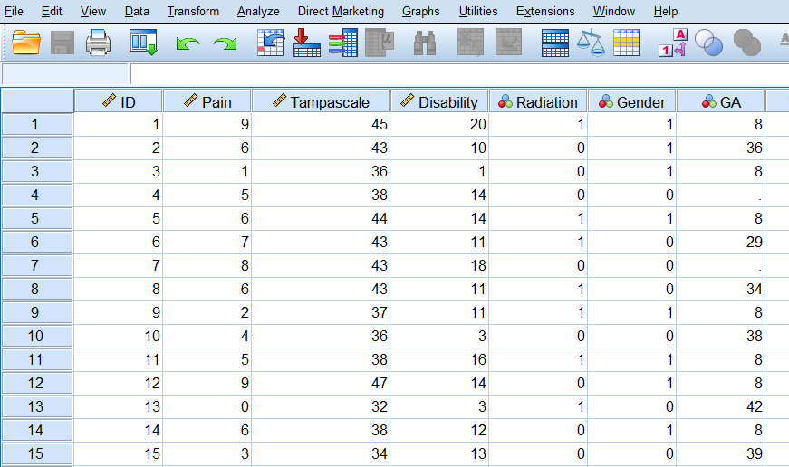
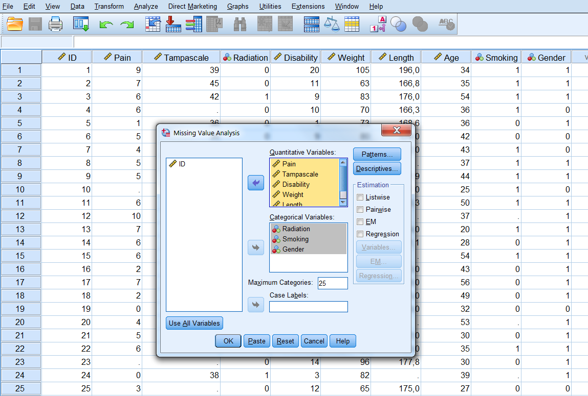
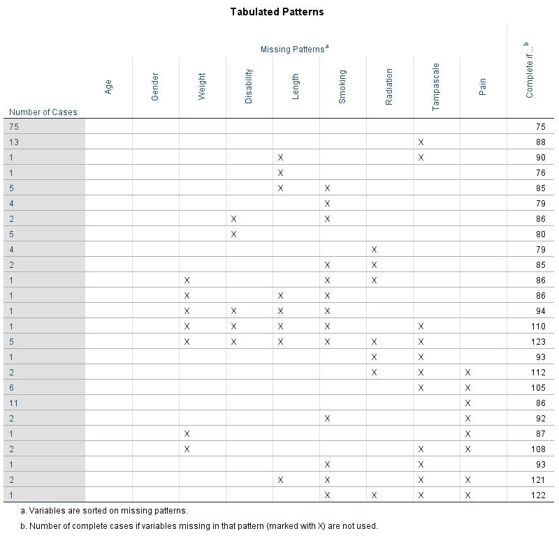

# Missing Data Evaluation

Before you decide what to do with your missing data it is important to consider the reasons and probable causes of your missing data problem. With that information you can compose an analysis plan to deal with the missing data in your dataset. In this Chapter, you will learn how to explore and evaluate your missing data in SPSS and R and why it is important to think about the missing data mechanism. This knowledge is important for the method you choose to handle the missing data problem. 

##	Definition of Missing Data

###	Defining Missing Data in SPSS

Missing data in SPSS can be defined in two ways, as a system missing or user missing value. System missing data is missing data that is not present in the dataset and can be recognized by an empty cell (or dot). User missing data is data that is coded as missing value in the dataset by the user for some specific kind of reason. As an example we use a small dataset with 50 Backpain patients consisting of males (coded as 1) and females (coded as 0) patients (Figure 2.1). The female patients in this dataset have been pregnant and the Gestational Age (GA) variable, contains the duration of their pregnancy in weeks. 


```{r fig1, echo = FALSE, fig.cap="SPSS dataset containing variables with system and user missing data", out.width='90%', fig.align='center'}

```

The Variable GA in the dataset consists of different values, like real values for GA as 36 and 29, the value 8 and empty cells. The value 8 is specified by us to exclude males from further analysis that include the GA variable. This is a user missing value, that was indicated because males cannot be pregnant. The system missing values are recognizable by the empty cells (or dots) in the dataset, and these indicate the missing GA values for women who did not report their GA. It makes no difference if we code the missing values as a system or user missing value in SPSS, because both kinds of missing values are recognized as missing values by SPSS and will be excluded from further analyses.

###	Missing data in R

In R the missing values are denoted by NA which means “Not Available”. If we open the same dataset as above in R we get the following result.

```{r}
library(haven)
#dataset <- read_sav("data/")
#dataset
## kan hier de goede dataset niet vinden
```


The Variable Gestational Age (GA) contains the values for GA (e.g. 36, 29, etc.), the value 8 for males and the NA’s. In R the value 8 will be treated as a real value, so we have to recode that value to NA by using the following code.

```{r}
#dataset$GA[dataset$GA==8] <- NA
#dataset
```

The `NA` values will be recognized as missing values. For most functions in R the handling of `NA` values has to be defined. For example, the following code to obtain the mean of Gestational Age results in an `NA` because the handling of missing data is not defined.

```{r}
#mean(data$GA)
```

To obtain the mean of the observed data the following code has to be used:


```{r}
#mean(data$GA, na.rm=TRUE)
```


The `na.rm=TRUE` statement in the mean-function, indicates that values that are NA need to be removed before the analysis can be executed. Another NA handling procedure that is used in functions is called na.action with as options `na.fail`, `na.omit`, `NULL` (no action) and `na.exclude`. For more information about na.action options you can type the following code in the R console `?na.action`.

##	Missing data Patterns 

To get an idea about the complexity of the missing data problem in your dataset and information about the location of the missing values, the missing data pattern can be evaluated. Historically, the missing data pattern was important as a starting point to choose the missing data handling method (Little and Rubin, 2002). Currently, the missing data pattern is less important because the most advanced (missing) data analysis methods as multiple imputation can handle almost any missing data pattern. We will discuss some frequently seen missing data patterns, which are graphically displayed in Figure 2.2. 


```{r fig2, echo = FALSE, fig.cap="Missing data patterns (ID means person identification number, X1 to X3 represent variables, Time 1 to 3 means that data is measured at 3 time points over time, Study means study number). The white cells represent the missing data", out.width='90%', fig.align='center'}
knitr::include_graphics("images/fig2.2.png")
```

A univariate missing data pattern is a pattern with missing values in only one variable (Figure 2.2a). An example of such a pattern is when the independent variables are completely observed, but the outcome variable is not, or when a selection of subjects refuse to fill in a specific question such as their income level. Figure 2.2b and Figure 2.2c present examples of multivariate missing data patterns, where multiple variables contain missing values. Figure 2.2b shows an example where subjects miss values of the same two variables and Figure 2.2c shows a more general pattern where different subject miss different variable scores. A monotone pattern of missing data may occur in a longitudinal study with data repeatedly assessed over time, and subjects “drop-out” of the study (Figure 2.2d). An example could be an elderly study where persons become too frail to participate or just because persons do not want to attend the study anymore because they are not interested to fill in several questionnaires. A pattern called File Matching can be observed when data from several studies is merged for an individual participant data analysis and variables are not assessed in all studies (Figure 2.2e). In our example, one variable is observed in both studies (X1), but X2 and is only observed in study 1 and X3 in study 2.  

###	Missing data patterns in SPSS

To evaluate the missing data pattern, we can make use of the options under the Missing Value Analysis (MVA) procedure in SPSS (IBM, 2016). We use as an example a dataset that contains information of 150 Back pain patients and 9 study variables. The variables are Pain (continuous), Tampa scale (continuous), Radiation in the leg (dichotomous), Disability (continuous), Body Weight (continuous), Body Length (continuous), Age (continuous), Smoking (dichotomous), Gender (dichotomous). Only the variables Gender and Age are completely observed.

To access the MVA function in the SPSS menu choose: Analyze -> Missing Value Analysis…  A new window will open that is called “Missing Value Analysis” (Figure 2.3)


```{r fig3, echo = FALSE, fig.cap="The Missing Value Analysis menu", out.width='90%', fig.align='center'}

```

From this menu we first transfer all variables of interest in the correct Quantitative and Categorical variables window and then choose for the Patterns option. From the Patterns menu choose for the options “Tabulated cases, grouped by missing value patterns” and “sort variables by missing value pattern”. To obtain the full list of all patterns that occur in the data, set the “Omit patterns with less than 1% of cases at 0% (Figure 2.4), then click on continue and OK. This will produce the output table that is displayed in Tables 2.1a and 2.1b.

```{r fig4, echo = FALSE, fig.cap="The Patterns menu", out.width='90%', fig.align='center'}
knitr::include_graphics("images/fig2.4.png")
```


As default procedure univariate statistics are presented including output information about the number and percentages of missing data and other descriptive statistics for each variable. Information about the missing data patterns is provided in the Tabulated patterns table. On the left column of that table, named “Number of Cases”, the number of cases are presented with that specific missing data pattern. In our example, there are 75 cases in total without any missing values and 13 cases with a missing value in only the Tampa scale variable (see row 1 and 2 of Table 2.1). In the right column of that table named “Complete if…”, the total number of subjects is presented if the variables that contain missing data in that pattern are not used in the analysis. Those variables are marked with the “X” symbol.  For example, 88 subjects will be included in the analysis when the variable Tampa scale is not used in the analysis, those are the 75 subjects that have completely observed data on top of  the 13 subjects with missing data in the Tampa scale variable only.

```{r tab1, echo = FALSE, fig.cap="Descriptive missing data statistics and the missing data patterns.", out.width='90%', fig.align='center'}
knitr::include_graphics("images/tab2.1a.png")


```

Another way to obtain information about the missing data patterns is via the Multiple Imputation option. To access this option, choose: Analyze -> Multiple Imputation -> Analyze Patterns…  A new window “Analyze Patterns” will open (Figure 2.5).

```{r fig5, echo = FALSE, fig.cap="Analyse Patterns menu.", out.width='90%', fig.align='center'}
knitr::include_graphics("images/fit2.5.png")
```

Now transfer all variables that have to be analyzed for their missing values to the window “Analyze Across Variables”. We choose for the following output options in that window: 
Summary of missing values (displays missing data information in pie charts, Patterns of missing values (displays tabulated patterns of missing values) and Variables with the highest frequency of missing values (displays a table of analysis variables sorted by percent of missing values in decreasing order). To get the full list of all patterns set the “Minimum percentage missing for variable to be displayed” at 0. You can also adjust the maximum number of variables displayed. This procedure will generate the following output (Figure 2.6).

```{r fig5, echo = FALSE, fig.cap="Output as a result of the Analyze Patterns menu under Multiple Imputation.", out.width='90%', fig.align='center'}
knitr::include_graphics("images/fit2.6a.png")
knitr::include_graphics("images/fit2.6b.png")
knitr::include_graphics("images/fit2.6c.png")
knitr::include_graphics("images/fit2.6d.png")
```

###Studying Missing data patterns in R

To generate the missing data patterns in R we can make use of the mice and VIM packages. We start with the mice package. That package contains the `md.pattern` function that can generate the missing data pattern.
