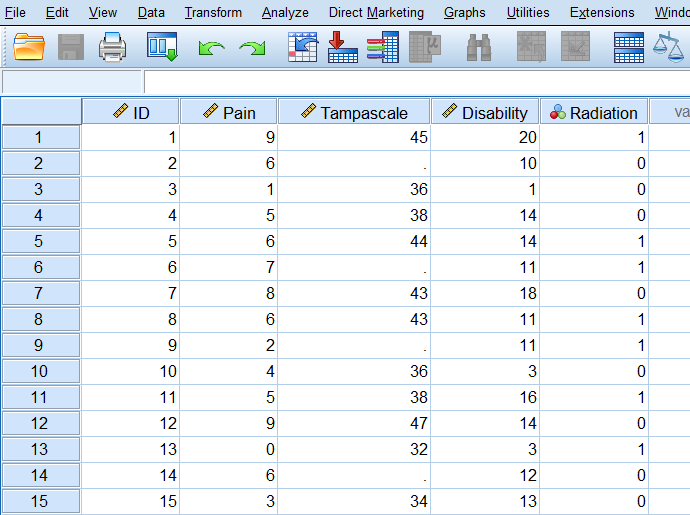

# Single Missing data imputations

In the previous Chapter the missing data patterns and mechanisms were evaluated and discussed. Both provide information about the locations of the missing values in the dataset and the relationship of variables with missing data and with other complete variables. Historically, this was important because some imputation methods worked best with a specific missing data pattern, or assumed missing data mechanism. Nowadays, advanced imputation methods as multiple imputation can deal with almost any missing data pattern. For the missing data mechanisms, it is still important to provide a strong idea about variables that can explain the missing data. When these variables are available in the dataset these can be used to impute the missing values. We will start this Chapter with a discussion of a in most missing data situations insufficient missing data method, complete case analysis.

## Complete cases analysis

Complete case analysis (CCA) means that the statistical analysis is performed in the dataset, after each missing data point has been excluded. This procedure is still one of the most use missing data handling procedures (Eekhout et al. 2012) and only results in correct mean or regression coefficient estimates when the data is MCAR. However, this method can have a large impact on the precision of the statistical test results because the main drawback of using CCA is that much of the information in the dataset will be excluded. It also leads to an incorrect estimation of standard errors when the data is MCAR, MAR and MNAR (Eekhout et al. 2014). It is for that reason not recommended. 
	There is only one situation in which CCA gives comparable results under MAR data. That is the situation when only outcome data is missing in randomized controlled trials (RCT) and observational study designs and adjustment for covariates is required (Groenwold et al. 2011). This situation gives the same results as with Multiple Imputation when the covariates are predictive of the missing data. Groenwold et al. therefore recommend the use of CCA because CCA would be more transparent compared to Multiple Imputation. Luiblinska and Rubin (2012) however, argued against this argument because the case of only outcome missing data is limited and therefore not realistic for many missing data situations where missing data is detected in more variables. This makes that CCA can be used in one rare missing data situation and that makes Multiple Imputation are more flexible procedure to use.

## Missing data imputation

In this Chapter, we will discuss several single imputation methods. These imputation methods will be considered by using a dataset containing information of 50 Low Back Pain (LBP) patients. Although, this dataset is small, the methods easily generalize to larger datasets with missing values in more variables. From these 50 patients, data is obtained about Pain, Tampa scale, Disability and if Radiation in the leg is present or not. The SPSS dataset is shown in (Figure \@ref(fig:fig1)) (first 15 patients are shown):

```{r fig50, echo = FALSE, fig.cap="SPSS dataset with missing values in the Tampa scale variable", out.width='90%', fig.align='center'}

```

Assume that we are interested in the relationship between Pain and the Tampa scale variable. To get a first impression about this relationship we make a scatterplot. The scatterplots of the complete and incomplete datasets are displayed in (Figure \@ref(fig:fig3)):

```{r fig51, echo = FALSE, fig.cap=" Relationship between the Tampa scale and Pain variables (green dots are observed and red dots are assumed to be missing data", out.width='90%', fig.align='center'}
knitr::include_graphics("images/fig3.2.png")
```

```{r fig52, echo = FALSE, fig.cap="Relationship between the Tampa scale and Pain variable. Missing data are excluded", out.width='90%', fig.align='center'}
knitr::include_graphics("images/fig3.3.png")
```

The green dots represent the observed data and the red dots the missing data points. In essence, in our dataset we have the data points that are visualized in Figure 3.2b. We will use this relationship to discuss what it means when we use single imputation methods. These will be discussed below.

## Mean Imputation

### Mean imputation in SPSS

Mean imputation in SPSS can be applied by using three different methods. One is to first compute the mean of the variable by using Descriptive Statistics, and replace all missing values by the mean value, the other is by using the Replace Missing Values procedure under Transform and the last one is by using the Linear Regression procedure. We will start with the first. 

Descriptive Statistics
Via Analyze -> Descriptive statistics, the descriptive statistics are calculated. The results are shown in Table 3.2. 

