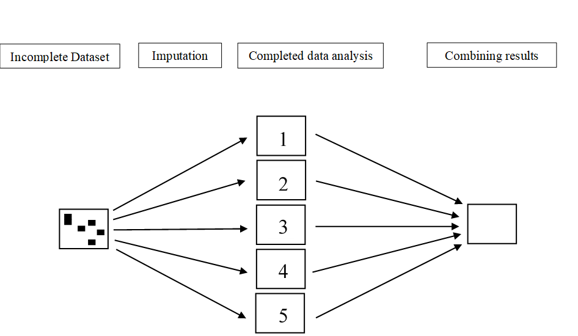

# Multiple Imputation

##Multiple Imputation

In this Chapter we discuss an advanced missing data handling method, that is called Multiple Imputation (MI). With MI, each missing value is replaced by several different values and consequently several different completed datasets are generated. The complete data is copied repeatedly in the completed datasets. The concept of MI can be made clear by the following figure 4.1.

```{r fig41, echo = FALSE, fig.cap="Graphical presentation of the MI procedure. ", out.width='90%', fig.align='center'}

```

The large square on the left represents a dataset with missing values, with the missing values indicated as small solid black squares. The squares in the middle that are numbered from 1 to 5 are the separate imputed and completed datasets and the square on the right represents the combined study results. 

Figure 4.1 shows that the imputation of missing values consists of three steps, first the missing values are imputed, subsequently statistical analyses are applied in each completed dataset and finally the statistical test results from these analyses are synthesized by combining the sperate analysis results into one pooled estimate. 

##Multivariate Imputation by Chained Equation (MICE)

The main MI method that is discussed in this manual is Multivariate imputation by chained equations (MICE), also known as Sequential Regression Imputation, Fully Conditional Specification or Gibbs sampling (ref). In the MICE algorithm, a chain of regression equations is used to obtain imputations, which means that variables with missing data are imputed one by one using a chain of regression models. These regression models make use of information of all other variables in the model, i.e. conditional imputation models. Essentially, applying MI is the same as repeating stochastic regression imputation over several imputation runs or chains to impute the missing data sequentially in different variables. 
	
Another multiple imputation procedure is called multivariate normal 
	
In this Chapter, the first phase in multiple imputation, that of the imputation step is the main topic. In the next Chapter, the analysis and pooling phase will be discussed. First, we start with a small note about Bayesian statistics because the default imputation procedure in MI uses Bayesian statistics to generate the missing values and this is important to understand. We will discuss Bayesian statistics conceptually. For a better understanding of Bayesian statistics, we refer to the books of Knight, Enders (2010), Gelman (2004), Box and Tiao (1973) and Rubin (1987). The book of Enders is the least technical and a good book to start with as an introduction into Bayesian statistics for missing data and to get a better understanding of Bayesian estimation. The other books are theoretical and you must have a firm understanding of statistics and no fear of formulas to read those. 

##4.1.	A small note on Bayesian Imputation

Within the MI algorithm we account for imputation uncertainty by replacing the missing values multiple times. Values are predicted by using regression parameters. With regression parameters we mean the parameters that result from applying a regression model to a dataset. The estimates from a (regression) model, like regression coefficients or the error variance, are called parameters in statistics. What separates the non-Bayesian from the Bayesian imputation procedures is how the regression parameters are estimated. In the context of linear regression modeling these parameters are the regression coefficients and the residual error variance. Non-Bayesian regression imputation models account for the uncertainty in the missing values, by adding error variance to imputed values that are estimated from the regression line as in stochastic regression imputation (paragraph 3.5). This is done in each imputed dataset. Bayesian regression imputation models also add variation to the regression coefficients as in Bayesian stochastic regression imputation (paragraph 3.6). Thus, the difference between non-Bayesian and Bayesian imputation is that in the latter procedure not only extra variation is added via the residual error variance, but also via the (population) regression coefficients (in essence also for the error variance component a Bayesian estimate is used).	

We have seen an example of Bayesian and non-Bayesian imputation in Chapter 3 when we compared the Bayesian and non-Bayesian stochastic regression imputation procedure. By adding extra variation to the regression coefficients, as with Bayesian Stochastic regression imputation models, we take into account that the regression coefficient by itself is surrounded by uncertainty. In other words, we use the idea that there is not one true (population) regression coefficient but that the regression coefficient, as the (true) population parameter, follows a (probability) distribution itself. This is in contrast to a frequentist idea, which assumes that there is one true population parameter and that the uncertainty (by using a confidence interval) around the population parameter can be interpreted as a probability statement of the result if the study would be repeated infinite times. In the frequentist approach the sample regression coefficient is estimated by assuming that the regression coefficient, when repeating the study infinite times, follow a normal distribution. We use the sample regression coefficient as the best estimator of the population regression coefficient and present these with the confidence interval for the true population estimate. In contrast, in a Bayesian context, a Bayesian interval is a direct reflection of the uncertainty of the population regression coefficient. This means that, for Bayesian estimates, we directly compute the probability distribution of the regression coefficient itself. In other words, Bayesian statistics assume that the regression coefficient is a random variable that has a distribution. 

	What makes Bayesian estimation complex is that the distribution of the regression coefficient itself has to be estimated. This means that an estimation method has to be used to derive this distribution. Markov Chain Monte Carlo (MCMC) methods can help with this. A popular MCMC method to construct this distribution is the Gibbs Sampler. The Gibbs sampler produces a chain of iterations and updates regression parameters at each iteration step. This procedure is also used by the Multivariate Imputation by Chained Equations (MICE) package, that is the main MI method discussed in this manual, and therefore the MICE procedure is also called Gibbs sampling.
	
	Bayesian estimates are used to incorporate parameter uncertainty, e.g. uncertainty in the regression coefficient, that is used to generate the imputed values (on top of the error variance). Consequently, imputed values are drawn from their posterior predictive distribution, conditional on the values of other variables. Posterior, in Bayesian statistics, refers to an estimate, e.g. a regression coefficient estimate, that is estimated by using the sample data together with prior information about the value of the regression coefficient. This combination of sample data and prior information leads to a posterior estimated value of the regression coefficient, i.e. the posterior distribution. The Gibbs sampler helps to estimate this posterior value, that is subsequently used in a regression model to generate imputed values. Conditional, means loosely that we make use of the idea that variables are related to each other. For example, the value of the Tampa scale variable, relates to  for example the Pain, Gender and Disability variables. The more we know about the values of Pain, Gender or Disability, the better we can estimate the value for the Tampa scale. This relation is important because this relation can be used to generate imputations for the Tampa scale variable. If Tampa scale values are missing for specific values of Pain, Gender and Disability, these variables can be used to impute the Tampa scale scores. These relationships are captured by specifying a regression model with the Tampa scale as the outcome variable and Pain, Gender and Disability as the independent variables. We use these regression models to estimate imputed values for the Tampa scale score conditional on the Pain, Gender and Disability scores. A posterior predictive distribution means that we first use the posterior distribution, i.e. determined by using the Gibbs sampler, to draw a regression coefficient from and that we use that regression coefficient and the observed data to predict the missing value by using a regression equation. 


##4.2.	Running Multiple Imputation in R

Multipl imputation in R can be performed with the `mice` function from the `mice` package. As an example we will apply this function to deal with the missing values in the LBP dataset of 50 low back pain patients. The dataset contains missing data in the two continuous variables, the Tampa scale and the Disability variable. The other variables in the dataset are Pain and Radiation, which are completely observed. 

```{r}
data <- read_sav("data/Backpain50 MI missing.sav")
head(data,15)

```


The variable with missing values is always defined as the dependent variable and all other variables in the imputation model are the independent variables. During each iteration, all variables with missing values are imputed. 

The following options are used in the `mice` function to start MI, `m=5`, to generate 5 imputed datasets, `maxit=10`, to use 10 iterations for each imputed dataset (i.e. 10 chains of regression imputation models), `method=”pmm”`, which is the default imputation procedure in mice (see `?mice` for all settings of the mice function). We can also add a seed value to be able to obtain the same results when we repeat the analysis.

```{r}
library(mice)
imp <- mice(data, m=5, maxit=10, method="pmm", seed=1050)
```

After we have run the mice function, information is provided about the iteration and imputation steps for the variable that are imputed under the columns named “iter”, “imp” and “variable”. This information can be turned off by setting the mice function parameter printFlag = FALSE, which results in silent computation of the missing values. However, the printed information gives feedback about at which iteration step the imputation algorithm is, which gives you an idea how long it takes until the imputations are finished. The results from the imputation can be viewed by calling the imp object.

```{r}
imp
```

Under this object is information of the function that is called call (function settings that we used for mice), the number of imputed datasets, the missing values in each variable, the imputation method, the information under VisitSequence which is information about the sequence of variables that are firstly, secondly, etc. imputed during the imputation process, information of the PredictorMatrix (see paragraph XX) and the seed value of the random number generator.

The MI datasets can be extracted by using the complete function (R code 4.4). The settings action=”long” and include=T mean that the imputed datasets are stacked under each other and that the original dataset (with missings) is also included (see ?complete for more possibilities how to store the imputed datasets).

```{r}
mi_long <- complete(imp, action="long", include=T)
```

In the imputed datasets two variables are added, an .id variable and an .imp variable to distinguish the cases in the dataset and the imputed datasets. The imputed datasets can be further used in mice to conduct pooled analyses or to store them for further use in other software packages as SPSS. 

###The mice alogorithm iand iteration steps 

Imputed dataset 1
Per imputed dataset we start with iteration number 0 (not shown in output). 

Iteration 0:
Data points are randomly drawn from the observed values of the Tampascale and the Disability variable and these are used to replace the missing values in these variables. 

Iteration 1 (cycle 1):
The Tampascale values are set back to missing. Then, a linear regression model is applied in the available data (i.e. complete case analysis) with the Tampascale as the dependent and Pain, Disability and Radiation as independent variables to their regression coefficient estimates that are used to predict the missing values in the Tampascale variable together with the completed variables, i.e. the completed Disability variable from iteration 0 (indicated by Disability0, because only the Disability variable contained missing data at this stage) and the available data from the Pain and Radiation variable (which were complete). This regression equation is defined as: 

〖Tampascale〗_mis= β_0+ β_1× Pain+ β_2× 〖Disability〗_0+ β_3× Radiation

The same procedure is repeated for the Disability variable. The Disability scores are first set back to missing, then the regression coefficients of the Pain, Tampa scale and Radiation variables are obtained in the complete case dataset and imputations are generated from these regression coefficients. The missing values for Disability are imputed by using the imputed values in the Tampa scale variable (indicated by Tampa scale1, i.e. which were imputed from the previous regression model). 

〖Disability〗_mis= β_0+ β_1× Pain+ β_2× 〖Tampascale〗_1+ β_3× Radiation

Iteration 2 (cycle 2): 

The Tampascale values are again set back to missing and (new) updated regression coefficients for Pain, Disability and Radiation are obtained, making use of the imputed values in the Disability variable from iteration 1 (indicated by Disability1) and the complete data of the Pain and Radiation variables. Subsequently, missing values are updated from that regression model.

〖Tampascale〗_mis= β_0+ β_1× Pain+ β_2× 〖Disability〗_1+ β_3× Radiation

The same holds for the Disability variable. The missing values are updated by making use of the imputed values in the Tampascale variable within iteration 2 (indicated by Tampascale2) and updated regression coefficients.

〖Disability〗_mis= β_0+ β_1× Pain+ β_2× 〖Tampascale〗_2+ β_3× Radiation

Iteration 3 to prespecified number of iterations:
This process is repeated within each iteration 

Last iteration:
The imputed values from the last iteration are used in the imputed dataset.
For the next imputed dataset, the entire process of iterations is repeated.


##4.3	Customizing the Imputation model

	With MI the variables Tampa scale and Disability will be imputed with the help of the variables Pain and Radiation. The latter two variables are called auxiliary variables when they are not part of the main analysis model but they help to impute the Tampa scale and Function variables. Variables that are used to impute other variables can be switched off and on in the predictormatrix. As we saw in R code 4.3 above, the predictor matrix for our MI procedure is

```{r}
imp$PredictorMatrix
```

The predictor matrix is a matrix with the names of the variables that are part of the imputation model in the dataset listed in the rows and the column. The variables in the columns can be switched on or off which is the same as in- or excluding them from the imputation model to impute the missing data in the row variable. This works as follows for our LBP dataset. The first and fourth rows contain only zero´s, which is logical, because the Pain and Radiation variables did not have missing values. The variable in the second row contains missing values and the 1´s in this row mean that the column variables, Pain, Disability and Radiation will be included in the (regression) imputation model. To impute the missing data in the Disability variable, the column variables Pain, Tampa scale and Radiation are used. 
	As a default setting all variables will be included in the imputation model to predict missing values in other variables, i.e. as default all combinations of variables that are complete and have missing values in the matrix will be switched on, i.e. are assigned a value 1 in the predictormatrix. The diagonal of the predictormatrix is always zero. 
	The predictormatrix can also be adapted when for example a variable that contains a high percentage of missing data must be excluded from the imputation model to impute other variables. For example, if we want to exclude the variable Disability from the imputation model of the Tampa scale variable and re-run the MI, we can use the following code:

```{r, eval=FALSE}
pred <-imp$PredictorMatrix
pred["Tampascale", "Disability"] <- 0
pred

imp2 <- mice(data,m=5, maxit=10, method="pmm", predictorMatrix = pred, seed=1050)
```

For information about the imputation model can be foud in REF van buuren, REF White  etc. A summary of guidelines for building the imptuation model is as follows:

1.	 Include the outcome variable (Moons, 2006).

2.	Include all variables that are part of the analysis model.

3.	Include the variables at the same way in the imputation model as they appear in the analysis model (i.e. if interaction terms are in the analysis model they also have to be included in the imputation model).

4.	Include as many predictor variables that are related to missingness in other variables or that are correlated to the variable with missing values (auxiliary variables).

##Output of the `mice` function

The mice function returns a mids (multiple imputed data set) object. In our example that is the imp object. Under this object, all kind of imputation information is stored and can be extracted by typing `imp$`, followed by the type of information you want. 

```{r}
imp$m
imp$nmis
imp$seed
imp$iteration
```
The above objects contain the the number of imputed datasets, missing values in each variable, the specified seed value and the number of iterations.
The original data can be found in:
```{r}
imp$data
```
The imputed values for each variable in the imptued values can be found under:
```{r}
imp$imp
```
The imputation methods used:
```{r}
imp$method
```

The predictor matrix:
```{r}
imp$predictorMatrix
```

The sequence of the variables used in the imputeon procedure:
```{r}
imp$visitSequence
```

The imputed values (or means) during each iteration can also be extracted. These are stored as chainMean. The number of Chains is equal to the number of imputed datasets. A Chain refers to the chain of regression models that is used to generate the missing values. The length of each chain is equally large as the number of iterations. The Chains contain the means of the imputed values. This object can be used for monitoring convergence (by for example displaying the results in a convergence plot. See the next paragraph). 
```{r}
imp$chainMean
```

##Checking Convergence in R

When you use the mice function to create imputations it is a good idea to check if the imputation runs were successful and if you can thrust the imputations. This can be done by visualizing a convergence plot. On a convergence plot the means or standard deviations within imputation chains can be plotted, this can be done by presenting the information under the object LBP_imp$chainMean at the y-axis and the iterations on the x-axis. The convergence plot of the imputations from the imputations of R code 4.5 is presented in Figure 4.3 (we used 50 iterations to create the plot). In this plot you see that the variance between the imputation chains is almost equally large as that within the chains. If this is the case than there is healthy convergence. To create a convergence plot for only the Tampascale variable just use:

```{r}
plot(imp)
```

##Imputation diagnostics in R

It can also be of interest to compare the values that are imputed with those that are observed.
For that, the stripplot function can be used in mice. This function can easily be used in combination with the mice function (R code 4.10). With this function it is possible to plot the observed and imputed values in one plot. An example is given in Figure 4.4. By comparing the observed and the imputed data points we get an idea if the imputed values can be thrusted. If there are no large differences between the imputed and observed values under MAR than we can conclude the imputed values are correct.

```{r}
stripplot(imp)

```


